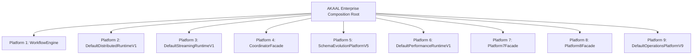
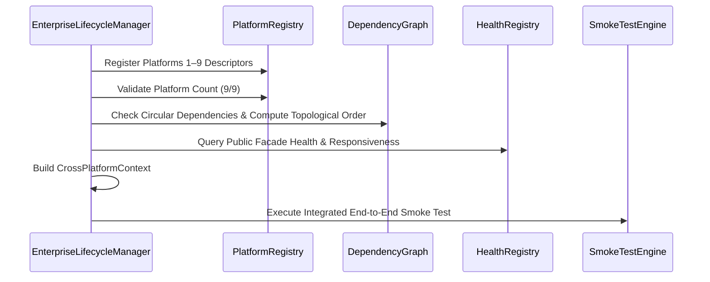

# AKAAL Enterprise Integration Walkthrough

This document outlines the architecture, bootstrap flow, dependency graph resolution, health aggregation, and end-to-end integration lifecycle of the **AKAAL Enterprise Composition Root** (`akaal/integration/composition_root.py`).

---

## 1. Composition Root Architecture

The Enterprise Composition Root acts as AKAAL's single entry point for assembling all nine completed platforms into a unified enterprise system.

### Architectural Directives
- **Zero Business Logic**: The integration layer delegates execution strictly to platform public facades.
- **Strict Public Contract Isolation**: Never imports internal modules of any platform.
- **Dependency-Safe Initialization**: Uses topological sorting to initialize lower-level execution platforms before higher-level API, reporting, and operational layers.

---

## 2. Startup Lifecycle & Validation

### Topological Startup Order
1. `platform-6` (Enterprise Performance Engine)
2. `platform-5` (Live Schema Evolution)
3. `platform-4` (Enterprise CDC)
4. `platform-3` (Streaming Execution Engine)
5. `platform-2` (Distributed Runtime)
6. `platform-1` (Enterprise Workflow & Orchestration)
7. `platform-9` (Enterprise Operations)
8. `platform-8` (Enterprise Reporting)
9. `platform-7` (Enterprise APIs & Integration)

---

## 3. Integrated End-to-End Smoke Test Flow

The smoke test (`execute_e2e_smoke_test`) verifies cross-platform communication across all 9 public facades:

1. **Platform 1**: Queries `WorkflowEngine` state (`READY`).
2. **Platform 2**: Queries `DefaultDistributedRuntimeV1` worker registry.
3. **Platform 3**: Checks `DefaultStreamingRuntimeV1` backpressure controller.
4. **Platform 4**: Verifies `CoordinatorFacade` readiness.
5. **Platform 5**: Verifies `SchemaEvolutionPlatformV5` readiness.
6. **Platform 6**: Queries `DefaultPerformanceRuntimeV1` active profile (`BALANCED`).
7. **Platform 7**: Verifies `Platform7Facade` capabilities API (`REST`, `gRPC`, `CLI`, `SDK`).
8. **Platform 8**: Verifies `Platform8Facade` reporting client.
9. **Platform 9**: Queries `DefaultOperationsPlatformV9` Digital Twin model.

---

## 4. Graceful Shutdown Sequence

Shutdown executes in exact **reverse topological order**:
`platform-7` $\rightarrow$ `platform-8` $\rightarrow$ `platform-9` $\rightarrow$ `platform-1` $\rightarrow$ `platform-2` $\rightarrow$ `platform-3` $\rightarrow$ `platform-4` $\rightarrow$ `platform-5` $\rightarrow$ `platform-6`.
