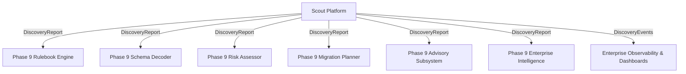

# ADR-009: Scout Platform Subsystem Architecture & Enterprise Extensions

* **Status**: Accepted
* **Date**: 2026-07-18
* **Authors**: Antigravity AI / Lead Platform Architecture Team
* **Subsystem**: `akaal/scout` (Phase 9 — Features 1 to 8)

---

## 1. Context & Motivation

The **Akaal Migration Platform** requires an enterprise-grade, read-only intelligence subsystem responsible for discovering, profiling, fingerprinting, and auditing source database environments prior to schema translation, risk analysis, planning, or migration execution.

**Scout** operates as the first stage of Akaal's Phase 9 Intelligence Layer. Its sole responsibility is **read-only source discovery and profiling**. Scout **never** executes DDL or DML statements under any circumstance.

---

## 2. Architectural Decisions & Enterprise Refinements

### 2.1 Separation of Concerns (Adapter vs. DiscoveryProvider)
- `BaseAdapter` manages database connections.
- Metadata discovery logic is decoupled into dedicated `BaseDiscoveryProvider` implementations (`PostgresDiscoveryProvider`, `MySQLDiscoveryProvider`, `OracleDiscoveryProvider`, `GenericDiscoveryProvider`).
- **Scout contains zero SQL strings, zero vendor-specific branches, and zero database-specific logic.**

### 2.2 Three-Tier Lifecycle Model Separation
1. **`DiscoveryRequest`**: Immutable request carrying connection specs, `DiscoveryPolicy`, `DiscoveryProfile`, `force_refresh` flag, and cache TTL preferences.
2. **`DiscoveryContext`**: Runtime context encapsulating execution state, `DiscoveryProvider`, event bus, metrics, diagnostics, inventories, audit, and permission assessments.
3. **`DiscoveryReport`**: Canonical, versioned, immutable output report document (`schema_version="1.0.0"`, `report_version="1.0.0"`, `generator_version="scout-1.0.0"`, `compatibility_version="1.0.0"`).

### 2.3 Discovery Policies & Profiles
- **`DiscoveryPolicy`**: Controls discovery scope (include/exclude schemas, include/exclude tables, max queries, max runtime, read-only enforcement, storage/cluster/inventory collection flags).
- **`DiscoveryProfile`**: Enum presets (`QUICK`, `STANDARD`, `DEEP`, `COMPLIANCE`) automatically generating suitable `DiscoveryPolicy` instances.

### 2.4 Capability Confidence Scoring
- `CapabilityInventory` records feature flags along with `CapabilityConfidence` objects (`supported`, `confidence_score` 0-100, `detection_method`, `evidence`, `notes`).

### 2.5 Provider Compatibility Validation
- `BaseDiscoveryProvider` declares version bounds (`minimum_supported_version`, `maximum_supported_version`).
- `DiscoveryProviderRegistry` validates target engine compatibility before execution.

### 2.6 Audit Trail & Manifest Verification
- `DiscoveryAudit`: Records discovery ID, request ID, authenticated user, endpoint, policy hash, report hash, fingerprint, duration, result, and provider version.
- `DiscoveryManifest`: Contains report UUID, fingerprint, provider versions, report SHA-256 checksum, and policy checksum for reproducibility.

### 2.7 Cost Estimation & Permission Assessment
- `DiscoveryCostEstimate`: Pre-execution estimation vs post-execution actual resource tracking.
- `PermissionAssessment`: Granular status (`GRANTED`, `DENIED`, `UNKNOWN`) across metadata, schema, table, storage, replication, cluster, and statistics permissions.

### 2.8 Discovery Health Score & Recommendations
- `DiscoveryHealth`: Computes overall health score (0-100) from completeness, permissions, confidence, provider compatibility, and warnings.
- `DiscoveryRecommendation`: Actionable, structured observation notes.

---

## 3. Future Integration Strategy

The canonical `DiscoveryReport` produced by Scout serves as the primary input artifact for downstream Phase 9+ intelligence subsystems:

- **Rulebook Engine**: Consumes `CapabilityInventory` and `SchemaInventory`.
- **Schema Decoder**: Consumes `ObjectInventory` and `SchemaInventory` for DDL translation.
- **Risk Assessor**: Inspects `StatisticsSection`, `StorageInventory`, `HealthSection`, and `PermissionAssessment`.
- **Migration Planner**: Uses `SchemaInventory` dependencies and `StorageInventory` size distributions.
- **Advisory & Enterprise Intelligence**: Analyzes performance, storage, and cluster topology for sizing recommendations.
- **Enterprise Observability**: Subscribes to `DiscoveryEventBus` for live progress tracking.
