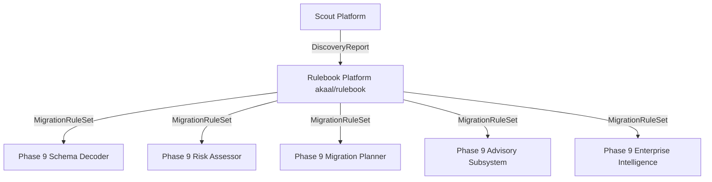

# ADR-010: Rulebook Platform Architecture & Enterprise Policy Decision Engine

* **Status**: Accepted
* **Date**: 2026-07-18
* **Authors**: Antigravity AI / Lead Platform Architecture Team
* **Subsystem**: `akaal/rulebook` (Phase 9 — Feature 2)

---

## 1. Context & Motivation

The **Akaal Migration Platform** requires an enterprise policy decision engine to convert a source environment `DiscoveryReport` (produced by Scout), a target database specification, migration configuration, and organizational policies into a single canonical, immutable, versioned, checksum-protected **`MigrationRuleSet`**.

Historically, database migration engines coupled policy decision-making directly with SQL query building or execution loops. **Rulebook** introduces strict separation of concerns: it is purely the **enterprise policy decision engine**. Rulebook performs **zero SQL generation, zero data transformation, and zero migration execution**.

---

## 2. Architectural Decisions

### 2.1 Single Canonical Output (`MigrationRuleSet`)
- All rule resolution, precedence calculations, policy inheritance overrides, and diagnostic evaluations compile into a single output document: **`MigrationRuleSet`**.
- Downstream intelligence subsystems (Decoder, Risk, Planner, Advisor, Enterprise Intelligence) consume **only** `MigrationRuleSet`. Nothing consumes raw discovery providers or individual rules directly.

### 2.2 Immutable Context & Deterministic Execution Trace
- **`RuleEvaluationContext`**: A single canonical, immutable context object passed across all decision engines.
- **`RuleExecutionTrace`**: Captures step-by-step evaluation order, decisions (`APPLIED`, `SKIPPED`, `BLOCKED`, `OVERRIDDEN`), priority scores, capability checks, and latencies deterministically.

### 2.3 Passive Registries & Provider Isolation
- `RuleRegistry` acts purely as a passive store (holding rules and the `DependencyGraph`).
- `RuleProvider` plugins (`PostgresRuleProvider`, `MySQLRuleProvider`, `OracleRuleProvider`, `GenericRuleProvider`, etc.) are passive rule suppliers. Providers **never** mutate state or invoke execution engines.

### 2.4 Decoupled Single-Responsibility Engine Sequence
The execution sequence follows a strict single-responsibility chain:
$$\text{DiscoveryReport} \to \text{RuleEvaluationContext} \to \text{RulePackRegistry} \to \text{RuleRegistry} \to \text{DependencyGraph} \to \text{RuleResolutionEngine} \to \text{ValidationEngine} \to \text{PriorityEngine} \to \text{ConflictEngine} \to \text{InheritanceEngine} \to \text{SimulationEngine} \to \text{MigrationRuleSet}$$

### 2.5 8-Level Policy Inheritance
Rulebook enforces an 8-level policy hierarchy:
$$\text{Global} \to \text{Organization} \to \text{Project} \to \text{Migration} \to \text{Database} \to \text{Schema} \to \text{Table} \to \text{Column}$$
Lower levels override higher levels deterministically, recording override rationale in `RuleAudit`.

### 2.6 Rule Lifecycle & Capability Validation
- **Lifecycle States**: `DRAFT` → `VALIDATED` → `APPROVED` → `ACTIVE` → `DEPRECATED` → `RETIRED`.
- **Capability Metadata**: `ValidationEngine` verifies target engine bounds and required Scout discovery sections before rule evaluation.

### 2.7 Dry-Run Simulation (`SimulationEngine`)
- `RulebookPlatform.simulate(...)` produces a read-only `SimulationReport` dry-run artifact summarizing applied/skipped/overridden rules, diagnostics, and resolution timelines without executing migration logic.

---

## 3. Downstream Integration Strategy

- **Schema Decoder**: Reads `conversion_rules`, `naming_rules`, and `transformation_rules` to perform AST-based DDL compilation.
- **Risk Assessor**: Inspects `compliance_rules` and `constraint_rules` to compute risk scores.
- **Migration Planner**: Consumes `constraint_rules` and `inheritance_summary` to organize batch chunking.
- **Advisory & Enterprise Intelligence**: Consumes `vendor_rules` and `security_rules` for instance sizing and security audit recommendations.
