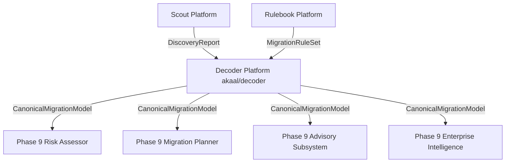

# ADR-011: Decoder Platform Architecture & Universal Normalization Engine

* **Status**: Accepted
* **Date**: 2026-07-18
* **Authors**: Antigravity AI / Lead Platform Architecture Team
* **Subsystem**: `akaal/decoder` (Phase 9 — Feature 3)

---

## 1. Context & Motivation

The **Akaal Migration Platform** requires a vendor-neutral database normalization engine to transform a source environment `DiscoveryReport` (from Scout) and an enterprise policy `MigrationRuleSet` (from Rulebook) into a single canonical, immutable, versioned, checksum-protected **`CanonicalMigrationModel`**.

**Decoder** operates strictly as the **enterprise normalization engine**. It contains **zero SQL generation, zero migration execution, zero planning, zero risk scoring, and zero business logic translation**.

---

## 2. Architectural Decisions

### 2.1 Storage Model Family Hierarchy
Instead of product-centric design, Decoder is architected around storage model families:
$$\text{StorageModel} \longrightarrow \text{StorageFamily} \longrightarrow \text{StorageEngine} \longrightarrow \text{Provider} \longrightarrow \text{VersionAdapter}$$
- Supported Families: `RELATIONAL`, `DOCUMENT`, `GRAPH`, `KEYVALUE`, `TIMESERIES`, `WAREHOUSE`, `LAKEHOUSE`, `STREAMING`, `SEARCH`, `VECTOR`, `OBJECT`, `LEGACY`, `CUSTOM`.

### 2.2 Canonical Type Algebra & Extensible OpaqueType
- 16 top-level type families (`INTEGER`, `DECIMAL`, `BOOLEAN`, `DATE`, `TIMESTAMP`, `INTERVAL`, `UUID`, `BINARY`, `UNICODE_STRING`, `JSON`, `XML`, `ARRAY`, `SPATIAL`, `IDENTITY`, `SEQUENCE_REFERENCE`, `LARGE_OBJECT`, `OPAQUE`).
- Unknown vendor types normalize into an extensible `OpaqueType` without loss of raw type metadata or silent string conversion.

### 2.3 Unified Canonical Object Graph & Universal Identity
- All database objects exist as nodes within a unified `CanonicalObjectGraph`.
- Every object carries a stable `CanonicalIdentity` (`canonical_id`, `source_identifier`, `fingerprint`, `checksum`, `origin`, `lineage_id`).

### 2.4 Expression AST & Universal Function Library
- Vendor expressions normalize into immutable AST nodes (`ConstantNode`, `ColumnNode`, `FunctionNode`, `OperatorNode`).
- Functions map into a universal canonical function AST library (`ABS`, `LOWER`, `UPPER`, `CONCAT`, `LENGTH`, `TRIM`, `SUBSTRING`, `ROUND`, `NOW`, `COALESCE`).

### 2.5 Semantic Mapping Model & Lineage Tracking
- `SemanticEquivalence` captures rich semantic classifications (`EQUIVALENT`, `SUBTYPE`, `SUPERTYPE`, `LOSSLESS`, `LOSSY`, `PARTIAL`, `REQUIRES_TRANSFORMATION`, `EMULATED`, `UNSUPPORTED`, `UNKNOWN`) alongside confidence scores and fallbacks.
- `LineageEngine` establishes Stage 1 transformation lineage.

### 2.6 Immutable Execution Context & Telemetry Events
- **`DecoderContext`**: Immutable context object encapsulating `discovery_report`, `migration_ruleset`, `validation_profile` (`QUICK`, `STANDARD`, `STRICT`, `COMPLIANCE`), and metadata.
- **`DecoderEventBus`**: Telemetry event bus broadcasting immutable events (`NormalizationStarted`, `ObjectNormalized`, `CanonicalModelBuilt`, etc.).

### 2.7 Deterministic Serialization Layer (`CanonicalSerializer`)
- Supports versioned export/import, JSON, and binary serialization so downstream modules consume canonical artifacts without Python object dependencies.

---

## 3. Downstream Integration Topology

- **Risk Assessor**: Consumes `semantic_mappings` and `capability_model` to score migration risks.
- **Migration Planner**: Traverses `canonical_graph` dependencies to schedule chunk execution.
- **Advisory & Enterprise Intelligence**: Analyzes capability trees and storage strategies for target provisioning.
