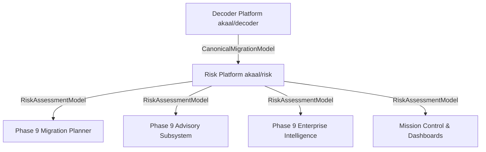

# ADR-012: Risk Platform Architecture & Enterprise Risk Assessment Engine

* **Status**: Accepted
* **Date**: 2026-07-18
* **Authors**: Antigravity AI / Lead Platform Architecture Team
* **Subsystem**: `akaal/risk` (Phase 9 — Feature 4)

---

## 1. Context & Motivation

The **Akaal Migration Platform** requires an enterprise migration risk assessment engine to evaluate the canonical, immutable **`CanonicalMigrationModel`** generated by Decoder and produce a deterministic, immutable, versioned, checksum-protected **`RiskAssessmentModel`**.

**Risk** operates strictly as an **analysis engine**. It contains **zero SQL generation, zero migration execution, zero planning, zero advisory recommendations execution, and zero business logic conversion**.

---

## 2. Architectural Decisions

### 2.1 Pipeline Decoupling & Inputs
The platform pipeline follows a strict linear architecture:
$$\text{Scout} \longrightarrow \text{Rulebook} \longrightarrow \text{Decoder} \longrightarrow \text{Risk} \longrightarrow \text{Planner} \longrightarrow \text{Advisor} \longrightarrow \text{Enterprise Intelligence}$$
- **Input**: Consumes **ONLY** `CanonicalMigrationModel` from Decoder. Risk communicates with no database drivers or runtime Rulebook modules.
- **Rule Provenance**: Risk accesses rule references embedded inside `CanonicalMigrationModel` by Decoder.

### 2.2 Enterprise Risk Taxonomy
Hierarchical risk classification:
$$\text{RiskDomain} \longrightarrow \text{RiskCategory} \longrightarrow \text{RiskType} \longrightarrow \text{RiskItem}$$
- Supported Domains: `COMPATIBILITY`, `PERFORMANCE`, `SECURITY`, `COMPLIANCE`, `OPERATIONAL`, `DATA_INTEGRITY`, `SEMANTIC`, `AVAILABILITY`, `SCALABILITY`, `INFRASTRUCTURE`.

### 2.3 Risk Evidence Graph (`RiskEvidenceGraph`)
- Interconnected directed graph linking `CanonicalObject`, `CanonicalIdentity`, `SemanticEquivalence`, embedded `Canonical Rule Provenance`, `CanonicalCapability`, `CanonicalConstraint`, `CanonicalFunction`, and `CanonicalDependency`.

### 2.4 Multi-Dimensional Confidence & Severity Matrix
- **Confidence**: Composed of metadata, rule provenance, analyzer, capability, and evidence strength.
- **Severity**: Calculated deterministically via $\text{Probability} \times \text{Impact} \times \text{Recoverability} \longrightarrow \text{Severity}$ (`INFO`, `LOW`, `MEDIUM`, `HIGH`, `CRITICAL`).

### 2.5 Multi-Level Resource & Cutover Readiness Models
- **Resource Estimation**: Computes `Minimum`, `Recommended`, `Peak`, and `Burst` requirements for CPU, RAM, Disk I/O, Network, Workers, and Temporary Staging Storage.
- **Cutover Readiness**: Evaluates Technical, Operational, Infrastructure, and Data Readiness $\to$ `Overall Readiness` (`READY`, `READY_WITH_WARNINGS`, `HIGH_RISK`, `NOT_READY`).

### 2.6 Deterministic Risk Aggregation (`AggregationEngine`)
- Pipeline: $\text{RiskItems} \longrightarrow \text{Grouping} \longrightarrow \text{Deduplication} \longrightarrow \text{Aggregation} \longrightarrow \text{Scoring} \longrightarrow \text{RiskAssessmentModel}$.
- Deduplicates risk evidence to prevent score inflation.

### 2.7 Serialization Layer (`RiskSerializer`)
- Deterministic JSON, binary, and versioned export/import with checksum preservation.

---

## 3. Downstream Integration Topology

