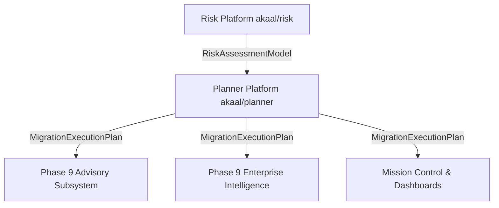

# ADR-013: Planner Platform Architecture & Enterprise Migration Planning Engine

* **Status**: Accepted
* **Date**: 2026-07-18
* **Authors**: Antigravity AI / Lead Platform Architecture Team
* **Subsystem**: `akaal/planner` (Phase 9 — Feature 5)

---

## 1. Context & Motivation

The **Akaal Migration Platform** requires an enterprise migration planning engine to convert the canonical **`RiskAssessmentModel`** produced by Risk into a deterministic, immutable, versioned, checksum-protected **`MigrationExecutionPlan`**.

**Planner** operates strictly as a **planning engine**. It contains **zero SQL generation, zero migration execution, zero database connections, zero advisory recommendations execution, and zero business logic conversion**.

---

## 2. Eight Core Roadmap Features

| Feature | Engine | Output |
|---|---|---|
| Migration Planning | `MigrationEngine` | `ExecutionTask` list |
| Execution Sequencing | `SequencingEngine` | `ExecutionSequence` |
| Dependency Planning | `DependencyEngine` + `DependencyAnalyzer` | `PlannerDependencyGraph` |
| Parallel Execution Planning | `ParallelEngine` + `ParallelismAnalyzer` | `parallel_strategy` dict |
| Checkpoint Planning | `CheckpointEngine` + `CheckpointAnalyzer` | `CheckpointPlan` |
| Rollback Planning | `RollbackEngine` + `RollbackAnalyzer` | `RollbackPlan` + `RollbackGraph` |
| Resource Scheduling | `SchedulingEngine` + `ResourceAnalyzer` | `ResourceSchedule` + `ResourceAllocationGraph` |
| Cutover Planning | `CutoverEngine` + `CutoverAnalyzer` | `CutoverPlan` (8 phases) |

---

## 3. Architectural Decisions

### 3.1 Pipeline Decoupling & Inputs
$$\text{Scout} \longrightarrow \text{Rulebook} \longrightarrow \text{Decoder} \longrightarrow \text{Risk} \longrightarrow \text{Planner} \longrightarrow \text{Advisor} \longrightarrow \text{Enterprise Intelligence}$$

- **Input**: Consumes **ONLY** `RiskAssessmentModel` from Risk Platform. No direct database drivers or runtime Rulebook dependencies.
- **Output**: Produces exclusively `MigrationExecutionPlan`.

### 3.2 Nine Final Architectural Refinements

1. **ExecutionState** (`PLANNED`..`ROLLED_BACK`): Defines intended task lifecycle statically.
2. **DependencySemantics** (`HARD`, `SOFT`, `OPTIONAL`, `SYNCHRONIZATION`, `VALIDATION`): Preserved as immutable metadata inside `ExecutionGraph`.
3. **ExecutionWindow** (`MAINTENANCE`, `BUSINESS`, `FREEZE`, `CUTOVER`, `VALIDATION`, `ROLLBACK`): First-class planning model.
4. **StagePolicy** (`RetryPolicy`, `CheckpointPolicy`, `FailurePolicy`, `ValidationPolicy`, `RollbackPolicy`): Embedded per `ExecutionStage`.
5. **PlannerEvidenceGraph**: Traceable graph linking risk assessments, planning strategy, constraints, and conflict resolution outcomes.
6. **PlanVersionInfo** (`plan_id`, `parent_plan_id`, `revision`, `revision_history`): Immutable version tracking.
7. **Expanded `PlannerValidator`**: Detects unreachable nodes, orphan nodes, circular rollback chains, duplicate tasks, invalid barriers, and broken dependencies.
8. **Refined Public API**: Single deterministic entry point — `PlannerPlatform.build_execution_plan()`.
9. **ConflictResolutionEngine**: Resource, dependency, checkpoint, rollback, scheduling, and parallelism conflict resolution before plan assembly.

### 3.3 Cutover Phase Model
Eight deterministic, immutable phases: `PREPARATION` → `FREEZE` → `SYNCHRONIZATION` → `VALIDATION` → `SWITCH` → `MONITORING` → `ROLLBACK_WINDOW` → `COMPLETION`.

### 3.4 Expanded Rollback Graph
`RollbackGraph` links `RollbackNode` → compensation chains, recovery nodes, `RollbackDependencies`, `RollbackBoundaries`, and `RollbackOrdering`.

---

## 4. Downstream Integration Topology

