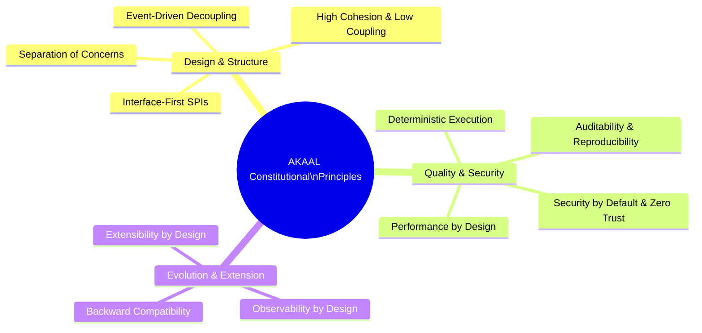
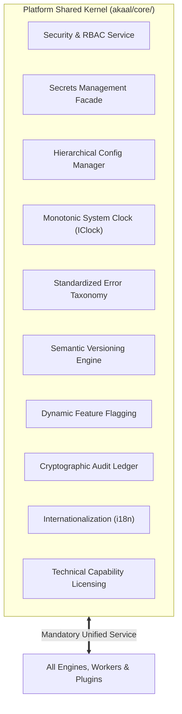
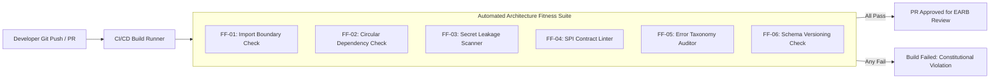
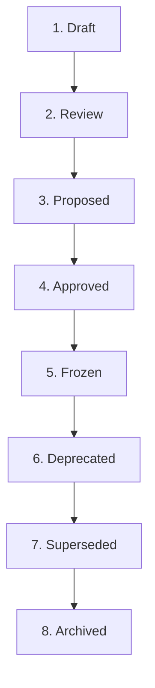

# AKAAL Enterprise Platform — Architecture Constitution
## The Supreme Engineering Governance & Compliance Framework (v1.0)

**Document Version:** 1.0  
**Status:** Ratified Supreme Engineering Constitution  
**Classification:** Internal Governance Specification  
**Author:** Enterprise Architecture Review Board (EARB), Chief Enterprise Software Architect & Platform Governance Council  
**Target Systems:** All Subsystems, Engines, Adapters, Plugins, Modules, APIs, and Runtimes of the AKAAL Enterprise Platform  

---

## Table of Contents

- [1. Executive Summary](#1-executive-summary)
- [2. Constitutional Principles](#2-constitutional-principles)
- [3. Constitutional Engineering Laws](#3-constitutional-engineering-laws)
- [4. Platform Shared Kernel Charter](#4-platform-shared-kernel-charter)
- [5. Architecture Fitness Functions](#5-architecture-fitness-functions)
- [6. Architecture Compliance Levels](#6-architecture-compliance-levels)
- [7. Canonical Architecture Lifecycle](#7-canonical-architecture-lifecycle)
- [8. Engineering Review Checklist](#8-engineering-review-checklist)
- [9. Architecture Governance Responsibilities](#9-architecture-governance-responsibilities)
- [10. Long-Term Evolution Strategy](#10-long-term-evolution-strategy)
- [11. Constitutional Compliance Statement](#11-constitutional-compliance-statement)
- [12. EARB Final Ratification Statement](#12-earb-final-ratification-statement)

---

## 1. Executive Summary

This document establishes the **AKAAL Architecture Constitution (v1.0)**. It represents the supreme engineering governance authority for the **AKAAL Enterprise Platform**. 

Having ratified the canonical operational workflow (`AKAAL_Enterprise_Migration_Workflow_v1.0.md`), the remaining architecture roadmap (`AKAAL_Remaining_Enterprise_Architecture_Roadmap_v2.0.md`), and the architecture governance review (`AKAAL_Architecture_Governance_Review_v1.0.md`), this Constitution establishes the immutable engineering laws, core principles, Shared Kernel charter, automated fitness functions, and governance processes that every current and future architecture document, code module, subsystem, plugin, and software engineer must strictly obey.

This Constitution supersedes all informal coding conventions, ad-hoc design patterns, and localized engineering decisions. Any code, architecture proposal, or pull request that violates this Constitution is declared invalid and shall be rejected by automated CI/CD gating and the Enterprise Architecture Review Board (EARB).

---

## 2. Constitutional Principles

All engineering endeavors within the AKAAL platform must embody the following **14 Constitutional Principles**:



### 1. Separation of Concerns
Every component must possess a single, well-defined architectural responsibility. Execution logic, task scheduling, database adaptation, data transformation, state persistence, intelligence, and observability must remain physically and logically separated into distinct modules.

### 2. High Cohesion & Low Coupling
Modules must group closely related functionality together while maintaining zero direct concrete coupling to external modules. Subsystems interact exclusively through versioned Service Provider Interfaces (SPIs) registered in the Gateway.

### 3. Interface-First (SPI) Design
No concrete class implementation may be exposed across subsystem boundaries. Every public service must expose a typed, contract-first Interface / SPI before any implementation code is authored.

### 4. Event-Driven Decoupling
Cross-subsystem notifications, telemetry streaming, state transition logging, and operational alerts must be dispatched as immutable events via the Internal Message Bus, preventing blocking dependencies between producer and consumer services.

### 5. Backward Compatibility
All persistent storage formats, AST serialization schemas, wire protocols, and public APIs must preserve backward compatibility across major versions. The platform must support seamless schema evolution without corrupting existing workspace state.

### 6. Security by Default
All network endpoints, IPC channels, and memory buffers must default to maximum security settings (strict TLS 1.3, AES-256 payload encryption, disabled debug probes, sanitized log sinks) out of the box.

### 7. Zero Trust Architecture
Every cross-boundary API invocation must authenticate session credentials, verify multi-tenant workspace isolation, and evaluate assigned RBAC/ABAC permissions before executing business logic.

### 8. Performance by Design
Core data movement pipelines (`WF-011`, `WF-016`) must utilize zero-copy byte-buffer streaming and push-down SQL algorithms. Performance bottlenecks must be eliminated at the architectural layer, not patched after implementation.

### 9. Observability by Design
No operational component may execute as a black box. All worker processes, driver adapters, and state machines must emit structured logs, OpenTelemetry traces, and high-frequency Prometheus metrics natively.

### 10. Extensibility by Design
The platform must support third-party enterprise custom drivers, data masking rules, validation algorithms, and CAB governance hooks through versioned, sandboxed plugin containers without modifying core platform code.

### 11. Deterministic Execution
Migration workflows, state transitions, and topological DAG evaluations must produce identical execution paths given identical input metadata profiles, preventing non-deterministic behavior during load operations.

### 12. Auditability
Every user action, approval sign-off, schema mutation, state transition, and self-healing recovery attempt must be recorded in an append-only, cryptographically signed SHA-256 audit repository.

### 13. Reproducibility
The system must be capable of re-creating exact operational states, AST configurations, and execution topologies from persistent state records for diagnostic verification and compliance auditing.

### 14. Hardware & OS Neutrality
Core migration engine logic must contain zero operating-system-specific calls or hardcoded filesystem assumptions, operating uniformly across Standalone Desktop, Enterprise Server, Cloud Kubernetes, and Edge Node runtimes.

---

## 3. Constitutional Engineering Laws

Every engineer, subsystem, pull request, and canonical architecture must comply with the **15 Constitutional Engineering Laws**. Violations result in automatic CI/CD build rejection.

```
┌──────────────────────────────────────────────────────────────────────────────────┐
│                     AKAAL CONSTITUTIONAL ENGINEERING LAWS                        │
├──────────┬───────────────────────────────────────────────────────────────────────┤
│ Law ID   │ Constitutional Law Specification                                      │
├──────────┼───────────────────────────────────────────────────────────────────────┤
│ LAW-001  │ No subsystem may bypass a published SPI to call concrete classes.     │
│ LAW-002  │ Direct inter-subsystem database or internal state access is forbidden.│
│ LAW-003  │ Every architectural boundary must expose a published typed contract. │
│ LAW-004  │ Circular dependencies between packages or modules are prohibited.     │
│ LAW-005  │ All persistent storage structures, ASTs, and wire formats must be    │
│          │ explicitly versioned.                                                 │
│ LAW-006  │ Breaking changes to SPI contracts require formal EARB ADR approval.   │
│ LAW-007  │ All cross-cutting concerns must consume Platform Shared Kernel       │
│          │ services exclusively.                                                 │
│ LAW-008  │ All public API endpoints and background workers must be observable.   │
│ LAW-009  │ Plaintext credentials and secrets must never touch persistent disk.   │
│ LAW-010  │ Destructive operations require verified 4-Eyes digital sign-offs.     │
│ LAW-011  │ Worker streams are forbidden from mutating shared in-memory buffers.  │
│ LAW-012  │ System clock queries must consume the monotonic `IClock` abstraction.  │
│ LAW-013  │ All error exceptions must map to the Standardized Error Taxonomy.     │
│ LAW-014  │ State machine ledgers and audit records must be append-only.          │
│ LAW-015  │ Automatic surrogate primary key creation without human sign-off is    │
│          │ strictly illegal.                                                     │
└──────────┴───────────────────────────────────────────────────────────────────────┘
```

### Detailed Statutory Specifications

- **LAW-001 (SPI Enforcement):** No subsystem may import concrete implementation classes from another subsystem. All interaction occurs through SPIs registered with the `Internal REST & Event Gateway`.
- **LAW-002 (Encapsulated State Access):** Subsystems must not read or mutate private data structures or local SQLite/state repositories belonging to another subsystem.
- **LAW-003 (Contract Formalization):** Public interfaces must specify request/response data contracts using strict types (Pydantic / TypeScript Interfaces / Proto schemas).
- **LAW-004 (Zero Circular Dependencies):** Package import graphs must form a Directed Acyclic Graph (DAG). Circular imports between components trigger immediate build failure.
- **LAW-005 (Schema Versioning):** Every serialized JSON, YAML, SQLite table, or binary stream file header must include a version attribute (`schema_version: "X.Y.Z"`).
- **LAW-006 (Breaking Change Restriction):** Modifying or removing a published SPI method requires an approved Architectural Decision Record (ADR) and a minimum 2-minor-release deprecation grace period.
- **LAW-007 (Shared Kernel Mandatory Use):** Subsystems are strictly forbidden from implementing custom logging, secrets retrieval, RBAC checking, or configuration parsing logic.
- **LAW-008 (Universal Observability):** Every API handler and background worker process must instrument OpenTelemetry spans and Prometheus metrics counters natively.
- **LAW-009 (Zero Plaintext Secrets):** Passwords, private keys, and tokens must be stored as encrypted secret references (`ref://secrets/tenant/id`) resolved in-memory at execution time.
- **LAW-010 (Mandatory Governance Sign-Off):** Execution engines must verify signed Approval Records (`GATE 1`, `GATE 2`, `GATE 3`) before applying target DDL, dropping objects, or initiating cutover.
- **LAW-011 (Zero-Copy Buffer Integrity):** Data transport streams (`WF-011`, `WF-016`) must treat payload byte buffers as read-only, applying inline data masking via zero-copy stream views.
- **LAW-012 (Monotonic Time Measurement):** All duration calculations, timeout checks, and replication lag metrics must query the monotonic system clock provider (`IClock`).
- **LAW-013 (Taxonomic Error Handling):** Bare `except Exception:` catches are illegal. Errors must instantiate a `PlatformException` containing a valid error code (`AKAAL-ERR-XXX`), category, and severity rating.
- **LAW-014 (Append-Only Audit Trail):** SQL statements executing `UPDATE` or `DELETE` against `audit_repository` or `checkpoint_store` tables are strictly illegal and blocked by DB triggers.
- **LAW-015 (Surrogate Key Prohibition):** Generating automatic surrogate primary keys without prior explicit human approval via `GATE 2` is strictly forbidden, preserving Agenda 1 compliance.

---

## 4. Platform Shared Kernel Charter

The **Platform Shared Kernel** (`akaal/core/`) provides centralized, tamper-proof infrastructure services utilized across all 8 canonical architecture domains.



### In-Scope Responsibilities (What Belongs in the Kernel)
- **Security & Secrets:** RBAC enforcement, JWT validation, HashiCorp Vault / KMS secret resolution.
- **Configuration & Clock:** Multi-tenant configuration hierarchy parsing, UTC monotonic clock providers.
- **Diagnostics & Error Taxonomy:** Exception base classes, standardized error code registry, locale message resolution.
- **Governance & Audit:** SHA-256 digest creation, append-only audit persistence wrappers, feature flag evaluation.

### Out-of-Scope Responsibilities (What Must NEVER Belong in the Kernel)
- **Database Migration Logic:** DDL parsing, table chunking, SQL dialect transformation, or row streaming logic.
- **UI & Presentation Logic:** HTML rendering, desktop IPC event handling, or visual theme management.
- **Database-Specific Drivers:** Native database drivers (Oracle, Postgres, Snowflake) must reside exclusively inside UDAL Driver Plugins (`akaal/adapters/`).

---

## 5. Architecture Fitness Functions

To enforce Constitutional compliance automatically, AKAAL integrates continuous **Architecture Fitness Functions** into the CI/CD pipeline:



### Automated Fitness Function Registry

| ID | Fitness Function Name | Verification Objective | Validation Method | CI/CD Enforcement Tool | Failure Severity |
|:---:|:---|:---|:---|:---|:---:|
| **FF-01** | **Import Boundary Check** | Detect illegal direct concrete imports across subsystems. | AST Static Analysis (`import-linter`) | Pre-Commit / Build Pipeline | `CRITICAL (Block)` |
| **FF-02** | **Circular Dependency Scanner**| Detect circular package dependencies. | Graph Analysis (`dependency-check`) | Build Pipeline | `CRITICAL (Block)` |
| **FF-03** | **Secret Leakage Scanner** | Detect hardcoded passwords, keys, or tokens in source. | Entropy Scanning (`TruffleHog` / `Gitleaks`) | Pre-Commit Hook | `CRITICAL (Block)` |
| **FF-04** | **SPI Contract Linter** | Ensure public APIs implement typed interface contracts. | Type Checker (`mypy` strict mode) | Build Pipeline | `HIGH (Block)` |
| **FF-05** | **Error Taxonomy Auditor** | Verify all thrown exceptions use valid `AKAAL-ERR-XXX` codes. | AST Code Inspection | Build Pipeline | `HIGH (Block)` |
| **FF-06** | **Schema Version Check** | Confirm persistent data models include `schema_version`. | Model Schema Validation | Build Pipeline | `HIGH (Block)` |
| **FF-07** | **Layering Compliance Check**| Enforce unidirectional dependency flow rule (`LAW-002`). | Architecture Fitness Suite | Build Pipeline | `CRITICAL (Block)` |
| **FF-08** | **Observability Probe Check**| Verify API handlers instantiate OpenTelemetry spans. | AST Code Inspection | Build Pipeline | `MEDIUM (Warn)` |

---

## 6. Architecture Compliance Levels

Every module, subsystem, and pull request is assigned an **Architecture Compliance Level**:

```
┌──────────────────────────────────────────────────────────────────────────────────┐
│                        ARCHITECTURE COMPLIANCE LEVELS                            │
├──────────┬──────────────────────┬────────────────────────────────────────────────┤
│ Level    │ Status Name          │ Description & Governance Rules                 │
├──────────┼──────────────────────┼────────────────────────────────────────────────┤
│ LEVEL A  │ Fully Compliant      │ 100% compliant with Constitution and Canonical   │
│          │                      │ Architecture Specs. Ready for production merge. │
├──────────┼──────────────────────┼────────────────────────────────────────────────┤
│ LEVEL B  │ Approved Exception   │ Deviates from non-critical rule with an        │
│          │                      │ approved Architectural Decision Record (ADR).   │
├──────────┼──────────────────────┼────────────────────────────────────────────────┤
│ LEVEL C  │ Temporary Debt       │ Contains approved technical debt with an       │
│          │                      │ explicit EARB remediation deadline (<90 days). │
├──────────┼──────────────────────┼────────────────────────────────────────────────┤
│ LEVEL D  │ Non-Compliant        │ Violates Constitutional Laws without an ADR.   │
│          │                      │ Merge is strictly blocked by CI/CD.            │
└──────────┴──────────────────────┴────────────────────────────────────────────────┘
```

### Remediation & Escalation Rules
- **Level D to Level A/B:** Code categorized as Level D cannot be merged into any integration branch. The author must resolve violations or submit an ADR for EARB evaluation.
- **Level C Expiration:** If technical debt categorized as Level C is not remediated within **90 days**, CI/CD pipelines automatically degrade the status to Level D, blocking subsequent releases.

---

## 7. Canonical Architecture Lifecycle

Canonical Architecture Documents (`docs/architecture/*.md`) progress through an explicit 8-stage lifecycle:



### Lifecycle Transition Criteria
1. **Draft ➔ Review:** Author completes preliminary architecture draft and submits to EARB.
2. **Review ➔ Proposed:** EARB conducts peer review and verifies Constitutional alignment.
3. **Proposed ➔ Approved:** EARB issues formal approval sign-off in meeting minutes.
4. **Approved ➔ Frozen:** Architecture document is locked against modification (`v1.0.md`); implementation begins.
5. **Frozen ➔ Deprecated:** A newer architectural pattern is proposed; legacy specification is marked deprecated with a 2-minor release grace period.
6. **Deprecated ➔ Superseded:** New architecture specification is approved and takes effect (`v2.0.md`).
7. **Superseded ➔ Archived:** Legacy specification is moved to historical archive storage.

---

## 8. Engineering Review Checklist

Before any PR or architectural proposal is approved, reviewers and EARB auditors must complete the **Mandatory Engineering Review Checklist**:

- [ ] **1. SPI Boundaries:** Does the change interact with external subsystems strictly through published SPIs? (`LAW-001`)
- [ ] **2. Dependency Direction:** Does the module preserve unidirectional dependency layering without circular imports? (`LAW-002`, `LAW-004`)
- [ ] **3. Shared Kernel Utilization:** Does the change consume central Shared Kernel services for security, secrets, clock timing, and logging? (`LAW-007`)
- [ ] **4. Zero Secrets Leakage:** Are passwords and credentials handled via encrypted secret references (`ref://`)? (`LAW-009`)
- [ ] **5. Governance Integrity:** Does the workflow verify 4-Eyes digital approvals (`GATE 1`, `GATE 2`, `GATE 3`) before destructive operations? (`LAW-010`)
- [ ] **6. Streaming Performance:** Are bulk load and CDC streams implemented using zero-copy byte-buffer view pipelines? (`LAW-011`)
- [ ] **7. Standardized Error Handling:** Are all thrown exceptions mapped to valid `AKAAL-ERR-XXX` codes? (`LAW-013`)
- [ ] **8. Schema Versioning:** Does persistent data contain explicit schema version attributes? (`LAW-005`)
- [ ] **9. Observability & Telemetry:** Are distributed OpenTelemetry spans and Prometheus metrics instrumented natively? (`LAW-008`)
- [ ] **10. ADR Requirement:** If introducing an architectural exception or SPI modification, is an approved ADR attached? (`LAW-006`)

---

## 9. Architecture Governance Responsibilities

```
┌──────────────────────────────────────────────────────────────────────────────────┐
│                      GOVERNANCE RESPONSIBILITY MATRIX                            │
├─────────────────────┬────────────────────────────────────────────────────────────┤
│ Role                │ Architectural Governance Authority & Responsibility        │
├─────────────────────┼────────────────────────────────────────────────────────────┤
│ Chief Architect     │ Ultimate authority over Constitutional amendments,         │
│                     │ canonical document freezes, and major breaking changes.    │
├─────────────────────┼────────────────────────────────────────────────────────────┤
│ EARB Council        │ Evaluates architecture proposals, approves ADRs, enforces  │
│                     │ fitness functions, and conducts bi-annual compliance audits.│
├─────────────────────┼────────────────────────────────────────────────────────────┤
│ Lead Engineers      │ Ensures component designs comply with the Constitution and │
│                     │ enforces checklist reviews during pull request sign-offs.  │
├─────────────────────┼────────────────────────────────────────────────────────────┤
│ Plugin Developers   │ Builds custom enterprise adapters in strict compliance with│
│                     │ sandboxed Extension SDK SPI contracts (Agenda 8).           │
└─────────────────────┴────────────────────────────────────────────────────────────┘
```

---

## 10. Long-Term Evolution Strategy

The **AKAAL Architecture Constitution** is designed to remain valid across a 10-year platform lifespan. When integrating emerging technologies, engineering teams must apply the following evolutionary strategies:

- **New Database Storage Engines (NoSQL / Vector / Graph):** Implement new UDAL Driver Plugins (`Agenda 1`) exposing native catalog extraction and push-down validation without altering core migration workers.
- **Cloud-Native Kubernetes & Serverless Runtimes:** Implement new containerized `Execution Runtime` SPI providers (`Agenda 3`) without modifying task DAG scheduling logic (`Agenda 4`).
- **Autonomous AI & Machine Learning Expansion:** Route all AI recommendations and automated self-healing through the `Enterprise Intelligence` event bus (`Agenda 6`), maintaining human 4-Eyes sign-off gates (`GATE 1`, `GATE 2`, `GATE 3`).
- **Post-Quantum Cryptography Migration:** Update digest algorithms centrally inside the `Platform Shared Kernel Security Service` without refactoring individual application modules.

---

## 11. Constitutional Compliance Statement

All code authored for the **AKAAL Enterprise Platform** must state compliance with this document:

> *"This software module strictly complies with the AKAAL Architecture Constitution (v1.0). It adheres to all Constitutional Principles, obeys all Statutory Engineering Laws (LAW-001 through LAW-015), consumes Shared Kernel services exclusively, and passes all automated CI/CD Architecture Fitness Functions."*

---

## 12. EARB Final Ratification Statement

The Enterprise Architecture Review Board (EARB) hereby ratifies the **AKAAL Architecture Constitution (v1.0)** as the supreme engineering governance authority for the AKAAL Enterprise Platform. 

This Constitution is **OFFICIALLY RATIFIED & IN EFFECT**. All engineering activities across all 15 implementation phases shall strictly conform to its provisions.

### Official EARB Ratification Sign-Off:

**RATIFIED & ENACTED AS THE SUPREME ARCHITECTURE CONSTITUTION (v1.0)**  
*Enterprise Architecture Review Board, Chief Enterprise Software Architect & Platform Governance Council — AKAAL Enterprise Platform*
