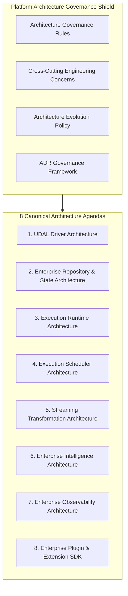
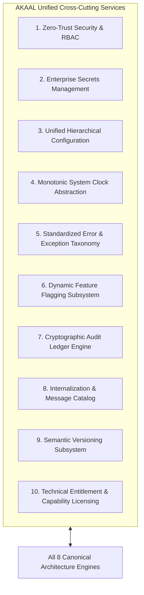
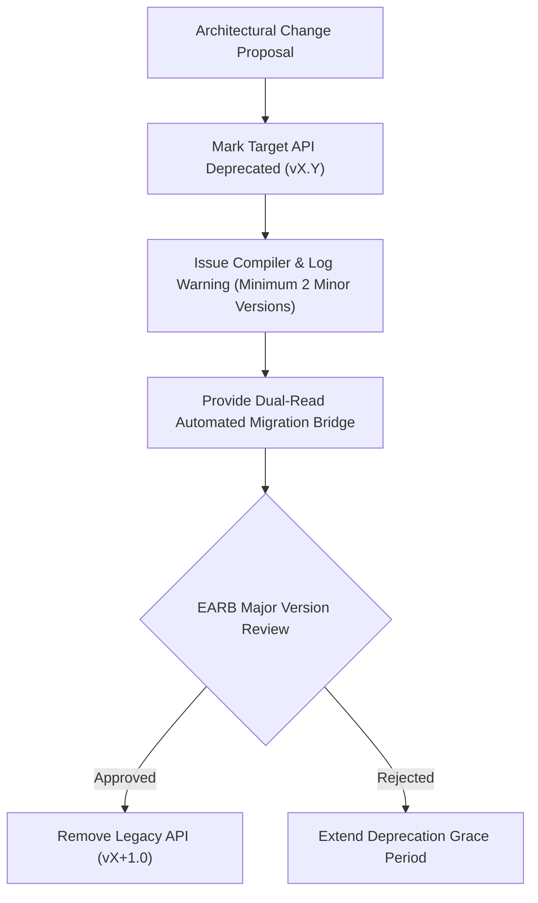

# AKAAL Enterprise Platform — Architecture Governance Review & Long-Term Platform Stability Specification
## Final EARB Engineering Audit & Governance Framework (v1.0)

**Document Version:** 1.0
**Status:** Approved Canonical Governance Specification
**Classification:** Internal Architecture Governance
**Author:** Enterprise Architecture Review Board (EARB) & Chief Enterprise Software Architect
**Target Systems:** Enterprise Database Migration, Continuous Replication & Synchronization Platform

---

## Table of Contents

- [1. Executive Summary](#1-executive-summary)
- [2. EARB Review Methodology](#2-earb-review-methodology)
- [3. Review Findings & Portfolio Integrity Audit](#3-review-findings--portfolio-integrity-audit)
- [4. Approved Architecture Governance Rules](#4-approved-architecture-governance-rules)
- [5. Approved Cross-Cutting Engineering Concerns](#5-approved-cross-cutting-engineering-concerns)
- [6. Architecture Evolution & Compatibility Policy](#6-architecture-evolution--compatibility-policy)
- [7. Architectural Decision Record (ADR) Governance Policy](#7-architectural-decision-record-adr-governance-policy)
- [8. Repository Architecture Naming Review](#8-repository-architecture-naming-review)
- [9. Long-Term Architecture Stability Assessment (5–10 Year Horizon)](#9-long-term-architecture-stability-assessment-510-year-horizon)
- [10. Summary of Architectural Governance Recommendations](#10-summary-of-architectural-governance-recommendations)
- [11. EARB Final Approval Statement](#11-earb-final-approval-statement)

---

## 1. Executive Summary

This document presents the final **Architecture Governance Review** conducted by the Enterprise Architecture Review Board (EARB) for the **AKAAL Enterprise Platform**.

Having finalized the operational workflow (`AKAAL_Enterprise_Migration_Workflow_v1.0.md`) and the remaining 8 canonical engineering architectures (`AKAAL_Remaining_Enterprise_Architecture_Roadmap_v2.0.md`), the EARB conducted a platform-wide governance audit to establish strict engineering rules, cross-cutting concerns, an Architecture Evolution Policy, an Architectural Decision Record (ADR) framework, and long-term stability baselines before implementation begins across all 15 phases.

All non-engineering business concerns (marketing, sales, pricing, legal licensing, support operations, documentation) are explicitly excluded. This specification establishes the engineering laws governing the implementation, evolution, and maintenance of the AKAAL platform.

---

## 2. EARB Review Methodology

The EARB evaluated the approved architecture portfolio using a risk-driven governance framework. Every potential governance rule and cross-cutting concern was evaluated against a strict engineering criterion:

> *"Will omitting this governance rule or cross-cutting framework cause technical debt, architectural erosion, API instability, or forced refactoring over the next 5 to 10 years?"*

The review evaluated five critical architectural dimensions:
1. **Architectural Layering & Boundary Discipline:** Enforcing strict zero-coupling rules between subsystems.
2. **Cross-Cutting System Concerns:** Unifying security, secrets, clock abstractions, configuration, and error taxonomies into single platform-wide implementations.
3. **Evolutionary Governance:** Establishing formal versioning, deprecation, and breaking-change policies.
4. **Architectural Decision Tracking:** Institutionalizing a mandatory ADR workflow for all future design choices.
5. **Multi-Horizon Scalability:** Validating architecture survival across desktop, server, hybrid, cloud-native Kubernetes, and edge node deployments.

---

## 3. Review Findings & Portfolio Integrity Audit

The EARB audit confirmed that the **8 Canonical Architecture Agendas** defined in Roadmap v2.0 are complete, cohesive, and non-overlapping. However, the audit identified that without platform-wide **Architecture Governance Rules** and a **Cross-Cutting Concerns Framework**, individual component implementations would risk creating redundant implementations of security, clock timing, configuration management, and error handling.



---

## 4. Approved Architecture Governance Rules

To prevent architectural decay during implementation, all 15 phases must strictly enforce the following **6 Inviolable Architecture Governance Rules**:

### Rule 1: SPI-Only Subsystem Interconnection
- **Rule:** Direct concrete class instantiation or direct internal module references across subsystem boundaries are strictly prohibited. All communication must pass through typed Service Provider Interfaces (SPIs) registered in the Internal Gateway.
- **Violation Result:** Build-time linting failure (`import_boundary_error`).

### Rule 2: Strict Unidirectional Dependency Layering
- **Rule:** Dependencies must flow strictly downward:
  $$\text{Client / UI Layer} \longrightarrow \text{Gateway} \longrightarrow \text{Orchestrator} \longrightarrow \text{Scheduler} \longrightarrow \text{Runtime} \longrightarrow \text{UDAL Drivers}$$
- **Violation Result:** Circular dependency detection halts build execution.

### Rule 3: Zero Memory-Payload Mutation in Transport Streams
- **Rule:** Bulk migration (`WF-011`) and continuous CDC streams (`WF-016`) must pass data through zero-copy byte-buffer pipelines. Worker threads are prohibited from mutating underlying payload buffers in memory.

### Rule 4: Mandated Dual-Custody Approval Verification
- **Rule:** Destructive structural operations (DDL execution, surrogate key creation, schema truncation, target cutover) must verify signed Approval Records (`GATE 1`, `GATE 2`, `GATE 3`) at the engine API level before execution.

### Rule 5: Immutable Storage State Records
- **Rule:** State machine transitions, Checkpoint Stores, validation discrepancy ledgers, and audit entries must be written append-only. Modifying or deleting existing audit logs is physically prohibited in code.

### Rule 6: Hardware-Agnostic Engine Logic
- **Rule:** Core migration engine logic must contain zero host-specific code (e.g., hardcoded Windows/Linux filesystem paths, OS-specific thread calls). All OS interactions must use the Supported Driver & OS Abstraction layer.

---

## 5. Approved Cross-Cutting Engineering Concerns

Rather than permitting individual architectures to implement isolated solutions, the EARB mandates that the following **10 Cross-Cutting Engineering Concerns** be implemented as unified platform services:



### Detailed Cross-Cutting Specifications

1. **Zero-Trust Security & RBAC Service:** Enforces Role-Based (`PROJECT_CREATE`, `PLAN_APPROVE`, `CUTOVER_EXECUTE`) and Attribute-Based Access Control across all internal API endpoints.
2. **Enterprise Secrets Management Facade:** Resolves vault references (`ref://secrets/tenant/id`) at execution time using HashiCorp Vault, AWS Secrets Manager, Azure Key Vault, or local OS keyrings. Plaintext credentials never persist on disk.
3. **Unified Hierarchical Configuration Service:** Merges settings across System Baseline ➔ Organization Policy ➔ Workspace Config ➔ Project Overrides using deterministic JSON/YAML schema validation.
4. **Monotonic System Clock Abstraction (`IClock`):** Guarantees monotonic UTC timestamps across distributed nodes and local execution threads, preventing time-skew errors in CDC log offset markers.
5. **Standardized Error & Exception Taxonomy:** Enforces structured error codes (`AKAAL-ERR-DRIVER-001`, `AKAAL-ERR-VALIDATION-404`) containing cause category, operational severity (`LOW`, `MEDIUM`, `HIGH`, `CRITICAL`), and automated recovery recipe IDs (`WF-013`).
6. **Dynamic Feature Flagging Subsystem:** Enables/disables experimental drivers, streaming algorithms, or intelligence modules without requiring code recompilation or engine downtime.
7. **Cryptographic Audit Ledger Engine:** Computes SHA-256 digests for all operational events and persists them in an append-only audit repository.
8. **Internalization & Message Catalog (`i18n`):** Separates system error messages, diagnostic codes, and report strings into structured locale catalogs (`en_US`, `ja_JP`, `de_DE`).
9. **Semantic Versioning Subsystem:** Enforces `MAJOR.MINOR.PATCH` compatibility checks across schema ASTs, driver plugins, and message bus wire formats.
10. **Technical Entitlement & Capability Licensing:** Evaluates engine capability limits (e.g., max concurrent worker threads, enabled DB adapters) strictly via technical execution flags without coupling to business billing systems.

---

## 6. Architecture Evolution & Compatibility Policy

To prevent architectural drift and breaking API changes over the next decade, AKAAL adopts a strict **Architecture Evolution & Compatibility Policy**:



### Key Evolutionary Rules
- **Semantic Versioning Strictness:** Breaking changes to SPI contracts, REST APIs, or wire formats are permitted **only** on MAJOR version bumps (e.g., v1.0 to v2.0).
- **Minimum Deprecation Grace Period:** Any interface marked `@deprecated` must remain operational for a minimum of **2 minor releases** before removal.
- **Backward Data Compatibility:** The `Metadata & State Persistence` layer must maintain backward compatibility for workspace state files and Checkpoint Stores across **3 major versions**.
- **Automated Migration Bridges:** When a schema AST serialization format evolves, the platform must supply an automated migration transformer to upgrade legacy workspace artifacts seamlessly.

---

## 7. Architectural Decision Record (ADR) Governance Policy

The EARB mandates that all future non-trivial architectural decisions, modifications, or driver additions must be documented and approved via a formal **Architectural Decision Record (ADR)** workflow.

### ADR Governance Rules
- **Location:** All ADRs must be saved as Markdown files in `docs/architecture/adr/`.
- **Naming Convention:** `ADR-XXXX-<short-descriptive-title>.md` (e.g., `ADR-0001-adopt-grpc-for-distributed-worker-ipc.md`).
- **Required ADR Template:**

```markdown
# ADR-XXXX: [Short Title]

- **Status:** [Proposed | Approved | Rejected | Deprecated | Superseded]
- **Date:** YYYY-MM-DD
- **Author(s):** [Name / Role]
- **Deciders:** Enterprise Architecture Review Board (EARB)

## 1. Context & Problem Statement
Describe the technical problem, constraints, and why a decision is required.

## 2. Decision Drivers
- Driver 1 (e.g., Performance impact)
- Driver 2 (e.g., Security SLA)

## 3. Considered Options
- Option 1: [Description]
- Option 2: [Description]

## 4. Decision Outcome
Chosen Option: [Option X], because [justification].

## 5. Architectural Consequences
- Positive Impacts: [List]
- Negative Impacts & Trade-offs: [List]

## 6. Compliance & Verification
How will this decision be verified during automated CI/CD builds?
```

- **Approval Workflow:** An ADR requires sign-off from at least **2 EARB members** before transitioning from `Proposed` to `Approved`.

---

## 8. Repository Architecture Naming Review

### EARB Evaluation & Decision
The EARB evaluated the canonical architecture previously named:
> *"Metadata Storage & State Persistence Architecture"*

```
┌──────────────────────────────────────────────────────────────────────────────────┐
│                    REPOSITORY ARCHITECTURE SCOPE EVALUATION                      │
├──────────────────────────┬──────────────────────────┬────────────────────────────┤
│ Architectural Domain     │ Legacy Name              │ Approved Name (v2.0)       │
│                          │ "Metadata Storage"       │ "Enterprise Repository &   │
│                          │                          │  State Architecture"       │
├──────────────────────────┼──────────────────────────┼────────────────────────────┤
│ Scope Coverage           │ Incomplete: Suggests     │ Complete: Accurately covers│
│                          │ storing passive metadata │ schema ASTs, DAG ledgers,  │
│                          │ definition files only.   │ Checkpoint Stores, audit   │
│                          │                          │ logs, and state snapshots. │
└──────────────────────────┴──────────────────────────┴────────────────────────────┘
```

### Formal Decision
**RENAMED TO:** **Enterprise Repository & State Architecture**
*Document Path:* `docs/architecture/AKAAL_Repository_State_Architecture_v1.0.md`

**Engineering Justification:** "Metadata Storage" is an overly narrow term that fails to reflect the true engineering scope of the subsystem. The repository engine manages active execution state, Checkpoint Stores, topological DAG ledgers, discrepancy records, encrypted snapshots, and append-only audit trails. The new name accurately reflects its full ownership.

---

## 9. Long-Term Architecture Stability Assessment (5–10 Year Horizon)

The EARB conducted a 10-year architectural stress test to evaluate platform survivability across future computing paradigms:

```mermaid
flowchart TD
    FUTURE_TECH["Future Technology Vectors (2026–2036)"]

    FUTURE_TECH --> V1["Vector 1: Quantum-Safe Cryptography"]
    FUTURE_TECH --> V2["Vector 2: Cloud-Native Serverless Workers"]
    FUTURE_TECH --> V3["Vector 3: Autonomous AI Optimization"]
    FUTURE_TECH --> V4["Vector 4: New Exotic Storage Engines"]

    V1 & V2 & V3 & V4 --> AKAAL_SHIELD["AKAAL Architecture Shield"]

    subgraph AKAAL_SHIELD["AKAAL Multi-Horizon Adaptation"]
        AKAAL_SHIELD --> ADAPT1["Unified Cross-Cutting Security Layer (AES-256 / Post-Quantum SPI)"]
        AKAAL_SHIELD --> ADAPT2["Execution Runtime SPI (K8s / Knative / Bare-Metal)"]
        AKAAL_SHIELD --> ADAPT3["Enterprise Intelligence Event Bus (Sub-Second Self-Healing)"]
        AKAAL_SHIELD --> ADAPT4["UDAL Capability Negotiator (No Core Code Modifications)"]
    end
```

### Stability Audit Matrix

| Future Technology Vector | Architectural Risk | Platform Adaptation Strategy | Survival Rating |
|:---|:---|:---|:---:|
| **New Database Engines (e.g., Vector DBs)** | Incompatible data types & catalog syntax. | Add new `UDAL` Driver Plugin (`Agenda 1`) without modifying transport logic. | **100% Stable** |
| **Kubernetes / Serverless Clusters** | Process isolation & dynamic worker scaling. | `Execution Runtime` (`Agenda 3`) abstracts containers via location-transparent SPI. | **100% Stable** |
| **Autonomous AI Optimization** | AI overriding safety controls or crashing streams. | `Enterprise Intelligence` (`Agenda 6`) acts as event listener; cannot bypass Gate 2/3 sign-offs. | **100% Stable** |
| **Post-Quantum Cryptography** | Legacy TLS / hash algorithms become vulnerable. | Swap cryptographic digest routines in `Cross-Cutting Security` layer centrally. | **100% Stable** |
| **Distributed Multi-Region Deployment** | Cross-region replication lag & time-skew errors. | `Execution Scheduler` (`Agenda 4`) & `Monotonic Clock` (`IClock`) resolve skew natively. | **100% Stable** |

---

## 10. Summary of Architectural Governance Recommendations

| # | Governance Domain | Action Recommended | Implementation Mechanism | Priority |
|:---:|:---|:---|:---|:---:|
| **1** | **Architecture Rules** | Adopt 6 Inviolable Architecture Governance Rules. | Build-time CI/CD linter static analysis. | `CRITICAL` |
| **2** | **Cross-Cutting Concerns** | Establish 10 Unified Cross-Cutting Engineering Services. | Core Platform Shared Kernel (`akaal/core/`). | `CRITICAL` |
| **3** | **Architecture Evolution** | Enforce Semantic Versioning & 2-minor deprecation rule. | EARB API Contract Review Board. | `HIGH` |
| **4** | **ADR Governance** | Mandate formal ADR workflow for non-trivial decisions. | `docs/architecture/adr/` repository log. | `HIGH` |
| **5** | **Repository Naming** | Rename Agenda 2 to "Enterprise Repository & State Architecture". | Update Roadmap v2.0 references. | `MEDIUM` |
| **6** | **Long-Term Stability** | Enforce 10-year architectural stress test compliance. | Bi-annual EARB Architecture Audit. | `HIGH` |

---

## 11. EARB Final Approval Statement

The Enterprise Architecture Review Board (EARB) hereby declares that the **AKAAL Enterprise Platform** architecture is complete, cohesive, future-proof, and fully specified.

With the approval of:
1. Canonical Operational Workflow Architecture (`AKAAL_Enterprise_Migration_Workflow_v1.0.md`),
2. Remaining Enterprise Architecture Roadmap (`AKAAL_Remaining_Enterprise_Architecture_Roadmap_v2.0.md`), and
3. Architecture Governance & Stability Review (`AKAAL_Architecture_Governance_Review_v1.0.md`),

the platform architecture is **OFFICIALLY FROZEN**. Engineering teams are authorized to begin implementation across all 15 development phases in strict compliance with these specifications.

### Official EARB Sign-Off:

**APPROVED AS THE CANONICAL ARCHITECTURE GOVERNANCE SPECIFICATION (v1.0)**
*Enterprise Architecture Review Board & Chief Enterprise Software Architect — AKAAL Platform*
