# AKAAL Enterprise Migration Workflow & Execution Architecture

**Document Version:** 1.0  
**Status:** Approved Enterprise Architecture  
**Classification:** Internal Architecture  

---

## Table of Contents

- [1. Executive Summary](#1-executive-summary)
- [2. Purpose](#2-purpose)
- [3. Scope](#3-scope)
- [4. Audience](#4-audience)
- [5. Architectural Principles](#5-architectural-principles)
- [6. Relationship with Frozen Agendas 1–4](#6-relationship-with-frozen-agendas-14)
- [7. High-Level Architecture](#7-high-level-architecture)
- [8. Complete Workflow Overview](#8-complete-workflow-overview)
- [9. Complete Workflow Diagram](#9-complete-workflow-diagram)
- [10. Workflow State Machine](#10-workflow-state-machine)
- [11. Migration Lifecycle — Detailed Stage Specifications](#11-migration-lifecycle--detailed-stage-specifications)
  - [WF-001: Project Initiation & Scope Definition](#wf-001-project-initiation--scope-definition)
  - [WF-002: Discovery & Schema Extraction](#wf-002-discovery--schema-extraction)
  - [WF-003: Assessment & Deep Inspection](#wf-003-assessment--deep-inspection)
  - [WF-004: Risk Scoring & Impact Analysis](#wf-004-risk-scoring--impact-analysis)
  - [WF-005: Schema Mapping & Transformation](#wf-005-schema-mapping--transformation)
  - [WF-006: Execution Planning & Dependency Graph](#wf-006-execution-planning--dependency-graph)
  - [WF-007: Governance, Security & Compliance](#wf-007-governance-security--compliance)
  - [WF-008: Formal Approval & Change Governance](#wf-008-formal-approval--change-governance)
  - [WF-009: Pre-Flight Validation & Simulation](#wf-009-pre-flight-validation--simulation)
  - [WF-010: Scheduling & Maintenance Window](#wf-010-scheduling--maintenance-window)
  - [WF-011: Bulk Migration Execution](#wf-011-bulk-migration-execution)
  - [WF-012: Monitoring & Telemetry](#wf-012-monitoring--telemetry)
  - [WF-013: Self-Healing & Recovery](#wf-013-self-healing--recovery)
  - [WF-014: Validation & Integrity Verification](#wf-014-validation--integrity-verification)
  - [WF-015: CDC Initialization & Catch-up](#wf-015-cdc-initialization--catch-up)
  - [WF-016: Continuous Synchronization](#wf-016-continuous-synchronization)
  - [WF-017: Production Cutover & Hypercare](#wf-017-production-cutover--hypercare)
  - [WF-018: Rollback & Disaster Recovery](#wf-018-rollback--disaster-recovery)
  - [WF-019: Reporting & Compliance Certification](#wf-019-reporting--compliance-certification)
  - [WF-020: Project Closure & Archival](#wf-020-project-closure--archival)
- [12. Three Enterprise Approval Gates](#12-three-enterprise-approval-gates)
- [13. Execution DAG Overview](#13-execution-dag-overview)
- [14. Validation Architecture](#14-validation-architecture)
- [15. CDC Architecture](#15-cdc-architecture)
- [16. Continuous Synchronization Architecture](#16-continuous-synchronization-architecture)
- [17. Production Cutover Architecture](#17-production-cutover-architecture)
- [18. Rollback Architecture](#18-rollback-architecture)
- [19. Hypercare Architecture](#19-hypercare-architecture)
- [20. Reporting Architecture](#20-reporting-architecture)
- [21. Archive Architecture](#21-archive-architecture)
- [22. Enterprise Matrices](#22-enterprise-matrices)
- [23. Appendices](#23-appendices)

---

## 1. Executive Summary

The **AKAAL Enterprise Database Migration & Synchronization Platform** provides a multi-tenant, air-gapped, zero-loss designed framework for discovery, assessment, transformation, bulk movement, continuous change data capture (CDC), validation, cutover, hypercare, and compliance archival across enterprise database engines.

AKAAL replaces ad-hoc scripting with a deterministic 20-stage workflow (`WF-001` through `WF-020`) governed by 3 multi-custody approval gates (`GATE 1`, `GATE 2`, `GATE 3`). This document establishes the official implementation-agnostic architecture.

---

## 2. Purpose

This document specifies the target architecture, stage-by-stage operational lifecycle, governance control checkpoints, failure recovery state machines, and non-functional requirements governing the AKAAL platform. It serves as the authoritative blueprint for engineering implementation.

---

## 3. Scope

This specification applies to all deployment profiles (Standalone Workstation, Enterprise Server, Hybrid Workstation-Server), engine runtime modules, driver abstraction adapters, security models, and storage provider abstractions supported by AKAAL.

---

## 4. Audience

This architecture document is intended for:
- Enterprise Architecture Review Boards (EARB)
- Principal Systems & Software Architects
- Database Infrastructure & SecOps Engineering Leads
- Regulatory Compliance Auditors & Risk Officers

---

## 5. Architectural Principles

1. **Implementation Neutrality:** Core execution logic remains completely decoupled from physical underlying storage engines, file serialization formats, and UI rendering frameworks.
2. **Deterministic State Progression:** State transitions occur strictly through validated entry/exit gates and auditable workflow signals.
3. **Recovery-First Design:** Operational state checkpoints enable non-destructive resumption or graceful failback at any workflow boundary.
4. **Inherited Governance Hierarchy:** Security and compliance constraints cascade hierarchically:
   $$\text{Organization} \longrightarrow \text{Workspace} \longrightarrow \text{Project}$$
5. **Non-Intrusive Operations:** Discovery, extraction, and validation utilize read-only metadata catalog probes and dynamic thread throttling to preserve source workload stability.
6. **Explicit Authorization Gatekeeping:** Destructive structural modifications or primary key surrogate introductions are strictly prohibited without prior explicit human approval.

---

## 6. Relationship with Frozen Agendas 1–4

- **Agenda 1 (Product Scope):** Governs multi-database discovery, intelligence, automated risk evaluation, schema remapping, continuous CDC synchronization, self-healing, post-load validation, and executive certification.
- **Agenda 2 (Deployment Profiles):** Governs Standalone Workstation, Enterprise Server, and Workstation + Server profiles across on-premise, air-gapped, and hybrid environments. Customer data remains within customer infrastructure unless explicitly configured.
- **Agenda 3 (Technology Isolation):** Enforces separation between the Supported Desktop Runtime / UI Framework, Internal API layer, Supported Engine Runtime, and Migration Worker Pools using an event-driven architecture.
- **Agenda 4 (Workspace & Project Lifecycle):** Maps project transitions across state definitions (`Draft`, `Discovery`, `Planning`, `Validation`, `Approved`, `Ready`, `Running`, `Paused`, `Recovering`, `Validating`, `Completed`, `Rollback`, `Rolled Back`, `Archived`) backed by central connection handling, enterprise secrets management, and role-based access control (RBAC).

---

## 7. High-Level Architecture

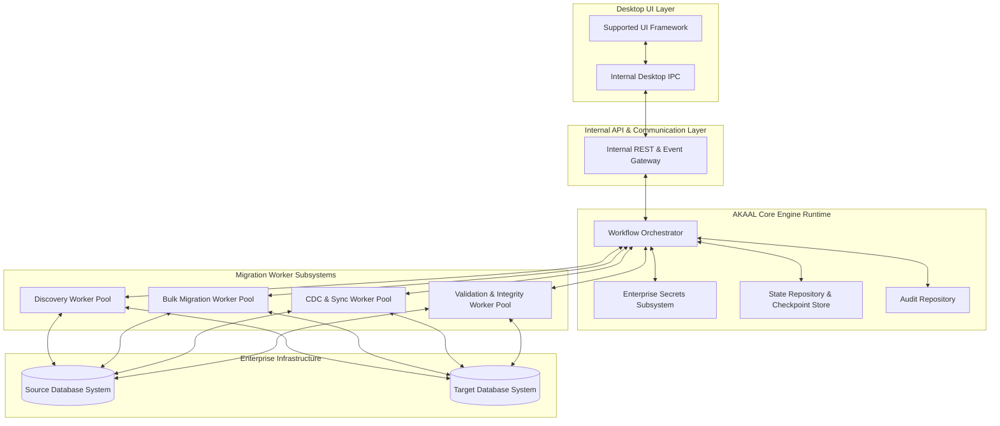

All present and future client interfaces—including the Desktop UI, Web UI, CLI tools, Enterprise SDKs, APIs, automated CI/CD pipelines, and AI Advisory modules—interact with the AKAAL Core Engine exclusively through the Internal REST & Event Gateway (or equivalent architectural gateway abstraction).

---

## 8. Complete Workflow Overview

The operational lifecycle of an AKAAL migration project is organized into 6 logical phases encompassing 20 workflow stages and 3 embedded approval gates:

- **Phase 1: Discovery & Assessment (`WF-001` – `WF-004`)**
  - Project scope definition, automated schema extraction, deep inspection, and quantitative risk evaluation.
  - **GATE 1:** Discovery & Assessment Approval
- **Phase 2: Planning & Governance (`WF-005` – `WF-008`)**
  - Schema translation, execution DAG generation, compliance scanning, and formal change advisory sign-off.
  - **GATE 2:** Migration Plan & Execution Approval
- **Phase 3: Validation & Simulation (`WF-009` – `WF-010`)**
  - Pre-flight dry-run simulation, environment capacity validation, and maintenance window reservation.
- **Phase 4: Bulk Execution & Sync (`WF-011` – `WF-016`)**
  - Multi-threaded parallel load, live telemetry, self-healing recovery, data integrity verification, CDC initialization, and sub-second continuous synchronization.
  - **GATE 3:** Production Cutover Approval
- **Phase 5: Cutover & Stabilization (`WF-017` – `WF-019`)**
  - Zero-loss application cutover, multi-day operational hypercare, rollback contingency, and executive reporting.
- **Phase 6: Closure (`WF-020`)**
  - Resource decommissioning, workspace encryption, and compliance archival.

---

## 9. Complete Workflow Diagram

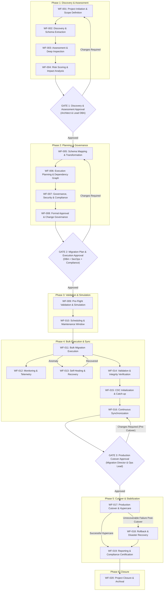

---

## 10. Workflow State Machine

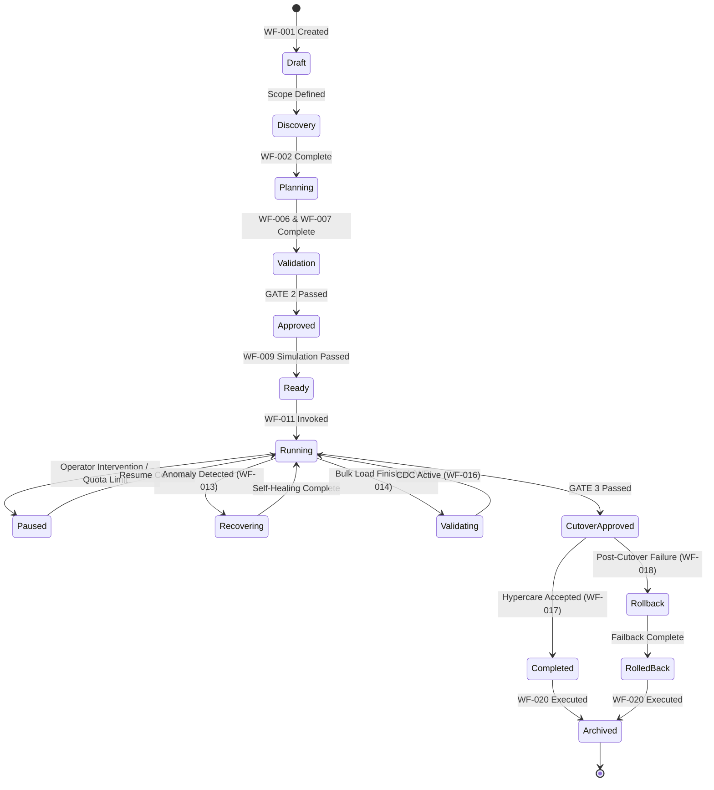

*Note on State Machine Semantics:* Any transient approval marker (such as a Cutover Approved transition marker) is a logical transition marker within the state machine engine rather than an independent long-lived workflow state. The canonical enterprise workflow state definitions strictly adhere to Agenda 4.

---

## 11. Migration Lifecycle — Detailed Stage Specifications

### WF-001: Project Initiation & Scope Definition
- **Workflow ID:** `WF-001`
- **Stage Name:** Project Initiation & Scope Definition
- **Purpose:** Establish administrative boundaries, register migration endpoints, assign tenant RBAC roles, and define SLA expectations.
- **Objectives:** Bound migration scope, authenticate endpoint references in the Central Connection Manager, and initialize workspace metadata.
- **Enterprise Value:** Eliminates unauthenticated database access and establishes governance accountability prior to execution.
- **Business Justification:** Binds enterprise SLA requirements and operational responsibility to the migration project from inception.
- **Inputs:** Workspace Reference, Tenant Context, Source Endpoint Handle, Target Endpoint Handle, Project Metadata, SLA Targets.
- **Outputs:** Project Definition Record, Encrypted Endpoint Handles, Initialized Project Workspace.
- **Entry Criteria:** Active administrative session with verified `PROJECT_CREATE` RBAC permissions.
- **Exit Criteria:** Project definition persisted in metadata storage; project state transitioned to `Draft`.
- **Detailed Workflow Activities:**
  1. Validate user session permissions against Organization and Workspace governance policies.
  2. Register source and target database connection handles in the Central Connection Manager.
  3. Instantiate project metadata container within the target Workspace.
  4. Perform synthetic connection handshake probes to verify basic network reachability.
  5. Log audit event `PROJECT_INITIATED` to the Audit Repository.
- **Security Considerations:** Plaintext connection strings and passwords are strictly prohibited; only handles referencing the Enterprise Secrets Subsystem are accepted.
- **Compliance Considerations:** Inherits compliance metadata (GDPR, HIPAA, PCI-DSS) directly from Organization and Workspace definitions.
- **Audit Requirements:** Log initiator identity, timestamp, tenant ID, and endpoint handles to the Audit Repository.
- **Performance Considerations:** Synthetic connection probes must complete within a 5-second timeout window.
- **Scalability Considerations:** Multi-tenant workspace architecture isolates project definitions across independent workspace namespaces.
- **Failure Handling:** Invalid credentials or network unreachable events abort stage initialization and return actionable error codes.
- **Recovery Strategy:** Prompt administrator to update Secret Handles in Connection Manager and re-test connectivity.
- **Human Interaction:** Lead Architect registers project parameters and assigns team operational roles.
- **Automation Opportunities:** Automated endpoint validation and automatic compliance policy inheritance.
- **Related Workflow Stages:** Cascades to `WF-002`; receives inputs from Central Connection Manager.
- **Extension Points:** Custom metadata tagging plugins for corporate asset tracking integrations.

---

### WF-002: Discovery & Schema Extraction
- **Workflow ID:** `WF-002`
- **Stage Name:** Discovery & Schema Extraction
- **Purpose:** Perform non-intrusive metadata catalog discovery to extract the complete source structural definitions.
- **Objectives:** Extract table definitions, column attributes, indexes, foreign key dependencies, views, triggers, and procedural objects into an implementation-agnostic AST.
- **Enterprise Value:** Provides complete visibility into database structure without exposing sensitive underlying data records.
- **Business Justification:** Prevents structural migration surprises by building an authoritative structural baseline.
- **Inputs:** Active Source Connection Handle, Schema Extraction Scope Definition.
- **Outputs:** Source Schema Abstract Syntax Tree (AST), System Catalog Profile, Object Count Inventory.
- **Entry Criteria:** State = `Draft`; Source database accessible with dictionary read permissions.
- **Exit Criteria:** 100% of scoped catalog metadata extracted and serialized into the Schema AST; state transitioned to `Discovery`.
- **Detailed Workflow Activities:**
  1. Establish read-only catalog session using the Supported Driver Abstraction.
  2. Query system data dictionary tables across scoped schemas.
  3. Extract table structures, column data types, precision, nullability, and column defaults.
  4. Extract primary keys, unique constraints, foreign key relationships, and check constraints.
  5. Extract view definitions, stored procedure definitions, trigger source logic, and custom type definitions.
  6. Serialize metadata into the canonical Source Schema AST.
- **Security Considerations:** Queries execute using minimal read-only catalog privileges (`SELECT ANY DICTIONARY` or equivalent).
- **Compliance Considerations:** Schema discovery operates purely on metadata structures; table data records are not read or cached.
- **Audit Requirements:** Log catalog discovery start, elapsed duration, extracted object counts, and schema signatures.
- **Performance Considerations:** Dynamic thread-pooled extraction queries prevent catalog locks on active source systems.
- **Scalability Considerations:** Supports enterprise schemas containing >100,000 database objects via paginated catalog streaming.
- **Failure Handling:** Catalog permission denials flag exact missing read privileges without terminating the extraction session.
- **Recovery Strategy:** Resume extraction from last successful object boundary after privilege grant update.
- **Human Interaction:** Lead DBA reviews extracted object inventory counts.
- **Automation Opportunities:** Background asynchronous metadata polling with dynamic query rate-limiting.
- **Related Workflow Stages:** Depends on `WF-001`; feeds into `WF-003`.
- **Extension Points:** Custom catalog extraction adapters for proprietary legacy database engines.

---

### WF-003: Assessment & Deep Inspection
- **Workflow ID:** `WF-003`
- **Stage Name:** Assessment & Deep Inspection
- **Purpose:** Execute structural and volumetric inspection of the extracted schema to identify potential migration obstacles.
- **Objectives:** Evaluate LOB/BLOB object sizes, detect tables missing primary keys, analyze partition strategies, and profile procedural code complexity.
- **Enterprise Value:** Flags structural incompatibilities early in the lifecycle to enable accurate labor and schedule estimations.
- **Business Justification:** Reduces operational risk by surfacing high-maintenance data structures prior to plan commitment.
- **Inputs:** Source Schema AST, Source System Statistics.
- **Outputs:** Assessment Baseline Report, Missing Primary Key Inventory, LOB Density Profile, Procedural Dependency Map.
- **Entry Criteria:** State = `Discovery`; Source Schema AST validated.
- **Exit Criteria:** Deep inspection completed across 100% of discovered objects; assessment baseline published.
- **Detailed Workflow Activities:**
  1. Inspect column data types for large binary/text objects (LOBs/CLOBs/BLOBs) and evaluate storage footprints.
  2. Scan table definitions for absence of explicit primary keys or unique indexes.
  3. Inspect table partitioning methods and evaluate target alignment.
  4. Parse procedural code blocks (stored procedures, functions, triggers) to analyze dialect-specific syntax density.
  5. Generate Assessment Baseline Report.
- **Security Considerations:** Inspection checks logic and structural definitions without reading individual row data content.
- **Compliance Considerations:** Identifies columns requiring specialized handling under data privacy rules.
- **Audit Requirements:** Log deep inspection duration, identified structural flags, and baseline report signature.
- **Performance Considerations:** Utilizes existing database catalog statistics to eliminate table scan overhead.
- **Scalability Considerations:** Scales linearly across multi-schema environments via parallel inspection threads.
- **Failure Handling:** Missing database statistics trigger non-blocking system statistics collection alerts.
- **Recovery Strategy:** Fallback to structural estimation logic if target object statistics are unavailable.
- **Human Interaction:** DBA inspects flagged primary-keyless tables and complex procedural objects.
- **Automation Opportunities:** Heuristic categorization of stored procedure code complexity.
- **Related Workflow Stages:** Depends on `WF-002`; feeds into `WF-004`.
- **Extension Points:** Plug-in rules for industry-specific data type inspection.

---

### WF-004: Risk Scoring & Impact Analysis
- **Workflow ID:** `WF-004`
- **Stage Name:** Risk Scoring & Impact Analysis
- **Purpose:** Compute a quantitative Risk Score evaluating operational, structural, and volumetric migration complexity.
- **Objectives:** Calculate normalized Risk Score (0–100), assign Risk Level (`LOW` | `MEDIUM` | `HIGH` | `CRITICAL`), and generate mitigation recommendations.
- **Enterprise Value:** Provides executive leadership with an objective metric to evaluate migration feasibility and resource needs.
- **Business Justification:** Establishes objective governance criteria required for Change Advisory Board (CAB) reviews.
- **Inputs:** Assessment Baseline Report, Target Engine Capability Profile.
- **Outputs:** Risk Analysis Matrix, Overall Risk Score, High-Risk Object Inventory, Mitigation Plan Artifact.
- **Entry Criteria:** Assessment Baseline Report complete; target database dialect capabilities loaded.
- **Exit Criteria:** Risk Score computed; risk report published to Migration Artifact Repository; ready for `GATE 1`.
- **Detailed Workflow Activities:**
  1. Execute Risk Scoring algorithm combining data volume, type complexity, primary key density, and procedural code metrics.
  2. Map risk scores to categorical risk tiers (`LOW`, `MEDIUM`, `HIGH`, `CRITICAL`).
  3. Generate automated mitigation recommendations for identified high-risk objects.
  4. Compile Risk Analysis Matrix and update Project State metadata.
  5. Present risk evaluation package to `GATE 1`.
- **Security Considerations:** Ensures risk reports mask sensitive network endpoint details in executive summaries.
- **Compliance Considerations:** Flags high-risk data handling paths that could breach corporate governance standards.
- **Audit Requirements:** Log calculated Risk Score, contributing factor weights, and algorithm version to Audit Repository.
- **Performance Considerations:** Risk scoring computation executes asynchronously in memory (< 2 seconds).
- **Scalability Considerations:** Scoring rules model scales seamlessly regardless of database size or object volume.
- **Failure Handling:** Incomplete assessment data triggers maximum-weight conservative risk scoring for unprofiled objects.
- **Recovery Strategy:** Re-run assessment inspection pass for unprofiled objects and re-compute score.
- **Human Interaction:** Executive Sponsor and Lead Architect review risk findings prior to submitting to `GATE 1`.
- **Automation Opportunities:** Machine-learning-assisted risk weighting based on historical project failure logs.
- **Related Workflow Stages:** Depends on `WF-003`; gates entry to `GATE 1` and `WF-005`.
- **Extension Points:** Custom enterprise risk scoring formula extensions.

---

### WF-005: Schema Mapping & Transformation
- **Workflow ID:** `WF-005`
- **Stage Name:** Schema Mapping & Transformation
- **Purpose:** Translate source schema definitions into compatible target SQL dialect DDL statements.
- **Objectives:** Convert data types, map default values, adjust precision/scale, handle identifier case conversions, and transform constraint syntax.
- **Enterprise Value:** Guarantees structural DDL compatibility between heterogeneous database engines.
- **Business Justification:** Automates labor-intensive schema translation while ensuring target dialect best practices.
- **Inputs:** Source Schema AST, Target Engine Dialect Rules, User-Defined Mapping Rules.
- **Outputs:** Target Schema AST, Target SQL DDL Scripts, Type Conversion Audit Ledger.
- **Entry Criteria:** Approved `GATE 1` record; Project State = `Planning`.
- **Exit Criteria:** Target DDL AST generated and validated against target dialect parser rules.
- **Detailed Workflow Activities:**
  1. Parse Source Schema AST through Target Dialect Transformation Engine.
  2. Apply standard data type translation matrices (e.g., source spatial types ➔ target spatial representation).
  3. Apply name mapping rules (case normalization, reserved keyword avoidance).
  4. Identify tables lacking primary keys. *Automatic surrogate primary key generation is strictly prohibited*; the platform flags these tables, recommends surrogate options, and requests explicit user approval before generating execution DDL.
  5. Generate Target SQL DDL scripts.
- **Security Considerations:** DDL generation scripts avoid hardcoded credentials or unencrypted storage handles.
- **Compliance Considerations:** Ensures target column definitions preserve required data masking and encryption attributes.
- **Audit Requirements:** Log all manual mapping overrides, automated type conversions, and generated DDL signatures.
- **Performance Considerations:** Schema transformation AST transformation executes in memory.
- **Scalability Considerations:** Modular transformation pipeline isolates dialect conversion rules cleanly.
- **Failure Handling:** Unresolvable type conversion halts transformation on specific column and flags for user mapping input.
- **Recovery Strategy:** User specifies custom Type Mapping Rule via Desktop UI and resumes transformation.
- **Human Interaction:** Lead DBA reviews generated DDL scripts and approves/rejects recommended surrogate primary key additions.
- **Automation Opportunities:** Automated DDL syntax validation using embedded target parser routines.
- **Related Workflow Stages:** Governed by `GATE 1`; feeds into `WF-006`.
- **Extension Points:** Custom dialect transformation modules for specialized data engines.

---

### WF-006: Execution Planning & Dependency Graph
- **Workflow ID:** `WF-006`
- **Stage Name:** Execution Planning & Dependency Graph
- **Purpose:** Construct an optimal Execution Directed Acyclic Graph (DAG) for data loading.
- **Objectives:** Map foreign key dependency chains, group tables into parallel execution tiers, define data chunking boundaries, and isolate deferred constraints.
- **Enterprise Value:** Eliminates foreign key violations during bulk data ingestion while maximizing parallel load throughput.
- **Business Justification:** Optimizes maintenance window usage by minimizing bulk load execution duration.
- **Inputs:** Target Schema AST, Source Table Volume Metrics, Worker Pool Capacity Specs.
- **Outputs:** Execution DAG Artifact, Parallel Load Tier Schedule, Range Chunk Allocation Plan.
- **Entry Criteria:** Target Schema AST complete; state = `Planning`.
- **Exit Criteria:** DAG generated with zero unresolved cyclic dependencies; parallel execution tiers assigned.
- **Detailed Workflow Activities:**
  1. Analyze foreign key relationship hierarchy in Target Schema AST.
  2. Perform Topological Sort to group tables into sequential dependency tiers (Tier 1: Parent, Tier 2: Child, etc.).
  3. Detect cyclic reference loops; automatically inject deferred foreign key constraint creation steps post-bulk load.
  4. Compute range chunk boundaries (numeric key range, date partition, or primary key hash) for high-volume tables.
  5. Generate final Execution DAG Artifact.
- **Security Considerations:** Execution DAG metadata excludes raw database credentials.
- **Compliance Considerations:** Execution ordering respects table dependency constraints without bypassing audit logs.
- **Audit Requirements:** Log generated DAG topology, dependency depth, tier counts, and chunk boundary plans.
- **Performance Considerations:** DAG design maximizes parallel worker thread saturation up to resource limits.
- **Scalability Considerations:** Handles complex schemas with thousands of table relationships using graph optimization.
- **Failure Handling:** Cyclic dependencies trigger automatic constraint deferral rules to ensure unblocked loading.
- **Recovery Strategy:** Re-evaluate graph generation with updated table partition boundaries if memory limits are exceeded.
- **Human Interaction:** Infrastructure Lead reviews thread concurrency levels and chunk allocation plans.
- **Automation Opportunities:** Dynamic topological sorting with automatic cycle resolution algorithms.
- **Related Workflow Stages:** Depends on `WF-005`; feeds into `WF-007`.
- **Extension Points:** Custom DAG scheduling algorithms for multi-cluster execution environments.

---

### WF-007: Governance, Security & Compliance
- **Workflow ID:** `WF-007`
- **Stage Name:** Governance, Security & Compliance
- **Purpose:** Audit and enforce security policies, data classification rules, masking transformations, and regulatory compliance standards across the project.
- **Objectives:** Execute PII/PHI/PCI data classification scans, verify TLS encryption parameters, enforce inherited compliance rules, and attach masking policies.
- **Enterprise Value:** Prevents regulatory violations and data leaks during migration across security zones.
- **Business Justification:** Protects corporate reputation and ensures adherence to legal data privacy mandates.
- **Inputs:** Execution DAG Artifact, Compliance Policy Hierarchy (Organization ➔ Workspace ➔ Project), Data Masking Catalog.
- **Outputs:** Compliance Review Record, Active Data Masking Rules, Transport Security Specification.
- **Entry Criteria:** Execution DAG Artifact generated; compliance configuration loaded.
- **Exit Criteria:** All sensitive data columns mapped to compliance rules; transport encryption confirmed; state ready for `WF-008`.
- **Detailed Workflow Activities:**
  1. Retrieve inherited compliance rules from Organization and Workspace governance policies.
  2. Scan column definitions against enterprise Data Classification patterns.
  3. Assign data masking/anonymization transformations to identified sensitive fields for non-production targets.
  4. Verify TLS/SSL encryption parameters for all network transport endpoints.
  5. Generate Compliance Review Record.
- **Security Considerations:** Validates that data in transit utilizes approved cryptographic TLS protocols.
- **Compliance Considerations:** Strictly enforces compliance inheritance from Organization to Workspace to Project; compliance policies are never inferred from endpoint connection string names. When data masking rules are active for non-production environments, the Validation Engine (`WF-014`) performs validation using the equivalent masked representation rather than comparing raw source values against masked target values.
- **Audit Requirements:** Log compliance evaluation results, assigned masking rules, and security reviewer identities.
- **Performance Considerations:** Data masking algorithms utilize high-performance stream transformations to minimize latency.
- **Scalability Considerations:** Enterprise governance templates apply uniformly across hundreds of migration projects.
- **Failure Handling:** Unencrypted endpoints or unmasked sensitive columns targeting non-secure environments halt workflow.
- **Recovery Strategy:** Configure mandatory transport encryption and update masking rules in Governance Console.
- **Human Interaction:** Security Lead and Data Protection Officer review compliance findings and masking assignments.
- **Automation Opportunities:** Automated pattern-based sensitive data classification scanning.
- **Related Workflow Stages:** Depends on `WF-006`; feeds into `WF-008`.
- **Extension Points:** Third-party Enterprise Data Governance platform integration connectors.

---

### WF-008: Formal Approval & Change Governance
- **Workflow ID:** `WF-008`
- **Stage Name:** Formal Approval & Change Governance
- **Purpose:** Execute formal multi-custody approval workflows required to transition a project from planning to execution state.
- **Objectives:** Present migration plan, risk scoring, DDL, and compliance packages to designated approvers and capture cryptographically verifiable sign-offs.
- **Enterprise Value:** Implements strict dual-custody governance (4-Eyes Principle) to prevent unauthorized production changes.
- **Business Justification:** Fulfills corporate Change Advisory Board (CAB) and SOC 2 internal control requirements.
- **Inputs:** Risk Analysis Matrix, Target Schema DDL, Execution DAG Artifact, Compliance Review Record.
- **Outputs:** Signed Approval Record, Project State = `Approved`.
- **Entry Criteria:** Stages `WF-001` through `WF-007` complete; state = `Planning`.
- **Exit Criteria:** `GATE 2` passed; Approval Record persisted in metadata store; state transitioned to `Approved`.
- **Detailed Workflow Activities:**
  1. Compile Change Governance Package containing all project planning artifacts.
  2. Submit approval request to designated role approvers (Lead DBA, Security Lead, Compliance Officer).
  3. Capture digital approvals and sign-off timestamps.
  4. Persist Approval Record to metadata store.
  5. Transition Project State to `Approved`.
- **Security Considerations:** Approval records are signed and immutably logged to prevent tampering.
- **Compliance Considerations:** Enforces dual-custody sign-off prior to authorizing database structural or data modifications.
- **Audit Requirements:** Log all approver identities, approval decisions, timestamp records, and reviewer comments.
- **Performance Considerations:** Asynchronous workflow notification engine prevents operational bottlenecks.
- **Scalability Considerations:** Supports multi-tenant role authorization structures across enterprise departments.
- **Failure Handling:** If an approver issues `Changes Required`, the workflow preserves complete audit history, records feedback, and returns the project to `WF-005` or `WF-006` for adjustments.
- **Recovery Strategy:** Address reviewer comments, update plan artifacts, and re-submit to `GATE 2`.
- **Human Interaction:** Formal sign-off by Lead DBA, Security Lead, and Compliance Officer.
- **Automation Opportunities:** Automated ITSM Change Advisory Board (CAB) ticket status synchronization.
- **Related Workflow Stages:** Governed by `GATE 2`; feeds into `WF-009`.
- **Extension Points:** ITSM webhook integrations (e.g., ServiceNow Change Management).

---

### WF-009: Pre-Flight Validation & Simulation
- **Workflow ID:** `WF-009`
- **Stage Name:** Pre-Flight Validation & Simulation
- **Purpose:** Execute synthetic, non-destructive validation probes and dry-run simulations against target environments.
- **Objectives:** Verify target storage allocation, log space, tablespace quotas, network throughput, driver capabilities, and execute schema dry-runs.
- **Enterprise Value:** Guarantees target environment readiness and eliminates runtime failures caused by infrastructure limits.
- **Business Justification:** Eliminates costly failed migration attempts during high-stakes maintenance windows.
- **Inputs:** Signed Approval Record, Target Endpoint Handle, Execution DAG Artifact, Resource Capacity Requirements.
- **Outputs:** Pre-Flight Diagnostic Report, Benchmark Simulation Metrics, Project State = `Ready`.
- **Entry Criteria:** Approved `GATE 2` record; state = `Approved`; target database accessible.
- **Exit Criteria:** 100% pre-flight diagnostic checks passed; target capacity verified; state = `Ready`.
- **Detailed Workflow Activities:**
  1. Validate target storage space against projected table and index growth requirements.
  2. Verify target transaction log allocation and auto-extend configurations.
  3. Execute synthetic network payload tests to measure bandwidth and round-trip latency.
  4. Execute dry-run schema creation in temporary test namespace to validate DDL execution paths.
  5. Generate Pre-Flight Diagnostic Report and update Project State to `Ready`.
- **Security Considerations:** Dry-run probes execute using isolated temporary structures without impacting active production data.
- **Compliance Considerations:** Confirms target environment meets specified security and encryption baselines.
- **Audit Requirements:** Log all pre-flight probe results, resource checks, latency measurements, and system readiness flags.
- **Performance Considerations:** Synthetic tests execute within controlled limits to avoid target load.
- **Scalability Considerations:** Capacity validation formulas account for multi-tb enterprise storage systems.
- **Failure Handling:** Insufficient storage or network bandwidth failure halts progression and highlights exact resource deficit.
- **Recovery Strategy:** Provision additional target storage or adjust network allocation; re-run pre-flight validation suite.
- **Human Interaction:** Systems Engineer and DBA inspect diagnostic probe results.
- **Automation Opportunities:** Automated dry-run DDL execution and synthetic IOPS benchmarking probes.
- **Related Workflow Stages:** Depends on `WF-008`; feeds into `WF-010`.
- **Extension Points:** Custom infrastructure monitoring probe plugins.

---

### WF-010: Scheduling & Maintenance Window
- **Workflow ID:** `WF-010`
- **Stage Name:** Scheduling & Maintenance Window
- **Purpose:** Bind project execution parameters to authorized enterprise maintenance windows and configure notification triggers.
- **Objectives:** Schedule bulk migration start time, establish window expiration boundaries, lock project configurations, and initialize alerting channels.
- **Enterprise Value:** Prevents migration activities from interfering with business operations and aligns execution with CAB schedules.
- **Business Justification:** Ensures compliance with corporate operational SLA windows and customer notification commitments.
- **Inputs:** Project State = `Ready`, Maintenance Window Schedule (`start_time`, `end_time`), Operational Notification Contacts.
- **Outputs:** Execution Schedule Handle, Operational Notification Triggers, Active Execution Lock File.
- **Entry Criteria:** Pre-Flight Validation passed; state = `Ready`.
- **Exit Criteria:** Maintenance schedule locked; execution trigger armed; system ready for bulk load.
- **Detailed Workflow Activities:**
  1. Register start and end boundaries for authorized maintenance window.
  2. Instantiate operational execution lock to prevent conflicting configuration edits.
  3. Initialize notification channels (Email, PagerDuty, Slack/Teams sinks).
  4. Arm automated start trigger or enable manual "Execute Now" override for Migration Operations team.
- **Security Considerations:** Execution locks prevent unauthorized changes to approved project parameters prior to launch.
- **Compliance Considerations:** Ensures data movement occurs exclusively within authorized change windows.
- **Audit Requirements:** Log scheduled start/stop times, notification configurations, and lock creation timestamps.
- **Performance Considerations:** Scheduling sub-system operates with negligible memory/CPU overhead.
- **Scalability Considerations:** Enterprise scheduler manages concurrent migration schedules across multiple application teams.
- **Failure Handling:** Expiration of maintenance window prior to execution disarms trigger and requires schedule re-authorization.
- **Recovery Strategy:** Obtain extended maintenance window sign-off and re-arm execution schedule.
- **Human Interaction:** Migration Operations Lead arms schedule or triggers manual execution start.
- **Automation Opportunities:** Integration with enterprise job schedulers via Internal REST API.
- **Related Workflow Stages:** Depends on `WF-009`; feeds into `WF-011`.
- **Extension Points:** Enterprise enterprise scheduler plugins (Control-M, Airflow).

---

### WF-011: Bulk Migration Execution
- **Workflow ID:** `WF-011`
- **Stage Name:** Bulk Migration Execution
- **Purpose:** Execute high-speed, parallel bulk data extraction, stream transformation, and target ingestion for historical data.
- **Objectives:** Ingest baseline data according to Execution DAG tiers, apply dynamic range chunking, manage thread pools, and record chunk progress checkpoints.
- **Enterprise Value:** Minimizes baseline data transfer duration by saturating available network and storage throughput cleanly.
- **Business Justification:** Reduces total system migration window, minimizing business operational impact.
- **Inputs:** Execution DAG Artifact, Chunk Allocation Plan, Worker Concurrency Settings, Endpoint Handles.
- **Outputs:** Target Data Population, Checkpoint Store Updates, Bulk Transport Completion Metrics, State = `Running`.
- **Entry Criteria:** Execution schedule active; state = `Ready`; target DDL base tables instantiated.
- **Exit Criteria:** 100% of historical table data ingested and committed on target; state ready for `WF-014`.
- **Detailed Workflow Activities:**
  1. Instantiate Bulk Migration Worker Pool based on configured thread limits.
  2. Execute Tier 1 parent table data loads in parallel utilizing range chunking boundaries.
  3. Stream data through inline transformation pipeline (applying data masking where configured).
  4. Write data to target using high-performance batch loading interfaces.
  5. Commit completed chunks and update Checkpoint Store continuously.
  6. Sequentially progress through remaining execution DAG tiers until all tables are populated.
- **Security Considerations:** Data in transit is encrypted using configured TLS transport parameters; raw data never touches unencrypted disk.
- **Compliance Considerations:** Applies all active data masking and anonymization rules defined in `WF-007`.
- **Audit Requirements:** Log start/stop times per table, rows transferred, byte volumes, worker IDs, and chunk commit markers.
- **Performance Considerations:** Multi-threaded parallel processing with dynamic memory buffer management maximizes IOPS.
- **Scalability Considerations:** Scales horizontally across worker nodes to support multi-terabyte data volumes.
- **Failure Handling:** Worker crash or network disconnect logs chunk failure and triggers automated retry from Checkpoint Store without restarting table load.
- **Recovery Strategy:** Read Checkpoint Store for uncommitted chunk boundaries and resume loading from last valid marker.
- **Human Interaction:** Migration Operations Team monitors live thread status and chunk progress.
- **Automation Opportunities:** Dynamic chunk size tuning based on real-time target commit latency.
- **Related Workflow Stages:** Governed by `WF-010`; monitored by `WF-012`; feeds into `WF-013` and `WF-014`.
- **Extension Points:** Custom high-speed bulk loader driver modules.

---

### WF-012: Monitoring & Telemetry
- **Workflow ID:** `WF-012`
- **Stage Name:** Monitoring & Telemetry
- **Purpose:** Collect, aggregate, and display continuous real-time operational metrics across all active migration workers.
- **Objectives:** Stream throughput (MB/s, rows/s), latency, thread status, buffer queue depth, and host resource utilization to UI dashboards and monitoring sinks.
- **Enterprise Value:** Provides operational visibility and surfaces performance bottlenecks proactively.
- **Business Justification:** Ensures operations teams maintain real-time oversight of critical data movement operations.
- **Inputs:** Active Execution Streams, Worker Pool Telemetry, System Resource Probes.
- **Outputs:** Live Telemetry Stream, Metrics Export Feed, Operational Alert Events.
- **Entry Criteria:** Initiated concurrently with `WF-011` and active through `WF-017`.
- **Exit Criteria:** Active until project reaches terminal state (`Completed`, `Rolled Back`, `Archived`).
- **Detailed Workflow Activities:**
  1. Collect worker process metrics (rows processed, bytes written, error counts, latency).
  2. Collect host resource metrics (CPU load, memory consumption, disk queue depth, network I/O).
  3. Publish real-time metrics to Desktop UI via Internal API WebSocket/IPC.
  4. Stream metrics to enterprise monitoring endpoints (Prometheus feed).
  5. Evaluate metrics against threshold rules; dispatch alerts on SLA warning conditions.
- **Security Considerations:** Telemetry metrics stream strictly operational performance data; sensitive payload data is never included.
- **Compliance Considerations:** Preserves operational monitoring logs required for system availability audits.
- **Audit Requirements:** Store aggregated performance metrics alongside project execution history.
- **Performance Considerations:** Lightweight asynchronous metric collection consumes < 1% CPU overhead.
- **Scalability Considerations:** Centralized metrics aggregator handles streams from dozens of concurrent worker processes.
- **Failure Handling:** Monitoring collector failures restart silently without disrupting core migration data paths.
- **Recovery Strategy:** Respawn metric collector process and reconnect to active telemetry channels.
- **Human Interaction:** Operations Lead and SecOps monitor live dashboards during migration windows.
- **Automation Opportunities:** Automated alert dispatches based on dynamic threshold breaches.
- **Related Workflow Stages:** Operates concurrently with `WF-011`, `WF-013`, `WF-015`, `WF-016`, `WF-017`.
- **Extension Points:** Custom telemetry exporters (Datadog, Splunk, Grafana).

---

### WF-013: Self-Healing & Recovery
- **Workflow ID:** `WF-013`
- **Stage Name:** Self-Healing & Recovery
- **Purpose:** Automatically detect, diagnose, and recover from transient operational faults during execution.
- **Objectives:** Intercept network disconnects, lock timeouts, memory pressure, and worker crashes; execute automated recovery recipes.
- **Enterprise Value:** Eliminates manual intervention for transient infrastructure glitches, protecting migration completion.
- **Business Justification:** Reduces operational labor costs and avoids failed migration windows due to minor environmental hiccups.
- **Inputs:** Error Signal Stream, Error Pattern Catalog, Checkpoint Store, Recovery Recipe Library.
- **Outputs:** Fault Recovery Log, Adjusted Concurrency Plan, Resumed Stream Execution, State = `Recovering` ➔ `Running`.
- **Entry Criteria:** Execution anomaly or exception intercepted during `WF-011` or `WF-016`.
- **Exit Criteria:** Fault resolved within configured retry budget; worker resumed; state returned to `Running`.
- **Detailed Workflow Activities:**
  1. Intercept process exception or worker failure event.
  2. Match error signature against Error Pattern Catalog (e.g., transient network drop, target lock timeout).
  3. Transition Project State to `Recovering`.
  4. Execute designated Recovery Recipe (e.g., exponential backoff reconnect, thread concurrency reduction, worker respawn).
  5. Query Checkpoint Store to determine exact restart boundary.
  6. Resume execution stream and return Project State to `Running`.
- **Security Considerations:** Automated recovery preserves authenticated session state without logging raw credentials.
- **Compliance Considerations:** All autonomous recovery attempts are logged to maintain full audit transparency.
- **Audit Requirements:** Log fault error codes, matched recovery recipe, retry attempt numbers, and final resolution outcome.
- **Performance Considerations:** Recovery recipes execute rapidly to minimize replication lag accumulation.
- **Scalability Considerations:** Decoupled self-healing engine handles concurrent worker faults independently.
- **Failure Handling:** Exhaustion of retry budget transitions project state to `Paused` and dispatches urgent operator alert.
- **Recovery Strategy:** Operator inspects fault log, addresses underlying environmental issue, and issues manual Resume command.
- **Human Interaction:** Operator intervention is requested only when automated recovery recipes fail to resolve the fault.
- **Automation Opportunities:** Autonomous exponential backoff reconnects and adaptive thread throttling.
- **Related Workflow Stages:** Invoked by `WF-011` and `WF-016`; updates Checkpoint Store.
- **Extension Points:** Custom self-healing recipe plugins for specialized database error codes.

---

### WF-014: Validation & Integrity Verification
- **Workflow ID:** `WF-014`
- **Stage Name:** Validation & Integrity Verification
- **Purpose:** Execute mathematical and structural verification to validate data fidelity between source and target systems.
- **Objectives:** Execute row count reconciliation, cryptographic block hashing, and stratified field value comparisons.
- **Enterprise Value:** Provides mathematically verifiable proof of data accuracy prior to authorizing production cutover.
- **Business Justification:** Mitigates corporate risk by confirming data completeness before decommissioning legacy systems.
- **Inputs:** Source Table Data, Target Table Data, Verification Level (`EXPRESS` | `BALANCED` | `DEEP_HASH`), Sample Ratio.
- **Outputs:** Validation Artifact, Discrepancy Ledger, Data Integrity Score (0–100%).
- **Entry Criteria:** Bulk migration execution (`WF-011`) complete; deferred non-PK indexes created on target.
- **Exit Criteria:** Integrity Score meets configured threshold (e.g., 100% matching); Validation Artifact published.
- **Detailed Workflow Activities:**
  1. Execute Tier 1 Row Count Reconciliation across all loaded table pairs.
  2. Execute Tier 2 Cryptographic Block Checksum Hashing on primary key ranges using native database SQL functions. When data masking rules are active for non-production environments (assigned in `WF-007`), the Validation Engine performs validation using the equivalent masked representation rather than comparing raw source values against masked target values.
  3. Execute Tier 3 Stratified Sample Field Comparison on randomized sample records.
  4. Compile discrepancy details into Discrepancy Ledger if data mismatches are detected.
  5. Generate Validation Artifact and log results to Audit Repository.
- **Security Considerations:** Checksum hashing is performed engine-side using SQL math routines to prevent bulk data extraction over network.
- **Compliance Considerations:** Provides regulatory auditors with tamper-evident proof of data migration accuracy.
- **Audit Requirements:** Log verification level, execution time, table validation results, discrepancy counts, and Validation Artifact signature.
- **Performance Considerations:** Hashing runs in parallel using push-down database queries to minimize local engine memory use.
- **Scalability Considerations:** Stratified sampling verifies multi-terabyte datasets within tight maintenance windows.
- **Failure Handling:** Discrepancy detection flags affected primary key ranges and generates targeted delta repair tasks.
- **Recovery Strategy:** Execute targeted delta repair load for mismatched key ranges and re-run verification pass.
- **Human Interaction:** Lead DBA and Auditor review Validation Artifact and discrepancy reports.
- **Automation Opportunities:** Parallelized block hashing push-down query generation.
- **Related Workflow Stages:** Depends on `WF-011`; precedes `WF-015`.
- **Extension Points:** Custom validation rules for complex domain-specific data types.

---

### WF-015: CDC Initialization & Catch-up
- **Workflow ID:** `WF-015`
- **Stage Name:** CDC Initialization & Catch-up
- **Purpose:** Initialize Change Data Capture (CDC) transaction log extraction and apply change backlog accumulated during bulk load.
- **Objectives:** Connect to source transaction log stream starting from log offset captured at bulk load start, parse DML changes, and apply changes to target.
- **Enterprise Value:** Bridges the time gap between baseline historical load and live continuous operations without requiring source downtime.
- **Business Justification:** Enables zero-downtime migrations by allowing source applications to remain online during bulk load.
- **Inputs:** Log Offset Checkpoint (captured at `WF-011` start), Source Transaction Logs, CDC Parser Module.
- **Outputs:** Parsed Change Stream, Transaction Staging Queue, Catch-up Lag Metrics.
- **Entry Criteria:** Bulk load complete; Validation Artifact approved; source transaction logging active.
- **Exit Criteria:** CDC replication catch-up lag falls below configured threshold (e.g., < 5 seconds); state ready for `WF-016`.
- **Detailed Workflow Activities:**
  1. Establish reader connection to source transaction log interface starting from captured Log Offset Checkpoint.
  2. Parse raw transaction log records into canonical Change Event format (INSERT, UPDATE, DELETE).
  3. Stage transactions in high-speed Transaction Buffer Queue.
  4. Read staged changes and apply to target database in dependency-ordered batches.
  5. Monitor catch-up lag continuously until target approaches real-time synchronization.
- **Security Considerations:** CDC log readers authenticate using secure, dedicated credentials with log-mining privileges.
- **Compliance Considerations:** Change events preserve transactional order and audit tracking metadata.
- **Audit Requirements:** Log CDC start offset, processed transaction counts, commit LSNs/SCNs, and elapsed catch-up duration.
- **Performance Considerations:** In-memory transaction buffering and batch commits maximize target catch-up speed.
- **Scalability Considerations:** Stream engine handles high-volume transaction workloads (>50,000 transactions/sec).
- **Failure Handling:** Missing source log sequence triggers explicit log gap error notification.
- **Recovery Strategy:** Locate missing archive log in backup repository or execute differential delta catch-up query.
- **Human Interaction:** DBA verifies source log retention settings prior to CDC initialization.
- **Automation Opportunities:** Automatic format conversion of proprietary source transaction log records.
- **Related Workflow Stages:** Depends on `WF-014`; feeds into `WF-016`.
- **Extension Points:** Custom CDC log parser modules for specialized storage platforms.

---

### WF-016: Continuous Synchronization
- **Workflow ID:** `WF-016`
- **Stage Name:** Continuous Synchronization
- **Purpose:** Maintain ongoing sub-second continuous transaction replication between source and target databases.
- **Objectives:** Stream live source DML changes, apply conflict resolution policies, handle non-breaking DDL schema evolution, and maintain low replication lag.
- **Enterprise Value:** Keeps target system in real-time sync with source, enabling flexible cutover timing and extended parallel staging.
- **Business Justification:** De-risks production cutover by permitting thorough application validation against live data streams.
- **Inputs:** Live Source Transaction Stream, Target Connection Pool, Conflict Resolution Configuration.
- **Outputs:** Applied Target Transactions, Sub-Second Lag Telemetry, Dead Letter Queue (DLQ) Entries (if conflicts occur).
- **Entry Criteria:** CDC Catch-up (`WF-015`) complete; replication lag < 5 seconds.
- **Exit Criteria:** Formal cutover authorization signal received from `GATE 3`.
- **Detailed Workflow Activities:**
  1. Capture live source DML changes in continuous streaming mode.
  2. Apply conflict resolution logic (e.g., Source Wins, Target Wins, Latest Timestamp) for constraint collisions.
  3. Route unresolvable transaction errors to Dead Letter Queue (DLQ) without halting stream processing.
  4. Dynamic Schema Evolution: detect non-breaking source DDL changes (e.g., column additions) and apply equivalent DDL to target schema.
  5. Publish continuous lag telemetry (`lag_seconds`, `events_per_sec`) to monitoring dashboards.
- **Security Considerations:** Continuous stream is encrypted in transit; DLQ entries containing sensitive data are encrypted at rest.
- **Compliance Considerations:** Preserves complete transaction audit trail for continuous compliance monitoring.
- **Audit Requirements:** Log continuous replication metrics, conflict resolution events, DLQ entries, and schema evolution executions.
- **Performance Considerations:** Low-latency stream processing pipeline maintains sub-second replication lag.
- **Scalability Considerations:** Distributed change stream architecture supports multi-table parallel replication paths.
- **Failure Handling:** Unhandled transaction collisions quarantine affected record to Dead Letter Queue and alert operator while stream continues.
- **Recovery Strategy:** Operator inspects DLQ item, applies manual resolution, and re-injects transaction into target stream.
- **Human Interaction:** Operations Lead monitors live synchronization metrics and manages DLQ items.
- **Automation Opportunities:** Automated non-breaking DDL schema evolution propagation.
- **Related Workflow Stages:** Depends on `WF-015`; gates entry to `GATE 3` and `WF-017`.
- **Extension Points:** Custom conflict resolution rule plugins.

---

### WF-017: Production Cutover & Hypercare
- **Workflow ID:** `WF-017`
- **Stage Name:** Production Cutover & Hypercare
- **Purpose:** Execute zero-loss production cutover, switch application endpoints to target DB, and manage post-cutover Hypercare operational stabilization.
- **Objectives:** Quiesce source traffic, drain CDC stream to zero lag, enable target triggers/sequences, switch connections, and execute multi-day Hypercare observation.
- **Enterprise Value:** Completes production transformation with minimal downtime while providing dedicated operational stabilization support.
- **Business Justification:** Ensures seamless application transition to new database infrastructure with guaranteed executive sign-off.
- **Inputs:** Approved `GATE 3` Record, Zero-Lag Confirmation, Cutover Script, Hypercare Plan (duration, SLA metrics).
- **Outputs:** Promoted Production Target Endpoint, Final Sync Checkpoint, Hypercare Performance Logs, Executive Acceptance Sign-Off.
- **Entry Criteria:** Approved `GATE 3` record; replication lag = 0.000s; maintenance window active.
- **Exit Criteria:** Hypercare duration completed; operational stabilization metrics satisfied; Executive Acceptance signed; state = `Completed`.
- **Detailed Workflow Activities:**
  1. Quiesce source application traffic (place application in read-only maintenance mode).
  2. Drain remaining CDC transaction queue until `Replication_Lag == 0.000s`.
  3. Terminate CDC replication engine and freeze final SCN/LSN checkpoint.
  4. Sequence Adjustment: adjust target table identity values and sequence generators to align with current maximum primary key values using the appropriate database-specific mechanism supplied by the Supported Driver Abstraction.
  5. Activate deferred target triggers, foreign keys, and check constraints.
  6. Redirect application connection strings to Target Database endpoint.
  7. Resume full application read-write traffic.
  8. **Hypercare Phase:** Initiate configurable post-cutover stabilization period (e.g., 24–72 hours). Execute continuous application monitoring, performance observation, business validation checks, and operational stabilization.
  9. Obtain formal Executive Acceptance sign-off upon Hypercare completion.
- **Security Considerations:** Target database security roles and access controls are fully enabled prior to opening application traffic.
- **Compliance Considerations:** Cutover timing and sequence synchronization records are immutably logged for audit compliance.
- **Audit Requirements:** Log cutover start/stop timestamps, zero-lag verification markers, sequence adjustment SQL commands, and Hypercare metrics.
- **Performance Considerations:** Cutover execution sequence is optimized to complete within tight SLA windows (< 60 seconds downtime).
- **Scalability Considerations:** Enterprise cutover orchestration handles multi-tier application dependency stacks.
- **Failure Handling:** If unrecoverable application errors occur *during cutover execution or post-cutover Hypercare*, trigger `WF-018` (Rollback Architecture).
- **Recovery Strategy:** Execute `WF-018` Rollback Protocol to restore production traffic to source database.
- **Human Interaction:** Cutover Commander (Migration Director) issues final Go/No-Go execution commands; DBA monitors Hypercare metrics.
- **Automation Opportunities:** Automated target application endpoint health check probes.
- **Related Workflow Stages:** Governed by `GATE 3`; triggers `WF-018` on failure; feeds into `WF-019` on success.
- **Extension Points:** Application traffic router integration plugins (DNS switches, load balancer API triggers).

---

### WF-018: Rollback & Disaster Recovery
- **Workflow ID:** `WF-018`
- **Stage Name:** Rollback & Disaster Recovery
- **Purpose:** Execute a controlled disaster recovery protocol to fail back production operations to the source database in the event of an aborted cutover or Hypercare failure.
- **Objectives:** Reverse connection endpoints, execute reverse CDC synchronization if target received production writes, and restore source to primary operational state.
- **Enterprise Value:** Guarantees business continuity and prevents data loss if new target infrastructure encounters unforeseen failure.
- **Business Justification:** Provides corporate safety net allowing aggressive migration timelines with guaranteed recovery path.
- **Inputs:** Abort Command / Hypercare Failure Signal, Pre-Cutover Source Checkpoint, Reverse CDC Configuration.
- **Outputs:** Restored Source Production Endpoint, Reverse Sync Audit Log, State = `Rollback` ➔ `Rolled Back`.
- **Entry Criteria:** Initiated strictly *after* cutover execution has commenced (`WF-017`) or during Hypercare following an unrecoverable operational failure. *(Note: Pre-cutover NO-GO decisions at `GATE 3` do not enter `WF-018`; they return to `WF-016`)*.
- **Exit Criteria:** Source database restored to active primary role; application traffic validated; state = `Rolled Back`.
- **Detailed Workflow Activities:**
  1. Quiesce application traffic on target database.
  2. Evaluate target write activity: if target received production writes during cutover/Hypercare, initialize Reverse CDC Engine to extract target delta changes and apply to source.
  3. Revert application connection strings to point back to Source Database endpoints.
  4. Reactivate source database application triggers and sequence generators.
  5. Resume production application traffic on Source Database.
  6. Transition Project State to `Rolled Back`.
- **Security Considerations:** Reverse CDC pipeline enforces identical TLS transport and encryption standards as forward migration.
- **Compliance Considerations:** Preserves complete audit trail of rollback event, reason, and data reconciliation metrics.
- **Audit Requirements:** Log rollback trigger cause, initiator identity, reverse CDC row counts, and source restoration timestamps.
- **Performance Considerations:** Reverse CDC processing prioritizes rapid data catch-up to minimize rollback downtime.
- **Scalability Considerations:** Failback engine scales across complex source environments.
- **Failure Handling:** Hardware failure on source host during rollback triggers restore from pre-cutover physical database backup.
- **Recovery Strategy:** Restore source system from baseline backup image and apply archive logs to pre-cutover checkpoint.
- **Human Interaction:** Incident Commander and Lead DBA authorize and supervise rollback operations.
- **Automation Opportunities:** Automated application endpoint failback routing triggers.
- **Related Workflow Stages:** Invoked from `WF-017`; feeds into `WF-019`.
- **Extension Points:** Automated disaster recovery orchestration tool connectors.

---

### WF-019: Reporting & Compliance Certification
- **Workflow ID:** `WF-019`
- **Stage Name:** Reporting & Compliance Certification
- **Purpose:** Compile, generate, and archive publication-grade executive, technical, and regulatory compliance reports.
- **Objectives:** Aggregate project logs, risk assessments, Validation Artifacts, approval records, and Hypercare metrics into tamper-evident report bundles.
- **Enterprise Value:** Satisfies regulatory compliance mandates (SOC 2, ISO 27001, HIPAA, PCI-DSS) and corporate governance audits.
- **Business Justification:** Provides permanent legal and technical verification of migration completion and data accuracy.
- **Inputs:** Complete Project Execution History, Validation Artifacts, Approval Records, Compliance Audit Logs.
- **Outputs:** Executive Summary PDF, Technical Audit Manifest, Compliance Certification Package.
- **Entry Criteria:** Project reached terminal operational state (`Completed` or `Rolled Back`).
- **Exit Criteria:** Compliance Certification Package compiled, cryptographically signed, and stored in repository; state ready for `WF-020`.
- **Detailed Workflow Activities:**
  1. Aggregate execution logs, performance metrics, and telemetry histories across all workflow stages.
  2. Retrieve signed Approval Records, Pre-Flight Diagnostic Reports, and Validation Artifacts.
  3. Generate Executive Summary PDF displaying key migration milestones, SLAs, and validation scores.
  4. Generate Technical Audit Manifest containing complete execution detail trees and object transformation histories.
  5. Cryptographically sign report package (SHA-256 digest) and store in Migration Artifact Repository.
- **Security Considerations:** Reports are encrypted at rest and access-restricted based on workspace RBAC policies.
- **Compliance Considerations:** Formats reports to meet specific regulatory layout standards for audit submission.
- **Audit Requirements:** Log report generation events, document signatures, and distribution lists.
- **Performance Considerations:** Asynchronous document compilation executes without impacting database systems.
- **Scalability Considerations:** Report engine formats comprehensive documentation for large enterprise projects.
- **Failure Handling:** Missing metric records log non-critical audit warnings and utilize fallback audit trail logs.
- **Recovery Strategy:** Re-parse underlying audit events from Audit Repository to rebuild missing metrics.
- **Human Interaction:** Compliance Manager and Lead Auditor review and sign off on final report package.
- **Automation Opportunities:** Automated PDF rendering and cloud document distribution.
- **Related Workflow Stages:** Depends on `WF-017` or `WF-018`; precedes `WF-020`.
- **Extension Points:** Enterprise document management system export connectors (SharePoint, OpenText).

---

### WF-020: Project Closure & Archival
- **Workflow ID:** `WF-020`
- **Stage Name:** Project Closure & Archival
- **Purpose:** Dismantle operational resources, release database connections, encrypt workspace state, and transition project to terminal `Archived` state.
- **Objectives:** Drop temporary staging structures, release CDC log reader handles, compress project workspace, encrypt archive package, and log closure.
- **Enterprise Value:** Prevents resource leaks on enterprise database hosts and secures historical project data for long-term retention policies.
- **Business Justification:** Enforces corporate data hygiene and fulfills regulatory record retention schedules.
- **Inputs:** Completed Compliance Certification Package, Workspace Metadata Container, Archival Retention Rules.
- **Outputs:** Encrypted Project Archive Package, Released System Resources, Final Audit Record `PROJECT_ARCHIVED`.
- **Entry Criteria:** Reporting complete (`WF-019`); Project State = `Completed` or `Rolled Back`.
- **Exit Criteria:** Temporary staging structures purged; archive package encrypted and stored; Project State = `Archived`.
- **Detailed Workflow Activities:**
  1. Disconnect and release all active worker connections from source and target endpoints.
  2. Drop temporary staging tables, CDC log mining handles, and replication slots on database hosts.
  3. Release network locks and clear transient buffer caches.
  4. Compress project metadata workspace, logs, and artifacts into single archive bundle.
  5. Encrypt archive bundle using Enterprise Encryption keys.
  6. Transition Project State to `Archived`.
- **Security Considerations:** Archive bundle is encrypted at rest using strong AES encryption; temporary memory caches are securely wiped.
- **Compliance Considerations:** Adheres to enterprise record retention mandates (e.g., 7-year regulatory retention).
- **Audit Requirements:** Log final closure event, freed resources, archive package SHA-256 digest, and storage location.
- **Performance Considerations:** Resource cleanup releases database memory and log space immediately.
- **Scalability Considerations:** Compact archive packages minimize long-term storage repository utilization.
- **Failure Handling:** Failure to drop temporary replication slot issues explicit alert with manual cleanup SQL script.
- **Recovery Strategy:** Execute manual SQL cleanup script provided in closure report to free host resources.
- **Human Interaction:** Lead DBA authorizes final project closure and archival.
- **Automation Opportunities:** Automated dispatch of encrypted archive package to enterprise cold storage.
- **Related Workflow Stages:** Final workflow stage; depends on `WF-019`.
- **Extension Points:** Enterprise cold storage archive connectors (AWS Glacier, Azure Blob Archive).

---

## 12. Three Enterprise Approval Gates

The AKAAL architecture embeds 3 formal multi-custody approval gates within the 20-stage workflow. Approval gates represent governance control checkpoints and are **not** workflow stages.

```mermaid
flowchart TD
    subgraph GATE1_SECTION["GATE 1: Discovery & Assessment Approval"]
        G1_IN["Input: WF-004 Risk Analysis"] --> G1_DEC{"Approvers:\n- Enterprise Architect\n- Lead DBA"}
        G1_DEC -- Approved --> G1_OUT1["Proceed to WF-005"]
        G1_DEC -- "Changes Required" --> G1_OUT2["Return to WF-001 / WF-002\n(Audit Preserved)"]
    end

    subgraph GATE2_SECTION["GATE 2: Migration Plan & Execution Approval"]
        G2_IN["Input: WF-008 Plan Package"] --> G2_DEC{"Approvers (4-Eyes):\n- Lead DBA\n- Security Lead\n- Compliance Officer"}
        G2_DEC -- Approved --> G2_OUT1["Proceed to WF-009"]
        G2_DEC -- "Changes Required" --> G2_OUT2["Return to WF-005 / WF-006\n(Audit Preserved)"]
    end

    subgraph GATE3_SECTION["GATE 3: Production Cutover Approval"]
        G3_IN["Input: WF-016 Sync Lag = 0s"] --> G3_DEC{"Approvers:\n- Migration Director\n- Operations Lead"}
        G3_DEC -- "GO (Approved)" --> G3_OUT1["Proceed to WF-017 Cutover"]
        G3_DEC -- "NO-GO Pre-Cutover (Changes Required)" --> G3_OUT2["Return to WF-016 Continuous Sync\n(Retry Gate 3 Later)"]
        G3_DEC -- "NO-GO Post-Cutover / Failure" --> G3_OUT3["Proceed to WF-018 Rollback"]
    end
```

### Detailed Gate Specifications

#### Gate 1: Discovery & Assessment Approval
- **Purpose:** Validate discovery scope, schema completeness, and quantitative risk evaluation before committing resources to detailed planning.
- **Required Approvers:** Enterprise Architect, Lead Database Administrator.
- **Approval Criteria:**
  - 100% of target catalog metadata extracted successfully.
  - Risk Score computed and risk factors categorized.
  - Data classification boundaries (PII/PHI/PCI) acknowledged.
- **Approval Evidence:** Signed Approval Record stored in Migration Artifact Repository.
- **Rejection Handling:** Issues `Changes Required`. The workflow preserves complete audit history, records feedback, and returns the project to `WF-001` or `WF-002` for scope adjustment.
- **Audit Trail:** Log approver IDs, decision timestamp, Risk Score, and reviewer notes in Audit Repository.
- **Security Requirements:** Approvers authenticate using multi-factor credentials with assigned RBAC sign-off roles.
- **Operational Impact:** Prevents progression to schema mapping if discovery data is incomplete or risk exceeds acceptable baselines. Projects classified as HIGH or CRITICAL risk generate an automated informational notification to the Business Owner / Project Sponsor. This notification is informational and does not introduce an additional mandatory approval; technical approval authority remains unchanged.

#### Gate 2: Migration Plan & Execution Approval
- **Purpose:** Enforce formal dual-custody governance (4-Eyes Principle) over target DDL, execution DAG tiers, maintenance windows, and compliance policies. Organizations may configure Gate 2 to require or validate an external Change Advisory Board (CAB) approval or change-management authorization reference according to their corporate governance policies. AKAAL supports recording or validating an external change authorization reference in a vendor-neutral manner without requiring a specific ITSM product or vendor.
- **Required Approvers:** Lead Database Administrator, Enterprise Security Lead (CISO/SecOps), Compliance Officer (Data Protection Officer).
- **Approval Criteria:**
  - Target Schema DDL and type conversion mappings approved.
  - Primary-keyless table handling rules explicitly approved (automatic surrogate primary key generation is prohibited).
  - Execution DAG tiers and concurrency limits validated.
  - Active data masking and TLS transport security confirmed.
- **Approval Evidence:** Cryptographically signed Approval Record attached to project metadata.
- **Rejection Handling:** Issues `Changes Required`. Audit trail is preserved, reviewer comments are logged, and project returns to `WF-005` or `WF-006` for plan modifications.
- **Audit Trail:** Log individual sign-offs from all 3 required roles, timestamps, DDL checksums, and compliance verification IDs.
- **Security Requirements:** Enforces multi-role authorization where no single individual can approve a production migration plan independently.
- **Operational Impact:** Authorizes maintenance window allocation, pre-flight simulation, and bulk data movement execution.

#### Gate 3: Production Cutover Approval
- **Purpose:** Provide final operational "GO / NO-GO" authorization to execute production application cutover.
- **Required Approvers:** Migration Director (Cutover Commander), Operations / Infrastructure Lead.
- **Approval Criteria:**
  - Continuous CDC replication lag verified at zero (`Replication_Lag == 0.000s`).
  - Validation Artifact confirms configured data integrity verification score.
  - Target database operational readiness probes passed.
  - Maintenance window active and CAB ticket open.
- **Approval Evidence:** Signed Cutover Authorization Record logged to Audit Repository.
- **Rejection Handling (Pre-Cutover vs. Post-Cutover):**
  - **Pre-Cutover NO-GO (Changes Required):** If cutover execution has *not* yet commenced, issuing a NO-GO returns the project to `WF-016 Continuous Synchronization`. Continuous replication maintains sync while issues are resolved, allowing Gate 3 to be retried later when ready.
  - **Post-Cutover / Hypercare Failure:** If unrecoverable failure occurs *after* cutover has begun or post-promotion, the system initiates `WF-018 Rollback & Disaster Recovery`.
- **Audit Trail:** Log cutover sign-off timestamp, replication lag verification markers, and Cutover Commander credentials.
- **Security Requirements:** Requires elevated operational authority credentials to issue cutover execution signal.
- **Operational Impact:** Authorizes source application traffic quiescence and production connection string migration.

---

## 13. Execution DAG Overview

AKAAL constructs a Directed Acyclic Graph (DAG) in `WF-006` to govern data loading sequence. Tables are organized into parallel execution tiers based on foreign key topology:

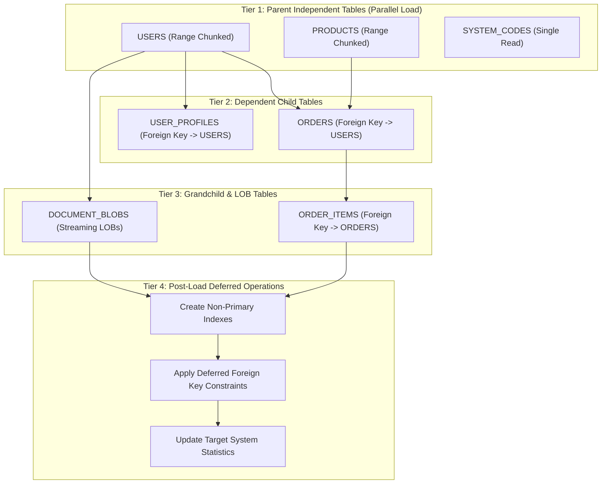

---

## 14. Validation Architecture

Validation (`WF-014`) operates across three progressive verification tiers to ensure data integrity:

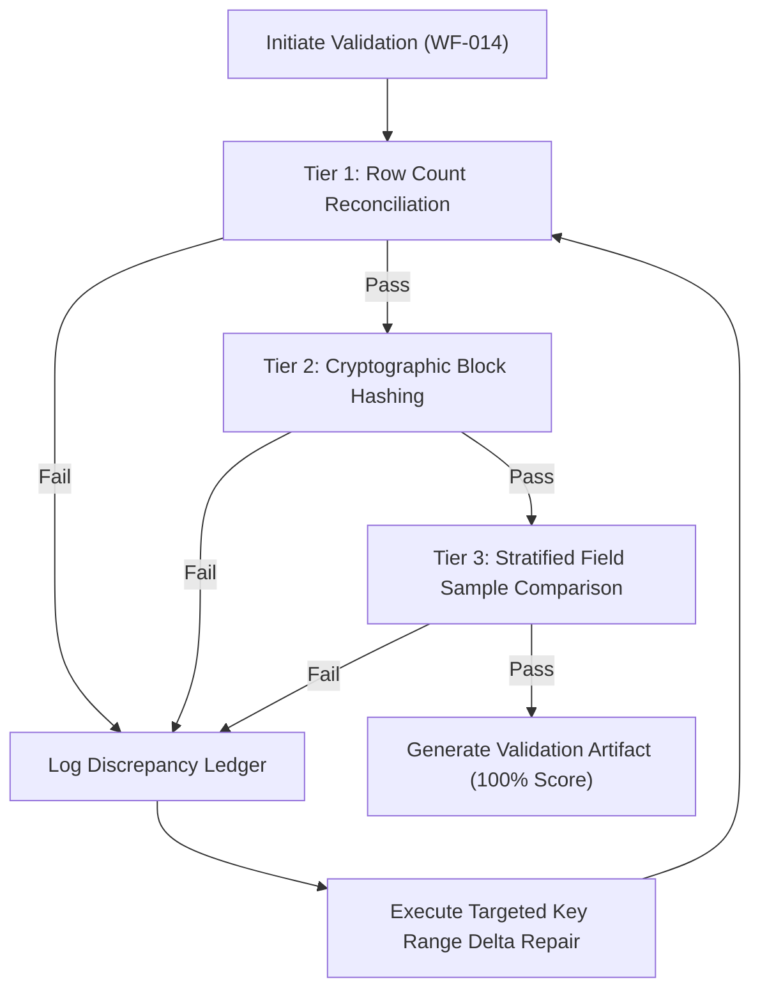

*Note on Data Masking Verification:* When data masking rules are active for non-production target environments (assigned in `WF-007`), validation evaluates equivalent masked representations to verify data transformation integrity without comparing raw source values directly against masked target values.

---

## 15. CDC Architecture

The Change Data Capture engine (`WF-015`) captures transactions starting from the exact Log Offset Checkpoint recorded at bulk load invocation:

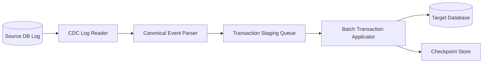

---

## 16. Continuous Synchronization Architecture

Continuous Synchronization (`WF-016`) maintains sub-second replication lag while processing DML and non-breaking DDL:

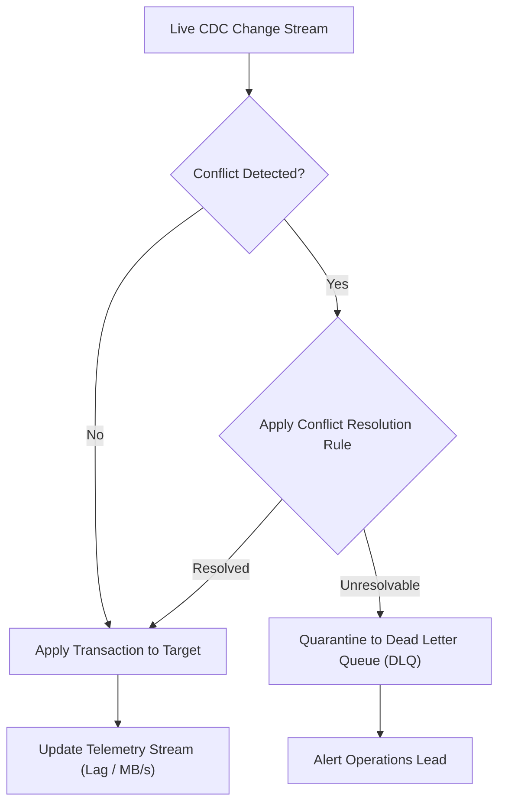

---

## 17. Production Cutover Architecture

Cutover (`WF-017`) executes zero-loss application migration:

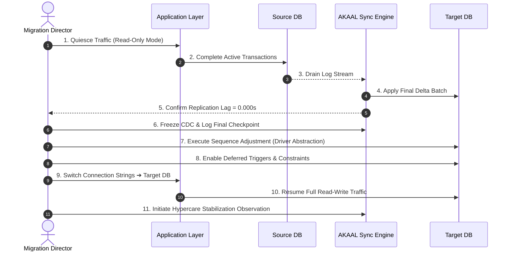

---

## 18. Rollback Architecture

Rollback (`WF-018`) provides a disaster recovery failback path:

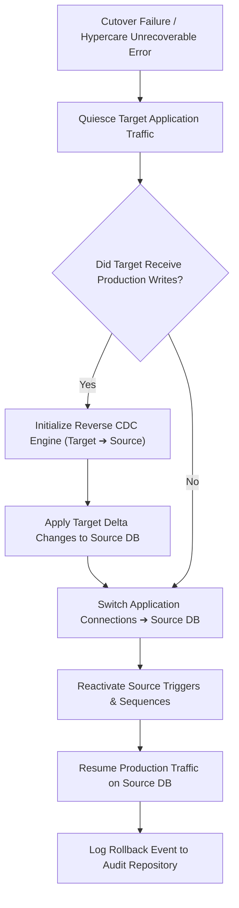

---

## 19. Hypercare Architecture

Hypercare (`WF-017` Sub-Phase) provides operational stabilization post-cutover:

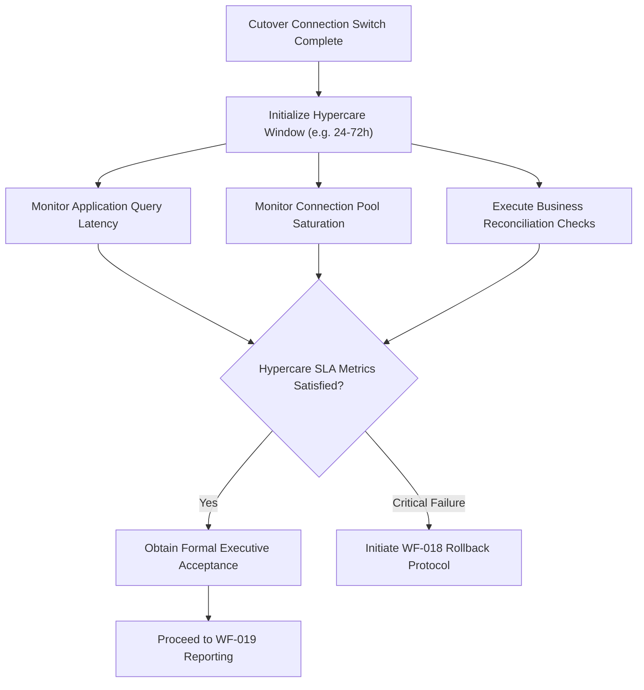

---

## 20. Reporting Architecture

Reporting (`WF-019`) generates verifiable compliance documentation:

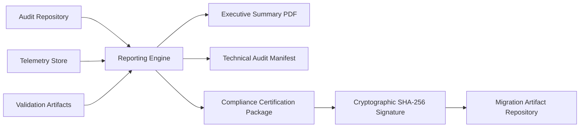

---

## 21. Archive Architecture

Archive (`WF-020`) decommissions operational resources and preserves project state:

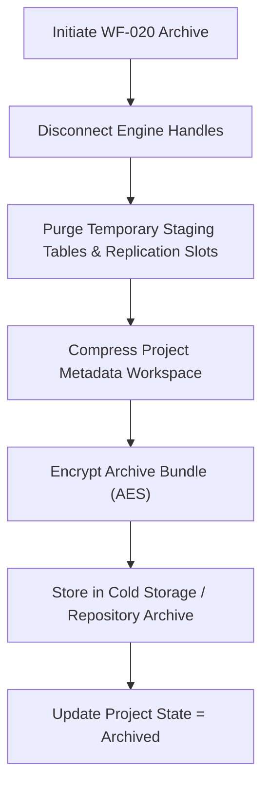

---

## 22. Enterprise Matrices

### 1. Approval Matrix

| Approval Gate | Stage Boundary | Required Approver Roles | Key Decision Criteria | Rejection Destination |
|---------------|----------------|-------------------------|-----------------------|-----------------------|
| **GATE 1** | Post `WF-004` | Enterprise Architect, Lead DBA | Catalog completeness, Risk Score acceptance, scope validation. | `WF-001` / `WF-002` (`Changes Required`) |
| **GATE 2** | Post `WF-008` | Lead DBA, Security Lead, Compliance Officer | Target DDL, execution DAG, masking rules, primary key policy. | `WF-005` / `WF-006` (`Changes Required`) |
| **GATE 3** | Post `WF-016` | Migration Director, Operations Lead | Lag = 0.00s, Integrity Certificate, target readiness. | Pre-Cutover: `WF-016` Sync Post-Cutover: `WF-018` Rollback |

---

### 2. Governance Matrix

| Lifecycle Phase | Stage Range | Governance Focus | Primary Artifacts | Responsible Roles |
|-----------------|-------------|------------------|-------------------|-------------------|
| **Discovery** | `WF-001` – `WF-004` | Scope bounding, catalog discovery, risk evaluation. | Project Definition, Schema AST, Risk Score | Lead Architect, DBA |
| **Planning** | `WF-005` – `WF-008` | Dialect translation, DAG design, compliance mapping, dual custody. | Target DDL, Execution DAG, Approval Record | DBA, SecOps, Compliance |
| **Validation** | `WF-009` – `WF-010` | Infrastructure simulation, capacity validation, window locking. | Pre-Flight Report, Maintenance Lock | Systems Engineer, Ops Lead |
| **Execution** | `WF-011` – `WF-016` | Parallel load, telemetry, self-healing, integrity, streaming sync. | Checkpoint Store, Telemetry, Validation Artifact | Migration Ops, DBA |
| **Cutover** | `WF-017` – `WF-018` | Zero-loss switch, sequence reset, Hypercare, disaster failback. | Cutover Record, Hypercare Log, Rollback Log | Migration Director, Ops Lead |
| **Closure** | `WF-019` – `WF-020` | Reporting, compliance certification, workspace encryption. | Audit Manifest, Encrypted Archive Package | Compliance Officer, DBA |

---

### 3. Risk Matrix

| Risk Category | Evaluated Factors | Weight | Mitigation Mechanism | Stage Handled |
|---------------|-------------------|--------|----------------------|---------------|
| **Structural Complexity** | Data types, LOB presence, partitioning, triggers. | 30% | Dialect remapping, LOB streaming, deferred index load. | `WF-003`, `WF-005` |
| **Data Volume** | Terabyte sizing, row counts, table width. | 25% | Dynamic range chunking, multi-threaded parallel streams. | `WF-006`, `WF-011` |
| **Constraint Integrity** | Missing primary keys, circular foreign keys. | 20% | Explicit user approval for PK strategy, deferred FK creation. | `WF-003`, `WF-005`, `WF-006` |
| **Procedural Logic** | Stored procedures, package density, custom types. | 15% | Code complexity parsing, manual review flagging. | `WF-003`, `WF-005` |
| **Network & IOPS** | Bandwidth, latency, target write IOPS limits. | 10% | Pre-flight simulation, dynamic thread backpressure. | `WF-009`, `WF-012` |

---

### 4. Failure Matrix

| Failure Event | Intercept Stage | Detection Probe | Severity | Primary Handling Protocol |
|---------------|-----------------|-----------------|----------|---------------------------|
| **Endpoint Unreachable** | `WF-001`, `WF-009` | Synthetic Handshake Probe | CRITICAL | Halt stage; prompt credential/network handle verification. |
| **Catalog Access Denied** | `WF-002` | Driver Error Catch | HIGH | Flag missing permission grants; retry from catalog offset. |
| **Unresolvable Data Type** | `WF-005` | Dialect Parser Exception | MEDIUM | Pause transformation; request custom mapping override. |
| **Target Storage Exhaustion** | `WF-009`, `WF-011` | Capacity Monitor (>90%) | CRITICAL | Halt ingestion; alert admin to expand storage target. |
| **Worker Process Crash** | `WF-011`, `WF-016` | Process Heartbeat Monitor | HIGH | Respawn worker; read Checkpoint Store; resume chunk. |
| **CDC Log Sequence Gap** | `WF-015` | Reader Offset Exception | CRITICAL | Search backup log path; fallback to differential delta sync. |
| **Cutover Lag Timeout** | `WF-017` | Telemetry Lag Probe | HIGH | Issue Pre-Cutover NO-GO; return to `WF-016` Continuous Sync. |
| **Post-Cutover System Failure**| `WF-017` | Hypercare Probe Exception | CRITICAL | Execute `WF-018` Rollback Protocol to restore source DB. |

---

### 5. Recovery Matrix

| Fault Scenario | Trigger Condition | Automated vs Manual | Recovery Action Steps | Target State |
|----------------|-------------------|---------------------|-----------------------|--------------|
| **Transient Network Drop** | Worker socket timeout | Automated | 1. Backoff reconnect 2. Re-authenticate 3. Resume from Checkpoint Store | `Running` |
| **Target Lock Contention** | DB Lock Timeout | Automated | 1. Roll back chunk 2. Reduce concurrency 50% 3. Retry chunk | `Running` |
| **Worker OOM Exception** | Worker process death | Automated | 1. Respawn worker 2. Halve table chunk size 3. Resume chunk | `Running` |
| **Retry Budget Exhausted** | Max retries exceeded | Manual | 1. Transition to `Paused` 2. Alert Ops 3. Manual resume upon fix | `Paused` ➔ `Running` |
| **Data Hash Mismatch** | Validation score < 100% | Automated / Manual | 1. Isolate PK range 2. Extract source delta 3. Upsert target | `Validating` |
| **Pre-Cutover Rejection** | Gate 3 NO-GO decision | Manual | 1. Return to `WF-016` 2. Maintain continuous sync 3. Retry Gate 3 | `Running` (Sync) |
| **Hypercare Unrecoverable Error**| Post-cutover failure | Manual | 1. Quiesce target 2. Reverse CDC to source 3. Restore source DB | `Rolled Back` |

---

### 6. Validation Matrix

| Verification Tier | Scope | Algorithm / Method | Execution Phase | Threshold Criteria |
|-------------------|-------|--------------------|-----------------|--------------------|
| **Tier 1: Row Count** | 100% of loaded tables | Exact physical row count reconciliation query. | Post `WF-011` | 100% Count Match |
| **Tier 2: Block Checksum** | High-volume table chunks | Engine-side concatenated SHA-256 primary key hashing (evaluates equivalent masked representations when masking is active). | `WF-014` | Zero Hash Mismatches |
| **Tier 3: Stratified Sample**| 5% randomized sample | Cell-by-cell value, precision, and encoding comparison (evaluates equivalent masked representations when masking is active). | `WF-014` | Zero Value Discrepancies |

---

### 7. Compliance Matrix

| Compliance Domain | Enforced Rule | Inheritance Point | Verification Mechanism | Stage |
|-------------------|---------------|-------------------|------------------------|-------|
| **Data Privacy (GDPR/HIPAA)**| Mask/anonymize PII fields in non-production environments. | Org ➔ Workspace ➔ Project | Compliance classification scanner. | `WF-007` |
| **Card Security (PCI-DSS)** | Enforce TLS transport encryption for all streams. | Org ➔ Workspace ➔ Project | Transport security endpoint probe. | `WF-007`, `WF-009` |
| **Access Control (SOC 2)** | Dual-custody approval (4-Eyes Principle) for changes. | Organization Workspace | Cryptographic Approval Records. | `WF-008` (GATE 2) |
| **Audit Trail (ISO 27001)** | Immutable logging of all actions and schema changes. | Platform System | SHA-256 signed Audit Repository. | All Stages |

---

### 8. Security Matrix

| Layer | Security Mechanism | Standard / Specification | Enforcement Point |
|-------|--------------------|--------------------------|-------------------|
| **Credentials** | Enterprise Secrets Handles | Vault / K8s / AWS Secrets Abstraction | Central Connection Manager |
| **Transport** | Network Encryption | TLS 1.3 / mTLS strict policy | All Worker Connections |
| **Data at Rest** | Storage Encryption | AES-256 payload encryption | Checkpoint & Audit Stores |
| **Authorization** | Role-Based Access Control | Workspace RBAC Policy Matrix | Internal API / UI Gates |
| **Integrity** | Document Signatures | SHA-256 cryptographic digests | Artifacts & Approval Records |

---

### 9. Performance Matrix

| Workflow Phase | Bottleneck Risk | Optimization Strategy | SLA Benchmark Goal |
|----------------|-----------------|-----------------------|--------------------|
| **Discovery (`WF-002`)** | Catalog query locks | Thread-pooled catalog queries | < 60 seconds per 10k objects |
| **Bulk Load (`WF-011`)** | Network / Target Disk IOPS | Dynamic range chunking & parallel streams | Maximize target write IOPS |
| **Validation (`WF-014`)** | High network transport | SQL push-down block checksum hashing | < 15 minutes per TB |
| **CDC Catch-up (`WF-015`)** | Backlog processing lag | In-memory transaction batching | Catch-up lag < 5 seconds |
| **Cutover (`WF-017`)** | Traffic quiescence duration | Pre-created constraints & sequence reset | Target downtime < 60 seconds |

---

### 10. Scalability Matrix

| Dimension | Architectural Boundary | Scaling Strategy | System Mechanism |
|-----------|------------------------|------------------|------------------|
| **Schema Object Count** | > 100,000 objects | Paginated catalog extraction | Async metadata worker stream |
| **Data Volume** | Multi-Terabyte / Petabyte | Horizontal range chunk partitioning | Parallel Worker Pool |
| **Transaction Volume** | > 50,000 transactions/sec | Distributed stream queue partitioning | Multi-channel CDC pipeline |
| **Multi-Tenancy** | Hundreds of concurrent projects | Isolated Workspace namespaces | Project context encapsulation |

---

### 11. Monitoring Matrix

| Metric Class | Measured Metric | Source | Frequency | Telemetry Target |
|--------------|-----------------|--------|-----------|------------------|
| **Throughput** | Rows/sec, MB/sec | Worker Engine | 1 second | Desktop UI & Prometheus |
| **Latency** | Network RTT, Commit Latency | Driver Adapter | 1 second | Desktop UI & Alerts |
| **Replication Lag** | SCN / LSN Delta (seconds) | CDC Reader | 500 ms | Cutover Gate & UI |
| **System Load** | CPU, Memory, Disk Queue | Host OS Probes | 5 seconds | System Telemetry Dashboard |

---

### 12. Audit Matrix

| Audit Category | Logged Data Attributes | Storage Engine | Retention Policy |
|----------------|------------------------|----------------|------------------|
| **User Access** | User ID, Tenant ID, Timestamp, Action, IP | Audit Repository | 7-year regulatory retention |
| **Governance Sign-off**| Approver ID, Role, Decision, Comments, Checksum | Migration Artifact Repository | Permanent project lifecycle |
| **Data Movement** | Table ID, Row Count, Byte Volume, Duration | Audit Repository | 7-year regulatory retention |
| **Self-Healing** | Fault Error Code, Recipe ID, Retries, Outcome | Audit Repository | 1-year operational log |

---

### 13. Workflow Transition Matrix

| Current State | Permitted Next States | Trigger Event | Governance Gate |
|---------------|----------------------|---------------|-----------------|
| `Draft` | `Discovery`, `Archived` | Scope definition complete | System Check |
| `Discovery` | `Planning`, `Draft` | Catalog discovery complete | **GATE 1** |
| `Planning` | `Validation`, `Draft` | Mapping & DAG complete | **GATE 2** |
| `Validation` | `Approved`, `Planning` | Dry-run simulation passed | System Check |
| `Approved` | `Ready` | Schedule armed & window active | System Check |
| `Ready` | `Running` | Bulk load process invoked | System Check |
| `Running` | `Paused`, `Recovering`, `Validating` | Bulk execution active | System Check |
| `Paused` | `Running`, `Archived` | Manual operator resume | Operator Override |
| `Recovering` | `Running`, `Paused` | Self-healing recipe completion | System Check |
| `Validating` | `Running` (Sync), `Rollback` | Integrity verification pass | System Check |
| `Running` (Sync)| `CutoverApproved`, `Paused` | GATE 3 sign-off received | **GATE 3** |
| `CutoverApproved`| `Completed`, `Rollback` | Hypercare completion / failure | System Check |
| `Completed` | `Archived` | Closure executed (`WF-020`) | Lead DBA Sign-off |
| `Rollback` | `Rolled Back` | Failback execution complete | System Check |
| `Rolled Back` | `Archived` | Post-rollback closure | Lead DBA Sign-off |
| `Archived` | *Terminal State* | Workspace encrypted & locked | Read-Only |

---

### 14. Database Capability Matrix

| Feature / Capability | Oracle | PostgreSQL | MySQL | SQL Server | DB2 | Snowflake | MongoDB |
|----------------------|:------:|:----------:|:-----:|:----------:|:---:|:---------:|:-------:|
| **Schema Metadata Extraction** | Yes | Yes | Yes | Yes | Yes | Yes | Yes |
| **Range Chunk Partitioning** | Yes | Yes | Yes | Yes | Yes | Yes | Yes |
| **Native LOB Streaming** | Yes | Yes | Yes | Yes | Yes | N/A | Yes |
| **Deferred Constraint Creation** | Yes | Yes | Yes | Yes | Yes | N/A | N/A |
| **Log-Based CDC Reader** | LogMiner / XStream | Logical Slot | Binlog | Sys CDC | DB2 Journal | Stream Feed | Change Stream |
| **SQL Push-Down Checksum Hash** | SHA256 / MD5 | MD5 / Digest | MD5 / SHA2 | HASHBYTES | Hash Function | HASH / MD5 | MD5 Pipeline |

---

## 23. Appendices

### Appendix A: Glossary
- **AST (Abstract Syntax Tree):** Intermediate structural representation of schema definitions decoupled from specific SQL dialects.
- **CAB (Change Advisory Board):** Enterprise governance body authorizing production system changes.
- **CDC (Change Data Capture):** Technology capturing live log-level DML mutations on a source database.
- **DAG (Directed Acyclic Graph):** Structural graph defining execution tasks and dependency hierarchies with zero circular loops.
- **DLQ (Dead Letter Queue):** Quarantine repository storing unresolvable transaction stream errors for manual inspection.
- **Hypercare:** Configurable post-cutover operational stabilization period involving intensive application observation.
- **LSN / SCN:** Log Sequence Number / System Change Number representing transaction log position markers.
- **RBAC / ABAC:** Role-Based / Attribute-Based Access Control enforcing security permissions.

### Appendix B: Architectural Principles & Design Decisions
- **Decision 1: Implementation Neutrality:** Decouples core workflow engine from specific storage drivers, rendering APIs, and file serialization formats.
- **Decision 2: Rejection Preserves Audit History:** Governance rejections issue `Changes Required` and record feedback while maintaining complete historical audit trails.
- **Decision 3: Prohibition of Automatic Surrogate Primary Keys:** Structural transformations flag missing primary keys and recommend solutions; surrogate key creation requires explicit human authorization.
- **Decision 4: Inherited Compliance Hierarchy:** Compliance rules cascade strictly from Organization to Workspace to Project.

### Appendix C: Non-Functional Requirements
- **Reliability Goals:** 99.999% stream uptime; zero-loss data migration design; automated self-healing for transient network faults.
- **Availability Goals:** Sub-second continuous synchronization lag; application cutover downtime < 60 seconds.
- **Performance Goals:** Bulk transport saturates up to 90% available network bandwidth; data verification completes within 15 minutes per TB using SQL push-down hashing.
- **Security & Observability Goals:** TLS 1.3 transport encryption; AES-256 storage encryption; real-time Prometheus telemetry feeds and tamper-evident SHA-256 audit logging.

---
**END OF OFFICIAL ARCHITECTURE SPECIFICATION**
