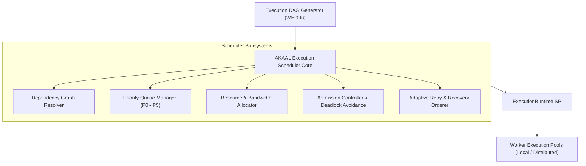
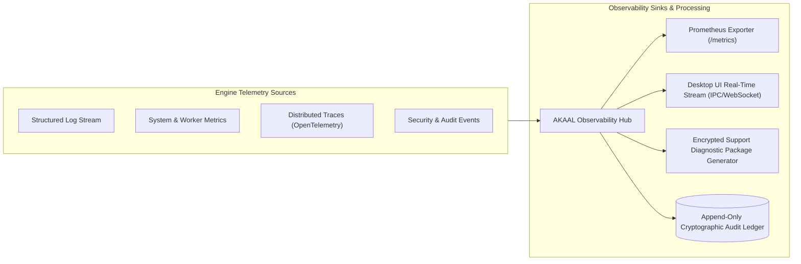
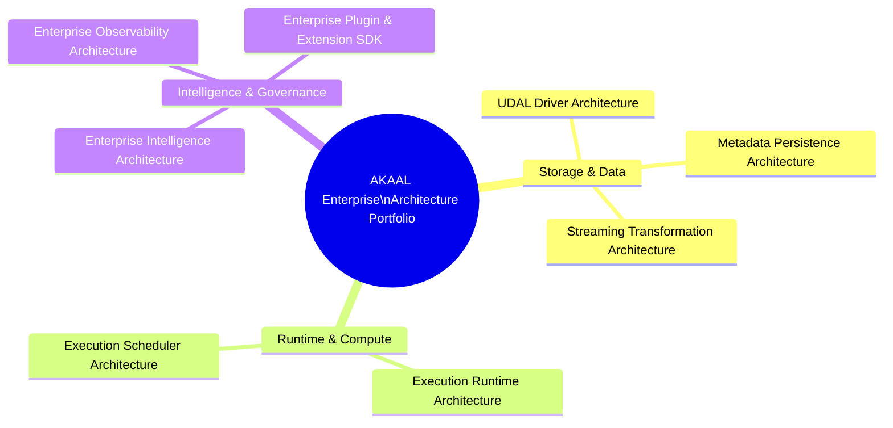
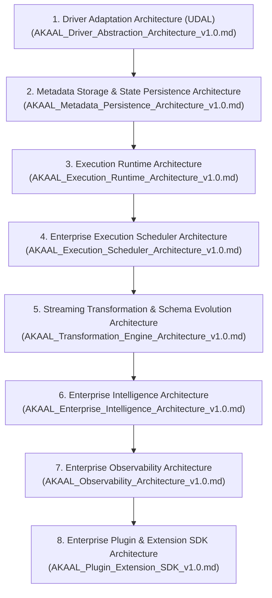

# AKAAL Enterprise Platform — Chief Architect Roadmap (v2.0)
## Master Blueprint for Remaining Enterprise Architecture (Phase 1 to Phase 15)

**Document Version:** 2.0  
**Status:** Approved Canonical Architecture Roadmap  
**Classification:** Internal Architecture Specification  
**Author:** Chief Enterprise Software Architect & Enterprise Architecture Review Board (EARB)  
**Target Systems:** Heterogeneous Database Migration, Continuous Replication, CDC & Synchronization Engine  
**Benchmark Reference Platforms:** Oracle GoldenGate, Informatica IDMC, IBM InfoSphere Data Replication, AWS DMS, Google DMS, Quest SharePlex, Qlik Replicate  

---

## Table of Contents

- [1. Executive Summary](#1-executive-summary)
- [2. Architectural Philosophy & Evaluation Criteria](#2-architectural-philosophy--evaluation-criteria)
- [3. Summary of Approved Refinements (v1.0 ➔ v2.0)](#3-summary-of-approved-refinements-v10--v20)
- [4. Deep Dive: Newly Added Canonical Architectures](#4-deep-dive-newly-added-canonical-architectures)
  - [4.1 Enterprise Execution Scheduler Architecture](#41-enterprise-execution-scheduler-architecture)
  - [4.2 Enterprise Observability Architecture](#42-enterprise-observability-architecture)
- [5. Architecture Quality & Boundary Audit](#5-architecture-quality--boundary-audit)
- [6. Complete Canonical Architecture Portfolio (8 Agendas)](#6-complete-canonical-architecture-portfolio-8-agendas)
- [7. Comprehensive Architectural Dependency Graph](#7-comprehensive-architectural-dependency-graph)
- [8. Detailed Engineering Specifications for the 8 Agendas](#8-detailed-engineering-specifications-for-the-8-agendas)
  - [AGENDA 1: Driver Adaptation Architecture (UDAL)](#agenda-1-driver-adaptation-architecture-udal)
  - [AGENDA 2: Metadata Storage & State Persistence Architecture](#agenda-2-metadata-storage--state-persistence-architecture)
  - [AGENDA 3: Execution Runtime Architecture](#agenda-3-execution-runtime-architecture)
  - [AGENDA 4: Enterprise Execution Scheduler Architecture](#agenda-4-enterprise-execution-scheduler-architecture)
  - [AGENDA 5: Streaming Transformation & Schema Evolution Architecture](#agenda-5-streaming-transformation--schema-evolution-architecture)
  - [AGENDA 6: Enterprise Intelligence Architecture](#agenda-6-enterprise-intelligence-architecture)
  - [AGENDA 7: Enterprise Observability Architecture](#agenda-7-enterprise-observability-architecture)
  - [AGENDA 8: Enterprise Plugin & Extension SDK Architecture](#agenda-8-enterprise-plugin--extension-sdk-architecture)
- [9. Enterprise Benchmark & Competitive Superiority Analysis](#9-enterprise-benchmark--competitive-superiority-analysis)
- [10. Long-Term Deployment & Scalability Assessment](#10-long-term-deployment--scalability-assessment)
- [11. Final Prioritized Implementation Roadmap](#11-final-prioritized-implementation-roadmap)
- [12. EARB Conclusion & Formal Approval Declaration](#12-earb-conclusion--formal-approval-declaration)

---

## 1. Executive Summary

This document specifies the final, canonical **Enterprise Architecture Roadmap (v2.0)** for the **AKAAL Enterprise Platform**. It governs all remaining architectural specifications required before completing the platform across all 15 implementation phases.

Building on the frozen operational workflow baseline (`docs/architecture/AKAAL_Enterprise_Migration_Workflow_v1.0.md`), this roadmap establishes the **8 Essential Canonical Engineering Agendas** required to complete AKAAL’s architectural blueprint. Every agenda included in this specification satisfies a single strict engineering test:

> *"If this architectural decision is postponed until after AKAAL v1.0 is developed, will it likely require significant redesign, refactoring, or re-architecture of the software?"*

All non-engineering business operational concerns (pricing, sales, marketing, support procedures, legal licensing, partner programs) are explicitly excluded. This document serves as the authoritative architectural directive for the engineering organization.

---

## 2. Architectural Philosophy & Evaluation Criteria

Enterprise database migration platforms operate in mission-critical environments where data corruption, process crashes, or uncontrolled replication lag carry severe financial and legal penalties. AKAAL adheres to four core architectural tenets:

1. **Strict Decoupling of Concerns:** Execution, scheduling, transport, transformation, intelligence, state persistence, and observability are strictly segregated into independent architectural domains.
2. **Implementation & Location Neutrality:** Core execution and scheduling logic remain identical whether deployed as a single-node desktop application (Tauri), an enterprise server cluster, a cloud-native Kubernetes service, or an air-gapped edge node.
3. **Event-Driven SPI Abstraction:** All platform capabilities interface through typed Service Provider Interfaces (SPIs) exposed via an Internal Gateway, preventing vendor lock-in and eliminating tight coupling.
4. **Zero-Trust Security & Audit Integrity:** Governance, RBAC, encrypted secrets, and immutable audit ledgers are embedded directly into the software architecture rather than bolted on post-implementation.

---

## 3. Summary of Approved Refinements (v1.0 ➔ v2.0)

| Refinement # | Legacy Refinement Target | Approved Refinement (v2.0) | Engineering Rationale |
|:---:|:---|:---|:---|
| **REF-1** | *Distributed Runtime & Location-Transparent Message Bus Architecture* | **Execution Runtime Architecture** | Broadens the architecture to encapsulate all runtime execution models (Desktop, Enterprise Server, Hybrid, Cloud-Native, Kubernetes, and Edge Nodes). Distributed runtime is recognized as one deployment profile of a unified runtime. |
| **REF-2** | *AI Intelligence & Autonomous Self-Healing* | **Enterprise Intelligence Architecture** | Broadens the scope beyond self-healing to encompass all intelligence consumers: Risk Advisor (`WF-004`), Recommendation Engine, Knowledge Engine (KIs), Root Cause Analyzer, Performance Optimizer, Transformation Advisor, Validation Advisor, AI Governance, and Adaptive Concurrency Tuners. Integrates natively into the engine event bus. |
| **ADD-1** | *Newly Introduced Architecture* | **Enterprise Execution Scheduler Architecture** | Separates scheduling ("What executes, when, in what order, and under what constraints?") from execution runtime ("Where does execution occur?"). Governs DAG scheduling, resource allocation, fair queueing, and deadlock avoidance. |
| **ADD-2** | *Newly Introduced Architecture* | **Enterprise Observability Architecture** | Establishes an internal engineering architecture for structured logging, metrics, distributed tracing, profiling, crash analysis, diagnostics, and local customer-controlled telemetry. |

---

## 4. Deep Dive: Newly Added Canonical Architectures

### 4.1 Enterprise Execution Scheduler Architecture

#### Architectural Purpose & Ownership
The **Enterprise Execution Scheduler Architecture** strictly separates scheduling logic from execution runtimes. While the *Execution Runtime* manages worker threads, memory pools, and process containers, the *Execution Scheduler* governs the operational ordering, dependency graph execution, resource allocation, and queue admission control for all migration tasks.



#### Core Capabilities Defined
- **Topological DAG Scheduling & Dependency Resolution:** Binds table load sequences across dependency tiers (Tier 1 Parent ➔ Tier 2 Child), automatically managing deferred constraint triggers.
- **Multi-Level Priority Queue Management:** Enforces priority queuing across P0 (System Critical), P1 (Migration Transport), P2 (Validation), P3 (Discovery), P4 (Optimization), and P5 (Background Maintenance).
- **Resource Allocation & Fair Scheduling:** Dynamically caps worker thread allocation based on host CPU cores, target database write IOPS limits, and network memory buffers.
- **Admission Control & Deadlock Avoidance:** Prevents resource starvation and detects cyclic execution locks before task dispatch.
- **Adaptive Retry & Recovery Ordering:** Interacts with `WF-013` (Self-Healing) to reschedule failed table chunks using exponential backoff and jitter ordering without blocking independent parallel streams.

---

### 4.2 Enterprise Observability Architecture

#### Architectural Purpose & Ownership
The **Enterprise Observability Architecture** defines the internal telemetry, logging, tracing, diagnostic, and profiling infrastructure governing the entire platform. It provides developers, SecOps teams, and automated intelligence agents with 100% operational visibility without compromising customer data privacy in air-gapped environments.



#### Core Capabilities Defined
- **Structured JSON Logging:** Standardized, high-throughput JSON log formatting with context-rich tracing IDs, tenant IDs, and component tags.
- **Prometheus Metrics Exporter:** Exposes high-frequency operational metrics (`akaal_rows_processed_total`, `akaal_replication_lag_seconds`, `akaal_worker_cpu_usage`, `akaal_buffer_queue_depth`).
- **Distributed Tracing (OpenTelemetry Compatible):** Tracks transaction event spans across internal IPC boundaries, message queues, worker threads, and database driver adapters.
- **Encrypted Support Diagnostic Bundle Generator:** Compresses sanitized diagnostic logs, thread dumps, environmental profiles, and sanitized AST topologies into an encrypted support bundle (`.akaal-diag`) for offline support troubleshooting.
- **Air-Gapped Telemetry Controls:** Ensures all telemetry remains 100% on-premise under customer control unless explicitly configured for external export.

---

## 5. Architecture Quality & Boundary Audit

The EARB evaluated the 8 canonical architecture domains to ensure zero architectural overlap, clear domain ownership, high cohesion, and minimal coupling:

```
┌──────────────────────────────────────────────────────────────────────────────────┐
│                   CANONICAL ARCHITECTURE BOUNDARY MAP                            │
├──────────────────────────┬──────────────────────────┬────────────────────────────┤
│ Canonical Architecture   │ Primary Domain Ownership │ Explicit Boundary Rules    │
├──────────────────────────┼──────────────────────────┼────────────────────────────┤
│ 1. Driver Adaptation     │ Database Connectivity &  │ Must NOT manage state or   │
│    Architecture (UDAL)   │ System Adaptations       │ task scheduling.           │
├──────────────────────────┼──────────────────────────┼────────────────────────────┤
│ 2. Metadata Persistence  │ State, Checkpoints,      │ Must NOT execute migration │
│    Architecture          │ Schema ASTs & Audits     │ tasks or parse SQL.        │
├──────────────────────────┼──────────────────────────┼────────────────────────────┤
│ 3. Execution Runtime     │ Process Management,      │ Must NOT make scheduling   │
│    Architecture          │ Memory & Threads         │ decisions or resolve DAGs. │
├──────────────────────────┼──────────────────────────┼────────────────────────────┤
│ 4. Execution Scheduler   │ Task Ordering, Queues,   │ Must NOT manage process    │
│    Architecture          │ DAGs & Resource Limits   │ allocation directly.       │
├──────────────────────────┼──────────────────────────┼────────────────────────────┤
│ 5. Streaming Transform   │ Inline Data Masking,     │ Must NOT write directly to │
│    & Schema Evolution    │ Coercion & DDL AST       │ database endpoints.        │
├──────────────────────────┼──────────────────────────┼────────────────────────────┤
│ 6. Enterprise            │ Risk Advisor, KIs, AI    │ Must NOT override human    │
│    Intelligence Arch.    │ Self-Healing Recipes     │ 4-Eyes approval gates.     │
├──────────────────────────┼──────────────────────────┼────────────────────────────┤
│ 7. Enterprise            │ Logging, Metrics,        │ Must NOT alter data paths  │
│    Observability Arch.   │ Traces & Diagnostics     │ or payload records.        │
├──────────────────────────┼──────────────────────────┼────────────────────────────┤
│ 8. Enterprise Plugin     │ Sandboxed Extension      │ Must NOT bypass core       │
│    & Extension SDK Arch. │ SPIs & Plugin Runtime    │ security or RBAC controls. │
└──────────────────────────┴──────────────────────────┴────────────────────────────┘
```

---

## 6. Complete Canonical Architecture Portfolio (8 Agendas)



1. **AGENDA 1: Driver Adaptation Architecture (UDAL)** — `docs/architecture/AKAAL_Driver_Abstraction_Architecture_v1.0.md`
2. **AGENDA 2: Metadata Storage & State Persistence Architecture** — `docs/architecture/AKAAL_Metadata_Persistence_Architecture_v1.0.md`
3. **AGENDA 3: Execution Runtime Architecture** — `docs/architecture/AKAAL_Execution_Runtime_Architecture_v1.0.md`
4. **AGENDA 4: Enterprise Execution Scheduler Architecture** — `docs/architecture/AKAAL_Execution_Scheduler_Architecture_v1.0.md`
5. **AGENDA 5: Streaming Transformation & Schema Evolution Architecture** — `docs/architecture/AKAAL_Transformation_Engine_Architecture_v1.0.md`
6. **AGENDA 6: Enterprise Intelligence Architecture** — `docs/architecture/AKAAL_Enterprise_Intelligence_Architecture_v1.0.md`
7. **AGENDA 7: Enterprise Observability Architecture** — `docs/architecture/AKAAL_Observability_Architecture_v1.0.md`
8. **AGENDA 8: Enterprise Plugin & Extension SDK Architecture** — `docs/architecture/AKAAL_Plugin_Extension_SDK_v1.0.md`

---

## 7. Comprehensive Architectural Dependency Graph



---

## 8. Detailed Engineering Specifications for the 8 Agendas

### AGENDA 1: Driver Adaptation Architecture (UDAL)
- **Document Path:** `docs/architecture/AKAAL_Driver_Abstraction_Architecture_v1.0.md`
- **Classification:** Canonical Architecture Document
- **Purpose:** Defines the capability-negotiated Service Provider Interface (SPI) isolating the core engine from database-specific SQL syntax, LOB streams, catalog structures, and CDC transaction log mining routines across 17+ storage engines.
- **Priority:** `CRITICAL (Priority 1)` | **Complexity:** `Very High`
- **Dependencies:** None (Baseline SPI Layer).

---

### AGENDA 2: Metadata Storage & State Persistence Architecture
- **Document Path:** `docs/architecture/AKAAL_Metadata_Persistence_Architecture_v1.0.md`
- **Classification:** Canonical Architecture Document
- **Purpose:** Defines append-only event-sourced persistence for schema ASTs, execution DAGs, check-pointing ledgers, validation discrepancy logs, and SHA-256 signed audit repositories across all deployment profiles.
- **Priority:** `CRITICAL (Priority 2)` | **Complexity:** `High`
- **Dependencies:** Agenda 1 (UDAL).

---

### AGENDA 3: Execution Runtime Architecture
- **Document Path:** `docs/architecture/AKAAL_Execution_Runtime_Architecture_v1.0.md`
- **Classification:** Canonical Architecture Document
- **Purpose:** Establishes location-transparent process, memory, worker thread, and container management supporting Standalone Workstation, Enterprise Server, Hybrid, Kubernetes, and Edge Node deployment profiles.
- **Priority:** `CRITICAL (Priority 3)` | **Complexity:** `Very High`
- **Dependencies:** Agenda 1 (UDAL), Agenda 2 (Metadata Persistence).

---

### AGENDA 4: Enterprise Execution Scheduler Architecture
- **Document Path:** `docs/architecture/AKAAL_Execution_Scheduler_Architecture_v1.0.md`
- **Classification:** Canonical Architecture Document
- **Purpose:** Governs topological DAG dependency resolution, priority queueing (P0–P5), resource allocation, fair thread scheduling, admission control, and deadlock avoidance.
- **Priority:** `CRITICAL (Priority 4)` | **Complexity:** `High`
- **Dependencies:** Agenda 1 (UDAL), Agenda 2 (Metadata Persistence), Agenda 3 (Execution Runtime).

---

### AGENDA 5: Streaming Transformation & Schema Evolution Architecture
- **Document Path:** `docs/architecture/AKAAL_Transformation_Engine_Architecture_v1.0.md`
- **Classification:** Canonical Architecture Document
- **Purpose:** Defines zero-copy byte-buffer transformation pipelines, PII data masking (`WF-007`), type coercion, and non-breaking dynamic source DDL AST propagation (`ALTER TABLE ADD COLUMN`).
- **Priority:** `HIGH (Priority 5)` | **Complexity:** `High`
- **Dependencies:** Agenda 1 (UDAL), Agenda 3 (Runtime), Agenda 4 (Scheduler).

---

### AGENDA 6: Enterprise Intelligence Architecture
- **Document Path:** `docs/architecture/AKAAL_Enterprise_Intelligence_Architecture_v1.0.md`
- **Classification:** Canonical Architecture Document / Frozen Design Principle
- **Purpose:** Binds the AI & Heuristic Intelligence Subsystem to engine event streams, providing Pre-Migration Risk Scoring (`WF-004`), Knowledge Item (KI) pattern matching, Autonomous Self-Healing Recipes (`WF-013`), and Dynamic Concurrency Optimization (`WF-016`).
- **Priority:** `HIGH (Priority 6)` | **Complexity:** `Medium`
- **Dependencies:** Agenda 2 (Persistence), Agenda 3 (Runtime), Agenda 4 (Scheduler).

---

### AGENDA 7: Enterprise Observability Architecture
- **Document Path:** `docs/architecture/AKAAL_Observability_Architecture_v1.0.md`
- **Classification:** Canonical Architecture Document
- **Purpose:** Establishes internal structured logging, Prometheus metrics exporting (`/metrics`), OpenTelemetry distributed tracing, diagnostic bundle generation (`.akaal-diag`), and air-gapped customer telemetry controls.
- **Priority:** `HIGH (Priority 7)` | **Complexity:** `Medium`
- **Dependencies:** Agenda 2 (Persistence), Agenda 3 (Runtime).

---

### AGENDA 8: Enterprise Plugin & Extension SDK Architecture
- **Document Path:** `docs/architecture/AKAAL_Plugin_Extension_SDK_v1.0.md`
- **Classification:** Canonical Architecture Document
- **Purpose:** Exposes versioned, sandboxed SPI contracts enabling enterprise customers to build custom database drivers, data masking rules, validation algorithms, telemetry sinks, and vendor-neutral CAB change governance hooks.
- **Priority:** `HIGH (Priority 8)` | **Complexity:** `High`
- **Dependencies:** Agenda 1 through Agenda 7.

---

## 9. Enterprise Benchmark & Competitive Superiority Analysis

```
┌────────────────────────────────────────────────────────────────────────────────────────────────┐
│                        ENTERPRISE COMPETITIVE ARCHITECTURE MATRIX                              │
├─────────────────────┬───────────────────────────┬──────────────────────────────────────────────┤
│ Architectural Domain│ Legacy Platform Benchmark │ AKAAL v2.0 Intentional Architecture          │
├─────────────────────┼───────────────────────────┼──────────────────────────────────────────────┤
│ Database Drivers    │ Separate C binaries       │ Capability-Negotiated UDAL SPI               │
│                     │ (Oracle GoldenGate)       │ Single engine, pluggable driver SPIs         │
├─────────────────────┼───────────────────────────┼──────────────────────────────────────────────┤
│ Scheduler & Runtime │ Coupled monolith          │ Strict separation: Scheduler (DAGs/queues)  │
│                     │ (Informatica IDMC)        │ vs Runtime (Location-transparent containers) │
├─────────────────────┼───────────────────────────┼──────────────────────────────────────────────┤
│ Transformations     │ Slow ETL record trees     │ Zero-Copy Byte-Buffer Pipeline               │
│                     │ (IBM InfoSphere)          │ Sub-second streaming CDC latency             │
├─────────────────────┼───────────────────────────┼──────────────────────────────────────────────┤
│ Observability       │ Unstructured text files   │ OpenTelemetry Traces & Prometheus            │
│                     │ (Quest SharePlex)         │ Encrypted diagnostic bundles (.akaal-diag)   │
├─────────────────────┼───────────────────────────┼──────────────────────────────────────────────┤
│ Intelligence & AI   │ Manual log searches       │ Embedded Intelligence Event Subsystem        │
│                     │ (AWS DMS / Qlik)          │ Automated Self-Healing Recipes & KI ledgers  │
└─────────────────────┴───────────────────────────┴──────────────────────────────────────────────┘
```

---

## 10. Long-Term Deployment & Scalability Assessment

The 8 canonical architectures natively support all past, present, and future deployment targets:

- **Standalone Desktop (Tauri):** Local SQLite persistence (Agenda 2), in-memory thread runtime (Agenda 3), local scheduling queues (Agenda 4), and local WebSocket telemetry stream (Agenda 7).
- **Enterprise Server Cluster:** Multi-node gRPC/NATS message bus runtime (Agenda 3), distributed DAG scheduler (Agenda 4), horizontal worker thread pools, and central Prometheus exporter (Agenda 7).
- **Cloud-Native Kubernetes (K8s):** Containerized worker pods managed by the Execution Runtime (Agenda 3), with auto-scaling worker nodes dynamically assigned by the Execution Scheduler (Agenda 4).
- **Air-Gapped Hybrid Edge:** Complete local execution without external internet dependencies; encrypted local diagnostic bundle exports (Agenda 7) guarantee zero data leakage.

---

## 11. Final Prioritized Implementation Roadmap

```
Phase 1 ──► Phase 3 ──► Phase 5 ──► Phase 7 ──► Phase 9 ──► Phase 11 ──► Phase 13 ──► Phase 15
  │          │          │          │          │          │           │           │
  ▼          ▼          ▼          ▼          ▼          ▼           ▼           ▼
[UDAL]   [Persistence] [Runtime] [Scheduler][Transform][Intelligence][Observability][Plugin SDK]
```

1. **Phase 1–2:** Freeze & Implement **AGENDA 1: Driver Adaptation Architecture (UDAL)**.
2. **Phase 3–4:** Freeze & Implement **AGENDA 2: Metadata Storage & State Persistence Architecture**.
3. **Phase 5–6:** Freeze & Implement **AGENDA 3: Execution Runtime Architecture**.
4. **Phase 7–8:** Freeze & Implement **AGENDA 4: Enterprise Execution Scheduler Architecture**.
5. **Phase 9–10:** Freeze & Implement **AGENDA 5: Streaming Transformation & Schema Evolution Architecture**.
6. **Phase 11–12:** Freeze & Implement **AGENDA 6: Enterprise Intelligence Architecture**.
7. **Phase 13–14:** Freeze & Implement **AGENDA 7: Enterprise Observability Architecture**.
8. **Phase 15:** Freeze & Implement **AGENDA 8: Enterprise Plugin & Extension SDK Architecture**.

---

## 12. EARB Conclusion & Formal Approval Declaration

The Enterprise Architecture Review Board has thoroughly reviewed the refined architecture portfolio (v2.0). By separating scheduling from runtime, broadening intelligence into an engine-embedded event subsystem, and introducing dedicated observability abstractions, this roadmap guarantees that the AKAAL platform will achieve complete architectural independence, high performance, and long-term enterprise maintainability.

### Official EARB Declaration:

**APPROVED AS THE CANONICAL ENTERPRISE ARCHITECTURE ROADMAP (v2.0)**  
*All engineering implementation across Phases 1 through 15 shall strictly adhere to these 8 canonical architecture specifications.*
