# AKAAL Super Engine Clean-Slate Architecture Blueprint

**Document Version:** 2.0
**Status:** Target Architectural Specification
**Classification:** Internal System Architecture & Engine Redesign
**Target Package:** `akaal/engine` ([akaal/engine](file:///a:/temp_akaal/akaal/engine))

---

## 1. Executive Summary & Design Principles

This document specifies the clean-slate target architecture for rebuilding [`akaal/engine`](file:///a:/temp_akaal/akaal/engine) from scratch. By eliminating legacy prototype files (`api.py`, `partitioner.py`, `reader.py`, `writer.py`, `scheduler.py`, `validator.py`, `checkpoint.py`, `state.py`, `telemetry.py`, `spec.py`), `akaal/engine` is refactored into a lean, 7-file **Super Engine Orchestration Layer**.

### Core Architectural Principles:
1. **Zero Logic Duplication:** Contains zero proprietary database drivers, zero localized SQLite database schemas, zero hardcoded SQL DDL strings, and zero fake type converters.
2. **100% Facade Delegation:** Bootstraps all 11 Enterprise Platform Facades via [`CompositionRoot`](file:///a:/temp_akaal/akaal/integration/composition_root.py) and delegates 100% of execution to underlying core platforms.
3. **Strict Compliance Enforcement:** Mandates Governance Approval Gates (**GATE 1**, **GATE 2**, **GATE 3**) and cryptographically signed digital trust seals before authorizing data transport or cutover.
4. **Implementation Neutrality:** Serves as the programmatic SDK and API entry point for all client interfaces (Desktop UI, Web REST, gRPC, CLI, Desktop IPC).

---

## 2. Clean-Slate Directory Structure & File Taxonomy

```
akaal/engine/
├── __init__.py            # Package Exports (AkaalSuperEngine, EngineExecutionContext, EngineConfig)
├── facade.py              # AkaalSuperEngine — Master Entrypoint & CompositionRoot Binder
├── orchestrator.py        # SuperEngineOrchestrator — Drives WF-001..WF-020 Lifecycle Execution
├── context.py             # EngineExecutionContext — Standardized Immutable Context DTOs
├── router.py              # PlatformRouter — Inter-Platform Dynamic Event Mesh & Router
├── observer.py            # TelemetryObserver — Unified Observability, Prometheus & EventBus Emitter
└── governance_gate.py     # GateController — Enforces GATE 1, GATE 2, GATE 3 & Trust Seals
```

---

## 3. Component Deep Dive: File Specifications

### 1. `facade.py` — [`AkaalSuperEngine`](file:///a:/temp_akaal/akaal/engine/facade.py)
- **Primary Responsibility:** Master top-level API facade.
- **Key Mechanics:**
  - Instantiates [`CompositionRoot`](file:///a:/temp_akaal/akaal/integration/composition_root.py) on initialization to bootstrap all 11 platform facades.
  - Exposes programmatic lifecycle methods:
    - `initiate_project(context: EngineExecutionContext)`
    - `discover_and_assess(context: EngineExecutionContext)`
    - `generate_plan_and_transpile(context: EngineExecutionContext)`
    - `evaluate_gate(context: EngineExecutionContext, gate_id: str)`
    - `execute_migration(context: EngineExecutionContext)`
    - `start_cdc_sync(context: EngineExecutionContext)`
    - `certify_and_close(context: EngineExecutionContext)`

### 2. `orchestrator.py` — [`SuperEngineOrchestrator`](file:///a:/temp_akaal/akaal/engine/orchestrator.py)
- **Primary Responsibility:** Master 20-Stage Workflow Execution Driver.
- **Key Mechanics:**
  - Delegates step execution directly to `WorkflowEngine` ([`akaal.orchestration`](file:///a:/temp_akaal/akaal/orchestration)) and `StateController` ([`akaal.workflow.state_machine`](file:///a:/temp_akaal/akaal/workflow/state_machine)).
  - Drives the full 20-stage state machine (`WF-001` through `WF-020`).
  - Dispatches tasks across multi-node worker clusters via `DefaultDistributedRuntimeV1` ([`akaal.distributed`](file:///a:/temp_akaal/akaal/distributed)).

### 3. `context.py` — [`EngineExecutionContext`](file:///a:/temp_akaal/akaal/engine/context.py)
- **Primary Responsibility:** Standardized Immutable Specification DTOs.
- **Key Mechanics:**
  - Uses unified contracts from [`akaal.core.contracts`](file:///a:/temp_akaal/akaal/core/contracts) and [`akaal.workflow.models.context`](file:///a:/temp_akaal/akaal/workflow/models/context.py).
  - Holds source/target `ConnectionAuthorityDTO` references, tenant RBAC context, schema mapping configurations, active tuning policies (`TuningPolicy`), and enterprise vault secret handles.

### 4. `router.py` — [`PlatformRouter`](file:///a:/temp_akaal/akaal/engine/router.py)
- **Primary Responsibility:** Inter-Platform Event Mesh & Sub-System Router.
- **Key Mechanics:**
  - Connects `EnterpriseEventBus` ([`akaal.events`](file:///a:/temp_akaal/akaal/events)) and `PluginBus` ([`akaal.plugins`](file:///a:/temp_akaal/akaal/plugins)).
  - Enables asynchronous closed-loop communication between `operational_reliability` (Bottleneck Detector), `performance` (Adaptive Throughput), `healing` (Self-Healing Recovery), and `cdc` without tight coupling.

### 5. `observer.py` — [`TelemetryObserver`](file:///a:/temp_akaal/akaal/engine/observer.py)
- **Primary Responsibility:** Unified Observability & Telemetry Broadcaster.
- **Key Mechanics:**
  - Collects metrics from `MetricsRegistry` ([`akaal.metrics`](file:///a:/temp_akaal/akaal/metrics)) and streams real-time IOPS, throughput (MB/s, rows/s), commit latency, host resource usage, and CDC replication lag to Prometheus sinks and Desktop UI WebSockets (`WF-012`).

### 6. `governance_gate.py` — [`GateController`](file:///a:/temp_akaal/akaal/engine/governance_gate.py)
- **Primary Responsibility:** Governance Approval & Compliance Enforcer.
- **Key Mechanics:**
  - Binds directly to `EnterpriseGovernancePlatformV6` ([`akaal.governance`](file:///a:/temp_akaal/akaal/governance)) and `EnterpriseTrustCertificationPlatformV11` ([`akaal.trust_certification`](file:///a:/temp_akaal/akaal/trust_certification)).
  - Strictly enforces **GATE 1** (Discovery/Risk), **GATE 2** (4-Eyes Plan Sign-off), and **GATE 3** (Cutover Authorization), generating cryptographic SHA-256 digital seals upon project completion.

---

## 4. Architecture Diagram & Platform Interconnection Topology

```mermaid
flowchart TD
    subgraph SUPER_ENGINE["akaal/engine (Super Engine Layer)"]
        FACADE["facade.py\n(AkaalSuperEngine)"]
        ORCH["orchestrator.py\n(SuperEngineOrchestrator)"]
        CTX["context.py\n(EngineExecutionContext)"]
        ROUT["router.py\n(PlatformRouter Event Mesh)"]
        OBS["observer.py\n(TelemetryObserver)"]
        GATE["governance_gate.py\n(GateController)"]
    end

    subgraph BOOTSTRAP["Composition Root"]
        COMP["CompositionRoot\n(akaal/integration/composition_root.py)"]
    end

    subgraph PLATFORM_FACADES["100% AKAAL Platform Facades"]
        P0["WorkflowEngine (P0 Orchestration)"]
        P1["EnterpriseValidationPlatformV1 (P1 Validation)"]
        P2["EnterpriseSelfHealingPlatformV2 (P2 Healing)"]
        P3["EnterpriseReplicationPlatformV3 (P3 Replication)"]
        P4["EnterpriseReliabilityPlatformV4 (P4 Reliability)"]
        P5["DefaultDistributedRuntimeV1 (P5 Distributed)"]
        P6["DefaultStreamingRuntimeV1 (P6 Streaming)"]
        P7["CoordinatorFacade (P7 CDC)"]
        P8["SchemaEvolutionPlatformV5 (P8 Schema & Transpiler)"]
        P9["DefaultPerformanceRuntimeV1 (P9 Performance)"]
        P10["EnterpriseGovernancePlatformV6 (P10 Governance)"]
        P11["EnterpriseTrustCertificationPlatformV11 (P11 Trust Seal)"]
    end

    FACADE --> COMP
    COMP --> P0 & P1 & P2 & P3 & P4 & P5 & P6 & P7 & P8 & P9 & P10 & P11
    ORCH <--> P0 & P5 & P2
    ROUT <--> P6 & P9 & P7 & P3
    OBS <--> P9
    GATE <--> P10 & P11
```



---

## 5. Feature Comparison Matrix

| Dimension | Legacy Prototype Engine | Clean-Slate Super Engine |
| :--- | :--- | :--- |
| **Code Footprint** | ~2,500 lines of redundant prototype code | ~400 lines of pure delegation & facade wiring |
| **Engine Support** | Hardcoded Oracle $\rightarrow$ Postgres | **100% of Database Engines** via `AdapterRegistry` |
| **DDL Generation** | Forged DDL strings (`col TEXT`) | Dialect AST Transpilation via `TranspilerFacade` |
| **State Persistence** | Isolated SQLite `state.db` | Central `WorkflowEngine` State Machine & `CentralStateStore` |
| **Worker Scaling** | Single-node `ProcessPoolExecutor` | Multi-node Worker Clusters via `DefaultDistributedRuntimeV1` |
| **Governance Gates**| Un-gated direct execution | Enforces **GATE 1**, **GATE 2**, and **GATE 3** Dual Custody |
| **Fault Recovery** | Primitive script crash log | Closed-Loop Autonomous Self-Healing via `PlatformV2` |
| **Certification** | None | Cryptographic SHA-256 Digital Seals & PDF Packages |

---

## 6. Programmatic Usage Example

```python
from akaal.engine import AkaalSuperEngine, EngineExecutionContext

# 1. Instantiate the Super Engine (Bootstraps all 11 platform facades)
engine = AkaalSuperEngine()

# 2. Define Execution Context
context = EngineExecutionContext.create(
    project_id="proj-enterprise-migration-001",
    source_handle="handle-oracle-core",
    target_handle="handle-postgres-analytics",
)

# 3. Discovery & Assessment (WF-001 .. WF-004)
assessment = engine.discover_and_assess(context)

# 4. Gate 1 Approval
engine.evaluate_gate(context, gate_id="GATE_1")

# 5. Schema Transpilation & DAG Generation (WF-005 .. WF-008)
plan = engine.generate_plan_and_transpile(context)

# 6. Gate 2 Approval (4-Eyes Principle)
engine.evaluate_gate(context, gate_id="GATE_2")

# 7. Execute Migration & 3-Tier Data Validation (WF-009 .. WF-014)
result = engine.execute_migration(context)

# 8. Start CDC Continuous Synchronization (WF-015 .. WF-016)
engine.start_cdc_sync(context)

# 9. Gate 3 Cutover & Trust Certification (WF-017 .. WF-020)
engine.evaluate_gate(context, gate_id="GATE_3")
certificate = engine.certify_and_close(context)
```

---
**END OF SPECIFICATION REPORT**
