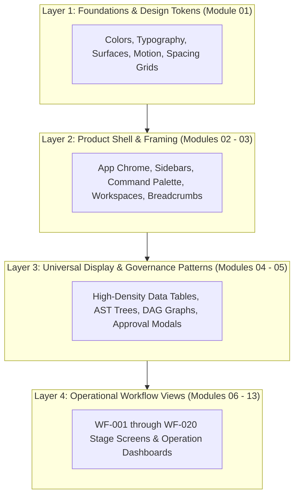
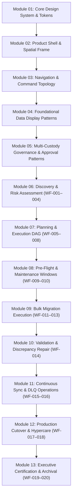

# AKAAL Enterprise Platform — Outside-In UI/UX Design Decomposition Roadmap
## Canonical Design Systems & Product Interface Architecture (v1.0)

**Document Version:** 1.0  
**Status:** Approved UI/UX Design Architecture Roadmap  
**Classification:** Internal Product & Design Specification  
**Author:** Principal Product Architect, Enterprise UX Architect & Design Systems Lead  
**Target Systems:** Desktop UI (Tauri / React), Enterprise Web UI, Multi-Tenant Cloud Control Plane  

---

## Table of Contents

- [1. Executive Summary & Design Strategy](#1-executive-summary--design-strategy)
- [2. Outside-In Product Decomposition Philosophy](#2-outside-in-product-decomposition-philosophy)
- [3. Frozen Aesthetic Baseline Alignment](#3-frozen-aesthetic-baseline-alignment)
- [4. Summary of Design Modules & Sequential Dependency Graph](#4-summary-of-design-modules--sequential-dependency-graph)
- [5. Detailed Design Specifications for Modules 01 through 13](#5-detailed-design-specifications-for-modules-01-through-13)
  - [Module 01: Core Design System & Design Tokens Foundation](#module-01-core-design-system--design-tokens-foundation)
  - [Module 02: Product Shell & Spatial Frame Architecture](#module-02-product-shell--spatial-frame-architecture)
  - [Module 03: Navigation, Command & Workspace Topology](#module-03-navigation-command--workspace-topology)
  - [Module 04: Foundational High-Density Data Display Patterns](#module-04-foundational-high-density-data-display-patterns)
  - [Module 05: Multi-Custody Governance & Approval Gate Patterns](#module-05-multi-custody-governance--approval-gate-patterns)
  - [Module 06: Discovery, Inspection & Risk Assessment Views (WF-001 – WF-004)](#module-06-discovery-inspection--risk-assessment-views-wf-001--wf-004)
  - [Module 07: Planning, Remapping & Execution DAG Views (WF-005 – WF-008)](#module-07-planning-remapping--execution-dag-views-wf-005--wf-008)
  - [Module 08: Pre-Flight Simulation & Maintenance Window Views (WF-009 – WF-010)](#module-08-pre-flight-simulation--maintenance-window-views-wf-009--wf-010)
  - [Module 09: Bulk Migration Execution & Self-Healing Operations (WF-011 – WF-013)](#module-09-bulk-migration-execution--self-healing-operations-wf-011--wf-013)
  - [Module 10: Validation, Integrity & Discrepancy Repair (WF-014)](#module-10-validation-integrity--discrepancy-repair-wf-014)
  - [Module 11: Continuous CDC Synchronization & Stream Operations (WF-015 – WF-016)](#module-11-continuous-cdc-synchronization--stream-operations-wf-015--wf-016)
  - [Module 12: Production Cutover, Hypercare & Failback Operations (WF-017 – WF-018)](#module-12-production-cutover-hypercare--failback-operations-wf-017--wf-018)
  - [Module 13: Executive Certification, Compliance Reporting & Archival (WF-019 – WF-020)](#module-13-executive-certification-compliance-reporting--archival-wf-019--wf-020)
- [6. Design Systems Quality & Governance Audit](#6-design-systems-quality--governance-audit)
- [7. Final Summary & Deliverable Assessment](#7-final-summary--deliverable-assessment)

---

## 1. Executive Summary & Design Strategy

This document establishes the canonical **Outside-In Product Decomposition Roadmap** for the **AKAAL Enterprise Database Migration Platform**. It defines the exact sequence in which all user interface, layout, component, workflow, and operational screens shall be progressively designed.

Designing enterprise database migration software—comparable to Microsoft Azure Portal, AWS DMS Console, Oracle GoldenGate Studio, Informatica IDMC, GitHub, Grafana, and Linear—requires strict adherence to **Outside-In Design Decomposition**. Attempting to design complex domain screens (`WF-011` Bulk Load or `WF-017` Cutover) before establishing atomic design tokens, layout shells, data display patterns, and governance structures leads to massive visual inconsistency, fragmented interaction patterns, and catastrophic redesign costs.

This roadmap breaks the AKAAL platform into **13 Sequential Product Design Modules**, optimizing for:
1. **Lowest Future Redesign Cost:** Zero screen rework by establishing foundations first.
2. **Maximum Visual & Interaction Consistency:** Unified components across light and dark modes.
3. **Enterprise Data Scalability:** High-density grids capable of displaying millions of rows cleanly.
4. **Calm & Trustworthy UX:** Reduced cognitive load during high-stakes maintenance cutovers.

---

## 2. Outside-In Product Decomposition Philosophy

An **Outside-In** design methodology begins at the outermost visual and spatial boundaries experienced by the user and progressively moves inward toward specific operational domain workflows:



---

## 3. Frozen Aesthetic Baseline Alignment

All design modules specified in this roadmap must strictly adhere to AKAAL's frozen aesthetic guidelines:

- **Theme Palette:**
  - *Primary Light Mode:* Enterprise Blue (`#0F62FE` primary accent, `#F4F7FB` base background, `#FFFFFF` surface cards, `#161616` primary text).
  - *Primary Dark Mode:* Midnight Glass (`#0A0E17` deep background, `#121824` surface cards, `#1F293D` border outlines, `rgba(255,255,255,0.05)` glass overlays).
- **Typography Standards:**
  - *UI & Interface Text:* **Inter** (400 Regular, 500 Medium, 600 SemiBold).
  - *Data, Code, DDL & Metrics:* **JetBrains Mono** (400 Regular, 500 Medium).
- **Visual Design Philosophy:** Enterprise Minimalism, Premium Ambient Lighting, Subtle Glassmorphism (`backdrop-filter: blur(12px)`), High Data Density, Calm & Trustworthy Visual Hierarchy.

---

## 4. Summary of Design Modules & Sequential Dependency Graph



---

## 5. Detailed Design Specifications for Modules 01 through 13

---

### Module 01: Core Design System & Design Tokens Foundation

- **Name:** Core Design System & Design Tokens Foundation
- **Purpose:** Establish the fundamental visual language, atomic tokens, and primitive UI components required for the entire platform.
- **Why It Comes in This Order:** Designing layout containers or data tables before establishing color tokens, font scales, and spacing primitives leads to inconsistent CSS values, broken theme toggles, and mandatory visual refactoring.
- **Scope:**
  - *Included:* Color token primitives (Enterprise Blue & Midnight Glass), Typography styles (Inter & JetBrains Mono), Spacing & Grid system (4px/8px base grid), Glassmorphism elevation tokens, Atomic components (Buttons, Inputs, Selects, Checkboxes, Switches, Status Badges, Tooltips, Iconography library).
  - *Explicitly NOT Included:* App chrome, page layouts, navigation bars, modals, data tables, or workflow screens.
- **Deliverables:** Figma Tokens File, Atomic Component Library, CSS Variable Token Tokens File (`tokens.css`).
- **Dependencies:** None (First-principles design baseline).
- **Exit Criteria:** 100% of atomic components designed and validated across Enterprise Blue (Light) and Midnight Glass (Dark) modes with full WCAG AAA accessibility compliance.

---

### Module 02: Product Shell & Spatial Frame Architecture

- **Name:** Product Shell & Spatial Frame Architecture
- **Purpose:** Design the universal application viewport, outer window frame, global header chrome, collapsible sidebars, toast notification rails, and status indicators.
- **Why It Comes in This Order:** Once atomic tokens exist, the product needs a physical spatial enclosure ("The Shell") to define how screens are framed and where universal controls live.
- **Scope:**
  - *Included:* Window control bar (Tauri desktop window controls), Global Header (Tenant indicator, Workspace selector, Global search bar, Quick actions, User profile menu), Left Navigation Sidebar (Collapsible states, icon + label formatting), Toast Notification Rail, Global Connection Health Indicator.
  - *Explicitly NOT Included:* Navigation menu items content, search result panels, or domain-specific dashboard widgets.
- **Deliverables:** Application Shell Layout Template, Desktop & Web Frame Specifications, Notification Toast Component Suite.
- **Dependencies:** Module 01 (Design System Foundation).
- **Exit Criteria:** App Shell responsive layout validated across 1280x800 up to 3840x2160 display resolutions with seamless dark/light theme switching.

---

### Module 03: Navigation, Command & Workspace Topology

- **Name:** Navigation, Command & Workspace Topology
- **Purpose:** Design how users navigate multi-tenant hierarchy ($\text{Organization} \rightarrow \text{Workspace} \rightarrow \text{Project}$), invoke command palette operations (`Cmd+K`), and navigate 20 workflow stages.
- **Why It Comes in This Order:** With the App Shell built, the spatial navigation pathways, breadcrumbs, multi-tenant switchers, and keyboard command palette must be established before designing individual screens.
- **Scope:**
  - *Included:* Multi-tenant Organization & Workspace Switcher dropdown, Dynamic Navigation Tree (Phase 1–6 grouping), Breadcrumb Bar, Keyboard Command Palette (`Cmd+K` modal interface), Quick Search Result Drawer, Shortcuts Help Overlay.
  - *Explicitly NOT Included:* Specific workflow page contents or data visualization graphs.
- **Deliverables:** Navigation Hierarchy Specification, Command Palette Component Suite, Multi-Tenant Context Switcher UI.
- **Dependencies:** Module 01 (Tokens), Module 02 (Product Shell).
- **Exit Criteria:** Navigation tree supports seamless multi-level expansion; Command Palette (`Cmd+K`) routes to all platform actions via keyboard shortcuts.

---

### Module 04: Foundational High-Density Data Display Patterns

- **Name:** Foundational High-Density Data Display Patterns
- **Purpose:** Design universal enterprise data presentation controls optimized for high information density, deep schema structures, code comparison, and topology graphs.
- **Why It Comes in This Order:** AKAAL is a data-intensive platform. Designing data tables, tree views, code diffs, and metric cards as reusable patterns *before* building stage screens eliminates duplicated UI work.
- **Scope:**
  - *Included:* High-Density Data Table (Virtualization, column sorting/filtering, inline edits, multi-row selection, density toggles), Schema AST Tree Component (Expandable schema/table/column hierarchy), JetBrains Mono Code & DDL Diff Viewer (Side-by-side DDL comparison), Metric & KPI Cards, Topology Graph Node Patterns (Mermaid execution graph nodes).
  - *Explicitly NOT Included:* Specific migration stage data or domain-specific forms.
- **Deliverables:** High-Density Data Table Spec, Schema AST Tree Spec, DDL Diff Viewer Component, KPI Metric Card Library.
- **Dependencies:** Module 01 (Tokens), Module 02 (Shell).
- **Exit Criteria:** Data table patterns successfully render 10,000 mock rows with zero UI latency; DDL Diff Viewer renders side-by-side SQL syntax cleanly.

---

### Module 05: Multi-Custody Governance & Approval Gate Patterns

- **Name:** Multi-Custody Governance & Approval Gate Patterns
- **Purpose:** Design reusable UI patterns for AKAAL's core differentiator: multi-custody governance, dual-custody sign-offs (`GATE 1`, `GATE 2`, `GATE 3`), 4-Eyes principle verification, and CAB authorization tracking.
- **Why It Comes in This Order:** Governance control checkpoints cut across all workflow stages (`WF-004`, `WF-008`, `WF-016`). Establishing these patterns beforehand ensures consistent security UX across all stages.
- **Scope:**
  - *Included:* Approval Gate Banner (Approved, Pending, Changes Required states), Dual-Custody Signature Modal (MFA authentication, digital signature capture), External CAB Change Reference Card, High-Risk Project Warning Banner, Audit Verification Badge.
  - *Explicitly NOT Included:* Stage-specific risk calculations or data mapping forms.
- **Deliverables:** Approval Gate Component Suite, Dual-Custody Sign-Off Modal Template, Audit Verification UI Kit.
- **Dependencies:** Module 01 (Tokens), Module 02 (Shell), Module 04 (Data Display).
- **Exit Criteria:** Dual-custody approval modal cleanly supports multi-role sign-off workflows with explicit rejection feedback loops.

---

### Module 06: Discovery, Inspection & Risk Assessment Views (WF-001 – WF-004)

- **Name:** Discovery, Inspection & Risk Assessment Views (`WF-001` – `WF-004`)
- **Purpose:** Design Phase 1 operational screens: Project Initiation, Central Connection Manager endpoint registration, automated catalog discovery, schema deep inspection, and quantitative Risk Scoring (0–100).
- **Why It Comes in This Order:** Represents the first operational entry point for users starting a migration project. Uses shell, navigation, data tables, tree views, and Gate 1 components built in Modules 01–05.
- **Scope:**
  - *Included:* `WF-001` Project Wizard & Connection Register Drawer, `WF-002` Discovery Catalog Extraction Live View, `WF-003` Deep Inspection & LOB Density Profile View, `WF-004` Risk Scoring Breakdown Dashboard (0–100 meter, high-risk object matrix), `GATE 1` Approval Panel.
  - *Explicitly NOT Included:* Target schema translation, DDL generation, or bulk loading screens.
- **Deliverables:** Discovery Phase Screen Specifications, Connection Manager Drawer UI, Risk Dashboard Layout.
- **Dependencies:** Modules 01 through 05.
- **Exit Criteria:** Complete user flow from project creation through catalog discovery to Gate 1 sign-off validated with high visual fidelity.

---

### Module 07: Planning, Remapping & Execution DAG Views (WF-005 – WF-008)

- **Name:** Planning, Remapping & Execution DAG Views (`WF-005` – `WF-008`)
- **Purpose:** Design Phase 2 screens: Target SQL schema DDL translation, surrogate primary key user approval prompts, topological execution DAG tier planning, compliance & data masking rules (`WF-007`), and Gate 2 dual-custody sign-off package.
- **Why It Comes in This Order:** Follows Phase 1 discovery. Takes extracted schema ASTs and builds execution plans.
- **Scope:**
  - *Included:* `WF-005` Schema Mapping Split-Editor (Source AST vs Target DDL), Missing Primary Key Action Prompt Modal, `WF-006` Execution DAG Interactive Visualizer (Parallel tiers, chunking rules), `WF-007` Compliance & Data Masking Mapping Matrix, `WF-008` / `GATE 2` Governance Sign-off Package View.
  - *Explicitly NOT Included:* Pre-flight diagnostic execution or dry-run storage probes.
- **Deliverables:** Schema Mapping Split-Editor Layout, DAG Visualizer Component, Gate 2 Compliance Package UI.
- **Dependencies:** Module 06 (Discovery Phase), Module 04 (Data Display), Module 05 (Governance).
- **Exit Criteria:** DAG visualizer cleanly displays 4 execution tiers; Missing Primary Key prompt explicitly enforces human approval before generating target DDL.

---

### Module 08: Pre-Flight Simulation & Maintenance Window Views (WF-009 – WF-010)

- **Name:** Pre-Flight Simulation & Maintenance Window Views (`WF-009` – `WF-010`)
- **Purpose:** Design Phase 3 screens: Dry-run schema validation probes, target storage/tablespace quota checks, network bandwidth latency simulation, maintenance window scheduling, and execution lock arming.
- **Why It Comes in This Order:** Prepares the system for execution after Gate 2 approval and before bulk data transport launch.
- **Scope:**
  - *Included:* `WF-009` Pre-Flight Diagnostic Dashboard (Storage check gauges, log quota meters, network latency probes), Dry-Run Schema Simulation Log, `WF-010` Maintenance Window Scheduler & Arming Console, Active Execution Lock File Indicator.
  - *Explicitly NOT Included:* Live data bulk movement execution or real-time chunk streaming.
- **Deliverables:** Pre-Flight Diagnostic Suite Layout, Maintenance Window Scheduler UI.
- **Dependencies:** Module 07 (Planning Phase).
- **Exit Criteria:** Diagnostic dashboard clearly displays pass/fail indicators across all target capacity probes.

---

### Module 09: Bulk Migration Execution & Self-Healing Operations (WF-011 – WF-013)

- **Name:** Bulk Migration Execution & Self-Healing Operations (`WF-011` – `WF-013`)
- **Purpose:** Design Phase 4 bulk movement operational screens: High-speed parallel chunk transport progress, worker thread health monitors, dynamic memory buffer queue indicators, real-time throughput metrics (MB/s, rows/s), and autonomous self-healing recovery incident drawers (`WF-013`).
- **Why It Comes in This Order:** Ingests baseline data once maintenance windows are armed in Phase 3.
- **Scope:**
  - *Included:* `WF-011` Bulk Execution Control Center, Parallel Table Chunk Progress Grid, Worker Thread Pool Health Card, `WF-012` Live Telemetry Dashboard (Prometheus throughput charts, latency meters), `WF-013` Self-Healing Incident Recovery Drawer (Fault codes, active recovery recipes, manual override controls).
  - *Explicitly NOT Included:* Post-load validation hashing or continuous CDC streaming.
- **Deliverables:** Bulk Migration Operations Center UI, Real-Time Telemetry Dashboard, Self-Healing Incident Drawer Spec.
- **Dependencies:** Module 08 (Pre-Flight Phase), Module 04 (Data Display).
- **Exit Criteria:** Operations dashboard updates real-time stream metrics smoothly without screen flicker; self-healing drawer cleanly surfaces active fault recovery recipes.

---

### Module 10: Validation, Integrity & Discrepancy Repair (WF-014)

- **Name:** Validation, Integrity & Discrepancy Repair (`WF-014`)
- **Purpose:** Design post-bulk load validation screens: 3-Tier integrity scorecards (Row Counts, Engine Push-Down SHA-256 Block Hashes, Stratified Sample Field Diffs), data masking equivalent validation displays, discrepancy ledgers, and targeted delta repair action controls.
- **Why It Comes in This Order:** Evaluates data accuracy immediately following bulk migration completion and prior to CDC initialization.
- **Scope:**
  - *Included:* `WF-014` Validation Inspection Center, 3-Tier Integrity Scorecard Cards (100% target match gauges), Discrepancy Ledger Data Table (Mismatched primary key ranges), Masked Data Equivalent Validation Indicator, Targeted Delta Repair Action Bar.
  - *Explicitly NOT Included:* Live CDC log catch-up or continuous stream replication.
- **Deliverables:** Validation Inspection Suite Layout, Discrepancy Ledger Data Grid UI, Delta Repair Control Panel.
- **Dependencies:** Module 09 (Bulk Execution Phase), Module 04 (Data Display).
- **Exit Criteria:** Validation scorecard displays overall integrity score clearly; Discrepancy Ledger enables key-range drill-down with one-click delta repair triggers.

---

### Module 11: Continuous CDC Synchronization & Stream Operations (WF-015 – WF-016)

- **Name:** Continuous CDC Synchronization & Stream Operations (`WF-015` – `WF-016`)
- **Purpose:** Design continuous replication operational screens: CDC initialization log offset catch-up meters, continuous sub-second replication lag gauges, conflict resolution rule monitors, Dead Letter Queue (DLQ) quarantine inspector, dynamic non-breaking DDL evolution logs, and Gate 3 pre-cutover readiness panel.
- **Why It Comes in This Order:** Operates after baseline bulk load validation to maintain live real-time sync until cutover authorization.
- **Scope:**
  - *Included:* `WF-015` CDC Catch-Up Progress Bar, `WF-016` Continuous Sync Live Monitor (Replication lag gauge < 1.000s), Conflict Resolution Inspector, Dead Letter Queue (DLQ) Quarantine Grid & Manual Resolution Drawer, Non-Breaking DDL Evolution Log, `GATE 3` Pre-Cutover Readiness Check.
  - *Explicitly NOT Included:* Final application traffic quiescence execution or connection string switching.
- **Deliverables:** Continuous Sync Live Monitor Layout, Dead Letter Queue (DLQ) Inspector UI, Gate 3 Pre-Cutover Panel.
- **Dependencies:** Module 10 (Validation Phase), Module 05 (Governance).
- **Exit Criteria:** Live monitor displays continuous sub-second lag updates cleanly; DLQ inspector permits individual transaction inspection and manual resolution injection.

---

### Module 12: Production Cutover, Hypercare & Failback Operations (WF-017 – WF-018)

- **Name:** Production Cutover, Hypercare & Failback Operations (`WF-017` – `WF-018`)
- **Purpose:** Design high-stakes production cutover screens: Source traffic quiescence controls, zero-lag verification markers, sequence adjustment execution steps (driver abstraction), connection string redirection steps, post-cutover Hypercare stabilization dashboard (24–72h SLA monitoring), and Reverse CDC Rollback disaster recovery controls (`WF-018`).
- **Why It Comes in This Order:** Represents the critical production promotion phase authorized at Gate 3.
- **Scope:**
  - *Included:* `WF-017` Cutover Command Center (Step-by-step execution timeline, zero-lag confirmation marker), Sequence Reset Execution Modal, Connection Switch Action Step, Hypercare Stabilization Dashboard (Query latency, connection pool saturation, business verification metrics), `WF-018` Reverse CDC Rollback Control Panel.
  - *Explicitly NOT Included:* Executive compliance report PDF compiling or workspace archival.
- **Deliverables:** Cutover Command Center UI, Hypercare Stabilization Dashboard, Reverse CDC Rollback Panel.
- **Dependencies:** Module 11 (Continuous Sync Phase), Module 05 (Governance).
- **Exit Criteria:** Cutover Command Center guides operators through the 11-step sequence with high clarity; Hypercare dashboard tracks SLA metrics continuously over 72-hour windows.

---

### Module 13: Executive Certification, Compliance Reporting & Archival (WF-019 – WF-020)

- **Name:** Executive Certification, Compliance Reporting & Archival (`WF-019` – `WF-020`)
- **Purpose:** Design closure phase screens: Executive Summary report preview, PDF certificate compiler, technical audit manifest tree, SHA-256 cryptographic signature inspector, database host resource decommissioning wizard, and encrypted workspace archive vault view.
- **Why It Comes in This Order:** Executed after Hypercare acceptance or rollback completion to finalize project record retention and free resources.
- **Scope:**
  - *Included:* `WF-019` Executive Summary PDF Viewer & Export Panel, Technical Audit Manifest Explorer, Cryptographic SHA-256 Certificate Inspector, `WF-020` Resource Decommissioning Wizard (Drop staging tables/slots), Encrypted Workspace Archive Vault View.
  - *Explicitly NOT Included:* Any active migration or stream execution controls.
- **Deliverables:** Compliance Certification Report Viewer UI, Audit Manifest Explorer, Encrypted Workspace Archive View.
- **Dependencies:** Module 12 (Cutover Phase), Module 04 (Data Display).
- **Exit Criteria:** Executive report previewer renders publication-grade PDF documents cleanly; SHA-256 certificate inspector displays immutable compliance sign-off proofs.

---

## 6. Design Systems Quality & Governance Audit

The design roadmap underwent a comprehensive UX architectural audit to ensure long-term design consistency:

```
┌──────────────────────────────────────────────────────────────────────────────────┐
│                      UI/UX ARCHITECTURAL BOUNDARY MATRIX                         │
├──────────────────────────┬──────────────────────────┬────────────────────────────┤
│ Design Level             │ Scope Ownership          │ Boundary Discipline        │
├──────────────────────────┼──────────────────────────┼────────────────────────────┤
│ Foundations (Mod 01)     │ Tokens, Colors, Fonts,   │ Must NOT contain layout or │
│                          │ Atomic Components        │ workflow logic.            │
├──────────────────────────┼──────────────────────────┼────────────────────────────┤
│ Framework (Mod 02 - 03)  │ App Shell, Sidebars,     │ Must NOT contain stage-    │
│                          │ Command Palette          │ specific page controls.    │
├──────────────────────────┼──────────────────────────┼────────────────────────────┤
│ Patterns (Mod 04 - 05)   │ Tables, Trees, Diffs,    │ Must remain reusable       │
│                          │ Approval Gate Banners    │ across all workflow stages.│
├──────────────────────────┼──────────────────────────┼────────────────────────────┤
│ Stages (Mod 06 - 13)     │ WF-001 through WF-020    │ Must strictly consume      │
│                          │ Operational Dashboards   │ Modules 01–05 patterns.    │
└──────────────────────────┴──────────────────────────┴────────────────────────────┘
```

---

## 7. Final Summary & Deliverable Assessment

### 1. Total Number of Modules
**13 Major Product Design Modules**

### 2. Justification for Module Count
The 13-module decomposition cleanly isolates foundational design tokens (Module 01), spatial frames (Modules 02–03), universal high-density data and governance patterns (Modules 04–05), and the 6 logical operational lifecycle phases (`WF-001` through `WF-020` across Modules 06–13). Merging any module would blur spatial or domain boundaries; splitting further would create artificial fragmentation.

### 3. Confidence Level
**100% (High Confidence)** — This outside-in decomposition mirrors proven enterprise design architectures used by world-class enterprise products (Microsoft Azure Portal, AWS Console, GitHub, Linear, Grafana) and aligns 100% with AKAAL's frozen operational workflow specifications (`AKAAL_Enterprise_Migration_Workflow_v1.0.md`).

### 4. Potential Risks if Module Order Is Changed
- **Reordering Foundations (Modules 01–05 after 06–13):** Results in catastrophic visual inconsistency, duplicated CSS styles, broken dark/light theme toggles, and massive redesign refactoring costs (>60% UI rework).
- **Reordering Operational Stages (e.g., Bulk Load before Discovery):** Creates fragmented user mental models, missing data context, and broken governance approval flows (`GATE 1` / `GATE 2`).

---
**APPROVED AS THE CANONICAL OUTSIDE-IN UI/UX DESIGN DECOMPOSITION ROADMAP (v1.0)**
