Yes. If this ledger is going to be the **single authoritative proof/evidence record** for the forensic audit, then it should contain the **full raw Step-1 findings**, not merely the interpretation and verdict.

Below is the consolidated version I would freeze now. I have preserved the evidence, strengthened the no-premature-architecture rule, and changed reconstruction wording such as **“retain X”** into **“X contains potentially reusable logic”** so we don't accidentally commit ourselves to the existing pipeline.

````markdown
# AKAAL Workflow Forensic Reconciliation Ledger

## Global Forensic & Reconstruction Rules

This ledger is the authoritative forensic evidence record for repository findings against the frozen AKAAL Enterprise Migration Workflow.

The purpose of this ledger is to preserve the implementation truth discovered during the workflow-by-workflow forensic audit so that later architectural reconciliation and reconstruction are based on repository evidence rather than assumptions, historical phase ownership, filenames, or the current shipping pipeline.

---

### Evidence Authority Rule

For the workflow forensic audit, this ledger is the authoritative stored record of accepted findings.

For each investigated workflow responsibility, the ledger MUST preserve enough evidence to reconstruct why a forensic conclusion was reached, including where applicable:

- discovered candidate implementations;
- actual responsibilities performed;
- persistence and restart behavior;
- production/shipping reachability;
- field and contract coverage;
- runtime consumers;
- validation behavior;
- duplicate or competing authorities;
- current call/data flows;
- UI/backend drift;
- current-boundary gaps;
- future-roadmap implementations;
- reusable implementation material;
- unresolved questions;
- final forensic verdict.

A summarized architectural interpretation MUST NOT replace the underlying forensic evidence.

If later forensic investigation discovers evidence that contradicts an earlier finding, the ledger MUST be explicitly amended rather than silently rewriting historical conclusions.

Repository code remains the ultimate implementation evidence. This ledger records the accepted forensic interpretation of that evidence.

---

### Critical Interpretation Rule

A finding that useful logic exists in the current AKAAL/NexusForge pipeline DOES NOT mean that the current pipeline, file, module, class, package, call chain, authority, or architectural placement should be preserved.

During forensic analysis:

- inspect the entire repository;
- identify every implementation that performs or could perform the responsibility being investigated;
- evaluate actual logic and behavior rather than filenames or historical phase ownership;
- record useful algorithms, mechanisms, contracts, persistence approaches, validation behavior, recovery behavior, connector behavior, and other reusable implementation logic;
- distinguish reusable LOGIC from reusable ARCHITECTURE;
- distinguish current workflow requirements from legitimate future-roadmap implementations;
- do not assume the current production/shipping pipeline is the future canonical pipeline;
- do not preserve a file merely because production currently reaches it;
- do not preserve an authority merely because another component currently depends on it;
- do not classify legitimate future implementation as a defect merely because it belongs to a later workflow step or roadmap phase;
- do not reorganize, delete, relocate, rewrite, or modify implementation during the forensic phase.

The current repository is evidence and implementation material, NOT the architectural authority.

The frozen AKAAL Enterprise Migration Workflow is the architectural requirement against which repository evidence is evaluated.

---

### No Premature Architecture Decision Rule

Actual architectural decisions are deferred until the complete workflow forensic discovery is sufficiently complete to understand cross-step responsibilities, dependencies, duplicates, competing authorities, and reusable implementation material.

No individual workflow-step forensic verdict may, by itself, authorize:

- implementation;
- deletion;
- relocation;
- package restructuring;
- authority replacement;
- authority preservation;
- production rewiring;
- pipeline preservation;
- creation of the final canonical architecture.

A component that appears preferable during Step 1 may later be superseded by stronger implementation discovered while investigating another workflow step.

Likewise, an implementation discovered during one workflow step may ultimately serve a different canonical authority during reconstruction.

Therefore:

> FORENSIC CLASSIFICATION IS NOT ARCHITECTURAL SELECTION.

And:

> STEP-LEVEL FINDINGS RECORD IMPLEMENTATION TRUTH; THEY DO NOT FREEZE THE FUTURE ARCHITECTURE.

---

### Meaning of Forensic Classifications

`KEEP_CANDIDATE` means:

> The implementation contains logic, infrastructure, behavior, or a contract that appears suitable for reuse.

It DOES NOT mean:

> Keep this file/module/class/package/pipeline exactly where or how it currently exists.

---

`RECTIFY_CANDIDATE` means:

> Useful implementation exists, but its semantics, contract, ownership, persistence, validation, integration, or architecture does not satisfy the frozen workflow.

It DOES NOT automatically mean the current implementation should be repaired in place.

Its useful logic may instead be extracted into a reconstructed canonical authority.

---

`MERGE_CANDIDATE` means:

> Useful logic is distributed across competing implementations and may need to be consolidated into the future canonical authority.

It does not preselect which existing implementation becomes that authority.

---

`REPLACE_CANDIDATE` means:

> The responsibility exists, but the implementation or architectural model is unsuitable enough that replacement is likely preferable to rectification.

Useful lower-level logic may still be extracted before replacement.

---

`REMOVE_CANDIDATE` means:

> The implementation appears obsolete, duplicate, archived, dead, superseded, or incompatible with the future canonical architecture.

Actual removal is deferred until reconstruction confirms that no required logic or dependency must first be extracted or migrated.

---

`BUILD_REQUIRED` means:

> No implementation discovered so far adequately provides the required responsibility.

This classification remains subject to later repository evidence discovered during subsequent workflow investigation.

---

`EARLY_FUTURE_IMPLEMENTATION` means:

> The repository already contains logic belonging to a later workflow or roadmap responsibility.

Its existence MUST NOT be treated as an architectural defect merely because the currently investigated workflow step does not require it.

Its actual quality, ownership, and future reusability must be evaluated when the relevant responsibility is investigated.

---

`FUTURE_NOT_YET_REQUIRED` means:

> The frozen roadmap requires this capability later, but its absence at the currently inspected boundary is not a current deficiency.

---

### Reconstruction Rule

Actual architectural selection occurs after forensic discovery.

During reconstruction, AKAAL will:

1. derive canonical responsibilities and authorities from the frozen workflow;
2. define their contracts and ownership boundaries;
3. use this ledger to locate implementation material discovered across the repository;
4. re-inspect source code where necessary before architectural selection;
5. select useful logic regardless of its historical phase, package, module, pipeline, or ownership;
6. extract and adapt useful logic where justified;
7. consolidate competing implementations where necessary;
8. replace unsuitable implementations;
9. build genuinely missing responsibilities;
10. remove obsolete, duplicate, dead, or superseded authorities after required logic has been extracted;
11. construct a NEW coherent canonical production path;
12. reconnect UI → Tauri → IPC → canonical backend authorities;
13. verify the reconstructed system against the frozen workflow;
14. verify previously completed AKAAL capabilities against the reconstructed canonical runtime;
15. prove that reconstruction did not silently regress valid existing functionality.

Therefore:

> CURRENT PIPELINE REACHABILITY IS EVIDENCE OF EXISTING FUNCTIONALITY, NOT A REQUIREMENT TO PRESERVE THE CURRENT PIPELINE.

---
UI/Product Structure Authority Rule

The frozen AKAAL UI structure is an operator-experience requirement used alongside the frozen workflow during forensic reconciliation.

Repository UI reachability does not make the current UI architecture canonical.

During forensic analysis, distinguish:

the responsibility that must exist;
the canonical operator surface where the frozen UI requires it to appear;
reusable UI implementation currently present;
backend authority actually serving it;
duplicate UI/backend authorities;
functionality implemented but exposed in the wrong product surface;
functionality required by the workflow but absent from its required UI surface.

Reconstruction may replace existing screens, components, stores, routes, DTOs, and call chains while reusing useful implementation logic.

The reconstructed product must ultimately expose canonical authorities through the frozen AKAAL UI structure without duplicating business logic in the UI.

---

## 1. Step‑1 executive truth

AKAAL has a shipping Step‑1-shaped wizard, but no single canonical Migration Definition authority.

The shipping UI collects name, description, project/workspace text, owner, environment, priority, scope, and strategy. On launch, it sends these inside `operator_metadata`; Python durably stores the raw payload in `artifacts/state.db`. However, the subsequent planner path reads those fields at the top level, so it substitutes defaults rather than using the UI values. Execution mode is not modeled anywhere as the M1–M8 canonical enum; planning mode exists only in the separate P5 plan model and is hardcoded to `SIMPLE` on the shipping path.

The current shipped flow conflates migration and project identity after creation: it creates a migration first, then creates a frontend “project” using the migration ID as `project_id`.

## 2. Candidate inventory

| Candidate | Responsibility actually owned | Persistence / restart | Shipping UI reachability | Classification |
|---|---|---|---|---|
| [NewMigrationWizard.tsx](/A:/temp_akaal/akaal_software/src/screens/MigrationModule/NewMigrationWizard.tsx:330) | Collects partial Step‑1 metadata and constructs `canonicalManifest` | React state only until launch; manifest then sent by IPC | Yes | RECTIFY_CANDIDATE |
| [projectRepository.ts](/A:/temp_akaal/akaal_software/src/repositories/projectRepository.ts:6) | UI workspace card/list, local “project” create/draft/duplicate | Memory only; lost on browser/app restart | Yes | RECTIFY_CANDIDATE |
| [ipcService.ts](/A:/temp_akaal/akaal_software/src/services/ipcService.ts:80) + [commands.rs](/A:/temp_akaal/akaal_software/src-tauri/src/engine_bridge/commands.rs:35) | TS → Tauri raw JSON forwarding | No domain model or validation | Yes | KEEP_CANDIDATE |
| [ipc_server.py](/A:/temp_akaal/akaal/ipc_server.py:37) | Rust IPC → Python `EngineGateway` dispatch | Stateless transport | Yes, assuming daemon/socket is active | KEEP_CANDIDATE |
| [EngineGateway.create_migration](/A:/temp_akaal/akaal/gateway/engine_gateway.py:588) | Generates migration ID; validates connection authority; stores full config | `central_state` category `migration`, `artifacts/state.db`; recoverable only by known ID | Yes | RECTIFY_CANDIDATE |
| [CentralStateStore](/A:/temp_akaal/akaal/core/state/state_store.py:17) | Generic durable key/value store | SQLite `artifacts/state.db`; survives restart | Indirectly | KEEP_CANDIDATE |
| [P5 MigrationProject / MigrationPlan](/A:/temp_akaal/akaal/planner/models/p5_domain.py:506) + [ProjectStore](/A:/temp_akaal/akaal/planner/persistence/project_store.py:32) | Durable planning project, plan, version, execution plan | Tables `projects`, `plans`, `plan_versions`, `execution_plans` in same `artifacts/state.db` | Indirectly via `generate_plan`; not Step‑1 UI-driven | EARLY_FUTURE_IMPLEMENTATION |
| [EngineGateway.generate_plan path](/A:/temp_akaal/akaal/gateway/engine_gateway.py:1469) | Creates P5 project/plan from payload | Durable P5 tables | Yes, later in wizard | RECTIFY_CANDIDATE |
| [core.models.project.MigrationProject](/A:/temp_akaal/akaal/core/models/project.py:73) | Legacy NexusForge project/session model | No demonstrated durable store for the model | Not shipping desktop Step‑1 | MERGE_CANDIDATE |
| [archive UI MigrationModel](/A:/temp_akaal/archive/UI_clone/src/types/models.ts:18) | Archived TS migration shape | No | No | REMOVE_CANDIDATE |
| [ValidationExecutionMode](/A:/temp_akaal/akaal/validation/domain/reconciliation.py:24) | Runtime-only validation distinction | Evidence/runtime-specific, not definition persistence | Not Step‑1 | EARLY_FUTURE_IMPLEMENTATION |
| [MappingTemplate](/A:/temp_akaal/akaal/planner/models/p5_domain.py:199) | Mapping template object | No migration-level association in Step‑1 | Mapping Studio, not Step‑1 | EARLY_FUTURE_IMPLEMENTATION |
| `move_migration_to_project` in [EngineGateway](/A:/temp_akaal/akaal/gateway/engine_gateway.py:2467) | Returns a “reparented” response only | Does not update any store or history | Capability registered, no shipping caller found | BUILD_REQUIRED |
| `duplicateProject` in [projectRepository.ts](/A:/temp_akaal/akaal_software/src/repositories/projectRepository.ts:121) | Visual local copy | Memory only; does not clone backend migration/configuration | UI-local only | RECTIFY_CANDIDATE |

## 3. Field matrix

Legend: `✓` modeled; `nested` means sent under `operator_metadata`; `—` absent.

| Field | UI | Rust DTO / IPC | Python model | Persistence | Validation | Runtime consumer | Roadmap requirement | Verdict |
|---|---|---|---|---|---|---|---|---|
| `migration_id` | Backend-generated | Raw JSON only; no DTO | Gateway config/key | `central_state:migration` | Generated, no duplicate protection shown | Runtime registry | REQUIRED_BY_CURRENT_BOUNDARY | RECTIFY |
| `name` | ✓ | Raw JSON | Gateway + P5 title | Gateway config; P5 title | Empty allowed; fallback name | Gateway/P5 | REQUIRED | RECTIFY |
| `description` | ✓ | Raw JSON | Nested UI value; P5 expects top-level | Gateway config only on shipping path | None | Not consumed by P5 shipping path | REQUIRED | RECTIFY |
| `business_context` | — | — | — | — | — | — | REQUIRED | BUILD_REQUIRED |
| `owner` | “Business Owner” ✓ | Raw JSON | Nested `business_owner`; P5 expects top-level | Gateway config; P5 defaults `Operator` | None | Approval uses UI owner | REQUIRED | RECTIFY |
| `environment` | ✓ | Raw JSON | Nested; P5 expects top-level | Gateway config; P5 defaults `Production` | Fixed UI choices only | P5 project only when top-level caller | REQUIRED | RECTIFY |
| `priority` | ✓ | Raw JSON | Nested; P5 expects top-level | Gateway config; P5 defaults `P0 - Critical` | Fixed UI choices only | P5 project only when top-level caller | REQUIRED | RECTIFY |
| `project_id` | Not selected/created in Step‑1 | Raw JSON only | P5 supports it | P5 tables | Required by P5 plan draft | P5 plan FK | REQUIRED | BUILD_REQUIRED |
| `workspace_id` | Text `projectName`, not ID | Raw JSON only | P5 stores workspace string | P5 `projects.workspace` | None | None | REQUIRED | BUILD_REQUIRED |
| `planning_mode` | — | — | `PlanningMode(SIMPLE/ADVANCED)` | P5 plans/versions | Enum conversion; unknown fails | Plan compiler | REQUIRED | BUILD_REQUIRED |
| `execution_mode` | —; scope/strategy are noncanonical substitutes | — | — | — | — | — | REQUIRED | BUILD_REQUIRED |
| `migration_window` | Disabled hardcoded “2 Hours (Off‑Peak Weekend)” | Not sent | — | — | — | Scheduler is unrelated | REQUIRED | BUILD_REQUIRED |
| `template_id` | — | — | Mapping template only | No Step‑1 relation | — | Mapping-only import/export | FUTURE_NOT_YET_REQUIRED | FUTURE_NOT_YET_REQUIRED |
| `clone_source_id` | — | — | — | — | — | — | FUTURE_NOT_YET_REQUIRED | FUTURE_NOT_YET_REQUIRED |

### Execution-mode result

No canonical M1–M8 value is representable by the definition model today.

| Canonical mode | Representable as Step‑1 intent? |
|---|---|
| M1 Bulk | No |
| M2 Bulk + CDC | No |
| M3 CDC / Continuous | No; UI has a noncanonical “CDC Streaming Replication Only” scope text |
| M4 Incremental Query / Polling | No |
| M5 State-Based Synchronization | No |
| M6 Schema Only | No; UI has a noncanonical DDL-only scope text |
| M7 Data Only | No |
| M8 Validation / Reconciliation Only | No; validation runtime has a separate `VALIDATION_ONLY` enum |

Unknown execution modes cannot fail closed because the definition boundary has no execution-mode field or validator.

## 4. Current call/data flow

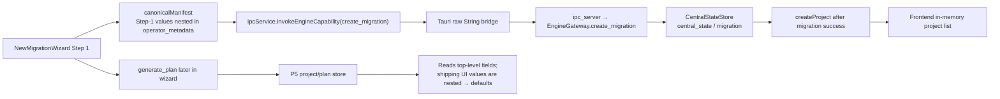

The UI → Tauri → IPC → Python transport is structurally wired. The Rust layer forwards opaque strings and does not deserialize/validate a migration-definition DTO. The Python gateway persists the payload, but does not normalize or validate Step‑1 semantics.

Alternate/bypass paths exist:

- Direct `EngineGateway.create_migration(payload)`.
- Direct P5 `p5_save_project` / `p5_create_plan_draft`.
- Legacy `ManagerAgent.create_project`.
- UI `projectRepository.createProject`, which creates a frontend workspace before its asynchronous backend project call is confirmed.

## 5. Duplicate authority and persistence map

| Authority/store | Identity model | Durable? | Conflict |
|---|---|---|---|
| Gateway `_migrations` | `migration_id` | No, memory mirror | Competes with durable generic migration record |
| `central_state` / `migration` | `migration_id → {status, config}` | Yes | No index/list/retrieval capability for definitions |
| P5 `projects` | `project_id` | Yes | A project is used as migration-like definition, but is not linked to Gateway migration |
| P5 `plans` | `plan_id → project_id` | Yes | Planning authority, but created after definition and defaults shipping UI metadata |
| Frontend `projects[]` | `id` frequently equal to `migration_id` | No | Calls migration a project/workspace |
| Legacy NexusForge `MigrationProject` | `project_id`, optional active migration | Not proven durable | Competing older semantics |

Restart reconstruction:

- Gateway definition: yes by known migration ID through generic state access; no proven public “load migration definition” or definition list path.
- P5 project/plan: yes, through `ProjectStore.load_*`.
- Frontend list/drafts/clones: no.
- Migration/project relationship and move history: no.

## 6. UI/backend drift

- UI collects `description`, `businessOwner`, `environment`, `priority`, `migScope`, and `strategy` under `operator_metadata`; the P5 generation path reads top-level equivalents and therefore writes defaults to its durable project.
- UI’s “Project Workspace” is only a free-text `project_name`; it is neither a `project_id` nor a `workspace_id`.
- UI displays a migration window but hardcodes it and drops it.
- Backend P5 expects `project_id`, top-level `title`, `workspace`, `owner`, `migration_strategy`, and optional `planning_mode`; shipping Step‑1 does not provide them in that shape.
- TS has `MigrationPipeline`, Rust has `ProjectDTO`, Gateway accepts an untyped dictionary, P5 has `MigrationProject`, and legacy Python has another `MigrationProject`. These are competing DTOs/models.
- UI’s three scope strings and two strategy strings conflict with the required M1–M8 intent model.

## 7. Current gap vs future gap

| Gap | Classification |
|---|---|
| Canonical execution mode M1–M8, enum validation, persistence, retrieval, and fail-closed handling | REQUIRED_BY_CURRENT_BOUNDARY |
| Separate migration identity from optional project/workspace membership | REQUIRED_BY_CURRENT_BOUNDARY |
| Real project/workspace IDs and assignment lifecycle | REQUIRED_BY_CURRENT_BOUNDARY |
| Planning mode carried from UI through durable definition | REQUIRED_BY_CURRENT_BOUNDARY |
| Real migration window field | REQUIRED_BY_CURRENT_BOUNDARY |
| Business context field | REQUIRED_BY_CURRENT_BOUNDARY |
| Template association and clone-source lineage | FUTURE_NOT_YET_REQUIRED |
| Existing P5 project/plan/version durable planning foundation | EARLY_FUTURE_IMPLEMENTATION |
| Existing mapping-template implementation | EARLY_FUTURE_IMPLEMENTATION |
| Existing validation-only and CDC runtime capabilities | EARLY_FUTURE_IMPLEMENTATION; not Step‑1 selection support |

## 8. Reusable Logic / Reconstruction Material

The following findings identify potentially reusable implementation material discovered during Step-1 investigation.

They DO NOT select the future canonical architecture and DO NOT authorize preservation of the current files, modules, classes, packages, authorities, DTOs, ownership boundaries, or production call chain.

### 8.1 Durable definition / persistence material

`CentralStateStore` contains potentially reusable SQLite-backed persistence logic, including:

- durable state storage;
- restart-surviving persistence;
- serialization/storage mechanisms;
- generic state retrieval.

This is implementation material only.

It does NOT establish `CentralStateStore` as the future Migration Definition authority.

The reconstructed Migration Definition responsibility may extract this logic, adapt it, combine it with other repository implementations, or replace it entirely after complete forensic reconciliation.

### 8.2 Planning / versioning material

P5 contains potentially reusable implementation logic and concepts around:

- `MigrationPlan`;
- `PlanVersion`;
- `ProjectStore`;
- plan persistence;
- execution-plan persistence;
- plan reconstruction.

This evidence does NOT establish the current P5 package, model hierarchy, persistence ownership, or planner integration as canonical.

Its useful logic should be evaluated alongside all later planning-related findings before reconstruction.

### 8.3 UI / transport material

The existing:

TypeScript → Tauri → IPC → Python

path demonstrates functioning transport mechanisms.

Potentially reusable material includes:

- TypeScript command invocation;
- serialization;
- Tauri bridging;
- IPC transport;
- Python dispatch;
- error propagation.

This does NOT establish the current raw-JSON contract, `EngineGateway`, named-pipe arrangement, or complete transport call chain as the future production architecture.

Transport logic may be extracted or adapted into the reconstructed canonical path.

### 8.4 Identity material

Existing migration-ID generation provides potentially reusable implementation logic.

However, the current repository demonstrates identity conflation between migrations and frontend projects.

The frozen workflow requires these identities to remain conceptually distinct where applicable:

- migration;
- project;
- workspace;
- plan;
- plan version;
- immutable execution plan;
- runtime execution.

The current use of a migration ID as `project_id` is evidence of existing behavior, not an architectural model to preserve.

### 8.5 Project / workspace assignment material

`move_migration_to_project` demonstrates intended reassignment functionality but does not provide a durable assignment/reassignment authority.

The required responsibility still lacks demonstrated:

- durable relationship state;
- reassignment history;
- authorization semantics;
- audit semantics;
- concurrency semantics;
- restart reconstruction.

Whether existing logic contributes to the eventual implementation remains a reconstruction decision.

### 8.6 Template / clone material

Existing `MappingTemplate` and frontend `duplicateProject` behavior provide partial implementation material.

They do not constitute canonical migration-template or migration-clone functionality.

Because template association and clone-source lineage are classified as `FUTURE_NOT_YET_REQUIRED` for Step 1, their absence from the canonical Step-1 boundary is not a current deficiency.

Their discovered logic should remain recorded for later relevant forensic steps.

### 8.7 Current shipping pipeline

NO PRESERVATION DECISION IS MADE FOR THE CURRENT SHIPPING PIPELINE.

The fact that the current path is:

UI → Tauri → IPC → EngineGateway → state/planner

proves only that this path currently exists and performs certain responsibilities.

It does NOT mean reconstruction should preserve:

- `EngineGateway`;
- `CentralStateStore`;
- P5 ownership;
- current DTOs;
- raw JSON boundaries;
- current package placement;
- current dependency direction;
- current call sequencing;
- current migration/project relationship;
- or the complete current production pipeline.

Even a `KEEP_CANDIDATE` classification means only:

> useful implementation material exists here and deserves consideration later.

The canonical production path will be selected only after the complete workflow forensic audit and cross-workflow reconciliation.

## 9. Unresolved questions

- Whether the desktop package always launches the Python IPC daemon in production cannot be proven from the Step‑1 call chain alone.
- Whether existing deployed `artifacts/state.db` rows contain recoverable historical migration definitions was not inspected, to avoid auditing runtime data beyond code evidence.
- Governance rules for allowed reassignment are not implemented in the inspected move handler.

## 10. Step‑1 verdict

**Step 1 is partially present as a UI form and durable raw configuration capture, but it is not a coherent canonical Migration Definition boundary.** It cannot model, validate, store, retrieve, or expose the required M1–M8 execution-mode intent; it conflates migration/project identity; and its shipping metadata contract drifts from the durable P5 planning model.

### Step-1 Forensic Conclusion

**Classification: PARTIALLY IMPLEMENTED / ARCHITECTURALLY NON-CANONICAL**

Step-1 investigation discovered useful implementation material, but no existing implementation or current shipping path is hereby selected as the future canonical Migration Definition architecture.

The Step-1 evidence is now recorded for later cross-workflow reconciliation.

No implementation, repair, deletion, relocation, authority selection, pipeline preservation, or architectural reconstruction is authorized by this finding alone.

### Step-1 Forensic Status

- Workflow responsibility: Migration Definition
- Forensic investigation: COMPLETE
- Raw evidence recorded: YES
- Candidate implementations recorded: YES
- Current/future boundary classified: YES
- Duplicate authorities recorded: YES
- Unresolved questions recorded: YES
- Canonical architecture selected: NO
- Canonical implementation verified: NO
- Reconstruction authorized: NO
- Current pipeline selected for preservation: NO
- Cross-workflow reconciliation pending: YES

# Workflow Step 2 — Source Instance

## 1. Step‑2 Executive Truth

**Step 2 is fragmented and noncanonical.** The shipping wizard provides a relational-database-oriented source form and an IPC connectivity button, but it does not implement real saved-profile selection, new-profile persistence, network-route selection, connector-property configuration, capability retrieval, or explicit source-authority verification.

Useful heterogeneous implementation material exists in P4:

- `ConnectionProfile`, connector manifests/registry, adapters, managed-cloud profiles, and transport routing.
- These components are largely backend-only or test/direct-call reachable.
- The shipping Tauri capability registry does **not** expose the P4 connector-manifest or transport capabilities.

The shipping path prematurely asks for `database_name` at Step 2 and requires it before migration creation. This is unsuitable for connector families where a database/dataset/keyspace/topic/bucket is later-discovered scope.

## 2. Candidate Inventory

| Candidate | Responsibility actually owned | Persistence / restart | Shipping UI reachability | Classification |
|---|---|---|---|---|
| [NewMigrationWizard.tsx](/A:/temp_akaal/akaal_software/src/screens/MigrationModule/NewMigrationWizard.tsx:344) | Source form, password state, Oracle privilege selector, test button, placeholder profile selector | React state only; lost on reload | Yes | RECTIFY_CANDIDATE |
| [connectionRepository.ts](/A:/temp_akaal/akaal_software/src/repositories/connectionRepository.ts:6) | Frontend `ProjectConnection` list/add/remove | Memory only; no backend call | Indirectly from workspace, not wizard profile selector | RECTIFY_CANDIDATE |
| [ConnectionProfile](/A:/temp_akaal/akaal/connectors/profile.py:38) | Reusable profile-shaped model: endpoint, auth ref, TLS, SSH, driver options | No store/list/update/delete implementation | No | MERGE_CANDIDATE |
| [UniversalConnectorRegistry](/A:/temp_akaal/akaal/connectors/registry.py:20) | Process-local connector and manifest registry | Rebuilt in process; no durable registry mutations | Backend direct only | KEEP_CANDIDATE |
| [UniversalCapabilityManifest](/A:/temp_akaal/akaal/connectors/manifest.py:27) | Static connector support, role, auth mechanisms, proof/support states | Code-defined/in-memory | Backend direct only | KEEP_CANDIDATE |
| [LegacyAdapterUniversalBridge](/A:/temp_akaal/akaal/connectors/bridge.py:40) | Converts P4 profile into legacy `ConnectionConfig`; test/connect/error classification | Active configuration/adapter only in memory | No shipping P4 path | MERGE_CANDIDATE |
| [EngineGateway.test_connection](/A:/temp_akaal/akaal/gateway/engine_gateway.py:475) | Shipping IPC test endpoint, limited to Oracle/PostgreSQL/MySQL/MSSQL | No durable test result/profile | Yes | RECTIFY_CANDIDATE |
| [ConnectionAuthority](/A:/temp_akaal/akaal/migration/target_identifier.py:85) | Sanitized source/target endpoint identity and fingerprint | Embedded only in migration config after creation | Indirectly, after later workflow launch | MERGE_CANDIDATE |
| [InProcessCredentialVault](/A:/temp_akaal/akaal/core/credential_vault.py:17) | In-memory secret lookup by reference | Lost on Python restart | Indirectly | KEEP_CANDIDATE |
| [CloudManagedDatabaseProfile](/A:/temp_akaal/akaal/cloud/models.py:50) | Cloud resource/endpoint/auth/network-profile model | No durable profile store | No | EARLY_FUTURE_IMPLEMENTATION |
| Cloud providers: [AWS](/A:/temp_akaal/akaal/cloud/aws_provider.py:18), [Azure](/A:/temp_akaal/akaal/cloud/azure_provider.py:17), [GCP](/A:/temp_akaal/akaal/cloud/gcp_provider.py:17), [OCI](/A:/temp_akaal/akaal/cloud/oci_provider.py:18) | Managed DB discovery and profile construction | Returned in memory | No shipping caller proven | EARLY_FUTURE_IMPLEMENTATION |
| [TransportPath / TransportHop](/A:/temp_akaal/akaal/transport/models.py:110) | Direct, SSH/bastion, proxy, private endpoint, remote-agent route model | In-memory only | No | EARLY_FUTURE_IMPLEMENTATION |
| [TransportManager](/A:/temp_akaal/akaal/transport/transport_manager.py:38) | Route resolution, route preflight, opening sessions | Active sessions/tunnels in memory | No shipping caller proven | EARLY_FUTURE_IMPLEMENTATION |
| [DiscoveryOrchestrator](/A:/temp_akaal/akaal/scout/orchestrator/discovery_orchestrator.py:28) | Later discovery connection plus read-only permission check | Discovery cache is memory by default | Reached through later preflight, not Step 2 | KEEP_CANDIDATE |
| Adapter registry and concrete adapters | Physical system connection/discovery/auth logic | Per-adapter connection only in memory | Shipping test uses only 4 relational mappings | MERGE_CANDIDATE |
| [archive/UI `MigrationModel`](/A:/temp_akaal/archive/UI_clone/src/types/models.ts:18) | Historical UI-only migration model | None | No | REMOVE_CANDIDATE |

## 3. Source‑Instance Domain / Field Matrix

| Field / Concept | UI | IPC / DTO | Backend model | Persistence | Validation | Runtime consumer | Workflow requirement | Verdict |
|---|---|---|---|---|---|---|---|---|
| `connection_profile_id` | Placeholder selector has no state/change handler | — | `ConnectionProfile.connection_id` | No profile store | Generated if model used | P4 bridge only | REQUIRED | BUILD_REQUIRED |
| Profile name | Placeholder only | — | `display_name` | None | None | P4 only | REQUIRED | BUILD_REQUIRED |
| Connector ID/type | Hardcoded `DatabaseEngine` list | `system_type` string | `SystemType`; P4 `connector_id` | Migration config only after creation | Gateway silently defaults unknown type to PostgreSQL | Adapters | REQUIRED | RECTIFY_CANDIDATE |
| Source role | Implicit source form | No explicit role in source test | P4 role is static manifest role; `ConnectionAuthority.role` | Embedded migration config | Not checked by shipping test | Create-migration authority | REQUIRED | BUILD_REQUIRED |
| Host/account/project/cluster | Host only | `host` | `ConnectionConfig.host`; cloud profile has provider IDs | Migration config only | Minimal/nonempty in P4; shipping defaults host to localhost | Adapter connection | REQUIRED | RECTIFY_CANDIDATE |
| Port | Text input | `port` | `ConnectionConfig.port` | Migration config only | `int()` can throw; P4 requires positive port except storage/HDFS | Adapter connection | REQUIRED | RECTIFY_CANDIDATE |
| Service/instance ID | SQL Server input; Oracle source instance state | Sent as `instance_name`, but Gateway test does not apply it as distinct endpoint property | `ConnectionAuthority` aliases it into `database` | Migration config only | No service/instance semantic validation | Oracle adapter uses `database_name` as DSN service | REQUIRED | RECTIFY_CANDIDATE |
| Authentication mode | Username/password; Oracle normal/SYSDBA; wallet text | Password sent plaintext over IPC | `AuthenticationMechanism`; legacy `ConnectionConfig`; cloud `auth_mode` | Vault references in migration config; secret itself only in memory | No shipping auth-mode enum | Adapters/vault | REQUIRED | RECTIFY_CANDIDATE |
| Credential/secret ref | Not operator-selected | Gateway derives refs | `credentials_ref` | Reference persisted only with later migration | Missing vault entry fails closed at resolution | Runtime adapters | REQUIRED | RECTIFY_CANDIDATE |
| TLS/security properties | Source UI has none; Oracle wallet text is dropped | Source test does not consume wallet/TLS | P4 TLS fields; cloud TLS fields | No profile persistence | P4 represents but shipping path ignores | P4 bridge/transport | REQUIRED | BUILD_REQUIRED |
| Network route | — | — | P4 `TransportPath`; profile SSH fields | No durable route store | Transport validates loops/fingerprints | Direct API only | REQUIRED where applicable | BUILD_REQUIRED |
| Connector properties | — | No generic properties payload from wizard | `driver_options`, `extra`, cloud `extra_metadata` | No profile persistence | Mostly untyped dicts | Adapters | REQUIRED | BUILD_REQUIRED |
| Database/catalog | Required visible source field | `database_name` | Every legacy `ConnectionConfig` has it | Migration config only | Gateway create migration rejects missing source database | Adapters/discovery | Must be deferred where connector semantics allow | RECTIFY_CANDIDATE |
| Schema/namespace | Not Step‑2 UI, though `ConnectionProfile.schema_name` exists | — | Profile and legacy adapter config can carry it | None | None | Adapter bridge | Must be deferred | RECTIFY_CANDIDATE |
| Capability manifest | Not shown/retrieved | Python supports APIs, Rust does not register them | `UniversalCapabilityManifest` | Code-defined only | Unknown capability fails closed | Compatibility engine/P4 direct callers | REQUIRED | RECTIFY_CANDIDATE |
| Endpoint-negotiated capabilities | — | — | Scout capability inventory later | Discovery-session only | Depends on later actual connection | Scout | REQUIRED | BUILD_REQUIRED |
| Connectivity-test result | Local session `sourceTested` / raw result | Raw JSON response | Gateway dict / P4 `ConnectionTestResult` | None | Limited adapter connect/version only | UI gate toward preflight | REQUIRED | RECTIFY_CANDIDATE |
| Source-authority result | UI labels connection “Verified” | — | Discovery context `read_only_verified` later | Discovery report/cache, not Step‑2 source profile | Later provider permission check | Scout | REQUIRED | BUILD_REQUIRED |
| Created/updated metadata | — | — | Profile/cloud model created timestamps | No durable profile authority | None | None | REQUIRED | BUILD_REQUIRED |

## 4. Connector‑Native Endpoint Boundary Matrix

| Connector family | Step‑2 endpoint/account/instance concept | Later discovery hierarchy | Current implementation behavior | Verdict |
|---|---|---|---|---|
| Oracle | Host + port + service/PDB or wallet/TNS service; user/privilege | Service/PDB → schemas → objects | Wizard collects host/port/database/instance/user/password; Gateway aliases service/instance into `database`; wallet UI input is not sent | Prematurely and ambiguously conflated |
| PostgreSQL | Server endpoint plus connection database; database is connector-native connection boundary | Database → schemas → tables | Wizard forces database field; Gateway requires it for migration; P4 profile also includes schema | Partially connector-native, but no distinction from later scope |
| MySQL/MariaDB | Server endpoint + database | Database → tables | Wizard/database-required Gateway path | Prematurely binds one database |
| SQL Server | Server/host + optional named instance + database | Server/instance → databases → schemas → objects | UI has instance field, but test config passes database only; Gateway does not create a named-instance-specific connection representation | Incomplete |
| Db2 | Server/database connection boundary | Database/catalog/schema/object hierarchy | Adapter exists; shipping engine list contains DB2 but Gateway test maps unknown DB2 to PostgreSQL | Not shipping-representable truthfully |
| Snowflake | Account/URL, user/auth, warehouse/role; database/schema are later logical scope | Account → databases → schemas → tables | Adapter supports account-like host but its legacy config uses `database_name`; shipping test maps Snowflake to PostgreSQL | Boundary collapsed/unreachable |
| BigQuery | GCP project/account, location/auth | Project → datasets → tables | Adapter treats `host` as project ID and `database_name` as dataset; shipping wizard cannot express project/location/ADC | Premature dataset selection |
| Redshift / Databricks | Cluster/SQL warehouse endpoint/account | Cluster/warehouse → database/catalog/schema/tables | Adapters exist but shipping test does not select them | Backend-only material |
| MongoDB | Cluster URI/hosts and auth DB; database/collections later | Cluster → databases → collections | Adapter connects to a configured `database_name` or defaults `test` | Premature/default database behavior |
| Cassandra/ScyllaDB | Cluster contact points/auth | Cluster → keyspaces → tables | Adapter uses `database_name` as keyspace or defaults `system` | Premature keyspace selection |
| Neo4j | Bolt endpoint/cluster/auth; graph database may be connection setting | DB → labels/relationship types | Adapter supports endpoint but generic model lacks graph-specific properties | Partial backend-only |
| Redis/KeyDB | Endpoint/cluster plus logical DB index | Cluster/node → logical DB → keys | Generic database field is overloaded as DB index/value | Semantically overloaded |
| Elasticsearch/OpenSearch | Cluster endpoint/auth | Cluster → indices → documents | Adapters exist; shipping test cannot select them | Backend-only |
| Kafka/Confluent/MSK | Bootstrap-server cluster plus SASL/TLS/auth | Cluster → topics → partitions/records | Adapter uses `database_name` as a topic if supplied and returns synthetic topic names otherwise | Premature topic selection and unsafe discovery evidence |
| Kinesis/Event Hubs/Pub/Sub | Cloud account/namespace/project plus stream/event hub/subscription | Account/project → streams/topics/subscriptions | Generic config overloads `database_name` for stream/topic/subscription | Premature scope conflation |
| S3/GCS/Azure Blob/MinIO | Account/bucket service endpoint and cloud credentials | Account → buckets/containers → prefixes/objects | Adapters use `database_name` as bucket/container when populated | Premature container/bucket selection |
| HDFS | Namenode/cluster endpoint and auth | Cluster → directories → files | P4 profile permits no-host family exception, but shipping wizard cannot represent it | Not shipping-representable |

## 5. Current Call / Data Flows

```mermaid
flowchart LR
  UI["Step 2 source form"] --> STATE["React state: sourceHost/sourceDbName/sourcePass"]
  STATE --> TEST["handleTestSource()"]
  TEST --> TS["ipcService.invokeEngineCapability('test_connection')"]
  TS --> TAURI["Tauri raw-string command"]
  TAURI --> PIPE["Named-pipe transport"]
  PIPE --> IPC["ipc_server.handle_capability_request"]
  IPC --> GW["EngineGateway.test_connection"]
  GW --> LEGACY["ConnectionConfig + create_adapter"]
  LEGACY --> RDBMS["Oracle / PostgreSQL / MySQL / MSSQL adapter"]
  RDBMS --> RESULT["Ephemeral result, vault entries if password supplied"]
  RESULT --> STATE
```

Actual shipping alternate flow:

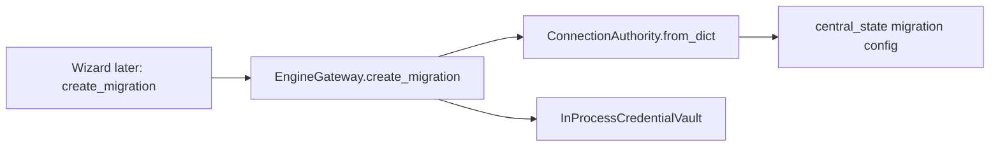

This is not profile creation. It persists only migration-local configuration after later workflow launch.

P4 bypass paths:

- Direct `UniversalConnectorRegistry` → P4 bridge → `ConnectionProfile`.
- Direct cloud-provider discovery → `CloudManagedDatabaseProfile` → resolver.
- Direct `TransportManager.resolve_transport_path()` / `open_transport_session()`.
- Direct Scout `DiscoveryOrchestrator`, which checks source read-only permissions later.

## 6. Saved Connection / Profile Persistence Map

| Authority / Store | Identity | Data owned | Durable? | Restart reconstruction | Conflict / overlap |
|---|---|---|---|---|---|
| Frontend `ConnectionRepository` | `conn-${Date.now()}` | Project-scoped display connection, fake vault URI, status | No | No | Competes conceptually with P4 profile |
| P4 `ConnectionProfile` | `connection_id` / `profile_id` | Endpoint, auth ref, TLS, SSH, options | No store | No | Strong reusable profile model without authority |
| Gateway test result | Deterministic hash of endpoint/user | Test response, connection ID | No | No | May resemble a profile ID but is not one |
| `InProcessCredentialVault` | `credential_ref` | Password/extra | No | No, cleared on daemon restart | Reference may survive migration config while secret does not |
| `central_state:migration` | `migration_id` | Later full migration config with source authority | Yes | Yes by known migration ID | Migration-local, not reusable profile |
| Cloud managed profile objects | `cmp-*`, cloud resource ID | Cloud resource/endpoints/TLS/network/auth metadata | No store | No | Separate profile shape |
| Transport manager | Path/session IDs | Route and active socket/tunnel | No | No | Separate network-route authority |
| Connector registry | Connector ID | Static connector/manifests | Process-local code bootstrap | Yes only by re-bootstrap | Connector definition, not concrete saved connection |

There is **no proven real durable saved connection-profile authority**: no profile CRUD, list/retrieve API, database table, frontend persistence, or reusable source/target profile assignment.

## 7. Authentication & Secret Handling Matrix

| Auth family / evidence | Current handling | Persistence / redaction evidence | Step‑2 status |
|---|---|---|---|
| Username/password | Shipping wizard sends plaintext password over IPC; Gateway places it in in-process vault after successful test | Vault is memory-only; create-migration removes plaintext before `central_state` write | Partially implemented; no durable profile binding |
| Oracle SYSDBA/SYSOPER | UI offers Normal/SYSDBA only; Oracle adapter recognizes SYSDBA/SYSOPER | `privilege_mode` is propagated to adapter; wallet text field is not propagated | Partial |
| Oracle wallet/TNS | Adapter reads `ORACLE_WALLET_PATH` and `ORACLE_TNS_ENTRY` environment variables | UI wallet field is local and unused | UI/backend drift |
| TLS certificate | P4 profile supports CA/client cert refs and hostname verification | No shipping source TLS controls; generic source test ignores them | Backend model only |
| Bearer/OAuth/API key | Enumerated in `AuthenticationMechanism`; specific adapters read raw `extra` values | No shipping auth-mode contract or profile persistence | Backend-only |
| AWS credentials/IAM | S3/Kinesis/cloud provider code accepts keys/session token; AWS managed profile reports `IAM_ROLE` | Raw credentials held in object memory; redaction helpers exist | EARLY_FUTURE_IMPLEMENTATION |
| Azure service principal / managed identity | Azure provider accepts client ID/secret/tenant; taxonomy names managed identity | No profile store or shipping UI | EARLY_FUTURE_IMPLEMENTATION |
| GCP ADC/service account | BigQuery uses SDK default credentials; GCP provider can consume service-account JSON | No shipping UI/typed profile selection | EARLY_FUTURE_IMPLEMENTATION |
| OCI config/private key/instance principal | OCI provider supports config file or raw key material and reports auth mode | Redacts key-related errors; no shipping UI | EARLY_FUTURE_IMPLEMENTATION |
| Kafka SASL / Event Hubs connection string | Adapters read raw `extra` values and redact selected error strings | No source UI property editor | Backend-only |

Security evidence:

- [ConnectionProfile.to_sanitized_dict](/A:/temp_akaal/akaal/connectors/profile.py:120) and [TransportHop.to_sanitized_dict](/A:/temp_akaal/akaal/transport/models.py:141) deliberately omit raw secrets.
- [InProcessCredentialVault](/A:/temp_akaal/akaal/core/credential_vault.py:17) fails closed when a referenced secret is absent.
- The shipping wizard nevertheless retains `sourcePass` in React state and sends it as JSON through Tauri/IPC. This is transport exposure, even though logging avoids displaying the password.
- [EngineGateway.test_connection](/A:/temp_akaal/akaal/gateway/engine_gateway.py:475) returns raw exception text in `message`; adapter redaction quality varies by adapter.

## 8. Network Route Findings

| Mechanism | Implementation / ownership | Durable? | Shipping reachability | Finding |
|---|---|---|---|---|
| Direct TCP | [TransportManager](/A:/temp_akaal/akaal/transport/transport_manager.py:38) | No | Indirect only through adapters, not route system | Present |
| SSH/bastion | [SSHForwardingTunnel](/A:/temp_akaal/akaal/transport/ssh_runtime.py:18), profile SSH fields | No | No | Host-key mismatch and missing SSH secret fail closed; forwarding implementation connects directly to target after local bind rather than demonstrating authenticated SSH hop establishment |
| Multi-hop SSH | `TransportPath` + `TransportManager` | No | No | Topology loop checks exist |
| HTTP CONNECT / SOCKS5 proxy | [EnterpriseProxyRuntime](/A:/temp_akaal/akaal/transport/proxy_runtime.py:34) | No | No | Supports proxy authentication and classified errors |
| Private endpoint / VPC/VNet/VCN metadata | Cloud profile + transport model | No | No | Represented, but not user-selectable or persisted |
| VPN-routed | `TransportMethod.VPN_ROUTED` enum | No | No proven opening/configuration path | Representation only |
| Remote agent | [RemoteAgentBoundaryManager](/A:/temp_akaal/akaal/transport/agent_boundary.py:43) | No | No | In-memory agent registration; fails closed if unavailable/unauthenticated |
| Route profile CRUD | — | — | — | Missing |

## 9. Connectivity‑Test Semantics

| Test path | TCP | Auth | Session | Metadata | Read authority | Write authority | Capability negotiation | Failure semantics |
|---|---:|---:|---:|---:|---:|---:|---:|---|
| Shipping `EngineGateway.test_connection` | Indirectly via adapter | Usually, for four mapped RDBMS types | Yes if adapter marks connected | Version attempt only | No | No | No | Returns `connected:false`; exposes exception string; unknown type becomes PostgreSQL |
| P4 `LegacyAdapterUniversalBridge.test_connection` | Indirectly | Adapter dependent | Yes | Version attempt only | No | No | Static manifest separate | Returns classified connector error |
| Transport preflight | DNS and route preflight | SSH host-key only in relevant path | No database session | No | No | No | No | Structured transport failure class |
| Scout discovery | Indirectly | Adapter dependent | Yes | Yes | Yes, through `check_read_only_permissions()` | No | Endpoint-specific later capability detection | Records errors/warnings; continues stages after connection error |
| S3 adapter `check_permissions` | SDK path | AWS auth at client/request time | Client creation | Bucket/list metadata | Bucket/list authority | No | No | Fails through SDK |
| BigQuery adapter `check_permissions` | SDK path | ADC/service account | Client | Dataset read | Dataset metadata authority | No | No | Fails through SDK |
| Kafka `check_permissions` | Admin-client connection | Kafka client setup, but no shipping SASL config | Yes | Topic discovery later | Returns `True` without ACL test | No | No | Authority claim is not trustworthy |

A shipping “Source Connection Verified” means only that the limited gateway test returned `connected:true`. It does **not** prove source metadata access, read authority, CDC/log authority, capability negotiation, or connector-role suitability.

## 10. Capability Discovery Findings

P4 contains meaningful static capability material:

- [UniversalCapabilityManifest](/A:/temp_akaal/akaal/connectors/manifest.py:27) records connector family, source/target role, supported authentication mechanisms, TLS, schema discovery, bulk read/write, streaming, CDC, checkpoints, restrictions, required privileges, proof level/state, implementation state, and support state.
- Unknown capability queries return `UNKNOWN_NOT_PROVEN`; stub/absent connectors fail closed.
- [UniversalConnectorRegistry](/A:/temp_akaal/akaal/connectors/registry.py:20) supports role-filtered manifest listing.
- [EngineGateway.get_connector_manifest](/A:/temp_akaal/akaal/gateway/engine_gateway.py:417) and `list_connector_manifests` implement backend access.

However, Tauri’s shipping [CapabilityRegistry](/A:/temp_akaal/akaal_software/src-tauri/src/engine_bridge/capability_registry.rs:14) does not register `get_connector_manifest`, `list_connector_manifests`, or `evaluate_connector_compatibility`. Thus the desktop cannot invoke them through its guarded bridge.

**Can AKAAL determine what this particular selected source endpoint can actually do?**

**Not at Step 2.** It can determine static, connector-type-level claims through P4 manifests. Endpoint-specific capability detection exists only later in Scout’s [CapabilityDetectionStage](/A:/temp_akaal/akaal/scout/pipeline/capability_stage.py:14), after actual discovery connection setup. The shipping source test does neither manifest retrieval nor endpoint negotiation.

## 11. Source Authority Verification

| Authority | Current evidence | Where verified | Step‑2 result |
|---|---|---|---|
| Authentication | Adapter connection success | Shipping test, adapter-dependent | Partial and limited |
| Session establishment | Adapter `connect()` | Shipping test | Partial |
| Metadata authority | Adapter discovery calls | Scout / later preflight | Deferred; not Step‑2 verified |
| Read-only/source-read authority | `provider.check_read_only_permissions()` | [DiscoveryOrchestrator](/A:/temp_akaal/akaal/scout/orchestrator/discovery_orchestrator.py:88) | Deferred |
| CDC/log/position access | Static manifest and later connector paths | P4/static or CDC operations | Not Step‑2 verified |
| Object-store list/read | Adapter `check_permissions()` | Direct adapter only | Not shipping Step‑2 |
| Stream consume/read | Kafka check returns unconditional `True` after connect | Direct adapter only | Not reliable authority proof |
| Source identity | `ConnectionAuthority` fingerprint | Created only with migration | Identity representation, not permission proof |

## 12. Duplicate Authority Map

| Overlap | Implementations | Semantic overlap |
|---|---|---|
| Connection model | TS `ProjectConnection`; P4 `ConnectionProfile`; legacy `ConnectionConfig`; `ConnectionAuthority`; cloud profile | Each contains endpoint/auth-like fields, but none is the durable reusable profile authority |
| Profile storage | Frontend repository; migration `central_state`; P4 model | Frontend is local-only; migration record is not reusable; P4 has no store |
| Connection tests | Shipping Gateway; P4 bridge; individual adapters; Scout | Different proof levels and return shapes |
| Connector registration | Adapter registry; universal connector registry; Tauri capability registry | Adapter registry resolves concrete adapters; universal registry advertises static manifests; Tauri registry gates IPC commands but omits P4 APIs |
| Auth/secrets | Wizard React state; adapter `extra`; profile `_raw_credentials`; transport hop `_raw_credentials`; in-process vault | Multiple in-memory secret channels |
| Network configuration | `ConnectionProfile` SSH fields; cloud profile route metadata; transport path/hops; legacy config `extra` | Same routing facts represented inconsistently |
| Cloud profiles | Provider-returned `CloudManagedDatabaseProfile`; generic `ConnectionProfile`; `ConnectionConfig` resolver output | Cloud model preserves resource identity, then flattens into generic DB config |

## 13. UI / Backend Drift

- “Saved Profiles” is visually present in [NewMigrationWizard.tsx](/A:/temp_akaal/akaal_software/src/screens/MigrationModule/NewMigrationWizard.tsx:1532), but it has no value, handler, source list, retrieval, or persistence path.
- “New Custom Connection” is only an `<option>`; it creates no profile.
- The wizard supports only a hardcoded `DatabaseEngine` union; P4 supports warehouses, NoSQL, streaming, object storage, HDFS, cloud, and managed profiles.
- `supported_engines` can dynamically query manifests, but the UI keeps a separate hardcoded list and falls back to relational engines.
- Source wallet text is collected but omitted from `handleTestSource()` and the later manifest.
- Source TLS, client certificates, token/IAM/OAuth auth, SSH/bastion/proxy/private endpoint, cloud account/project IDs, region, and connector-specific properties cannot be expressed.
- Gateway `test_connection` recognizes Oracle/PostgreSQL/MySQL/MSSQL only; all other system types silently become PostgreSQL.
- UI calls a database field part of connection establishment for every engine; adapter semantics use that field differently across BigQuery, Kafka, S3, Cassandra, Redis, and cloud systems.
- `ConnectionRepository.addConnection()` reports `sslStatus: 'Enforced'` and synthesizes a vault URI without actual TLS/vault interaction.
- Test success is UI-local and occurs before profile persistence because no profile persistence exists.
- Source password persists in wizard/session memory after a test and is later reused for create-migration.

## 14. Failure / Fail‑Closed Matrix

| Condition | Current behavior | Fail closed? |
|---|---|---|
| Unknown connector in P4 registry | `None` / unregistered capability fails closed | Yes |
| Unknown connector in shipping test | Silently mapped to PostgreSQL | No |
| Missing P4 host/port | P4 bridge validation returns errors | Yes at P4 direct path |
| Missing shipping host/database/user at create migration | Create migration rejects source authority | Yes, but too late and database is incorrectly mandatory generically |
| Invalid credentials | Adapter connection error returned | Generally yes for test; error redaction varies |
| Unreachable endpoint | Adapter error returned | Generally yes |
| Unsupported auth mode | No shipping auth type validated; P4 manifest is static only | No coherent enforcement |
| Bad connector properties | No UI properties; arbitrary dict use is largely untyped | No |
| Invalid route | Transport detects path loops / failed preflight | Yes in direct transport path |
| Missing secret after daemon restart | Vault resolution throws `CREDENTIAL_RESOLUTION_FAILED` | Yes |
| Capability mismatch | P4 manifest can fail closed; shipping path does not consult it | Not on shipping path |
| Insufficient read authority | Detected later by Scout warning/check | Not Step‑2 fail closed |
| Stale/deleted profile | No durable profile mechanism | Not applicable; capability missing |
| Corrupt persisted profile | No profile persistence | Not applicable; capability missing |

## 15. Current Gap vs Future Gap

| Gap / Capability | Classification |
|---|---|
| Durable reusable saved connection-profile CRUD/list/retrieve/delete | REQUIRED_BY_CURRENT_BOUNDARY / BUILD_REQUIRED |
| Wizard profile selection wired to a real authority | REQUIRED_BY_CURRENT_BOUNDARY / BUILD_REQUIRED |
| Heterogeneous endpoint model independent from later discovery scope | REQUIRED_BY_CURRENT_BOUNDARY / BUILD_REQUIRED |
| Explicit source role and source-authority result | REQUIRED_BY_CURRENT_BOUNDARY / BUILD_REQUIRED |
| Dynamic connector-specific property model/surface | REQUIRED_BY_CURRENT_BOUNDARY / BUILD_REQUIRED |
| Shipping capability retrieval for selected source connector | REQUIRED_BY_CURRENT_BOUNDARY / RECTIFY_CANDIDATE |
| Endpoint-specific capability/authority negotiation before Step 4 | REQUIRED_BY_CURRENT_BOUNDARY / BUILD_REQUIRED |
| Source route selection and durable route association | REQUIRED_BY_CURRENT_BOUNDARY / BUILD_REQUIRED |
| P4 static manifest/registry logic | EARLY_FUTURE_IMPLEMENTATION |
| P4 managed cloud profiles/providers | EARLY_FUTURE_IMPLEMENTATION |
| P4 transport paths, proxy, bastion, remote agent mechanics | EARLY_FUTURE_IMPLEMENTATION |
| Full Zero Trust, SPIFFE/SPIRE, certificate lifecycle, fleet/network orchestration | FUTURE_NOT_YET_REQUIRED |
| Full cloud/private-connectivity administration platform | FUTURE_NOT_YET_REQUIRED |

## 16. Reusable Logic / Reconstruction Material

- [UniversalCapabilityManifest](/A:/temp_akaal/akaal/connectors/manifest.py:27) contains potentially reusable static connector capability, role, proof, support-state, and fail-closed capability-query logic.
- [ConnectionProfile](/A:/temp_akaal/akaal/connectors/profile.py:38) contains potentially reusable profile fields and sanitized serialization.
- [LegacyAdapterUniversalBridge](/A:/temp_akaal/akaal/connectors/bridge.py:40) contains potentially reusable adaptation and classified test-result logic.
- [CloudManagedDatabaseProfile](/A:/temp_akaal/akaal/cloud/models.py:50) contains potentially reusable cloud resource identity, endpoint topology, TLS, and private-network metadata.
- Cloud providers contain potentially reusable SDK-based account/resource discovery and secret-redaction logic.
- [TransportPath](/A:/temp_akaal/akaal/transport/models.py:158) and [TransportManager](/A:/temp_akaal/akaal/transport/transport_manager.py:38) contain potentially reusable route models, diagnostics, DNS/TCP preflight, proxy, and remote-agent mechanics.
- [InProcessCredentialVault](/A:/temp_akaal/akaal/core/credential_vault.py:17) contains potentially reusable non-persistent secret-reference resolution and fail-closed missing-secret behavior.
- The adapter registry and individual adapters contain potentially reusable connector-native session, discovery, and permission-check logic.
- [DiscoveryOrchestrator](/A:/temp_akaal/akaal/scout/orchestrator/discovery_orchestrator.py:28) contains potentially reusable later-stage read-only verification logic, but its placement is beyond the Step‑2 boundary.
- TS → Tauri → IPC → Python forwarding contains potentially reusable transport mechanics, though it currently transmits opaque JSON and does not enforce a source-profile DTO.

## 17. Unresolved Questions

- No shipping `Migration → Connections` product surface was located that proves durable profile CRUD or P4 profile reuse.
- No evidence proves a durable cloud-profile or transport-route store.
- No evidence proves that the desktop daemon startup always exposes the Python P4 APIs in a production package.
- No endpoint-specific capability negotiation was found before Scout; no claim is made that none could exist outside the inspected code.
- Adapter test/proof quality across every connector was not execution-tested; conclusions above are source-code evidence only.
- Whether the `oracleWallet` field is intended for a future payload was not provable; it is not consumed in the inspected shipping path.

## 18. Step‑2 Verdict

AKAAL contains substantial **implementation material** for heterogeneous source connectivity—P4 manifests, adapters, cloud profiles, route primitives, and sanitization—but it does not currently compose that material into a coherent Step‑2 source-instance workflow.

What exists:

- A shipping relational connection form and basic IPC test.
- Static heterogeneous connector manifests and adapter registration.
- Backend-only cloud and network-route representations.
- Later Scout read-only permission verification.

What does not exist on the shipping Step‑2 path:

- A real saved/new reusable source-profile lifecycle.
- Correct generic endpoint/account modeling across connector families.
- Source network-route selection.
- Dynamic connector-specific configuration.
- Capability retrieval for the selected source.
- Explicit source-authority verification.
- Durable profile reconstruction.

Database/schema/object selection is not cleanly deferred: the generic `database_name` is collected and later mandatory even for systems where it represents a dataset, keyspace, topic, bucket, or later-discovered scope. The UI and backend do not agree on supported connector breadth, authentication, profile persistence, or capability semantics.

**Step‑2 forensic conclusion: AKAAL has fragmented, partially reusable heterogeneous connectivity implementation material, but the shipping Step‑2 workflow cannot yet establish a reusable, authenticated, network-reachable, capability-aware, authority-verified source instance cleanly before discovery.**

No Step‑2 implementation changes are authorized by this finding alone.

# Whole-Repository Forensic Completeness Sweep — Steps 1 & 2 Only

Investigation complete. No files were modified and no Git actions were performed. This sweep stops before Step 3.

## Part A — Repository Forensic Coverage Map

| Repository world | Location | Searched | Step 1 relevance | Step 2 relevance | Finding |
|---|---|---:|---|---|---|
| Shipping desktop UI / Tauri | `akaal_software` | Yes | Yes | Yes | Real current UI → Tauri → Python path |
| Current AKAAL platform | `akaal` | Yes | Yes | Yes | Current gateway, persistence, connectors, planner, transport |
| Merged NexusForge Core | `akaal/core`, `akaal/agents`, `akaal/engine`, `akaal/gateway`, `akaal/orchestration` | Yes | Yes | Yes | No separate NexusForge root exists; legacy code is merged under current `akaal` |
| Legacy migration/runtime world | `akaal/migration`, `akaal/workflow`, `akaal/replication` | Yes | Yes | Yes | Alternate in-memory project/session and runtime-authority paths |
| Archived Next UI | `archive/UI` | Yes | Yes | Yes | Mock/in-memory migration and database screens |
| Archived UI clone/security world | `archive/UI_clone` | Yes | Yes | Yes | Mock UI plus isolated browser-local secret-management subsystem |
| Tests and fixtures | `tests`, root `live_*`, scripts | Yes | Evidence only | Evidence only | Tests instantiate models directly; do not establish a shipping authority |
| Runtime/generated data | `artifacts`, `akaal_workspace`, `.akaal` | Yes | Evidence only | Evidence only | Existing SQLite/log/checkpoint artifacts; not source implementations |
| Docs/reports/project/deploy/benchmarks | `docs`, `reports`, `project`, `deploy`, `benchmarks` | Yes | No implementation authority found | No implementation authority found | Context only, not a Step-1/2 model/store/UI |

Coverage claim: **YES**. All repository worlds above were searched for semantic equivalents, including the archived UIs and merged NexusForge implementation. Dependency build output was excluded as non-source.

## Cross-World Duplicate Authority Analysis

| Concern | Competing authorities | Result |
|---|---|---|
| Migration definition | Shipping gateway state record; P5 `MigrationProject`; legacy `MigrationProject`; engine `MigrationSpecification`; archived UI `MigrationModel`; frontend `MigrationPipeline` | Multiple incompatible authorities; none is a complete canonical Step-1 definition |
| Project/workspace | Gateway `create_project`; P5 persisted project; legacy in-memory project; frontend repository “project” | Conflicting IDs, field sets, and durability |
| Source instance | Migration-scoped `ConnectionAuthority`; legacy `ConnectionConfig`; P4 `ConnectionProfile`; cloud profile; archived `DBConnection`; TS `ProjectConnection` | Multiple representations; no durable reusable source-profile authority |
| Credentials | Python `InProcessCredentialVault`; legacy config `extra.password`; archived clone `SecretManager`/providers | Shipping credential material is process-memory only; archive secret manager is disconnected from shipping |
| Execution intent | `MigrationStrategy`; P5 `PlanningMode`; validation-only execution enum; intelligence recommendation string | None represents canonical M1–M8 operator intent |

## STEP-1 FORENSIC LEDGER AMENDMENT

### Newly discovered material

| Candidate | Evidence | Step-1 finding | Classification |
|---|---|---|---|
| Engine-native `MigrationSpecification` / `AkaalMigrationEngine.register_specification` | [engine/spec.py](/A:/temp_akaal/akaal/engine/spec.py), [engine/api.py](/A:/temp_akaal/akaal/engine/api.py) | Immutable in-memory execution specification with migration ID/name, project name, endpoint authorities and scope. Its SQLite record persists only a sparse `spec_json` (`migration_id`, source/target fingerprints, scope), not the complete specification. No shipping UI/Tauri caller was found. | `EARLY_FUTURE_IMPLEMENTATION` |
| Engine SQLite state | [engine/state.py](/A:/temp_akaal/akaal/engine/state.py) | Stores lifecycle/partition/batch execution state. It is restart-reconstructible but does not preserve a Step-1 definition. | `FUTURE_NOT_YET_REQUIRED` |
| Legacy `MigrationProject` | [core/models/project.py](/A:/temp_akaal/akaal/core/models/project.py), [agents/manager/manager_agent.py](/A:/temp_akaal/akaal/agents/manager/manager_agent.py), [core/state/global_state.py](/A:/temp_akaal/akaal/core/state/global_state.py) | Requires project name, source/target configs and `MigrationStrategy`; generates separate project/session/migration IDs and holds state history. Global state is process-memory only. Project is mandatory, so it violates independent migration identity. | `MERGE_CANDIDATE` |
| Upload-oriented Gateway request/session | [gateway/models/gateway_request.py](/A:/temp_akaal/akaal/gateway/models/gateway_request.py), [gateway/models/gateway_session.py](/A:/temp_akaal/akaal/gateway/models/gateway_session.py) | Defines requester, optional project name, arbitrary metadata and legacy strategy for file uploads. It is not the shipping database-migration definition path and has no durable session store. | `FUTURE_NOT_YET_REQUIRED` |
| Mapping template API | [engine_gateway.py](/A:/temp_akaal/akaal/gateway/engine_gateway.py) `p5_export_mapping_template` / `p5_import_mapping_template`; [p5_domain.py](/A:/temp_akaal/akaal/planner/models/p5_domain.py) | Generates a mapping template object but does not persist it or associate it with a migration definition. | `EARLY_FUTURE_IMPLEMENTATION` |
| Archived migration models | [types/models.ts](/A:/temp_akaal/archive/UI_clone/src/types/models.ts), archived migration pages | Separate client-side models with source/target database IDs, owner and runtime metrics. No durable or real backend linkage. | `REMOVE_CANDIDATE` |

### Prior Step-1 findings status

| Prior conclusion | Status | Amendment |
|---|---|---|
| Shipping wizard collects a partial migration definition and sends raw configuration. | **CONFIRMED** | The gateway enriches that configuration with durable nested source/target `ConnectionAuthority` objects before storing it. |
| No canonical persisted Step-1 model exists. | **AMENDED** | There is an engine-native `MigrationSpecification`, but it is not reached from shipping UI and its persisted projection is incomplete. The conclusion remains true for the shipping boundary. |
| P5 planning model/store is useful future material. | **CONFIRMED** | P5 also has a transient mapping-template API, but neither creates a full Step-1 definition. |
| Migration and project identities are conflated in shipping UI. | **CONFIRMED** | `projectRepository.createProject()` uses the migration ID as the project ID when available. |
| Reassignment is unimplemented. | **CONFIRMED** | Gateway `move_migration_to_project()` returns `reparented` without reading or writing a migration record. |
| No M1–M8 intent model/validation exists. | **CONFIRMED** | Legacy strategies and later validation modes are not canonical M1–M8 values. |

### Step-1 revised verdict

**`BUILD_REQUIRED` at the current Step-1 boundary.** The current shipping route can create and durably retain a loose migration configuration, but it lacks one validated migration-definition authority with independent migration identity, optional project/workspace assignment, canonical execution-mode intent, planning mode, window, template/clone linkage, and move history.

The engine specification and P5 store are useful reconstruction inputs, not replacements for that authority.

## STEP-2 FORENSIC LEDGER AMENDMENT

### Newly discovered material

| Candidate | Evidence | Step-2 finding | Classification |
|---|---|---|---|
| Durable migration-scoped `ConnectionAuthority` | [migration/target_identifier.py](/A:/temp_akaal/akaal/migration/target_identifier.py), [gateway/engine_gateway.py](/A:/temp_akaal/akaal/gateway/engine_gateway.py) `create_migration` | Gateway constructs and persists source/target connection IDs, engine, host, port, database, username, credential reference and fingerprint under `config.source_authority` / `config.target_authority`. Endpoint authority survives restart with the migration record. It is not a reusable saved source profile. | `RECTIFY_CANDIDATE` |
| Runtime authority extractor | [workflow/steps/migration_steps.py](/A:/temp_akaal/akaal/workflow/steps/migration_steps.py) | Retrieves authority from migration/runtime context, checks a persisted fingerprint if present and can revalidate connectivity. It also supports many aliases and non-strict localhost/default fallbacks; it is later runtime work, not the Step-2 source-definition boundary. | `MERGE_CANDIDATE` |
| Native engine authority DTO | [engine/spec.py](/A:/temp_akaal/akaal/engine/spec.py) `ConnectionAuthorityDTO` | Strong required-field constructor and fingerprint. Used only by native-engine direct API; no profile persistence/UI path. | `MERGE_CANDIDATE` |
| Legacy `ConnectionConfig` | [core/models/project.py](/A:/temp_akaal/akaal/core/models/project.py) | Holds endpoint fields and credential ref; despite its stated policy, `extra` exposes a password accessor. Used by legacy and gateway adapters; not persistent itself. | `RECTIFY_CANDIDATE` |
| Archived database management UI | [archive/UI/src/app/databases/page.tsx](/A:/temp_akaal/archive/UI/src/app/databases/page.tsx), clone equivalent | Rich mock fields: vendor/environment/host/port/database/owner/TLS/auth. Loads `MOCK_CONNECTIONS`, mutates React state, simulates tests, and is not shipping. | `REMOVE_CANDIDATE` |
| Archived migration workspace | [archive/UI/src/app/migration-workspace/page.tsx](/A:/temp_akaal/archive/UI/src/app/migration-workspace/page.tsx), clone equivalent | Source/target form and test states are local React state with timer-based success. No API or durable save. | `REMOVE_CANDIDATE` |
| Archived clone secret manager | [secretManager.ts](/A:/temp_akaal/archive/UI_clone/src/security/secrets/secretManager.ts), [governancePersistenceStore.ts](/A:/temp_akaal/archive/UI_clone/src/security/governance/governancePersistenceStore.ts) | Rich provider/secret metadata and provider interfaces. Metadata uses browser `localStorage`; values are sent to independent providers and failures are swallowed. It has no connection-profile association or shipping bridge. | `MERGE_CANDIDATE` |
| Archived API client/database service | [DatabaseService.ts](/A:/temp_akaal/archive/UI_clone/src/services/DatabaseService.ts), [apiClient.ts](/A:/temp_akaal/archive/UI_clone/src/services/apiClient.ts) | Generic `/databases` client; mock mode returns success envelopes. No corresponding shipping Python API authority was found. | `REMOVE_CANDIDATE` |
| Test suites | `tests/unit/connectors/test_p4_*`, `tests/unit/workflow/test_p2_*`, `tests/unit/gateway/test_step_5_3_durable_state_authority.py` | Direct construction tests prove model-level behavior, P4 profile validation, and migration-state durability. They do not prove shipping profile CRUD, source profile persistence, or Tauri reachability. | `FUTURE_NOT_YET_REQUIRED` |

### Prior Step-2 findings status

| Prior conclusion | Status | Amendment |
|---|---|---|
| No durable saved source-profile authority exists. | **CONFIRMED** | A migration-scoped endpoint authority is durable; it is not a saved/reusable profile. |
| Source test stores credentials only in process memory. | **CONFIRMED** | `test_connection` and `create_migration` place supplied passwords in `InProcessCredentialVault`; secrets are not restart-reconstructible. |
| P4 `ConnectionProfile` is rich but not shipping-reachable or persisted. | **CONFIRMED** | Tests construct it directly; no profile CRUD/store/Tauri capability was found. |
| Transport/cloud support is backend-only and unavailable to shipping UI. | **CONFIRMED** | Tauri’s registered capability list omits connection-profile, cloud-profile, and transport methods. |
| Adapter test connection silently treats unknown engines as PostgreSQL. | **CONFIRMED** | [engine_gateway.py](/A:/temp_akaal/akaal/gateway/engine_gateway.py) maps all unmatched systems to PostgreSQL. |
| Archived UI material is not an implementation authority. | **CONFIRMED** | Its databases and workspace screens are mock/local state. |
| There is no source-authority integrity continuity. | **AMENDED** | Migration records persist a source-authority fingerprint, and later runtime extraction compares it when supplied. The route still has permissive aliases/defaults and lacks a durable credential/profile authority. |

### Step-2 revised verdict

**`BUILD_REQUIRED` for a saved, governed Source Instance authority; `RECTIFY_CANDIDATE` for migration-scoped authority continuity.**

The shipping route does persist enough non-secret endpoint data to reconstruct the source authority attached to a migration after restart. It does not persist retrievable source profiles, routes, health/capability evidence, or secrets. It also has no shipping UI path to the richer P4/cloud/transport models.

## Current-Gap vs Future-Gap

| Item | Classification | Reason |
|---|---|---|
| One Step-1 migration definition authority and migration/project separation | `BUILD_REQUIRED` | Required by the stated Step-1 boundary |
| M1–M8 execution-mode enum, storage, validation, and fail-closed behavior | `BUILD_REQUIRED` | Required explicitly by Step 1 |
| Optional project/workspace association plus real reassignment history | `BUILD_REQUIRED` | Required explicitly by Step 1 |
| Definition-level owner, environment, priority, business context, window, template/clone linkage | `BUILD_REQUIRED` | Required explicitly by Step 1 |
| Saved/reusable source-instance profile with durable non-secret metadata and credential reference | `BUILD_REQUIRED` | Required by Step 2 |
| Restart-safe secret-reference resolution | `BUILD_REQUIRED` | Required to reconstruct a usable Step-2 source instance |
| Source profile routing/TLS/proxy/cloud UI and persistence | `BUILD_REQUIRED` where required by source instance; P4 code is reusable | Current shipping UI cannot use existing support |
| P5 planning/store/template concepts | `EARLY_FUTURE_IMPLEMENTATION` | Valid future implementation material; not evidence that Step 1 is complete |
| P4 connector/cloud/transport breadth | `EARLY_FUTURE_IMPLEMENTATION` | Useful but not exposed at the shipping boundary |
| Actual execution mechanics for M1–M8 | `FUTURE_NOT_YET_REQUIRED` | Explicitly out of scope for Step 1 |
| Discovery/capability profiling beyond source connection acceptance | `FUTURE_NOT_YET_REQUIRED` | Belongs to later workflow work; not used to call Step 2 complete |

## Reusable Reconstruction Material

| Responsibility | Strongest existing pieces | Recommendation |
|---|---|---|
| Migration identity and durable raw record | Gateway `create_migration` + `CentralStateStore` | `RECTIFY_CANDIDATE` |
| Explicit operator metadata | Shipping `NewMigrationWizard` | `RECTIFY_CANDIDATE` |
| Planning definitions/versioning | P5 models and `ProjectStore` | `MERGE_CANDIDATE` |
| Migration-scoped endpoint identity | `ConnectionAuthority` + fingerprint | `MERGE_CANDIDATE` |
| Strict direct authority constructor | Engine `ConnectionAuthorityDTO.create` | `MERGE_CANDIDATE` |
| Connector-neutral source profile | P4 `ConnectionProfile` | `MERGE_CANDIDATE` |
| Cloud and routing extensions | P4 cloud profiles and transport models | `EARLY_FUTURE_IMPLEMENTATION` |
| Secret-provider abstraction | Archived clone secret-provider interfaces only | `MERGE_CANDIDATE`, subject to replacement of browser-local persistence and wiring |
| Legacy project/session system | Core/manager/global-state path | `REPLACE_CANDIDATE` for authority, while selectively preserving state-history ideas |
| Archived mock UIs | Archive UI and clone pages | `REMOVE_CANDIDATE` |

## Unresolved Questions

1. Whether the shipping desktop is intended to expose P5/P4 capabilities later cannot be proven from code alone; currently its Rust capability registry does not register them.
2. Existing `artifacts/state.db` data was not interpreted as a functional configuration contract; code establishes the schemas and read/write paths.
3. No code establishes a governance rule permitting or prohibiting a migration move. Current move handling is a no-op response.
4. No source proves whether archive secret providers were ever deployed; they are isolated from the current desktop route.
5. Some runtime paths intentionally allow compatibility defaults when strict flags are absent. Whether those flags are always set by a non-shipping caller cannot be proven without runtime invocation traces.

## Final Step-1 / Step-2 Forensic Verdict

- **Step 1:** `BUILD_REQUIRED`. Partial fields and durable raw gateway configuration exist, but the required migration-definition contract does not.
- **Step 2:** `BUILD_REQUIRED`, with a meaningful `RECTIFY_CANDIDATE` in the durable migration-scoped `ConnectionAuthority`. Endpoint identity can survive restart; saved source-instance profiles and usable secrets cannot.

No Step 3 investigation was started.

# Workflow Step 3 — Target Instance

## 1. Step-3 Executive Truth

AKAAL has substantial target-side implementation material, but it does **not** presently form one coherent, shipping-reachable Step-3 Target Instance boundary.

What exists today:

- The shipping wizard has a literal “3. Target Connection” screen for four relational engines only.
- It sends a target host/port/database/user/password test request through Tauri to Python.
- A successful test proves, at best, adapter connection/session establishment for the selected mapped relational adapter. It does **not** prove target write authority, DDL authority, endpoint-specific capabilities, source-target compatibility, or applicable mechanism selection.
- Gateway migration creation persists a migration-local `target_authority` with non-secret target endpoint identity and fingerprint. This survives restart with the migration record; credentials do not.
- P4 has broad connector manifests, profile models, cloud models, compatibility logic, and route models, but these are not registered in the shipping Tauri capability registry and have no shipping target-profile lifecycle.
- Target “permission” checks generally prove only that a session exists or a harmless read succeeds; they do not prove write/DDL capability.
- P4 compatibility is static connector/manifest negotiation, not endpoint-specific proof. The shipping route does not expose it.
- No current code determines M1–M8 target suitability based on canonical execution intent; Step 1 does not yet supply that intent.

Therefore, target endpoints are partly modeled, but target establishment is neither reusable nor truthfully verified end-to-end.

## 2. Whole-Repository Coverage Map

| Repository world | Location searched | Step-3 relevance | Result |
|---|---|---|---|
| Shipping desktop UI / IPC | `akaal_software` | Direct | Current 7-step target connection UI, Tauri registry, IPC bridge |
| Current AKAAL gateway/runtime | `akaal/gateway`, `akaal/engine`, `akaal/runtime` | Direct | Test/create persistence and native engine target DTOs |
| P4 connectors/adapters | `akaal/connectors`, `akaal/adapters`, `akaal/cloud`, `akaal/transport` | Direct | Heterogeneous models, manifests, adapters, cloud and routes |
| Merged NexusForge Core | `akaal/core`, `akaal/agents`, `akaal/orchestration` | Direct | Legacy `ConnectionConfig`, project/session and adapter paths |
| Legacy migration/replication/workflow | `akaal/migration`, `akaal/workflow`, `akaal/replication`, `akaal/cdc` | Direct | Target authority extraction, writers, CDC application abstractions |
| Compatibility/planning/schema worlds | `akaal/advisor`, `akaal/schema`, `akaal/planner`, `akaal/validation` | Relevant | Static pair compatibility, later deep compatibility, validation-only firewall |
| Archived UI | `archive/UI` | Relevant | Mock target database and workspace UI |
| Archived clone/security world | `archive/UI_clone` | Relevant | Mock target UI plus isolated secret-provider system |
| Tests/fixtures/scripts | `tests`, root scripts | Evidence | P4 unit proof and synthetic/integration fixtures; no shipping proof |
| Docs/reports/deploy/benchmarks/generated state | repository-wide | Context only | No additional Step-3 target authority found |

Search coverage included target connection/profile/endpoint/write authority/permissions/capabilities/compatibility/mechanisms/authentication/cloud/routing and archived/merged legacy worlds. No separate NexusForge root exists; the legacy material is physically merged into `akaal`.

## 3. Current 7-Step → Frozen 9-Step UI Mapping

| Current UI location | Actual functionality | Target 9-step destination | Reusable UI logic | Drift/problem |
|---|---|---|---|---|
| [NewMigrationWizard.tsx](/A:/temp_akaal/akaal_software/src/screens/MigrationModule/NewMigrationWizard.tsx) Step 3 | Target engine, host, port, MSSQL instance, database/service, user/password, SSL checkbox, test button | Step 3 — Target Instance | Form state, invalidation after endpoint change, IPC test handling | Relational-only; no saved/new profile, route, auth variety, properties, write probe, capability or compatibility display |
| Same wizard `handleTestTarget` | Calls `test_connection`, puts test result and plaintext password in local session state | Step 3 — Connectivity Test | Response parsing and stale-request token handling | “Verified” is only connected; local session is not durable |
| Same wizard Step 4 `handleRunDiscovery` | Requires source and target test flags, then invokes source-driven preflight/discovery | Step 4 | Prerequisite gating only | Target connection gate is mixed with later discovery; not target capability/write verification |
| Same wizard Step 5 | Builds plan with source/target engine strings and `enable_cdc` | Step 6 later | None for Step 3 | Target suitability is deferred/assumed rather than determined |
| Same wizard Step 6 | Existing-target-table policy, rollback policy, CDC toggle and runtime tuning | Step 6 | None for Step 3 | Mechanism/runtime choices are misplaced relative to missing Step-3 applicability |
| Same wizard Step 7 | Displays target endpoint in review | Review/launch later | Summary display | Reflects local state, not independently reloaded target evidence |
| [ProjectWorkspaceView.tsx](/A:/temp_akaal/akaal_software/src/screens/MigrationModule/ProjectWorkspaceView.tsx) / repositories | Project-level connection presentation | Connections product surface | Presentation only | Frontend repositories are memory-only |
| `archive/UI` and `archive/UI_clone` database/workspace pages | Target database forms, test, status, TLS/auth labels | Conceptually Step 3 / Connections | UI field vocabulary | Mock data, timer-based success, React-local state; not a backend implementation |

The current 7-step wizard’s Step 3 overlaps the frozen Step 3 only at basic target connection entry and connectivity test. It does not implement the required Target Instance surface.

## 4. Candidate Inventory

| Candidate | Provenance/world | Responsibility actually owned | Persistence/restart | Shipping reachability | Classification |
|---|---|---|---|---|---|
| Wizard target form/test | Current desktop | Relational target entry and connection test | Browser/session memory | Yes | `RECTIFY_CANDIDATE` |
| `EngineGateway.test_connection` | Current gateway | Maps four relational names to legacy adapter, tests a session, deposits password in memory vault | No result persistence; vault lost on restart | Yes | `RECTIFY_CANDIDATE` |
| `ConnectionAuthority` target role | Current migration/runtime | Migration-scoped non-secret target identity and fingerprint | Stored under migration config in `artifacts/state.db` | Indirectly yes through create migration | `MERGE_CANDIDATE` |
| `ConnectionAuthorityDTO` | Native engine | Strict direct endpoint DTO/fingerprint | Sparse state projection only | No UI/Tauri caller found | `MERGE_CANDIDATE` |
| P4 `ConnectionProfile` | Current P4 | Reusable profile descriptor, auth ref/TLS/SSH/properties | In-memory only; no CRUD/store | No | `MERGE_CANDIDATE` |
| P4 `CloudManagedDatabaseProfile` | Current P4.6 | Managed resource identity, writer endpoint, cloud/auth/network metadata | In-memory only | No | `EARLY_FUTURE_IMPLEMENTATION` |
| P4 `TransportPath` / `TransportManager` | Current P4.7 | Route identity, preflight, sessions | Active route/session memory only | Gateway methods exist but are absent from Tauri registry | `EARLY_FUTURE_IMPLEMENTATION` |
| Universal manifests/registry | Current P4.1 | Static target role and connector capability claims | Registry singleton memory | Gateway methods exist; absent from Tauri registry | `MERGE_CANDIDATE` |
| Universal compatibility engine | Current P4.8 | Static source-target capability negotiation | No persisted result | Gateway method exists; absent from Tauri registry | `MERGE_CANDIDATE` |
| Legacy `ConnectionConfig` | Merged NexusForge | Adapter configuration and raw `extra` properties | Not itself persistent | Used by gateway/runtime | `RECTIFY_CANDIDATE` |
| Adapter `check_permissions` | Current adapters | Varies by connector; usually connection/read probe | No proof persistence | Not a Step-3 shipping path | `RECTIFY_CANDIDATE` |
| Physical target writers | Legacy replication/native engine | Actual target writes/upserts during execution | No Step-3 proof | Later runtime only | `FUTURE_NOT_YET_REQUIRED` |
| Validation-only firewall | Validation P2.9 | Blocks target mutation in validation-only execution | No target establishment proof | Later runtime only | `EARLY_FUTURE_IMPLEMENTATION` |
| Archive database/workspace UIs | Historical UI worlds | Mock target connection/database UI | React memory/mock arrays | No | `REMOVE_CANDIDATE` |
| Archive clone secret manager | Historical clone | Browser-local secret metadata/provider abstraction | `localStorage`; isolated from shipping | No | `MERGE_CANDIDATE` |

## 5. Target-Instance Domain / Field Matrix

| Field/capability | Shipping UI | Rust DTO / IPC | Gateway/runtime | P4 model | Durable state | Verdict |
|---|---|---|---|---|---|---|
| Profile ID/display name | No | No | Migration target connection ID only | `ConnectionProfile.connection_id/display_name` | No reusable store | Missing profile lifecycle |
| Target role | Implicit | Implicit | `ConnectionAuthority.role="TARGET"` | Manifest role and profile are role-neutral | Migration-local only | Partial |
| Connector ID/type | Four hardcoded engines | String payload | Four-engine mapper; unknown → PostgreSQL | `connector_id`, family, manifest | Migration local raw string | Drift |
| Host/account/project/cluster | Host only | `host` | `host` | Host plus cloud fields | Migration local host | Partial |
| Port | Yes | Yes | Yes | Yes | Migration local | Partial |
| Service/instance | MSSQL instance UI only | Test payload instance name | Mostly ignored by generic config | Raw/native options only | Not canonical | Partial |
| Database/catalog | Yes | `database_name` / `target_db` | Generic `database_name` | `database_name`, schema name | Migration local | Semantically overloaded |
| Warehouse/region/location | No | No | Cloud payload accepted by non-shipping path | Cloud model fields | No profile persistence | Backend-only |
| Authentication mode | Password only | Password only | Legacy config/memory vault | Auth enum and cloud auth strings | Secret refs only; vault volatile | Partial |
| TLS/security | Checkbox only | Not passed to `test_connection` | No test enforcement | TLS refs/settings | No durable profile | Dropped/unused |
| Route | No | No shipping capability | Transport gateway methods exist | SSH/proxy/private route fields | Active session only | Backend-only |
| Connector properties | No | No | Generic raw `extra`/cloud payload in non-shipping methods | `driver_options`, cloud metadata | No profile persistence | Backend-only |
| Endpoint fingerprint | No | No | Target `ConnectionAuthority` fingerprint | Route/profile IDs but no unified fingerprint | Migration-local fingerprint | Partial |
| Connectivity evidence | Local “tested” flag | Test response | Session/test only | `ConnectionTestResult` | No | Volatile |
| Write-authority evidence | No | No | No target probe | No shared proof DTO | No | Missing |
| Capability result | No | No | Manifest/engine result possible | Static manifest | No | Backend-only/static |
| Compatibility result | Discovery advisor UI later | No | Compatibility gateway method | P4 engine | No | Backend-only/static |
| Applicable mechanisms | No | No | Partial static contract fields | Manifest/contracts | No | Missing Step-3 result |

## 6. Connector-Native Target Endpoint Boundary Matrix

| Family / representatives | Step-3 endpoint/account concept | Connection-native fields | Target write mechanism evidence | What belongs in Step 4 | Shipping representation |
|---|---|---|---|---|---|
| Relational: Oracle, PostgreSQL, MySQL, MariaDB, MSSQL, Db2, SQLite | Host/service/database or file | Host, port, service/database, credentials; MSSQL instance is UI-only | Adapter `write_batch`; native PostgreSQL writer; static manifest bulk-write claim | Schemas/tables/keys/metadata | Oracle/PostgreSQL/MySQL/MSSQL only |
| Warehouse/lakehouse: Snowflake, BigQuery, Redshift, Databricks | Account/project/warehouse/cluster | Adapter-specific raw config; cloud profile has project/region but no normalized UI | Adapter writes/static `supports_bulk_write` claims | Dataset/catalog/schema/object discovery | Not representable |
| NoSQL: MongoDB, Cassandra, ScyllaDB, Neo4j, Redis, KeyDB, Elasticsearch, OpenSearch | Cluster/URI/endpoint/keyspace/index/DB | Mostly squeezed into generic host/port/database/`extra` | Adapter writes/static claims | Collections, keyspaces, graph labels, indexes, Redis DB/key scope | Not representable |
| Streaming: Kafka, Confluent, MSK, Kinesis, Event Hubs, Pub/Sub | Bootstrap/service/account/namespace | Needs broker/security and connector-specific properties | Producer/apply abstractions; `check_permissions` often returns `True` after connect | Topic/stream selection and schema | Not representable |
| Storage: HDFS, S3, GCS, Azure Blob, MinIO | Account/bucket/container/endpoint | Cloud credentials/region/endpoint/raw options | Object write adapter logic; static claims | Bucket/prefix/object selection | Not representable |
| Managed cloud: AWS, Azure, GCP, OCI | Provider resource/writer endpoint | Cloud profile has resource/network/auth metadata | Model identifies `PRIMARY_WRITER`; no write proof | Database/catalog and object discovery | Not representable |

`database_name` is used interchangeably for relational database, S3 bucket, storage container-like resource, dataset/keyspace-like context, and other connector-native identifiers. This is a semantic boundary problem, not proof that later Step-4 scope should be captured in Step 3.

## 7. Current Call / Data Flows

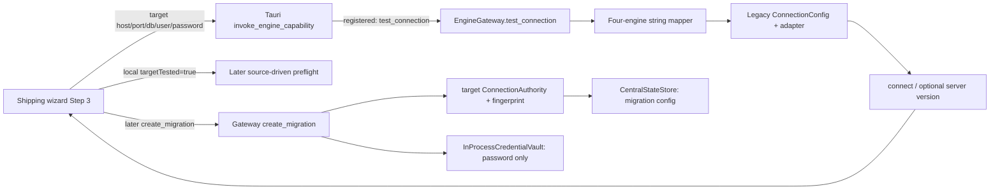

The P4 path is disconnected from shipping:

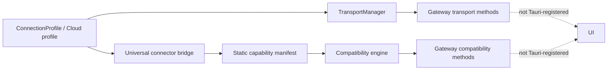

## 8. Saved Connection / Profile Persistence Map

| Lifecycle operation | Shipping/current implementation | Result |
|---|---|---|
| Create profile | Wizard creates local target session object | Not a profile |
| Save profile | None | Missing |
| List/retrieve profile | None | Missing |
| Update/delete profile | None | Missing |
| Reuse across migrations | None | Missing |
| Target role binding | Migration-local authority only | Partial |
| Reload endpoint after restart | Migration config can reload target endpoint identity | Migration-local, not reusable |
| Reload credentials after daemon restart | In-process vault is lost | Fails closed only where strict runtime flags are used |
| Reload test/write/capability/compatibility evidence | None | Missing |

A dropdown, connection ID from a test, migration-local config, or frontend repository is not evidence of a real target profile lifecycle.

## 9. Authentication & Secret Handling Matrix

| Auth family | UI / IPC | Backend representation | Persistence/restart | Redaction / behavior |
|---|---|---|---|---|
| Username/password | Shipping UI and IPC plaintext payload | `ConnectionConfig.extra.password`; memory vault | Vault lost on restart | Stored migration config removes password; UI keeps it in local state |
| Oracle SYSDBA/SYSOPER | Source UI only, not target UI | Adapter supports privilege fields | No durable profile | Target target-role expression absent |
| Oracle wallet/TNS | Source text field only | Cloud/profile refs/raw options may carry metadata | No shipping wiring | Not target expressible |
| TLS client certificates | Shipping has only target SSL checkbox | P4 profile refs | Not persisted/reachable | Checkbox not passed to test payload |
| OAuth/bearer/API key | No shipping UI | P4 auth enum/raw connector options | No durable profile | Backend-only |
| AWS IAM | No shipping UI | Cloud model/provider adapters | No durable profile | Backend-only |
| Azure Entra/service principal | No shipping UI | Cloud model/raw adapter options | No durable profile | Backend-only |
| GCP ADC/service account | No shipping UI | Cloud model/raw adapter options | No durable profile | Backend-only |
| OCI config/private key/instance principal | No shipping UI | Cloud model/wallet refs | No durable profile | Backend-only |
| Kafka SASL/Event Hubs connection strings | No shipping UI | Raw adapter config | No durable profile | Some adapter error redaction; no profile binding |
| Snowflake/Databricks native auth | No shipping UI | Raw/adapter-specific config | No durable profile | Not dynamically rendered |

The archive clone’s secret manager has provider abstractions but persists metadata in browser `localStorage`, can swallow provider-write failure, and is not connected to the desktop application. It is not evidence of shipping secret authority.

## 10. Network Route Findings

P4.7 contains potentially reusable logic for direct, SSH tunnel, bastion, multi-hop SSH, HTTP CONNECT, SOCKS5, VPN-routed, private-endpoint, and remote-agent paths:

- [transport/models.py](/A:/temp_akaal/akaal/transport/models.py) defines route IDs, hop IDs, sanitized serialization, fingerprinting, topology validation and failure classes.
- [transport_manager.py](/A:/temp_akaal/akaal/transport/transport_manager.py) resolves routes from `ConnectionConfig.extra`, performs DNS/path checks, and opens active sessions.
- Gateway exposes resolve/preflight/open/reconnect/close transport methods.

Limitations:

- No shipping route selection UI.
- No Tauri registration for transport capabilities.
- Route definitions are not saved as reusable entities.
- Sessions/tunnels are volatile and restart is not reconstructible.
- Connection profile SSH fields and transport-manager field names partially diverge.
- Route preflight mostly proves topology/DNS and selected path behavior, not target DB authentication or write authority.

Classification: P4 route code is `EARLY_FUTURE_IMPLEMENTATION`; a selectable/persisted Step-3 route association is `REQUIRED_BY_CURRENT_BOUNDARY`.

## 11. Connector-Specific Properties Findings

P4 profiles offer untyped `driver_options` and `extra` dictionaries. Cloud profiles have typed provider resource/network/auth metadata. Legacy adapters consume a mix of direct fields and raw `extra`.

This yields:

- no schema-driven UI rendering;
- no shipping connector property editor;
- no consistent validation of unsupported options;
- no durable profile-level property store;
- no canonical separation between connection-native properties and later object scope.

Examples:

- Oracle service/PDB, wallet and privilege modes are only partially handled.
- MSSQL instance is collected but generic gateway configuration does not establish an equivalent first-class field.
- Snowflake account/warehouse/role, BigQuery project/location, Databricks warehouse/catalog, Kafka producer security, and object-storage-specific identity are not shipping-representable.
- Generic `database_name` is misused across non-relational systems.

## 12. Connectivity-Test Semantics

| Path | DNS/TCP | Authentication/session | Identity/version | Metadata | Write/DDL authority | Capabilities | Failure behavior |
|---|---|---|---|---|---|---|---|
| Shipping `test_connection` | Indirect via adapter | Yes if mapped adapter can connect | Optional server version; fallback version strings exist | No | No | No | Unknown engine silently maps PostgreSQL |
| P4 bridge `test_connection` | Adapter-dependent | Yes | Optional version | No | No | Static manifest separate | Error classified but message can include adapter exception text |
| Adapter `check_permissions` | N/A | Requires connected session | No | Sometimes read query | Usually no | No | Often returns `True` |
| Transport preflight | DNS/path only | No DB auth | Endpoint/route only | No | No | No | Structured route failures |
| Archived UI test | No | No | Mock | No | No | No | `FAKE_SUCCESS` timer/local state |

The shipping UI label “Target Connection Verified” means `connected`, not “target authority verified.”

## 13. Target Write-Authority Verification

No coherent Step-3 target write-authority verifier was found.

Evidence:

- PostgreSQL `check_permissions()` returns `True` when connected.
- Oracle checks `SELECT 1 FROM DUAL`, proving read/session access.
- Snowflake checks `SELECT CURRENT_VERSION()`.
- Kafka and several other adapters return `True` after connection.
- S3 checks bucket existence/listing, not object write.
- HDFS explicitly raises `NotImplementedError` for permissions.
- Actual DDL/write behavior exists in execution writers and schema runtime, but those are later operations, not safe Step-3 probes.
- No shared evidence DTO records required privilege, result, timestamp, endpoint fingerprint, rollback safety, or execution-mode relation.

Thus checks are classified as `WARNING_ONLY` or `DEFERRED` for target authority, not write proof.

## 14. Capability Discovery Findings

### Static connector capabilities

P4 manifests declare:

- source/target roles;
- bulk read/write;
- streaming;
- transactions;
- CDC capture/continuous sync;
- TLS/auth mechanism list;
- restrictions;
- implementation/support/proof states.

The registry itself fails closed for missing/unknown manifest capabilities. This is useful logic.

### Endpoint-specific capabilities

No unified endpoint-specific discovery result was found for:

- actual write/DDL privileges;
- installed edition/version feature support;
- cloud tier/service availability;
- enabled CDC apply;
- target-side native loader availability;
- endpoint-specific transaction/idempotency characteristics;
- observed target health/capability proof.

Answer: **AKAAL cannot currently determine what a particular target endpoint can actually do as a complete Step-3 result.** It can make static manifest claims and sometimes retrieve a server version during a connection test.

Gateway methods to list manifests and evaluate compatibility exist, but Rust’s shipping capability registry does not register them.

## 15. Source ↔ Target Compatibility Findings

Competing compatibility authorities:

| Candidate | Actual behavior | Shipping reachability | Assessment |
|---|---|---|---|
| `UniversalCompatibilityEngine` | Static source/target manifest intersection for bulk, CDC, validation and semantic types; missing connector fails closed | No | Strongest Step-3 candidate, but static and unit-proven |
| `connectors/compatibility.py` | Family-level semantic compatibility with mapping/limitation labels | No | Useful coarse compatibility material; overlaps engine |
| Advisor/schema compatibility | Detailed type/schema/object risk and conversion analysis | Later preflight/Step 4+ | Not Step-3 fundamental pair gate |
| Gateway `evaluate_cross_system_compatibility` | Wrapper around P4 compatibility | No Tauri capability | Backend-only |
| Wizard advisor readiness display | Presents later preflight score | Yes, later | Not independently a pair-compatibility decision |

The P4 engine fails closed for unknown source/target contracts. However:

- it derives target role capability from static manifests;
- `requested_modes` is accepted but not used to drive its result;
- viability is tied to bulk feasibility, so it cannot accurately represent M3/M8/M6/M7 semantics;
- results are not persisted or bound to endpoint fingerprint/version;
- no shipping UI/Tauri route invokes it.

Therefore, current source-target compatibility is **not trustworthy as a complete Step-3 shipping determination**.

## 16. Applicable Migration Mechanisms

Existing material can express fragments:

| Mechanism | Existing evidence | Step-3 applicability status |
|---|---|---|
| Bulk | Manifest bulk read/write and compatibility intersection | Static only |
| Native bulk | Writer/adapters | Runtime implementation material only |
| Schema migration | DDL emitters/writers | No target DDL authority proof |
| CDC capture → apply | Source CDC manifests plus target event-apply derived flags | Static and incomplete |
| Incremental/polling | Incremental stores/managers | No target-specific applicability assessment |
| State synchronization | CDC/sync code and reconciliation | No Step-3 selector/proof |
| Schema only | DDL logic | No mode-aware authority determination |
| Data only | Writers/adapters | No existing-structure authority proof |
| Validation/reconciliation | Validation-only firewall and reconciliation | Later logic; target read adequacy not established at Step 3 |
| Warehouse/object/stream native mechanisms | Adapters/manifests | Backend-only static material |

No persisted “applicable mechanisms” result exists, and the shipping UI does not request one.

## 17. Execution-Mode Target Matrix — M1 through M8

| Mode | Required target truth at Step 3 | Existing supporting material | Current finding |
|---|---|---|---|
| M1 Bulk Migration | Bulk write; DDL only if planned | P4 bulk flags, writers | Static support only; no endpoint write proof |
| M2 Bulk + CDC | Initial write + CDC apply/idempotency where implemented | P4 source CDC / target event-apply flags | Static and not endpoint-specific |
| M3 CDC / Continuous Replication | CDC apply; not necessarily bulk | P4 target event-apply derivation | Compatibility engine still evaluates viability through bulk; inadequate |
| M4 Incremental Query / Polling | Insert/update/upsert suitability | Writer capability flags, incremental code | No target assessment |
| M5 State-Based Synchronization | Read/compare; mutation only if repair selected | Reconciliation/firewall material | No intent-aware target assessment |
| M6 Schema Only | DDL/schema authority, not row-data write | DDL emitters/writers | No safe DDL proof |
| M7 Data Only | Data write into existing structure, no automatic DDL requirement | Writers/adapters | No mode-aware proof |
| M8 Validation/Reconciliation Only | Target read/validation; no mutation by default | Validation firewall | Firewall exists later; no Step-3 target read proof |

The absence of canonical M1–M8 intent originates in Step 1 and must not be treated as a Step-3 implementation failure. Step 3 nevertheless lacks logic that could consume such intent correctly.

## 18. Duplicate Authority Map

| Responsibility | Competing models/services | Conflict |
|---|---|---|
| Target identity | Wizard local target object; `ConnectionAuthority`; engine DTO; `ConnectionConfig`; P4 profile; cloud profile; archive DB object | Different names, fields, lifetimes and role semantics |
| Target profile | P4 profile; TS `ProjectConnection`; archive `DBConnection`; cloud profile | None provides integrated durable profile lifecycle |
| Authentication | UI password; `ConnectionConfig.extra`; in-process vault; P4 refs/raw credentials; archive secret manager | Different persistence and redaction guarantees |
| Target permissions | Adapter `check_permissions`; scout source read-only checks; actual writers | No target write-probe authority |
| Capability | Adapter capability enum; P4 manifest; P4 capability contract; replication writer capability | Multiple static models, different granularity |
| Compatibility | Family rules; universal engine; advisor/schema rules; planner assumptions | Scope and proof differ |
| Network route | Profile SSH flags; cloud refs; `TransportPath`; raw config extras | Field/model drift, no durable linkage |
| Persistence | Central state migration config; engine state; P5 store; frontend memory; archive local storage | No single target-instance store |

## 19. Persistence / Restart Reconstruction

| Fact | Durable? | Reconstruction result |
|---|---:|---|
| Migration-local target endpoint identity | Yes | `CentralStateStore` migration config includes sanitized `target_authority` |
| Target role/connector/fingerprint | Yes, migration-local | Reconstructible non-secret metadata |
| Target profile | No | Not reconstructible |
| Credentials/secret usability | No | In-process vault is lost on daemon restart |
| TLS/auth/connector properties | Partially raw in migration config | Not a canonical profile and inconsistent |
| Route | No | Active paths/sessions lost |
| Connectivity test result | No | Local UI/session only |
| Write-authority proof | No | Never created |
| Endpoint capability result | No | Static registry regenerates, endpoint facts lost/absent |
| Compatibility result | No | Can be recomputed from static manifests only |
| Applicable mechanisms | No | Not produced |

## 20. UI / Backend / Product-Structure Drift

- The frozen Connections/Profiles/Capabilities/Connectivity Tests/Routes/Health/Connector Details surfaces do not have a coherent shipping implementation.
- The current wizard exposes only basic relational target entry, while P4 supports many connector families backend-side.
- Target SSL is collected in UI but not sent to `test_connection`.
- Target instance name is collected for MSSQL but is not a first-class generic gateway/profile field.
- The gateway’s unknown-engine branch silently defaults to PostgreSQL.
- The Tauri registry exposes `test_connection`, but not target profiles, connector manifests, compatibility, cloud profiles, or transport routes.
- The UI marks target “verified” after connectivity, although no write/DDL/capability/compatibility verification ran.
- Later discovery/preflight is mixed into the connection story but is primarily source/topology work.
- Archive UI has richer visual fields, but all target databases/tests are mock/local-state behavior.

## 21. Failure / Fail-Closed Matrix

| Scenario | Observed behavior | Classification |
|---|---|---|
| Unknown target connector in shipping test | Defaults to PostgreSQL | `SILENT_DEFAULT` |
| Missing target host/port/database/user in `create_migration` | Rejects migration creation | `FAIL_CLOSED` |
| Invalid credentials/unreachable relational target | Adapter error → failed test | `FAIL_CLOSED` |
| Target TLS checkbox | Not tested/enforced in shipping payload | `WARNING_ONLY` |
| Missing secret after restart | Vault missing; strict runtime flags can reject | `DEFERRED` |
| Unsupported auth mode | No shipping mode selector | `DEFERRED` |
| Invalid route topology | Transport path rejects loops/hop limit | `FAIL_CLOSED` |
| Transport DNS failure | Structured preflight failure | `FAIL_CLOSED` |
| Insufficient target write authority | No write probe | `UNRESOLVED` |
| Insufficient DDL authority | No DDL probe | `UNRESOLVED` |
| HDFS permission check | Raises not implemented | `FAIL_CLOSED` for that call |
| Kafka and several adapter permission checks | Return true once connected | `FAIL_OPEN` for write authority |
| Unsupported source-target manifest pair | P4 compatibility returns unsupported | `FAIL_CLOSED` |
| Unknown pair in shipping route | No compatibility call | `DEFERRED` |
| Endpoint-specific capability unknown | Static claims only | `WARNING_ONLY` |
| M8 mutation | Validation firewall blocks later runtime mutation | `FAIL_CLOSED` in that later path |
| Archive connection test | Timed/mock success | `FAKE_SUCCESS` |
| Corrupt saved target profile | No profile store | `UNRESOLVED` |
| Changed endpoint identity | Migration fingerprint exists; no target-profile evidence refresh | `DEFERRED` |

## 22. Current Gap vs Future Gap

| Gap / capability | Workflow ownership | Roadmap status | Forensic classification | Evidence |
|---|---|---|---|---|
| Durable reusable target profile lifecycle | Step 3 | `REQUIRED_BY_CURRENT_BOUNDARY` | `BUILD_REQUIRED` | P4 profile has no store/CRUD |
| Target connectivity/authentication | Step 3 | `EXISTING_P0_P4_IMPLEMENTATION` | `RECTIFY_CANDIDATE` | Shipping test path is relational-only |
| Target write/DDL authority proof | Step 3 | `REQUIRED_BY_CURRENT_BOUNDARY` | `BUILD_REQUIRED` | Existing permission checks are insufficient |
| Static capability catalog | Step 3 | `EXISTING_P0_P4_IMPLEMENTATION` | `MERGE_CANDIDATE` | P4 manifests/contracts |
| Endpoint-specific capability evidence | Step 3 | `REQUIRED_BY_CURRENT_BOUNDARY` | `BUILD_REQUIRED` | No unified endpoint result |
| Fundamental source-target compatibility | Step 3 | `EXISTING_P0_P4_IMPLEMENTATION` | `RECTIFY_CANDIDATE` | P4 static engine not shipping-reachable/mode-aware |
| Mechanism applicability result | Step 3 | `REQUIRED_BY_CURRENT_BOUNDARY` | `BUILD_REQUIRED` | No persisted, intent-aware result |
| Route selection/association | Step 3 | `REQUIRED_BY_CURRENT_BOUNDARY` | `BUILD_REQUIRED` | P4 transport is backend-only/volatile |
| Cloud/hybrid infrastructure administration | Administration | `EARLY_FUTURE_IMPLEMENTATION` | `EARLY_FUTURE_IMPLEMENTATION` | Cloud models and discovery providers |
| Detailed scope/catalog/object discovery | Step 4 | `FUTURE_NOT_YET_REQUIRED` for Step 3 | `FUTURE_NOT_YET_REQUIRED` | Must not be absorbed into target establishment |
| Runtime tuning, conflict policies, hooks | Step 6/P5.6+ | `FUTURE_NOT_YET_REQUIRED` | `FUTURE_NOT_YET_REQUIRED` | Not Step-3 prerequisites |
| P7 security certification | Later roadmap | `FUTURE_NOT_YET_REQUIRED` | `FUTURE_NOT_YET_REQUIRED` | Secret hardening beyond current boundary |

## 23. Reusable Logic / Reconstruction Material

- `ConnectionAuthority` contains potentially reusable logic for migration-bound target identity and endpoint fingerprinting.
- `ConnectionAuthorityDTO.create()` contains potentially reusable strict required-field validation.
- P4 `ConnectionProfile` contains potentially reusable profile metadata, TLS references, secret-safe serialization, and connector options.
- `CloudManagedDatabaseProfile` contains potentially reusable managed-resource, private endpoint, writer endpoint, and provider identity metadata.
- `TransportPath` and `TransportManager` contain potentially reusable route topology, redaction, DNS preflight, proxy/bastion/agent handling, and failure taxonomy.
- Universal manifests and contracts contain potentially reusable static role/capability/proof-state logic.
- `UniversalCompatibilityEngine` contains potentially reusable fail-closed static pair negotiation.
- Adapter error classification contains potentially reusable connectivity/authentication/authorization classification.
- The validation-only firewall contains potentially reusable M8 no-mutation enforcement.
- Archive clone secret-provider interfaces contain potentially reusable provider vocabulary only; browser-local persistence and disconnected integration prevent treating it as an authority.

## 24. Unresolved Questions

1. Whether gateway P4 compatibility/transport methods are intentionally omitted from shipping Tauri registration cannot be proven from code.
2. Live adapter behavior for every heterogeneous connector was not proven against live endpoints; unit proof does not elevate to live proof.
3. No code demonstrates a non-destructive, connector-specific target DDL/write probe contract.
4. No code establishes which target permissions are required for each future M1–M8 intent.
5. Whether a migration record is reloaded into a UI/runtime path after restart was not proven; its durable state is readable by the state store.
6. The intended ownership boundary between future Connections administration and the creation wizard cannot be settled by existing code.

## 25. Step-3 Verdict

A coherent Target Instance boundary does **not** currently exist at the shipping product boundary.

- Target profiles are not real or durable.
- Heterogeneous endpoints are modeled in P4/backend material, but not truthfully represented by the shipping UI or IPC boundary.
- Target write authority is not actually proven.
- Capability claims are predominantly static; endpoint-specific capability evidence is absent.
- Source-target compatibility has useful static, fail-closed P4 logic, but it is not shipping-reachable, endpoint-specific, or execution-mode aware.
- Applicable migration mechanisms cannot currently be determined as a durable Step-3 result.
- Current UI and backend disagree materially: four relational UI options versus broad backend connector claims, and “verified” means connection only.
- Current-boundary missing work is the target-instance/profile/proof/compatibility/mechanism boundary itself.
- Detailed target catalog/scope discovery, runtime tuning, P5.6 conflict controls, operations, and P7 security certification remain later-roadmap work and were not pulled backward.

**Step-3 forensic conclusion: AKAAL contains strong but fragmented P4 and legacy implementation material for target endpoint identity, routes, static capabilities, and adapter connectivity; it does not currently establish a reusable, authenticated, network-reachable, write-authorized, endpoint-capability-aware heterogeneous target instance with trustworthy source-target compatibility and mechanism applicability.**

No Step-3 implementation changes are authorized by this finding alone.

# Workflow Step 4 — Discovery & Advanced Scope

## 1. Step-4 Executive Truth

Step 4 divides into two materially different realities:

- **Discovery & Assessment:** substantial frozen P0–P4 implementation material exists. The shipping wizard reaches a source-driven Scout/preflight route through Tauri and displays a relational-shaped discovery tree. The backend has a versioned `DiscoveryReport`, discovery profiles, adapter/provider discovery, metadata inventory, storage estimates, fingerprints, P2 schema intelligence, and multiple compatibility/risk/dependency systems.
- **Selection & Scope:** the strongest structured implementation is explicitly **P5.2 material**. It has models and gateway handlers for rules, projections, predicates, ranges, sampling, diagnostics, estimates, previews, and drift checks, but is not shipping-reachable and is not yet a finished hierarchy-aware selection authority.

The shipping UI does not expose a truthful heterogeneous Step-4 workflow. It mixes source discovery, selection, deeper advisor results, and local UI state under current wizard Step 4.

## 2. Whole-Repository Coverage Map

| World | Searched | Step-4 result |
|---|---:|---|
| Shipping desktop/Tauri | Yes | Current Step 4 discovery-and-scope UI and current IPC path |
| Current gateway/engine | Yes | Preflight orchestration, persisted migration scope, progress state |
| Scout/discovery | Yes | Primary structured discovery pipeline |
| P4 connectors/adapters/cloud/transport | Yes | Physical connector reachability and native metadata providers |
| P2 schema/decoder/validation | Yes | Canonical schema, type, dependency, drift and compatibility material |
| P3 CDC/replication | Yes | CDC scope-consistency material, not a second selection authority |
| P5 planner/persistence | Yes | P5.1 planning and P5.2 selection implementation material |
| Merged NexusForge core/agents/workflow/migration | Yes | Legacy discovery/project/advisory paths |
| Advisor/governance/risk/intelligence | Yes | Separate impact/risk/assessment systems |
| Archive UI and UI clone | Yes | Mock/local discovery/database/workspace UI |
| Tests, fixtures, scripts, docs/runtime state | Yes | Unit/integration evidence and historical clues; not authority |

No separate NexusForge root was found; relevant legacy logic is merged beneath `akaal`.

## 3. Current 7-Step → Frozen 9-Step UI Mapping

| Current UI location | Frozen destination | Actual behavior | Classification |
|---|---|---|---|
| Wizard Step 4 “Discovery & Migration Scope” | Step 4 Discovery & Assessment + Selection & Scope | Starts source preflight, renders database/schema/object tree, lets user toggle objects | `RECTIFY_CANDIDATE` |
| Wizard `handleRunDiscovery` | Step 4 Discovery | Calls `start_preflight`, polls live operation, stores result only in React session | `MERGE_CANDIDATE` |
| Wizard object-tree selection | Step 4 / P5.2 Selection | Local `selected` flags are later copied into manifest `selected_scope` | `RECTIFY_CANDIDATE` |
| Wizard advisor/readiness display | Step 4 Assessment | Displays post-preflight advisor/risk values | `MERGE_CANDIDATE` |
| Wizard Step 5 dynamic plan | Step 7 later | Plan generated from strings/local selections | `EARLY_FUTURE_IMPLEMENTATION` |
| Archive workspace/database pages | Conceptual Step 4 UI | Mock objects, timer-based discovery/testing | `REMOVE_CANDIDATE` |
| Archive clone `SchemaExplorer` | Conceptual metadata explorer | UI-only historical component | `REMOVE_CANDIDATE` |

## 4. Candidate Inventory

| Candidate | World | Responsibility | Persistence/restart | Shipping reachability | Proof | Classification |
|---|---|---|---|---|---|---|
| `DiscoveryOrchestrator` | Scout/P0–P4 | Versioned source discovery pipeline | In-memory TTL cache only | Indirectly through gateway preflight | Unit proven | `KEEP_CANDIDATE` |
| `DiscoveryRequest` / policy/profile | Scout/P0–P4 | Quick/standard/deep/compliance discovery controls | Request only | Not exposed by shipping UI | Unit proven | `MERGE_CANDIDATE` |
| Discovery providers | Adapters/Scout | Engine-native metadata discovery | Volatile | Four relational sources through shipping mapper | Partial/unit | `RECTIFY_CANDIDATE` |
| Gateway preflight | Gateway/current | Shipping wrapper and UI-shaped discovery response | Operation memory only | Yes | Integration path present | `RECTIFY_CANDIDATE` |
| P2 schema models/decoder | Schema/decoder/P0–P4 | Canonical metadata, types, dependencies, compatibility | Separate schema/versioning stores where invoked | Not directly shipping Step-4 reachable | Unit proven | `MERGE_CANDIDATE` |
| P5.1 models/store | Planner/P5.1 | Plans, topology, versions, execution snapshots | SQLite `ProjectStore` | No Tauri route | Unit proven | `P5_IMPLEMENTATION_MATERIAL` |
| P5.2 selection models/compiler | Planner/P5.2 | Selection rules/projection/predicate/range/sample/estimate/preview | Can live inside plan payload; no shipping workflow | No Tauri route | Unit proven | `P5_IMPLEMENTATION_MATERIAL` |
| Advisor/risk systems | Advisor/governance/schema | Multiple risk, impact and recommendation paths | Mixed/mostly transient | Preflight summary only | Mixed | `MERGE_CANDIDATE` |
| Legacy advisory/schema scout | Merged NexusForge | Legacy parser/advisory evidence | In-memory/legacy | No | Test-oriented | `REPLACE_CANDIDATE` |
| Archived UIs | Archive worlds | Mock discovery/selection display | Local state/mock data | No | None | `REMOVE_CANDIDATE` |

## 5. Step-4 Domain / Field / Capability Matrix

| Capability | Current shipping UI | Gateway | Scout | P2 schema | P5.2 | Durable/reloadable |
|---|---|---|---|---|---|---|
| Source topology | Partial textual instance tree | Yes | Yes | Partial | References only | No |
| Catalog/database inventory | UI-shaped relational tree | Yes | Generic/partial | N/A | Rule target type | No |
| Namespace/schema inventory | Yes | Yes | Yes | Canonical models | Rule target type | No |
| Object inventory | Yes | Yes | Tables/views/procedural inventory | Stronger canonical objects | Rules | No |
| Columns/types/keys/indexes | Display partial | Flattens result | Provider dependent | Yes | Projection input | No |
| Dependencies | UI does not truthfully display graph | Partial | FK/provider dependent | Yes | Diagnostics only | No |
| Metadata compatibility | UI chips/advisor labels | Partial | Capability only | Yes | Mapping/selection diagnostics | No |
| Risk/impact | Advisor strings/scores | Yes | Health/cost only | Schema risk | No authoritative integration | No |
| Include/exclude | Object checkbox only | Raw scope persists | Discovery policy filters | N/A | Yes | P5 payload only |
| Projection/predicate/range/sample | No | P5 handlers only | Discovery policy only | N/A | Yes | P5 material |
| Volume estimate | UI count/rows | Yes | Storage inventory | N/A | Derived estimate | No |
| Fingerprint/drift | No | P5 fence possible | Discovery fingerprint | Schema drift | Drift compare | Not in shipping path |

## 6. Discovery Mode Matrix

| Frozen mode | Existing equivalent | Actual distinction | Verdict |
|---|---|---|---|
| Quick | `DiscoveryProfile.QUICK` | Reduced metadata query/runtime caps; disables storage, cluster and object inventory | Implemented |
| Standard | `STANDARD` | Default source assessment | Implemented |
| Deep | `DEEP` | Higher query/runtime caps and full enabled inventory | Implemented, depth mostly policy caps rather than richer provider semantics |
| Compliance | `COMPLIANCE` | Includes system objects and normal inventory | Partial; gathers potentially relevant metadata but does not perform compliance enforcement/classification |

Compliance discovery is not missing merely because later privacy/compliance policy work is unfinished.

## 7. Connector-Native Topology Matrix

| Connector family | Native conceptual topology | Scout/native result quality | Shipping reachable |
|---|---|---|---|
| Oracle | Service/PDB → schemas → objects | Dedicated provider | Yes |
| PostgreSQL | Server → databases → schemas → objects | Dedicated provider, but current generic report tends toward configured database/public schema | Yes |
| MySQL/MariaDB | Server → databases → objects | MySQL provider; MariaDB generic fallback | MySQL only |
| MSSQL | Server/instance → databases → schemas → objects | Dedicated provider | Yes |
| Db2/SQLite | Server/database or file → namespaces/objects | Generic fallback | No |
| Snowflake/Redshift/Databricks | Account/cluster → database/catalog → schema → objects | Generic fallback; relational-shaped normalization | No |
| BigQuery | Project → datasets → objects | Generic fallback; no true project/dataset hierarchy | No |
| MongoDB | Cluster → databases → collections | Generic fallback | No |
| Cassandra/Scylla | Cluster → keyspaces → tables | Generic fallback | No |
| Neo4j | DB/graph → labels/relationships | Generic fallback | No |
| Redis/KeyDB | Instance → logical DB/key groups | Generic fallback | No |
| Elasticsearch/OpenSearch | Cluster → indices/data streams | Generic fallback | No |
| Kafka/Confluent/MSK | Cluster → topics → partitions | Generic fallback; table-oriented methods are semantically weak | No |
| Kinesis/Event Hubs/PubSub | Account/project → streams/topics/subscriptions | Generic fallback | No |
| S3/GCS/Azure Blob/MinIO | Service/account → bucket/container → prefixes/objects | Generic fallback | No |
| HDFS | Cluster → directories/files | Generic fallback / permission path incomplete | No |
| CSV/JSON/JSONL/Parquet | File/dataset → records/schema | Parsers/adapter material; not Scout-native hierarchy | No |

## 8. Full P4 Connector Discovery Matrix

| Physical identities | Connection/adapter | Dedicated discovery provider | Metadata depth | Counts/sizes | Shipping |
|---|---|---:|---|---|---:|
| Oracle, PostgreSQL, MySQL, MSSQL | Yes | Yes | Standard relational | Provider/adapter dependent | Yes |
| MariaDB, Db2, SQLite | Yes | No | Generic table/column/index/FK calls | Generic estimate | No |
| Snowflake, BigQuery, Redshift, Databricks | Yes | No | Generic fallback; connector-native hierarchy not preserved | Generic estimate | No |
| MongoDB, Cassandra, ScyllaDB, Neo4j | Yes | No | Generic fallback | Generic estimate | No |
| Redis, KeyDB, Elasticsearch, OpenSearch | Yes | No | Generic fallback, many relational metadata concepts unsupported | Generic estimate | No |
| Kafka, Confluent, MSK, Kinesis, Event Hubs, Pub/Sub | Yes | No | Generic fallback, topic/stream semantics not normalized | Not proven | No |
| HDFS, S3, GCS, Azure Blob, MinIO | Yes | No | Generic fallback, storage hierarchy not preserved | Partial/provider dependent | No |

P4 connector acceptance/unit evidence is not live external-system certification.

## 9. Current Call / Data Flows

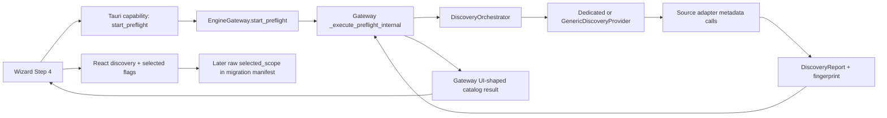

The shipping path is source-only. It does not consume P5.2 selection handlers.

## 10. Discovery Authority Map

| Authority | Scope | Conflict |
|---|---|---|
| Scout `DiscoveryOrchestrator` | Source discovery pipeline | Strongest structured discovery authority |
| Gateway preflight | Shipping wrapper/result shaper | Duplicates/reshapes Scout and adds relational assumptions |
| Adapter discovery methods | Native metadata primitives | Necessary provider layer, varying completeness |
| `agents/scout` and legacy advisory scout | Legacy agent/parser discovery | Separate legacy routes |
| P2 schema refresh/versioning | Canonical schema snapshots/drift | Different downstream schema authority |
| Archive UI mock data | Historical UI | Not implementation authority |

## 11. Discovery Pipeline / Scout Findings

`DiscoveryOrchestrator.execute_discovery()`:

1. creates cache key from `ConnectionConfig`;
2. resolves adapter and a provider;
3. connects;
4. asks provider to verify source read-only permissions;
5. executes stages: engine, version, capability, instance, cluster, schema, object, storage and fingerprint;
6. creates immutable/versioned `DiscoveryReport`;
7. caches it in memory with TTL.

Weaknesses:

- Cache is in-memory only.
- Generic provider `check_read_only_permissions()` returns `True` on exceptions: `FAIL_OPEN`.
- Generic provider invents generic version, “public” schema, capability values and row-size estimates.
- Only Oracle/PostgreSQL/MySQL/MSSQL have dedicated providers.
- Gateway maps unknown source engines to PostgreSQL before Scout receives them.
- Gateway’s UI response re-shapes normalized report into relational database/schema/object groups.

## 12. Metadata Normalization Findings

Native adapter metadata flows through provider dictionaries into Scout inventories:

- `SchemaInventory`: schemas, tables, columns, indexes, constraints, foreign keys, views.
- `ObjectInventory`: procedures, functions, triggers, sequences, custom types.
- `StorageInventory`: database/table/index sizes, partitions, row counts.
- `DiscoveryReport`: versioned snapshot, health, cost, capability inventory and fingerprint.

P2 supplies separate canonical schema/type/decoder representations. It is stronger for canonical type semantics, object modeling and compatibility than Scout’s generic dictionaries.

Unknown metadata is not always represented truthfully: generic provider defaults can synthesize `public`, generic version and feature claims.

## 13. Canonical Schema Integration Findings

Frozen P2 material includes canonical schema models, type registry, dependency graph, schema versioning/refresh, compatibility analysis and schema-risk classification.

Step 4 can consume this material, but current shipping preflight does not establish a durable bridge from Scout `DiscoveryReport` to P2 canonical schema snapshot/version authority. That is an integration gap, not a reason to create another schema engine.

## 14. Dependency Analysis Findings

| Authority | What it handles | Step-4 status |
|---|---|---|
| Adapter/provider foreign keys | Relational FK discovery where adapter supports it | Partial |
| P2 `ConstraintDependencyGraph` | Change/constraint/index/view/trigger ordering; cycle handling through Tarjan sorter | Existing P0–P4 material |
| Decoder dependency engine | Canonical/deep dependency representation | Existing P0–P4 material |
| Governance/healing dependency systems | Governance/recovery impacts | Separate later consumers |
| P5.2 selection diagnostics | Can surface warnings/blockers | P5 material, not a complete dependency-aware UI |

No shipping selection behavior warns when an included object depends on an excluded prerequisite.

## 15. Compatibility Assessment Findings

- **Step-3 pair compatibility:** P4 manifest/compatibility negotiation answers whether connector types can fundamentally participate.
- **Step-4 discovered-metadata compatibility:** P2 schema compatibility, datatype conversion, decoder semantic compatibility, schema comparison and risk engines assess actual discovered structures/types.

The shipping wizard displays compatibility labels and advisor readiness after preflight, but does not expose a durable, traceable composition of those authorities.

## 16. Impact Assessment Findings

Impact implementations exist in several worlds:

- schema dependencies and change graphs;
- governance `impact` analyzer/simulator;
- advisor topology/resource/cost/rollback analyzers;
- schema compatibility reports and unsupported-change risks.

They are competing analysis outputs rather than a unified Step-4 impact record. The shipping UI exposes only summary-like advisor values. No durable impact assessment is attached to the discovery snapshot.

## 17. Risk Assessment Findings

| Authority | Inputs | Persistence | Shipping exposure |
|---|---|---|---|
| P2 schema `RiskClassifier` | Schema diffs: object/column changes | Snapshot/report dependent | No direct |
| Advisor/risk scorer | Topology/resources/compatibility heuristics | Mostly transient | Summary only |
| Governance risk engine | Governance risk context | Separate authority | No direct |
| Discovery health | Pipeline errors/warnings/capability confidence | Discovery report/cache only | Indirect summary |

Deterministic risk material exists. P7C AI risk prediction is not required for Step 4.

## 18. Selection Authority Map

| Candidate | Actual role | Classification |
|---|---|---|
| Wizard object `selected` flags | UI-local raw object selection | `RECTIFY_CANDIDATE` |
| Scout `DiscoveryPolicy` filters | Controls what discovery collects, not migration selection | `MERGE_CANDIDATE` |
| P5.2 `SelectionDefinition` | Structured selection rules/projection/predicate/range/sample | `P5_IMPLEMENTATION_MATERIAL` |
| P5.1 plan/version payload | Durable versioned home for selected scope | `P5_IMPLEMENTATION_MATERIAL` |
| Migration manifest `selected_scope` | Raw, later execution-oriented snapshot | `RECTIFY_CANDIDATE` |
| Legacy migration configuration | Incremental/mapping controls | `REPLACE_CANDIDATE` |
| Archive UI selection state | Mock/local | `REMOVE_CANDIDATE` |

## 19–29. Selection & Scope Findings

| Capability | Existing truth | Owner/status |
|---|---|---|
| Database/catalog selection | Raw `selected_scope.databases`; no canonical UI/store | P5.2 material |
| Schema/namespace selection | Scout discovery policy and raw wizard scope | P5.2 material |
| Object selection | Wizard checkboxes and P5 rules | P5.2 material; shipping local only |
| Include/exclude/patterns | P5 `SelectionRule` supports include/exclude and exact/glob/regex concepts | P5.2 material |
| Column projection | P5 `ProjectionDefinition`; compiler attempts key retention | P5.2 material |
| Row predicates | P5 `PredicateDefinition`; compiler validates a limited safe operator set | P5.2 material |
| Partition/range | P5 `RangeDefinition` | P5.2 material |
| Sampling | P5 `SamplingDefinition` fixed rows/percentage/seed | P5.2 material |
| Dependency warnings | P5 diagnostics exist, but no full discovery graph binding | P5.2 material |
| Selection preview | `p5_preview_selection` can attempt a bounded read | P5.2 material; unsafe fallback noted below |
| Volume estimate | Scout actual/estimated inventory plus P5 derived calculation | Existing P0–P4 + P5.2 material |

`p5_preview_selection` falls back to fabricated sample rows when no live preview succeeds. That is `FAKE_SUCCESS` for a selection preview and must not be treated as evidence of discovered source data.

## 30. Bulk ↔ CDC Scope Consistency Findings

P3 owns CDC. No second canonical CDC scope engine was found.

- P5 selection compiler blocks sampling when connector type contains CDC.
- Projection code attempts to preserve key columns, but uses default candidates (`id`, `uuid`, `pk`) rather than discovered CDC/key requirements.
- No durable proof ties initial bulk scope, CDC capture scope, validation scope and reconciliation scope to one versioned selection artifact.
- Selection changes after CDC initialization are not governed in the shipping path.
- Raw wizard `selected_scope` is reused later, but without mode-aware validation.

## 31. Validation/Reconciliation Scope Consistency Findings

Validation-only/reconciliation code contains a later write firewall and object-level validation concepts. It does not provide a Step-4 persisted selection authority. There is no shipping proof that the selected source scope maps identically to validation/reconciliation scope after restart.

## 32. Persistence / Restart Reconstruction Matrix

| Item | Durable? | Current reconstruction |
|---|---:|---|
| Discovery report/cache | No | Scout cache lost on daemon restart |
| Preflight operation | No | Gateway `_preflight_operations` memory only |
| UI discovery tree | No | React state only |
| Source topology/metadata snapshot | Partially in later migration raw config only | Not a canonical Scout snapshot store |
| Discovery fingerprint | Generated | Not shipping-persisted as discovery authority |
| Compatibility/risk/impact assessment | No unified durable record | Recomputed/transient |
| Raw selected objects | Yes after migration creation | Stored in migration config |
| P5 plan/selection payload | Yes when P5 `ProjectStore` path is invoked | SQLite plan/project/version records |
| Preview/sample rows | No | Temporary response only |
| Volume estimate | No canonical durable record | Derived/transient |

## 33. Staleness / Drift Findings

- Scout generates fingerprints and supports force refresh/cache TTL.
- P2 schema refresh/versioning and drift systems exist.
- P5 compiler has `verify_discovery_drift()` and a pre-execution fence.
- Current gateway/wizard preflight does not persist/reload a canonical snapshot to make staleness decisions.
- P5 drift comparison currently compares selected object names against a supplied current discovery object list; it does not prove full column/dependency/statistics drift coverage.
- Shipping wizard can silently use old local discovery state until the user re-runs it.

## 34. UI / Backend / Product-Structure Drift

- Frozen Step 4 requires connector-native topology; current UI forces `database → schema → object`.
- P4 heterogeneous connector discovery is backend-only.
- Current UI has object selection but no include/exclude rules, patterns, projection, predicate, range, sampling, dependency warnings, deterministic preview, or estimate provenance.
- UI displays advisor/compatibility-like values without durable evidence linkage.
- Preflight requires both source/target connections even though discovery is source-driven; target metadata is not discovered.
- Archive UI is mock-only and must not be used as evidence of product support.

## 35. Shipping Reachability Matrix

| Capability | Implemented | Gateway exposed | Tauri registered | UI caller | Persisted/reloadable |
|---|---:|---:|---:|---:|---:|
| Source preflight/Scout | Yes | Yes | Yes (`start_preflight`) | Yes | No |
| Poll preflight | Yes | Yes | Yes | Yes | No |
| Raw object selection | UI only | Later manifest path | N/A | Yes | Only after migration creation |
| P5 selection evaluation/validation/estimate/preview | Yes | Yes | No | No | Only through P5 store if separately invoked |
| P2 canonical schema compatibility | Yes | Not current Step-4 route | No | No | Separate authority |
| P4 heterogeneous discovery | Partially | Indirect | No | No | No |
| Discovery profile choice | Yes | Direct API only | No | No | No |

## 36. Duplicate Authority Map

| Overlap | Candidates | Recommendation |
|---|---|---|
| Discovery | Scout, gateway preflight, legacy scout/advisory, adapter direct methods | Scout `KEEP_CANDIDATE`; gateway `RECTIFY_CANDIDATE`; legacy `REPLACE_CANDIDATE` |
| Metadata | Scout dict inventories, P2 canonical schema, decoder models | `MERGE_CANDIDATE` with P2 as canonical schema material |
| Dependencies | Adapter FKs, P2 graph, decoder, governance/healing graphs | `MERGE_CANDIDATE`; do not create another graph |
| Compatibility | P4 pair engine, P2 schema engine, advisor/rulebook | `MERGE_CANDIDATE`; preserve layered responsibilities |
| Risk/impact | P2 risk, advisor, governance, intelligence | `MERGE_CANDIDATE`; separate scope/proof levels |
| Selection | Wizard flags, Scout policy, P5.2 definitions, raw manifest | P5.2 `P5_IMPLEMENTATION_MATERIAL`; wizard `RECTIFY_CANDIDATE` |
| Persistence | Scout memory cache, gateway memory operations, migration state, P5 store | P5 store `P5_IMPLEMENTATION_MATERIAL`; others require integration |

## 37. Failure / Fail-Closed Matrix

| Condition | Behavior | Classification |
|---|---|---|
| Unknown source engine in gateway preflight | Becomes PostgreSQL | `SILENT_DEFAULT` |
| Source connection failure in Scout | Error is recorded; pipeline continues | `DEFERRED` / partial report |
| Provider permission check throws | Generic provider returns `True` | `FAIL_OPEN` |
| Unsupported connector discovery | Generic relational-shaped fallback | `WARNING_ONLY` |
| Empty allowed schemas after filter | Defaults to `public` | `SILENT_DEFAULT` |
| Invalid P5 predicate operator | Compiler emits blocker | `FAIL_CLOSED` |
| CDC sampling | Compiler emits blocker | `FAIL_CLOSED` |
| Missing selected object in supplied drift report | P5 fence blocks | `FAIL_CLOSED` |
| Invalid/stale discovery in shipping wizard | No canonical persisted comparison | `UNRESOLVED` |
| Failed live selection preview | Returns fabricated rows | `FAKE_SUCCESS` |
| Pattern matching zero objects | Not proven as blocker | `UNRESOLVED` |
| Excluded dependency | No shipping graph-bound warning | `UNRESOLVED` |

## 38. Proof-Level Matrix

| Capability | Implemented | Unit proven | Integration proven | Live proven | Shipping UI |
|---|---:|---:|---:|---:|---:|
| Scout profiles/reports/fingerprints | Yes | Yes | Partial | No | Partial |
| Dedicated relational discovery | Yes | Yes | Partial | No | Yes, four engines |
| Generic heterogeneous discovery | Yes | Partial | No | No | No |
| P2 canonical schema intelligence | Yes | Yes | Partial | No | No |
| P5.2 selection models/compiler | Yes | Yes | No | No | No |
| Discovery drift fence | Yes | Yes | No | No | No |
| Mock archive discovery UI | Yes | N/A | No | No | No |

## 39. Current Gap vs Future Gap

| Capability | Current implementation | Workflow owner | Roadmap status | Required now? | Classification |
|---|---|---|---|---|---|
| Source metadata discovery | Scout/adapters | Step 4 | Existing P0–P4 | Yes | `EXISTING_P0_P4_IMPLEMENTATION` |
| Connector-native heterogeneous topology | Partial generic provider | Step 4 | Existing P0–P4 integration | Yes | `REQUIRED_BY_CURRENT_STEP4_BOUNDARY` |
| Canonical schema/type/dependency intelligence | P2 exists | Step 4 consumer | Existing P0–P4 | Yes | `EXISTING_P0_P4_IMPLEMENTATION` |
| Product integration/persistence of discovery snapshot | Fragmented | Step 4 | Current boundary | Yes | `REQUIRED_BY_CURRENT_STEP4_BOUNDARY` |
| Planning authority/versioned plans | P5.1 exists | P5.1 | P5 implementation | No completion claim | `P5_IMPLEMENTATION_MATERIAL` |
| Hierarchical selection studio | P5.2 models/compiler | P5.2 | P5 implementation | Not a P0–P4 defect | `P5_IMPLEMENTATION_MATERIAL` |
| Projection/predicate/range/sample controls | P5.2 material | P5.2 | P5 implementation | Not a P0–P4 defect | `P5_IMPLEMENTATION_MATERIAL` |
| Detailed impact/risk composition | Fragmented systems | Step 4/P5.1 | Current integration work | Yes | `REQUIRED_BY_CURRENT_STEP4_BOUNDARY` |
| P7 compliance enforcement | Later | P7 | Later roadmap | No | `FUTURE_NOT_YET_REQUIRED` |
| P7C AI recommendations | Later | P7C | Later roadmap | No | `FUTURE_NOT_YET_REQUIRED` |

## 40. Reusable Reconstruction Material

- `DiscoveryOrchestrator`, `DiscoveryPolicy`, `DiscoveryProfile`, `DiscoveryReport`, stage diagnostics and fingerprint generation contain reusable discovery logic.
- Dedicated Oracle/PostgreSQL/MySQL/MSSQL providers contain reusable connector-native relational discovery logic.
- P4 adapter interfaces contain reusable physical metadata calls for heterogeneous connectors.
- P2 schema models, type registry, schema refresh, dependency graph and compatibility/risk analysis contain reusable canonical schema intelligence.
- P5.1 `ProjectStore` and versioned plan payloads contain reusable persistence/versioning material.
- P5.2 selection definitions, diagnostics, predicate/range/sample/projection models and drift fence contain reusable selection material.
- Existing P3 CDC lifecycle/scope material must be composed with selection rather than duplicated.
- Archive UI components are visual references only; their mock data/test behavior is not reusable authority.

## 41. Unresolved Questions

1. Whether every P4 adapter’s discovery methods produce connector-native metadata was not live-proven; generic fallback is demonstrably relational-shaped.
2. No shipping execution trace proves Scout reports are persisted and restored across daemon/desktop restart.
3. The intended canonical bridge from Scout report to P2 schema snapshot and P5 plan version is not established by current shipping code.
4. No code proves a complete source-side predicate pushdown contract across connector families.
5. Selection preview deliberately fabricates fallback rows, so its intended production semantics cannot be trusted from code alone.
6. No current code binds CDC scope changes, validation scope and bulk scope to a single immutable selection version.

## 42. Final Step-4 Verdict

### A. Discovery & Assessment

Discovery and assessment are **largely existing frozen P0–P4 implementation material requiring product integration and rectification**, not wholesale replacement.

Strong material already exists:

- Scout discovery profiles and immutable reports;
- source metadata pipeline and fingerprints;
- adapter/provider discovery;
- P2 canonical schema/type/dependency/compatibility/risk authorities;
- P4 connector framework.

Current-boundary weaknesses are shipping integration, durable/reloadable discovery snapshots, connector-native hierarchy preservation, removal of silent relational defaults, and truthful assessment composition.

### B. Selection & Scope

Selection and scope are **primarily P5.2 implementation material**, with useful current models and compiler logic but no completed shipping selection studio or Tauri route.

The existing wizard’s object checkboxes and raw manifest scope should not be mistaken for completion of P5.2. P5.1 supplies related plan/version persistence, but its existence does not make Step 4 complete.

**Step-4 forensic conclusion: AKAAL has a substantial discovery-and-assessment foundation across Scout, adapters, P2 schema intelligence and P4 connectors, but the current shipping Step 4 is a relational-shaped, volatile integration layer. Structured advanced selection/scope capability exists chiefly as unfinished P5.2 material and must not be duplicated or misclassified as a frozen P0–P4 defect.**

No Step-4 implementation changes are authorized by this finding alone.

## 1. Step-5 Executive Truth

AKAAL has substantial P5-oriented implementation material for structural mapping, transformations, and privacy, plus reusable frozen P2/P3/P4 runtime authorities. It does not have a shipping, durable, end-to-end Step-5 Mapping & Data Controls Studio.

The current 7-step wizard:

- renders a `MappingStudio` inside current Step 4’s object-detail panel, not its Step 5;
- renders additional mapping/masking/collision-looking controls in current Step 6;
- sends none of those Step-5 values into the generated plan or launched migration manifest;
- attempts P5 mapping/preview IPC capabilities that the shipping Tauri capability registry does not register, so calls fail closed before Python;
- has no UI for transformation policies, privacy policy definitions, deduplication/survivor rules, data-quality rules, CDC conflict-policy configuration, or governed SQL hooks.

No code or Git state was modified.

## 2. Whole-Repository Coverage Map

Repository worlds searched:

| World | Step-5-relevant evidence |
|---|---|
| Shipping desktop UI | `NewMigrationWizard.tsx`, `MappingStudio.tsx`, `mappingClient.ts` |
| Tauri/Rust bridge | capability registry and registered IPC boundary |
| EngineGateway | P5 mapping, transformation, privacy, selection-preview handlers |
| P5 planner/configuration | routing/compiled-mapping models, project/plan/version persistence |
| P2 schema intelligence | canonical type, compatibility, dependency, validation authorities |
| P3 CDC/conflict/reconciliation | CDC apply, replay/idempotency, multi-master conflict/quarantine |
| P0/P1 runtime | transport, execution, checkpoint/reliability material |
| Legacy AKAAL/NexusForge-style configuration | legacy mapping, transformations, masking, hooks, manager/GB-agent consumers |
| Reliability wrappers | legacy mapping/masking/transformation adapters |
| Tests | `MappingStudio.test.tsx` proves UI rendering only, not shipping IPC/runtime integration |
| Persistence/runtime state | `artifacts/state.db` project/plan/version tables and CentralStateStore users |

## 3. Current 7-Step → Frozen 9-Step UI Mapping

| Current wizard step | Actual responsibility | Frozen workflow position | Step-5 content present |
|---|---|---|---|
| 1. Overview | migration metadata/strategy | Step 1 | No |
| 2. Source Connection | source endpoint | Step 2 | No |
| 3. Target Connection | target endpoint | Step 3 | No |
| 4. Discovery & Migration Scope | discovery, object selection; embeds MappingStudio | Step 4 | Misplaced mapping UI; dead IPC path |
| 5. Dynamic Execution Plan | planner invocation and DAG display | later planning/execution-plan phase | No Step-5 controls |
| 6. Enterprise Configuration Center | generic settings cards | configuration phase | UI-only/dead mapping, masking, collision-related controls |
| 7. Deployment Review | manifest/review/launch | review/launch | No |

## 4. Current 7-Step Wizard Step-5 Support Verdict

| Required capability | Result | UI evidence | Backend/persistence/runtime evidence |
|---|---|---|---|
| Schema routing | NO | MappingStudio target schema input | P5 compiler exists, but unregistered IPC; no persistence/consumer |
| Object mapping | NO | target table input | Same |
| Column mapping | NO | fixed `id/first_name/last_name/email` rename controls | UI uses hardcoded columns; unregistered IPC; no plan binding |
| Rename/reorder | NO | rename only; no reorder UI | compiler can emit order, but no durable/runtime path |
| Merge/split | NO | none | model-only foundations; compiler does not parse or implement them |
| Mapping preview | NO | Preview button | invokes unregistered P5 calls; selection fallback fabricates rows |
| Transformations | NO | marketing text only | backend-only P5.4 compiler/preview |
| Cleansing | NO | none | P5.4 material only |
| Privacy/masking | NO | Step 6 masking checkbox/method dropdown | values never reach plan/manifest/privacy engine |
| Tokenization | NO | none | privacy engine supports it backend-only |
| Deduplication | NO | none | runtime/idempotency utilities, not P5.6 policy configuration |
| Data-quality policies | NO | generic validation and error-action controls | no quality-policy model/binding |
| Target collision policy | NO | `SKIP/OVERWRITE/MERGE` dropdown | local state only; not sent to `generate_plan` or launch manifest |
| P3 conflict-policy configuration | NO | CDC checkbox only | no conflict policy sent; P3 remains separate authority |
| Custom SQL | NO | none | legacy hook model/runtime only |
| Governed hooks | NO | none | no P5.7 UI/IPC/persistence/governance binding |
| Capability-driven presentation | NO | controls are unconditional | Step 1 lacks canonical M1–M8 intent; UI does not consume connector manifests/capabilities |

**CURRENT 7-STEP WIZARD STEP-5 SUPPORT: NO.**

The closest UI is [`MappingStudio.tsx`](A:\temp_akaal\akaal_software\src\screens\MigrationModule\components\MappingStudio.tsx), rendered inside current Step 4 by [`NewMigrationWizard.tsx`](A:\temp_akaal\akaal_software\src\screens\MigrationModule\NewMigrationWizard.tsx). Every MappingStudio action asks for `p5_*` capabilities, while [`capability_registry.rs`](A:\temp_akaal\akaal_software\src-tauri\src\engine_bridge\capability_registry.rs) registers none of them. The bridge therefore returns “Capability … is not registered” before it can call Python.

## 5. Candidate Inventory

| Candidate | World | Actual ownership | Persistence/restart | Classification |
|---|---|---|---|---|
| `MappingStudio` | shipping TS UI | schema/object/column rename draft, compile/preview/template buttons | React state only | RECTIFY_CANDIDATE; current calls are DEAD_CONTROL |
| `mappingClient` | shipping TS service | DTOs for P5 mapping calls | none | MERGE_CANDIDATE |
| Rust capability registry | shipping bridge | defines reachable capability boundary | n/a | RECTIFY_CANDIDATE |
| `EngineGateway.p5_compile_mapping` etc. | Python gateway | mapping compile/validate/preview/template transient operations | no configuration save | P5.3_IMPLEMENTATION_MATERIAL |
| `RoutingDefinition`, `CompiledMapping`, templates | P5 domain | canonical-looking mapping DTOs/fingerprint | only if separately placed in plan JSON | P5.3_IMPLEMENTATION_MATERIAL |
| `PlanCompiler.compile_mapping` | P5 planner | structural map compilation and basic collision validation | result transient | P5.3_IMPLEMENTATION_MATERIAL |
| `StructuralRowMapper` | shared runtime utility | applies compiled column map/default/ignore to rows | stateless | KEEP_CANDIDATE |
| `TransformationEngine` / AST | P5.4 | transformations, lookup/malformed policies, CDC transform method | transient unless caller persists definition | P5.4_IMPLEMENTATION_MATERIAL |
| `PrivacyEngine` / token vault | P5.5 | masking, hash, pseudonymization, tokenization, preview sanitization | token vault durable; policy itself not stored | P5.5_IMPLEMENTATION_MATERIAL |
| legacy `MigrationConfiguration` | legacy core | alternate mapping/transformation/masking/hooks DTO family | embedded only in in-memory legacy project world | MERGE_CANDIDATE, not canonical authority |
| legacy `MappingEngine`, `DataMasker`, transformer wrappers | legacy reliability | compatibility wrappers/execution helpers | no independent durable model | MERGE_CANDIDATE |
| `ZeroDuplicateMigrationEngine` | P1/runtime | PK-based runtime duplicate suppression/upsert generation | in-memory seen-key set | EARLY_FUTURE_IMPLEMENTATION, not P5.6 policy |
| P3 CDC apply/replay/conflict/quarantine | P3 | CDC correctness/conflict authority | CentralStateStore-backed in relevant paths | KEEP_CANDIDATE |
| legacy `SQLHook` / `HookExecutor` | legacy runtime | raw target SQL lifecycle hooks | hook config not durably reconstructed | P5.7_IMPLEMENTATION_MATERIAL |
| `ProjectStore`/P5 plans | P5.1 | durable generic plan/config/version store | `artifacts/state.db`, reloadable | KEEP_CANDIDATE/P5.1_IMPLEMENTATION_MATERIAL |

## 6. Step-5 Domain / Field / Capability Matrix

| Capability | UI | Rust/IPC | Python model | Persistence | Runtime consumer | Verdict |
|---|---|---|---|---|---|---|
| schema routing | partial dead UI | absent | `SchemaRoute` | plan JSON possible, not wired | none proven | P5.3 material |
| object mapping | partial dead UI | absent | `ObjectRoute` | same | `StructuralRowMapper` if injected | P5.3 material |
| column mapping/default/generated/ignored | partial dead UI | absent | `ColumnMapping`/`CompiledMapping` | same | mapper if injected | P5.3 material |
| merge/split | none | absent | model fields only | no | no | BUILD_REQUIRED under P5.3 |
| datatype-aware map | none | absent | unused `datatype_override` | no | no | BUILD_REQUIRED under P5.3/P2 integration |
| transformation | none | absent | AST/engine | no | optional caller only | P5.4 material |
| cleansing/quarantine | none | absent | malformed/lookup policies | no | optional transformation caller | P5.4 material |
| privacy/masking/tokenization | Step 6 dead checkbox only | absent | privacy policy/engine | token map durable; policy no | optional caller only | P5.5 material |
| dedup/quality policy | none | absent | none canonical | no | runtime mechanisms only | REQUIRED_BY_P5.6 |
| collision policy | Step 6 dead dropdown | absent | none canonical | no | no | REQUIRED_BY_P5.6 |
| CDC conflict policy configuration | none | absent | P3 policies, separate worlds | P3 state | P3 only | P5.6/P5.8 integration gap |
| hooks | none | absent | legacy `SQLHook` | no | legacy manager path | P5.7 material |
| templates | import/export file UX | absent | `MappingTemplate` | no template repository | no | P5.11 dependency |

## 7. Mapping Authority Findings

The strongest prospective structural authority is:

- [`p5_domain.py`](A:\temp_akaal\akaal\planner\models\p5_domain.py): `RoutingDefinition`, `CompiledMapping`, mapping template models.
- [`plan_compiler.py`](A:\temp_akaal\akaal\planner\engine\plan_compiler.py): deterministic map compiler/fingerprint.
- [`structural_mapper.py`](A:\temp_akaal\akaal\engine\structural_mapper.py): row application utility.

The legacy `MigrationConfiguration.mapping` / `MappingEngine` is a competing, less complete authority. It includes mock expression values such as `computed_expression_value`, lacks P2 integration, and should not become the new canonical model.

## 8. Schema Routing Findings

`SchemaRoute` represents source/target schemas and optional catalogs. The compiler builds a source-schema → target-schema dictionary. It checks target identifier fencing at object level, but does not persist the routing definition from the current UI, bind it to a versioned plan, or pass it to schema creation/transport.

Status: **P5.3_IMPLEMENTATION_MATERIAL; not shipping.**

## 9. Object Mapping Findings

`ObjectRoute` supports source/target schema/object and an `object_type`; the compiler applies explicit routes or simple bulk object rename rules. It detects duplicate target-object mappings as blockers.

The compiler has no target catalog existence verification, no target capability check, no selected-object topology validation beyond the supplied scope shape, and no runtime binding from a persisted plan.

Status: **partial compilation material, not end-to-end.**

## 10. Column Mapping Findings

`ColumnMapping` can express rename, ignored columns, defaults, generated flags, and a datatype override field. The compiler:

- prevents ignoring a configured/default PK;
- detects duplicate target columns;
- creates a deterministic fingerprint;
- returns column map/order/default/generated metadata.

But the current UI hardcodes four source field names regardless of selected discovered metadata, gives no generated/default editor, and has no durable save. `datatype_override` is represented but not used in compilation or execution.

Status: **P5.3 material with real local validation, but not product support.**

## 11. Merge / Split Findings

`MergeMappingSpec` and `SplitMappingSpec` exist in `RoutingDefinition`; defaults claim `allow_many_to_one=True` and disallow one-to-many/many-to-many.

However, `compile_mapping` parses schema/object/column/bulk-rule lists only. It does not parse or consume `merge_foundation`, `split_foundation`, or the `allow_*` flags. A duplicate target object is blocked even where a merge spec could have been intended.

Representability:

| Topology | Actual semantics |
|---|---|
| 1:1 | partial |
| many:1 | model claim only; compiler blocks it |
| controlled 1:many | model claim only; disabled/no implementation |
| controlled many:many | model claim only; disabled/no implementation |

Status: **BUILD_REQUIRED under P5.3.**

## 12. Datatype-Aware Mapping Findings

P2 has canonical schema/type/compatibility authorities. `compile_mapping` imports `CanonicalTypeRegistry`, but the examined method does not invoke it. It does not consume source/target canonical types, precision, scale, length, nullability, generated/default semantics, connector restrictions, lossy-conversion warnings, or unsupported-conversion results.

This is not a duplicate datatype authority; it is a missing P5.3 → frozen-P2 integration.

Status: **P5.3 integration gap, not a P0–P4 defect.**

## 13. Transformation & Cleansing Findings

[`transformation/models.py`](A:\temp_akaal\akaal\transformation\models.py) and [`transformation/engine.py`](A:\temp_akaal\akaal\transformation\engine.py) provide meaningful P5.4 material:

- AST node family rather than `eval`;
- expression compilation/evaluation;
- rules for cleansing, expressions, defaults, conversion, derived values, and lookups;
- priority ordering and cycle detection;
- malformed-data policies: fail job/object, reject, quarantine, default, null;
- batch and CDC-event transform methods.

Limits:

- no shipping UI, registered IPC, policy store, plan-version binding, or launch binding;
- gateway preview returns transformed rows but suppresses per-row reject/quarantine results from its response;
- no proved bulk pipeline invocation;
- no proved lookup persistence/remote lookup authority;
- no cross-object dependency/ordering persistence.

Status: **P5.4_IMPLEMENTATION_MATERIAL.**

## 14. Privacy / Masking / Tokenization Findings

[`privacy/engine.py`](A:\temp_akaal\akaal\privacy\engine.py) supports:

- static redaction, partial masking, nullification;
- SHA-256 hash;
- keyed HMAC pseudonymization;
- tokenization through `CentralStateStoreTokenVault`;
- basic format-preserving mask;
- priority ordering and policy fingerprint;
- CDC before/after-image processing;
- preview sanitization through `LogAndDiagnosticSanitizer`.

Critical limitations:

- `_get_hmac_key(... fail_closed=False)` falls back to a deterministic, constructed string when vault key retrieval fails. Missing key material therefore **does not fail closed**.
- policy source may contain a raw `salt`; no durable policy/version authority is wired.
- “format preserving” is limited to rudimentary email/digit masking, not general format-preserving encryption.
- no UI target selection, capability gating, plan binding, bulk/CDC binding, or evidence attachment.
- Step 6’s `SHA-256`, `SALTED_HMAC`, and nullification controls never instantiate a `PrivacyPolicy`.

Status: **P5.5_IMPLEMENTATION_MATERIAL; security/key handling requires rectification before production use.**

## 15. Deduplication Findings

Three distinct concepts exist and must not be merged:

| Concern | Existing implementation | Step-5 result |
|---|---|---|
| Data-quality deduplication | no canonical P5.6 policy model | Not implemented |
| Bulk duplicate suppression | `ZeroDuplicateMigrationEngine`: in-memory primary-key hash set and upsert SQL | reusable runtime material, not survivor-rule policy |
| CDC replay/idempotency | P3 apply/replay mechanisms with durable duplicate suppression | frozen P3 authority, not P5.6 |

The bulk helper supports only selected PK values supplied to it; no exact-row mode, composite-policy editor, null policy, survivor rule, thresholds, quarantine evidence, or restart-safe source-quality state is proven.

Status: **P5.6 required; do not count P3 idempotency as P5.6 completion.**

## 16. Data Quality Findings

Existing validation packages can detect/check properties and P2/P3 own validation/reconciliation. The legacy reliability validator warns about dropped uniqueness constraints. None forms a durable Step-5 quality-policy configuration authority.

No UI/persistence/runtime configuration exists for invalid values, thresholds, composite uniqueness, survivor selection, reject policies, or quality gates.

Status: **REQUIRED_BY_P5.6.**

## 17. Target Collision Findings

The Step 6 UI offers:

- `SKIP`
- `OVERWRITE`
- `MERGE`

under “Action on Existing Target Table.”

This is a **DEAD_CONTROL**. The value is React state only; it is omitted from `generate_plan` payload and the launch manifest’s `tuning_rules`.

There is no canonical model that distinguishes target collision policy from merge mapping or CDC conflict resolution, and no connector/capability check that these actions are safe or supported.

Status: **REQUIRED_BY_P5.6 / P5.8 integration.**

## 18. P3 CDC Conflict Integration Findings

P3 has multiple CDC conflict authorities, including `SynchronizationConfiguration.conflict_policy`, `CDCExecutor`, and the multi-master `CDCConflictResolutionPolicy`/resolver/quarantine system. These are runtime conflict mechanisms and remain P3-owned.

No Step-5 configuration reaches either P3 conflict model. The Step 6 CDC checkbox is only passed as `enable_cdc` to plan generation; it is not an execution intent model and does not configure policy.

Recommendation: retain P3 as the sole runtime CDC conflict authority; P5.6 should provide versioned policy inputs to it, not a new resolver.

## 19. SQL & Hooks Findings

Legacy hook material:

- [`configuration.py`](A:\temp_akaal\akaal\core\models\configuration.py): `SQLHook`, `HookPhase`, timeout, transactional, ignore-failure, rollback flags.
- [`executor.py`](A:\temp_akaal\akaal\migration\execution\hooks\executor.py): sequential execution, timeout wrapper, transaction/rollback attempt, in-memory audit log.
- [`manager_agent.py`](A:\temp_akaal\akaal\agents\manager\manager_agent.py): invokes target-side phase hooks.

Gaps:

- raw SQL only; no source role, session/object scope, named parameters, dependencies, ordering key, retry, immutable execution binding, persisted audit record, safety analysis, allow/deny rules, approval linkage, secret sanitization proof, or shipping UI/IPC;
- target adapter is selected unconditionally by manager;
- `audit_log` is in memory;
- no P5.10 approval binding.

Status: **P5.7_IMPLEMENTATION_MATERIAL, not governed hooks.**

## 20. Capability-Driven UI Findings

No current Step-5 control is capability-driven.

The wizard knows source and target labels and basic test results, but it does not conditionally hide, disable with truthful reasons, or tailor Mapping Studio/data controls based on:

- M1–M8 intent;
- connector manifest;
- target write, DDL, bulk, CDC, or validation capability;
- source/target compatibility;
- object family;
- discovered target topology.

Current presentation status: **shown incorrectly or silently ignored**. This is a genuine Step-5 integration gap, contingent on P5.8 and canonical Step-1 execution intent becoming available.

## 21. Connector-Family Applicability Matrix

| Connector family | Routing/object map | Field map | Merge/split | Transform/privacy/dedup | Collision policy | SQL/hooks |
|---|---|---:|---:|---:|---:|---:|
| Relational | applicable | applicable | capability-dependent | applicable | applicable | applicable |
| Warehouse/lakehouse | dataset/schema/object dependent | applicable | capability-dependent | applicable | load semantics dependent | limited |
| NoSQL/document | collection/document routing | field map | document-model dependent | applicable | key/document dependent | connector-specific |
| Wide-column | namespace/table/column-family | field map | limited | applicable | key dependent | connector-specific |
| Graph | graph/entity/edge routing | property map | topology dependent | applicable | entity identity dependent | query-language-specific |
| Key-value | namespace/key/value mapping | value-field dependent | limited | applicable | key collision | rarely SQL |
| Search/index | index/document mapping | field map | capability-dependent | applicable | document ID collision | API/script dependent |
| Streaming | topic/stream routing | event-field map | stream topology dependent | applicable | event/idempotency semantics | no generic SQL |
| Object storage | bucket/object/dataset route | record-format field map | format/pipeline dependent | applicable | object-key/manifest policy | script/API dependent |
| HDFS/files/datasets | path/dataset route | record-schema map | partition dependent | applicable | file/partition collision | engine-dependent |
| Managed-cloud profiles | depends on underlying service | depends | depends | depends | depends | provider-specific |

Current implementation is relationally biased: the MappingStudio uses “schema,” “table,” and hardcoded columns, without object-family adaptation.

## 22. M1–M8 Execution-Mode Applicability Matrix

| Mode | Mapping | Transform/privacy | Dedup/collision | Conflict policy | SQL/hooks |
|---|---|---|---|---|---|
| M1 Bulk | yes | yes | yes | normally no CDC conflict | mode/capability dependent |
| M2 Bulk + CDC | yes, same version needed | yes, same version needed | yes | yes, P3-consumed | phase dependent |
| M3 CDC | event/object/field mapping | yes | identity/CDC-specific | yes | session/lifecycle dependent |
| M4 Incremental polling | yes | yes | yes | limited | applicable |
| M5 State sync | yes | yes | yes | yes | applicable |
| M6 Schema only | schema/object mapping only | no row controls | naming/DDL collision only | no | DDL hooks only |
| M7 Data only | object/field map | yes | yes | mode dependent | data/session hooks |
| M8 Validation only | logical comparison mapping | comparison-safe transforms/privacy only | no mutation collision | no | read-only validation hooks only |

Step 1 does not yet provide a canonical M1–M8 model, and Step 5 contains no logic that can consume it once supplied. That is an integration dependency, not a P0–P4 defect.

## 23. Bulk ↔ CDC Policy Consistency Findings

The lower-level engines expose potentially compatible methods:

- `StructuralRowMapper.remap_batch`;
- `TransformationEngine.transform_batch` and `transform_cdc_event`;
- `PrivacyEngine.transform_batch` and `transform_cdc_event`;
- `CoreReplicationDomain.process_incoming_cdc_batch(...)` accepts optional compiled mapping/transformation/privacy engines.

But no shipping path constructs one versioned policy bundle and injects the same compiled artifact into:

1. bulk transport;
2. CDC apply;
3. restart/replay;
4. validation/reconciliation.

Therefore, consistency is **theoretically supported by APIs, not integration-proven**.

Bulk semantics can diverge from CDC semantics because neither is bound to persisted plan/version configuration.

## 24. Validation/Reconciliation Consistency Findings

`data_integrity/facade/platform8.py` can accept selected scope, compiled mapping, transformation engine, and privacy engine. Its examined implementation resolves target name and then uses fixed/simulated row-count behavior rather than proving transformed logical equivalence from actual selected data.

Status: **P5 integration material; validation consumer is not proven end-to-end.**

## 25. Configuration Persistence / Versioning / Restart Matrix

| Artifact | Durable | Reloadable | Versioned/fingerprinted | Bound to shipping execution |
|---|---:|---:|---:|---:|
| P5 project/plan/config JSON | yes, `artifacts/state.db` | yes | plan versions/execution plan fingerprint | no proven shipping binding |
| routing fields inside a saved P5 plan | technically possible | yes | can be in plan/version JSON | current UI never saves them |
| compiled mapping result | no separate store | no | fingerprint only | no |
| mapping template export | browser file only | user-managed file | static version string | no |
| transformation definition | no | no | compiled in memory | no |
| privacy policy | no | no | compiled fingerprint | no |
| tokenization map | CentralStateStore token vault | likely yes | token mapping, not policy version | no policy binding |
| quality/dedup policy | no canonical model | no | no | no |
| legacy migration configuration | legacy project object | not proven durable | no | legacy-only callers |
| hooks/audit | hook object/in-memory log | no | no immutable binding | legacy runtime only |

`ProjectStore` is the strongest candidate for the P5.1 configuration authority. Creating another mapping/privacy/hook store would duplicate authority.

## 26. Preview Truthfulness Findings

| Preview | Data source | Result |
|---|---|---|
| Mapping preview | source rows supplied by caller | backend mapping result is real relative to supplied rows |
| MappingStudio source preview | calls `p5_preview_selection` | blocked by unregistered capability in shipping |
| Selection preview gateway | optionally live connector read | **FAKE_SUCCESS:** on missing config or live-read failure returns fabricated Acme/Global Logistics/Apex rows with status `SUCCESS` |
| Transformation preview | caller-provided rows, zero target writes | backend-only; does not surface rejection/quarantine detail |
| Privacy preview | caller-provided rows, sanitized before/after DTO | backend-only; sanitization is a positive reusable control |
| Data-quality/SQL safety preview | none | not implemented |

The fallback in `EngineGateway.p5_preview_selection` must not be presented as a real bounded source read.

## 27. Current Call / Data Flows

### A. Current shipping Step-5-like path

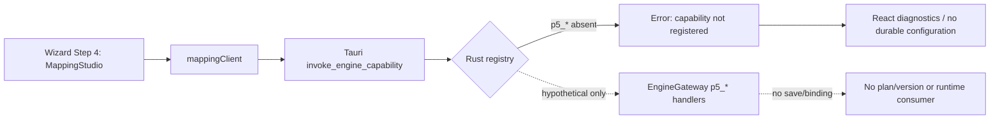

### B. Mapping path

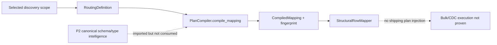

### C. Transformation/privacy/quality path

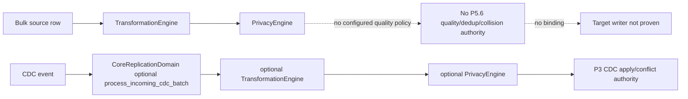

### D. SQL/hook path

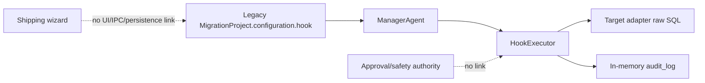

## 28. Shipping Reachability Matrix

| Capability | Implemented | Gateway exposed | Tauri registered | UI caller | Persisted | Reloadable | Runtime consumed | Proof |
|---|---:|---:|---:|---:|---:|---:|---:|---|
| mapping compile | yes | yes | no | yes | no | no | no | UNIT_PROVEN only |
| mapping validation | yes | yes | no | yes | no | no | no | UNIT_PROVEN |
| mapping preview | yes | yes | no | yes | no | no | no | UNIT_PROVEN |
| mapping templates | partial | yes | no | yes | no | no | no | IMPLEMENTED transient only |
| transformations | yes | yes | no | no | no | no | no proved | UNIT_PROVEN |
| privacy | yes | yes | no | no | policy no | no | optional only | UNIT_PROVEN |
| quality/dedup policy | no | no | no | no | no | no | no | NOT_IMPLEMENTED |
| target collision policy | no | no | no | UI local state | no | no | no | DEAD_CONTROL |
| CDC conflict config | P3 runtime exists | gateway paths exist | not shipping-listed | no | P3-specific | P3-specific | yes in P3 | INTEGRATION_PROVEN for P3, not Step 5 |
| SQL hooks | legacy yes | no Step-5 API | no | no | no | no | legacy manager | UNIT/legacy-runtime material |

No major Step-5 capability reaches **LIVE_PROVEN** through the shipping wizard.

## 29. UI / Backend / Product-Structure Drift

- Mapping Studio is structurally placed in current Step 4, despite being Step-5 scope.
- Mapping UI reads fixed field names rather than selected discovery metadata.
- `targetDefaults` is immutable empty state; no UI path supplies defaults.
- current Step 4 field projection checkboxes are uncontrolled `defaultChecked` inputs; changes are not captured or persisted.
- mapping client DTOs exist in TypeScript, but no Rust DTO/capability registration exists.
- `actionOnExisting`, rename pattern, masking state/method, error action, retries, sampling, notifications, and several configuration settings do not feed the planner or launch manifest.
- the launch manifest stores generic `tuning_rules`, not P5 mapping/transformation/privacy/quality/hook artifacts.
- P5 gateway handlers are backend-only because Rust blocks them.
- duplicate model families exist: P5 routing models vs legacy mapping configuration; P5 privacy models vs legacy masking configuration; P3 has multiple CDC policy worlds.

## 30. Duplicate Authority Map

| Responsibility | Competing implementations | Recommendation |
|---|---|---|
| mapping | P5 routing/compiler; legacy `MappingConfiguration`/`MappingEngine`; UI DTOs | KEEP P5 model/compiler + mapper; MERGE useful legacy inputs; replace legacy as authority |
| datatype conversion | P2 canonical type intelligence; legacy type-conversion rule; unused P5 field | KEEP P2; wire P5 to it; no new type authority |
| transformation | canonical P5 engine; legacy transformer wrapper | KEEP canonical; MERGE wrapper only |
| masking/privacy | canonical PrivacyEngine; legacy DataMasker; Step 6 local flags | KEEP PrivacyEngine; MERGE legacy adapter; REMOVE/RECTIFY UI-only flags |
| tokenization | PrivacyEngine/central token vault | KEEP_CANDIDATE |
| dedup | bulk zero-duplicate helper; P3 replay idempotency; absent P5 policy | keep distinct; BUILD P5.6 configuration only |
| target collision | Step 6 local dropdown; dialect-specific upsert helper | BUILD a policy model; do not treat upsert helper as authority |
| CDC conflict | synchronization executor; P3 multi-master resolver | KEEP P3; no duplicate resolver |
| quarantine | P3 conflict quarantine; P5.4 transient row quarantine | MERGE policy handoff semantics, retain P3 operational authority |
| SQL/hooks | legacy SQLHook/HookExecutor; generic callback hooks | MERGE into governed P5.7 model; do not make arbitrary callbacks canonical |
| persistence | P5 ProjectStore; CentralStateStore; legacy project memory | KEEP ProjectStore/CentralStateStore; replace memory as authority |
| templates | transient mapping export; no repository | P5.11 dependency |

## 31. Failure / Fail-Closed Matrix

| Condition | Current behavior | Classification |
|---|---|---|
| unregistered mapping capability | bridge rejects | FAIL_CLOSED |
| invalid mapping/PK ignored/duplicate target column | compiler diagnostic blocker | FAIL_CLOSED |
| duplicate target object | compiler blocker, even intended merge | FAIL_CLOSED but merge unsupported |
| missing target object/column | not checked against actual target | UNRESOLVED |
| unsupported/lossy datatype conversion | no P2 call | SILENT_DEFAULT / DEFERRED |
| invalid merge/split | not parsed | DEFERRED |
| invalid transformation/cycle | gateway catches compiler exception | FAIL_CLOSED in direct gateway call |
| malformed transformation record | engine supports policies | policy-dependent; no shipping path |
| lookup failure | engine policy-dependent | DEFERRED |
| invalid privacy strategy | enum conversion fails | FAIL_CLOSED in direct gateway call |
| missing HMAC secret | deterministic fallback key | FAIL_OPEN |
| privacy raw preview data | sanitizer invoked | PARTIAL; caller-provided data still enters process |
| duplicate without survivor policy | no P5.6 model | DEFERRED |
| unsupported collision policy | no model | DEFERRED |
| incompatible CDC policy | no Step-5 handoff | DEFERRED |
| dangerous SQL | no analyzer | UNRESOLVED/FAIL_OPEN |
| SQL timeout/failure | legacy executor timeout/raises unless ignored | PARTIAL |
| approval-required hook | no approval check | DEFERRED |
| stale discovery fingerprint | a P5 pre-execution fence exists, but not linked to current mapping | PARTIAL |
| changed selected scope | mapping compiles supplied scope only | DEFERRED |
| unsupported connector/mode | no capability-driven P5 UI | SILENT_DEFAULT/DEFERRED |
| source preview failure | fabricated rows returned success | FAKE_SUCCESS |

## 32. Proof-Level Matrix

| Area | Highest justified proof |
|---|---|
| Rust rejects unregistered P5 calls | INTEGRATION_PROVEN |
| MappingStudio renders/calls client | UNIT_PROVEN |
| P5 mapping compiler basic behavior | UNIT_PROVEN |
| structural mapper local row remap | IMPLEMENTED/UNIT_PROVEN |
| transformation engine local behavior | UNIT_PROVEN |
| privacy engine/token vault local behavior | UNIT_PROVEN |
| P3 CDC replay/conflict mechanisms | INTEGRATION_PROVEN within P3 |
| current wizard persistence/execution of Step-5 policy | NOT_PROVEN |
| end-to-end bulk/CDC same policy version | NOT_PROVEN |
| shipping Step-5 support | disproven by bridge/persistence trace |

## 33. Current Gap vs Future Gap

| Classification | Items |
|---|---|
| Frozen P0–P4 reusable authorities | P2 canonical types/schema/validation; P3 CDC replay/conflict/quarantine/reconciliation; P1 execution/checkpoint; P4 capability manifests |
| P5.1 implementation material | durable projects/plans/versions/execution-plan JSON in `artifacts/state.db` |
| P5.3 implementation material | routing, mapping compiler, structural mapper, mapping client/UI shell |
| P5.4 implementation material | AST transformation engine, malformed policies, CDC method |
| P5.5 implementation material | privacy engine, sanitizer, token vault, fingerprints |
| P5.6 implementation material | zero-duplicate helper and P3 mechanisms are reusable but not quality policy configuration |
| P5.7 implementation material | legacy hook model/executor/manager call sites |
| Genuine current Step-5 integration gaps | register/secure IPC; move Step-5 UI to correct boundary; durable versioned policy binding; plan/execution injection; capability-driven UI; eliminate fabricated preview success; bulk/CDC/validation consistency binding |
| Future not yet required | P5.10 governed approval/policy administration and P5.11 reusable template lifecycle infrastructure, except where needed to make hooks/templates operational |
| P5.8 dependency | canonical M1–M8 execution-mode authority and capability applicability are prerequisites for correct Step-5 presentation |

## 34. Reusable Reconstruction Material

The strongest reconstruction basis is:

1. P5.1 `ProjectStore` for durable versioned configuration, rather than a new store.
2. P5.3 `RoutingDefinition` + `PlanCompiler` + `StructuralRowMapper`, after P2 type compatibility is actually consumed.
3. P5.4 `TransformationEngine`, including AST, ordering, cycle checks, and malformed policies.
4. P5.5 `PrivacyEngine`, sanitizer, and token vault, after fail-closed key handling and durable policy binding.
5. P3 CDC conflict/replay/quarantine as unchanged runtime authority.
6. Legacy hooks only as source material for phases/timeout/transaction semantics; they need governed P5.7 modeling, persistence, and approval integration.

## 35. Unresolved Questions

- Whether any unexamined external daemon dynamically augments Rust capabilities at runtime; the checked shipping registry itself does not.
- Whether P5 plan persistence is invoked by a non-shipping API/client outside the checked desktop workflow.
- Whether target-side schema metadata is available to mapping compilation through a separate, non-wizard path.
- Whether CentralStateStore token-vault encryption/key-management is production-grade; this audit established policy wiring and fallback behavior, not cryptographic deployment configuration.
- Whether the second legacy CDC executor family is intentionally transitional or an active competing runtime path.

## 36. Final Step-5 Verdict

Step 5 is **not currently delivered by the shipping wizard**. AKAAL has meaningful but disconnected P5.1/P5.3/P5.4/P5.5/P5.7 implementation material and strong frozen P0–P4 authorities that Step 5 should consume. The main issue is not absence of all underlying code; it is absence of a single capability-driven, durable, versioned configuration path from UI through registered IPC into plan/runtime consumers, consistently across bulk, CDC, restart, and validation.

Step-5 forensic conclusion: frozen P0–P4 provides reusable schema, execution, connector, validation, and CDC-conflict authorities; unfinished P5 contains promising mapping, transformation, privacy, plan-store, and hook material; the genuine Step-5 gap is their missing shipping integration and versioned execution binding; P5.6/P5.7/P5.8/P5.10/P5.11 capabilities remain roadmap-owned and must not be misclassified as frozen P0–P4 defects.


# Workflow Step 6 — Enterprise Configuration Center

## 1. Step-6 Executive Truth

AKAAL has a real P5.1 canonical plan/compiler/persistence foundation and several real frozen runtime authorities for scheduling, resource control, CDC, validation, recovery, cutover, and governance. It does not currently compose them into a shipping, capability-driven Step-6 Enterprise Configuration Center.

The current wizard’s Step 6 is visually substantial but operationally narrow:

- `parallelism`, `batch_size`, `ram_limit_gb`, `validation_level`, and `enable_cdc` reach `generate_plan`;
- launch persists a subset in `tuning_rules`;
- `commit_interval` and `four_eyes_policy` are put into the launch manifest but are not proved consumed by the generated plan/runtime;
- collision, rename, masking, retry, sampling, error handling, notification, and mode state are local UI values and are silently dropped before execution;
- no Standard-mode synthesis, Advanced-mode metadata contract, dynamic applicability, scoped override UX, or Approval Barrier configuration exists.

## 2. Whole-Repository Coverage Map

| Repository world | Step-6 evidence |
|---|---|
| Shipping desktop UI | `NewMigrationWizard.tsx` Step 6 state/cards |
| Rust/Tauri | fixed capability registry |
| Gateway | `generate_plan`, transport, checkpoint, CDC/cutover/recovery handlers |
| P5.1 completed authority | `MigrationPlan`, `PlanVersion`, `ExecutionPlan`, `ConfigurationScope`, `PlanCompiler`, `ProjectStore` |
| P0/P1 runtime | scheduler, transport, recovery, checkpoints, resource/performance services |
| P2 | schema intelligence, compatibility, validation/reconciliation |
| P3 | CDC capture/apply/buffer/ordering/conflict/cutover/failback |
| P4 | connector capability and compatibility material |
| completed P5.2–P5.6 | selected scope, mapping/data controls compiled artifacts, privacy/quality runtime candidates |
| governance | fixed approval engines, four-eyes checks, plan fingerprint checks |
| legacy AKAAL/NexusForge | project-level performance, mapping/masking/hooks configuration and manager paths |
| persistence | `artifacts/state.db`, CentralStateStore, legacy in-memory stores |

## 3. Current 7-Step → Frozen 9-Step UI Mapping

| Current 7-step wizard | Frozen 9-step workflow | Truth |
|---|---|---|
| 1 Overview | 1 Migration Definition | partial metadata only |
| 2 Source Connection | 2 Source Instance | source setup |
| 3 Target Connection | 3 Target Instance | target setup |
| 4 Discovery & Scope | 4 Discovery & Advanced Scope | primary discovery/scope UI |
| MappingStudio embedded in Step 4 | 5 Mapping & Data Controls | misplaced and unregistered |
| 5 Dynamic Execution Plan | 7 Dynamic Migration Plan | reachable plan generation |
| 6 Enterprise Configuration Center | 6 Enterprise Configuration Center | partial visual surface; mostly local state |
| approval/review/launch in Step 7 | 8 Governance; 9 Review/Schedule/Initialize | merged/partial |

## 4. Current 7-Step Wizard Step-6 Support Verdict

**DOES THE CURRENT SHIPPING 7-STEP WIZARD ACTUALLY SUPPORT THE CANONICAL STEP 6? — NO.**

It supports a narrow set of settings flowing to plan generation, but not the canonical Standard/Advanced configuration experience.

| Current control | Physical path | Classification |
|---|---|---|
| Parallel workers | UI → `generate_plan` payload → P5.1 `plan.configuration` → compiled DAG display | PARTIAL_CONTROL |
| Batch insertion size | same path | PARTIAL_CONTROL |
| RAM quota | same path | PARTIAL_CONTROL |
| Validation strategy | same path | PARTIAL_CONTROL |
| CDC checkbox | same path | PARTIAL_CONTROL |
| Commit interval | launch manifest `tuning_rules` only | SILENTLY_IGNORED |
| Four-eyes checkbox | launch manifest `tuning_rules` only | SILENTLY_IGNORED |
| Existing-table action | React state only | DEAD_CONTROL |
| Table rename pattern | React state only | DEAD_CONTROL |
| PII masking checkbox/method | React state only | DEAD_CONTROL |
| Sampling percentage | React state only | DEAD_CONTROL |
| Error action | React state only | DEAD_CONTROL |
| Retry count | React state only | DEAD_CONTROL |
| Notification checkboxes | React state only | DEAD_CONTROL |
| Basic/Advanced selector | chooses card presentation only | UI_ONLY |

The relevant UI is [`NewMigrationWizard.tsx`](A:\temp_akaal\akaal_software\src\screens\MigrationModule\NewMigrationWizard.tsx). The canonical plan path is [`engine_gateway.py`](A:\temp_akaal\akaal\gateway\engine_gateway.py) → [`plan_compiler.py`](A:\temp_akaal\akaal\planner\engine\plan_compiler.py) → [`project_store.py`](A:\temp_akaal\akaal\planner\persistence\project_store.py).

## 5. Candidate Inventory

| Candidate | Responsibility | Persistence/reachability | Classification |
|---|---|---|---|
| Wizard Step 6 cards | UI choices | mostly React-only | RECTIFY_CANDIDATE |
| `generate_plan` | creates P5 plan/version/execution plan | registered/reachable, durable P5 plan | KEEP_CANDIDATE |
| `ConfigurationScope` | default/override precedence resolver | model only in current generate path | COMPLETED_P5_1_IMPLEMENTATION |
| `PlanCompiler` | effective config, compatibility validation, immutable execution plan | durable result via ProjectStore | KEEP_CANDIDATE |
| `ProjectStore` | plans, versions, immutable execution plans | `artifacts/state.db`, reloadable | KEEP_CANDIDATE |
| scheduler config | workers/retries/queue caps | runtime-local unless independently injected | EXISTING_P0_P4_IMPLEMENTATION |
| adaptive batch/parallelism | runtime adaptation | gateway-instantiated but not configured by wizard | EXISTING_P0_P4_IMPLEMENTATION |
| performance resource/governor | bandwidth/resource limits | independent defaults/hot-reload path | MERGE_CANDIDATE |
| P3 CDC config/runtime | capture/apply/cutover/failback | separate P3 paths | KEEP_CANDIDATE |
| approval engines | fixed ordered gate/governance paths | mixed memory/CentralStateStore | P5_10_IMPLEMENTATION_MATERIAL |
| legacy `MigrationProject` settings | historical performance fields | legacy in-memory project world | LEGACY_ONLY |
| legacy SQL hooks | lifecycle SQL execution | no shipping Step-6 path | P5_7_IMPLEMENTATION_MATERIAL |

## 6. Standard Mode Findings

There is no legitimate shipping Standard Mode.

The UI’s `BASIC` mode is not a Standard Mode synthesizer. It does not derive safe low-level settings from scope, topology, connector capabilities, risk, resource envelope, migration window, or execution mode. It does not display a resolved effective configuration or its provenance.

The closest reusable material is P5.1:

- `ConfigurationScope.resolve()` deterministically applies platform, workspace, environment, project, then plan overrides;
- `PlanCompiler.compile()` emits `resolved_configuration` and provenance into an immutable `ExecutionPlan`;
- advisory analyzers exist for worker/batch/checkpoint/resource recommendations.

But current `generate_plan` constructs `ConfigurationScope(plan_overrides=plan.configuration)` only. It does not populate platform/workspace/environment/project values, call an operator-facing synthesis service, or expose the resulting values in the wizard.

Verdict: **Standard Mode absent; P5.1 foundation reusable.**

## 7. Standard Recommendation / Synthesis Findings

| Requirement | Existing evidence | Verdict |
|---|---|---|
| deterministic recommendation engines | Advisor analyzers for batch, workers, checkpoint, resource, parallelism | backend material |
| capability-aware recommendation | compiler checks broad connector compatibility | partial |
| use discovered volume/topology/risk | `generate_plan` can access risk snapshot | not proved used for settings |
| visible effective configuration | execution plan stores it | not displayed as resolved Standard Mode |
| safe default derivation | runtime/default values exist | defaults, not demonstrated synthesis |
| Standard → Advanced preservation | no mode-switch state model | absent |
| Advanced → Standard override handling | no override provenance/UI model | absent |

The wizard’s visible “recommended” posture is therefore **STATIC_DISPLAY / FAKE_RECOMMENDATION risk**, not proof of a synthesis engine.

## 8. Advanced Mode Control-Domain Matrix

| Domain | Existing authority | Current Step-6 control | Shipping integration |
|---|---|---|---|
| A Connection/session | connector/adapters, legacy connection config | none | absent |
| B Discovery metadata | Scout/P2/P4 | none | absent |
| C Partitioning | partition algorithms/P3 sharding | none | absent |
| D Workers | scheduler/adaptive parallelism | global parallelism only | partial |
| E Batching | adaptive batch/runtime | batch size only | partial |
| F Memory/queues | resource governor/scheduler/CDC buffers | RAM display only | partial/dead |
| G Bandwidth | resource manager token bucket | none | absent |
| H Bulk transport | transport/writers | existing-table action UI only | dead |
| I LOB | adapters/legacy GB flow | none | absent |
| J Checkpointing | P1/P3 checkpoints | none | absent |
| K Retry/failure | scheduler/runtime/legacy project | retry/error UI only | dead |
| L Recovery | recovery coordinator/resume engine | none | absent |
| M CDC capture | P3 source/coordinator | checkbox only | partial |
| N CDC buffer/backlog | P3 buffer/monitoring | none | absent |
| O CDC apply | P3 apply manager | none | absent |
| P Multi-master | P3 topology/conflicts | none | absent |
| Q M4 incremental polling | incremental manager/store | none | absent |
| R M5 state sync | reconciliation/comparison | none | absent |
| S Validation | P2/P3 validation | validation level only | partial |
| T Repair | P2/P3 repair/healing | none | absent |
| U Schema execution | P2/P1 DDL execution | none | absent |
| V P5.3–P5.6 runtime policies | completed P5 authorities | none | absent |
| W SQL/hooks | legacy hooks | none | P5.7 material |
| X Cutover | P3 cutover | none | absent |
| Y Failback | P3 failback | none | absent |
| Z Telemetry | P1/P3 monitoring | notification toggles only | dead |
| AA Windows/scheduling | limited repair scheduler material | none | absent |
| AB Approval barriers | fixed gate/governance material | four-eyes checkbox only | silently ignored |
| AC Connector-specific controls | P4 manifests/compatibility | none | absent |

## 9. Connection / Session Findings

Connection/session options exist in adapters and legacy `ConnectionConfig`: host, port, credentials, SSL-oriented values, and connection behavior. The current Step 6 neither presents nor persists pool min/max, acquisition/idle/lifetime timeout, keepalive, session initialization, isolation, tunnel/bastion, auth refresh, or connector-specific options.

Status: **EXISTING_P0_P4/P4 authority; REQUIRED_BY_CURRENT_STEP6_BOUNDARY integration absent.**

## 10. Discovery / Metadata Configuration Findings

Step 4 owns discovery. Existing discovery profiles and P2/P4 metadata pipelines are reusable. Step 6 offers no legitimate runtime knobs for discovery depth, refresh, cache policy, metadata batching, sampling, dependency traversal, or inspection concurrency.

Status: **not a duplicate-authority gap; Step-6 composition surface absent.**

## 11. Partitioning Findings

Partition schemes, bounds, compatibility analysis, CDC sharding, and transport partitioning exist. No current Step-6 UI or plan contract configures partition strategy, key, count, size, skew handling, hot partitions, reassignment, or dynamic repartitioning.

Status: **runtime/planner material exists; Step-6 control surface absent.**

## 12. Workers / Parallelism Findings

The wizard’s `parallelism` is sent to `generate_plan`, stored as raw plan configuration, reflected in a DAG detail string, and included in launch `tuning_rules`.

This does **not** prove it reaches `SchedulerConfiguration.max_workers`, per-object workers, reader/writer/validator/CDC workers, or adaptive parallelism. The scheduler independently validates 1–64 workers, but the wizard’s value is only `parseInt(...)` with fallback defaults and is not validated against that scheduler contract before plan creation.

Answer to hostile question 1: **No. A UI value of 32 is proven to reach the plan payload/DAG display, not the worker authority.**

## 13. Batching Findings

`batch_size` follows the same limited path: UI → plan payload → raw configuration/DAG text → manifest tuning rule. It is not proved injected into bulk reader/writer, CDC apply, adaptive batch optimizer, or checkpoint batching.

Answer to hostile question 3: **No exact runtime consumer is proven for the Step-6 batch value.**

## 14. Memory / Buffer / Queue Findings

The repository has:

- `ResourceGovernor` CPU/RAM/network limits;
- scheduler queue maximum validation;
- CDC buffers/backpressure;
- runtime resource allocation;
- adaptive performance material.

The Step 6 RAM quota is only passed to plan generation and launch manifest. No proof binds it to resource governor, per-worker memory, queue capacities, watermarks, spill-to-disk, or backpressure settings.

Status: **UI partial; runtime authority separate.**

## 15. Bandwidth / Throttling Findings

`ResourceManager` implements a token-bucket bandwidth limiter with a default 100 Mbps. Performance services also expose throttling concepts. The wizard contains no bandwidth control, no per-source/target/migration rate policy, and no capability-aware connector throttling.

Answer to hostile question 2: **No. There is no current 100 MB/s wizard control or proven transport throttling binding.**

## 16. Bulk Transport Findings

P1/runtime transport and dialect writers support physical transfer. The UI “existing target table” choices (`SKIP`, `OVERWRITE`, `MERGE`) do not reach `generate_plan`, the manifest, target writer, or a collision policy authority.

No Step-6 controls configure fetch size, write mode, transaction boundary, native load, staging, constraint/index behavior, compression, target preparation/finalization, or ordering.

Status: **target-collision UI is DEAD_CONTROL.**

## 17. LOB Findings

LOB support appears in source capabilities and legacy GB-agent handling, including chunk size and integrity checks. It is not part of the shipping Step-6 configuration model and no LOB strategy/chunk/buffer/retry/checkpoint UI exists.

Status: **legacy/runtime material; current surface absent.**

## 18. Checkpointing Findings

P1/P3 contain checkpoints, resume validation, CDC checkpoint stores, checkpoint HMAC/fencing-related mechanisms, and `trigger_checkpoint` capability. The wizard exposes none of the checkpoint frequency, durability, retention, granularity, compaction, or restart settings.

Status: **frozen reusable authority; Step-6 configuration absent.**

## 19. Retry / Failure Findings

The scheduler validates bounded retry count/backoff and has retry classification/backoff behavior. The Step 6 UI’s retry count and error action never enter plan generation or launch manifest.

Thus:

- UI `retryCount`: **DEAD_CONTROL**;
- UI `errorAction`: **DEAD_CONTROL**;
- scheduler runtime retry: **EXISTING_P0_P4_IMPLEMENTATION**, independently defaulted.

## 20. Recovery Findings

`RecoveryCoordinator`, deterministic resume, scheduler checkpoints, and CDC recovery/cutover recovery exist. The wizard provides no recovery policy, governed recovery choice, reassignment configuration, replay policy, recovery concurrency, or restart-boundary view.

Status: **runtime authority present; Step-6 operational composition absent.**

## 21. CDC Capture Findings

P3 contains source-specific CDC, capture prerequisites, source position, transactions, schema evolution, heartbeat, checkpoints, and retention-related machinery. Current Step 6 only exposes `enableCdc`, which reaches `generate_plan` and conditionally adds a CDC DAG stage.

It does not configure capture mechanism, start position, capture batch/frequency, native options, source retention, heartbeat, or retry.

Status: **PARTIAL_CONTROL only.**

## 22. CDC Buffer / Backlog Findings

P3 includes CDC buffer, backpressure, monitoring, checkpoint/ACK frontier, cutover readiness, and capacity-oriented behavior. None is exposed or persisted via Step 6.

Status: **P3 authority retained; configuration integration absent.**

## 23. CDC Apply Findings

P3 CDC apply supports batching, ordering, transactions, idempotency, replay, and parallelism-related handlers. The gateway contains CDC parallelism/configuration handlers, but they are not part of the shipping Rust registry’s default capability list and have no current Step-6 UI caller.

Status: **BACKEND_ONLY / existing P3 authority.**

## 24. Bidirectional / Multi-Master Findings

P3 provides topology, provenance, echo suppression, conflict detection/resolution, quarantine, fencing, and cutover eligibility. Step 6 has no bidirectional/multi-master controls, conflict-policy composition, governed release control, or capability applicability logic.

Status: **P3 authority; no Step-6 surface.**

## 25. Incremental Polling M4 Findings

Incremental manager/store material exists, including watermark concepts. No shipping Step-6 M4 control configures key, initial watermark, interval, overlap, lookback, ordering, late-arrival behavior, retry, or schedule.

The inspected code did not prove a watermark advancing before target commit, but it also did not prove an end-to-end durable safe-watermark contract in the shipping flow.

Status: **P5_8_IMPLEMENTATION_MATERIAL / UNRESOLVED end-to-end correctness.**

## 26. State Synchronization M5 Findings

State comparison/reconciliation/repair material exists, but no Step-6 M5 controls expose comparison boundaries, Merkle/checksum depth, mismatch thresholds, repair eligibility, repair batching, or revalidation.

Status: **P5_8_IMPLEMENTATION_MATERIAL; current UI absent.**

## 27. Validation Findings

`validation_level` is the strongest current Step-6 control:

```text
UI → generate_plan payload → P5.1 configuration → conditional validation DAG stage
```

The plan compiler omits the validation stage if value is `NONE`. That still does not prove the selected validation level configures the actual P2/P3 validation runtime. Sampling rate is not sent anywhere.

Status: **PARTIAL_CONTROL; validation authority remains P2/P3.**

## 28. Reconciliation / Repair Findings

Reconciliation/repair and governance-related repair material exists, including P3 cutover validation. No current Step-6 controls configure repair depth, automatic/governed repair, thresholds, scope, idempotency, fencing, or revalidation.

Status: **existing runtime authority; surface absent.**

## 29. Schema Execution Findings

P2/P1 schema intelligence/execution and dependency ordering are reusable. `execute_schema` is registered, but Step 6 does not configure DDL behavior, transactional behavior, unsupported object policy, constraints/indexes/FKs/sequences, rollback, or schema-only applicability.

Status: **frozen authority, no canonical Step-6 control surface.**

## 30. Mapping / Transformation / Privacy / Quality Runtime Findings

Per the authoritative roadmap state, P5.3–P5.6 own these completed policy-definition authorities. Step 6 should configure their execution behavior, not recreate their models.

Current Step 6 does not bind the completed compiled/versioned P5 artifacts to `ExecutionPlan.resolved_configuration`, bulk transport, CDC processing, restart, or validation.

The visible masking controls are local state only and must not be counted as P5.5 runtime configuration.

Status: **genuine Step-6 integration gap, not a request to reopen P5.3–P5.6.**

## 31. Custom SQL / Hook Findings

Legacy `SQLHook`, `HookExecutor`, and manager hook call sites provide early functionality for lifecycle phases, timeout, transaction and rollback flags. There is no shipping Step-6 hook authoring/configuration path, safety analysis, parameterization, approval binding, durable audit, or immutable plan binding.

Status: **P5_7_IMPLEMENTATION_MATERIAL.**

## 32. Cutover Findings

P3 supplies cutover readiness, preparation, validation, approval, commit, abort, recovery, fencing, backlog/conflict gates, and CDC-specific paths. These gateway handlers are mostly not registered in the shipping registry and are not exposed by Step 6.

Status: **P3 authority exists; Step-6 composition absent.**

## 33. Failback Findings

P3 contains failback evaluation/execution and CDC failback paths. The current wizard has no eligibility, divergence, reverse-sync, primary authority, fencing, approval, or split-brain configuration.

Status: **P3 authority; no shipping configuration.**

## 34. Observability / Telemetry Findings

P1/P3 provide runtime snapshots, events, monitoring, metrics, and reporting. Step 6 notification toggles do not configure a notifier/telemetry authority. Migration-level telemetry controls are absent; broader fleet observability remains **FUTURE_P6**, not a Step-6 defect.

## 35. Scheduling / Runtime Window Findings

No shipping Step-6 scheduling, maintenance window, blackout, deadline, pause window, throttled window, recurring polling, or overrun policy exists. Existing maintenance-window material is repair-scheduler-oriented, not migration Step-6/Step-9 scheduling.

Status: **Step-6/Step-9 product integration absent; full scheduler lifecycle belongs later roadmap work as applicable.**

## 36. Approval Barrier Findings

**DOES AKAAL CURRENTLY HAVE A FIRST-CLASS CUSTOM APPROVAL BARRIER / APPROVAL NODE SYSTEM? — NO.**

Existing approval material includes:

- `ApprovalEngine`: fixed ordered gates 1–3, in-memory requests/tokens/decisions;
- `ApprovalGateStep`: workflow step waiting for a fixed gate;
- governance approval workflow: role steps and four-eyes flag, in memory;
- gateway approval packets persisted in CentralStateStore;
- `AkaalSuperEngine.verify_governance_authorization`: fail-closed pre-start fingerprint verification;
- P3 cutover/failback approval mechanisms.

It does not provide a first-class `ApprovalBarrier`/`ApprovalNode` model attachable at arbitrary safe DAG boundaries.

| Barrier requirement | Current truth |
|---|---|
| add at arbitrary safe DAG boundary | No |
| durable barrier identity/configuration | No |
| protected execution-node linkage | No |
| plan/version/fingerprint binding | partial only for whole-plan approval |
| durable wait state/restart reconstruction | No proven general mechanism |
| execution fence before whole migration | Yes, pre-transport fingerprint gate |
| exact-once protected node release | No |
| quorum | No approval quorum model; distributed cluster quorum is unrelated |
| four-eyes | partial fixed validation/flag, not barrier semantics |
| expiry/rejection/delegation | ApprovalEngine supports them in memory |
| escalation | governance workflow has limited workflow material, not barrier integration |
| policy-required barrier cannot be removed | No |
| stale approval invalidation | whole-plan fingerprint mismatch fails closed; no individual barrier invalidation |
| configure in Step 6 | No |
| visualize/add in Step 7 | No |
| evaluate in Step 8 | only fixed approval paths |
| freeze in Step 9 | no barrier artifact exists to freeze |

Full custom approval-barrier administration/execution integration is **P5_10_IMPLEMENTATION_MATERIAL / remaining roadmap**, verified later under P5.12.

## 37. Connector-Specific Dynamic Control Findings

P4 capability/compatibility material exists, but current React controls are relational, static, and connector-agnostic. There is no metadata contract from a connector manifest to dynamically generate controls.

Unsupported controls are not consistently hidden, disabled with reasons, or rejected. They are commonly never sent at all.

## 38. Scoped Override / Precedence Findings

`ConfigurationScope` models:

```text
platform defaults
→ workspace defaults
→ environment defaults
→ project overrides
→ plan overrides
```

This is the strongest existing precedence candidate. It does not model the canonical remaining scopes:

```text
execution mode → DAG stage/node → object/table → partition/worker → connector-specific
```

Nor does it provide nested-object merging, explicit-null semantics, validation/conflict policy, UI provenance, override history, or a mode-switch contract.

Current `generate_plan` uses only `plan_overrides`, making all higher levels inert.

## 39. Configuration Metadata Contract Findings

No first-class control metadata contract was found for:

- control ID/domain/type;
- default source/provenance;
- range/enum validation;
- applicability predicate;
- mutability;
- restart/recompile/approval impact;
- sensitivity;
- connector support;
- UI widget/help;
- override scope;
- effective-value display.

The repository instead contains scattered dataclasses, defaults, gateway payload dictionaries, and UI state.

## 40. Standard ↔ Advanced Switching Findings

`configMode` is a local `'BASIC' | 'ADVANCED'` React state. It does not select a different configuration model, resolver, plan type, or persistence behavior.

No evidence supports:

- preserving resolved Standard choices as Advanced overrides;
- reconciling Advanced values when returning to Standard;
- warning before discarding expert overrides;
- handling controls unavailable under a changed connector/mode.

Status: **UI_ONLY.**

## 41. Execution-Mode Applicability Matrix

Canonical M1–M8 is still P5.8 work. Current UI does not consume it.

| Mode | Relevant Step-6 controls | Current behavior |
|---|---|---|
| M1 Bulk | workers, batch, memory, target load, validation | only a few generic fields shown |
| M2 Bulk + CDC | M1 plus CDC capture/apply/buffer/cutover | CDC checkbox only |
| M3 CDC | CDC controls, apply workers, backlog, conflict/cutover | bulk settings still shown incorrectly |
| M4 Polling | watermark, interval, lookback, schedule | absent |
| M5 State sync | compare/repair thresholds | absent |
| M6 Schema only | DDL/ordering/rollback | row/CDC controls not truthfully suppressed |
| M7 Data only | data transport/quality/validation | generic controls only |
| M8 Validation only | validation/read-only telemetry | destructive-target-like controls not suppressed |

## 42. Connector-Family Applicability Matrix

| Family | Can current UI derive truthful controls? | Actual current treatment |
|---|---|---|
| Relational | P4/P2/P3 material could support it | hardcoded relational assumptions |
| Warehouse/lakehouse | capabilities could drive staging/load controls | no dynamic UI |
| NoSQL/document | collection/field/session options required | no dynamic UI |
| Wide-column | key/partition controls required | no dynamic UI |
| Graph | entity/edge/property controls required | no dynamic UI |
| Key-value | key/value and collision rules required | no dynamic UI |
| Search/index | document/index/write options required | no dynamic UI |
| Streaming | topic/event/offset/consumer options required | no dynamic UI |
| Object/HDFS/files | file/dataset/format/window options required | no dynamic UI |
| Managed cloud profiles | provider-native controls needed | no dynamic UI |

## 43. Configuration Persistence / Versioning / Restart Findings

| Artifact | Durable | Reloadable | Fingerprinted/versioned | Runtime-bound |
|---|---:|---:|---:|---:|
| P5 MigrationPlan configuration | yes | yes | plan version/fingerprint | partial |
| P5 resolved execution config | yes | yes | immutable execution plan | not proved consumed |
| wizard local settings | no | no | no | no |
| launch manifest tuning rules | migration state | yes | only indirectly in whole spec fingerprint | partial/unproven |
| scheduler config | typically runtime-local | no proven generic restore | no | runtime only |
| CDC state/checkpoints | P3-specific durable paths | yes in relevant components | P3-specific | yes |
| legacy project config | legacy/in-memory | not proved restart-safe | no | legacy-only |
| whole migration approval record | CentralStateStore | yes | whole-plan fingerprint | pre-start only |

The immutable `ExecutionPlan` can contain effective configuration. The shipping execution path, however, uses the separately persisted migration manifest/config and dynamically merges request payload changes in `start_transport`; it does not prove it loads and applies the exact immutable `resolved_configuration`.

## 44. Configuration Compilation / Effective-Value Findings

Existing canonical compilation candidate:

```text
MigrationPlan + PlanVersion + ConfigurationScope
→ PlanCompiler.compile()
→ effective_config + provenance
→ immutable ExecutionPlan fingerprint
```

This is the authority to retain.

But `generate_plan` feeds raw wizard payload into `MigrationPlan.configuration`, uses only plan-level overrides, and does not validate a typed Step-6 schema. At execution, `start_transport` merges transport payload values with saved config. This creates risk that runtime settings can diverge from the plan’s effective configuration.

Answer to hostile question 20: **The immutable execution snapshot contains `resolved_configuration`, but consumption of that exact snapshot by runtime is not proven.**

## 45. Dynamic Mutability Matrix

| Control family | Current proven mutability |
|---|---|
| workers / batch / RAM from wizard | PRE_COMPILE_ONLY in effect; runtime update unproven |
| validation level / CDC flag | PRE_COMPILE_ONLY in plan DAG construction |
| runtime scheduler retry/backoff | runtime implementation exists; UI binding absent |
| performance hot reload | generic `ConfigurationHotReloader`; not bound to migration plan or wizard |
| P3 CDC operational config | component-specific/runtime paths; Step-6 binding absent |
| mapping/privacy/quality artifacts | should be immutable/version-bound; current runtime injection unproven |
| approvals | whole-plan pre-start gate; no mutable node barrier system |
| connector/session controls | no product mutability contract |

## 46. Configuration Change Impact Matrix

| Change | Current impact behavior |
|---|---|
| wizard setting before plan generation | raw value may enter plan payload |
| local-only setting | no action; silently lost |
| plan configuration changed/versioned through P5 path | plan diff can flag reapproval for selected critical keys |
| change after approval | SuperEngine whole-plan fingerprint check can reject transport |
| arbitrary `start_transport` payload change | merged into runtime spec; fingerprint verification may reject if fingerprint changes |
| connector/discovery scope change | compiler has some compatibility/drift checks; shipping recompile path incomplete |
| runtime tuning change | no Step-6 impact-analysis model |
| privacy fingerprint change on resume | resume validator can fail closed |
| approval barrier change | no barrier model exists |

## 47. Current Call / Data Flows

### A. Current shipping Step-6 UI

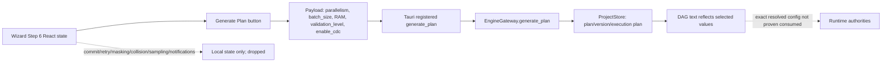

### B. Existing/intended Standard Mode

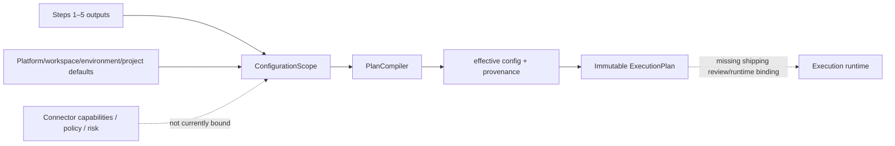

### C. Advanced Mode

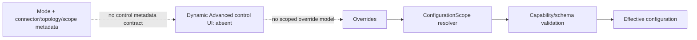

### D. Runtime consumption

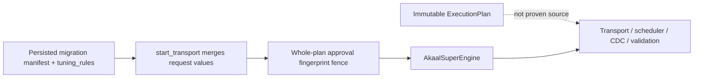

### E. Approval barrier

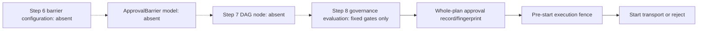

## 48. Shipping Reachability Matrix

| Capability | UI | Gateway | Rust registered | Durable | Reloadable | Runtime consumed | Proof |
|---|---:|---:|---:|---:|---:|---:|---|
| plan generation | yes | yes | yes | yes | yes | DAG only proven | INTEGRATION_PROVEN |
| worker count | yes | through plan | yes | plan/manifest | yes | no | PARTIAL_CONTROL |
| batch size | yes | through plan | yes | plan/manifest | yes | no | PARTIAL_CONTROL |
| RAM quota | yes | through plan | yes | plan/manifest | yes | no | PARTIAL_CONTROL |
| validation level | yes | through plan | yes | plan/manifest | yes | validation stage only | PARTIAL_CONTROL |
| CDC enabled | yes | through plan | yes | plan/manifest | yes | CDC DAG stage only | PARTIAL_CONTROL |
| retry/error action | yes | no | n/a | no | no | no | DEAD_CONTROL |
| masking/collision/rename | yes | no | n/a | no | no | no | DEAD_CONTROL |
| checkpoints/recovery | no | some gateway paths | selected registrations only | component-dependent | partial | yes in runtime worlds | EXISTING_P0_P4_IMPLEMENTATION |
| advanced connector controls | no | partial backend | mostly unregistered | no Step-6 contract | no | component-specific | BACKEND_ONLY |
| custom barriers | no | no | no | no | no | no | NOT_IMPLEMENTED |

## 49. UI / Backend / Product-Structure Drift

- `BASIC` is not canonical Standard Mode.
- `ADVANCED` does not expose all legitimate applicable controls.
- displayed config values are not a typed cross-layer DTO.
- most Step-6 state has no backend payload.
- `generate_plan` accepts raw dictionaries rather than a validated Step-6 contract.
- plan creation always uses `PlanningMode.SIMPLE`, regardless of the UI’s `configMode`.
- `generate_plan` defaults missing project/source/target values, which can hide missing configuration.
- launch manifest’s `tuning_rules` differs from plan payload/configuration.
- runtime may merge transport-call overrides separately from immutable plan config.
- no connector/mode capability-driven control generation exists.

## 50. Duplicate Authority Map

| Responsibility | Authorities | Recommendation |
|---|---|---|
| configuration resolution | P5.1 `ConfigurationScope`; scattered runtime defaults; legacy project fields | KEEP P5.1 as canonical resolver; merge runtime metadata |
| plan compilation | P5.1 compiler; gateway plan wrapper | KEEP compiler; rectify gateway input contract |
| worker/batch tuning | scheduler, adaptive optimizers, wizard state, legacy project fields | retain runtime engines; remove wizard as independent authority |
| memory/bandwidth | ResourceGovernor/ResourceManager; wizard RAM state | retain performance authority; wire configuration through compiler |
| CDC | P3 components/gateway handlers/wizard checkbox | retain P3; Step 6 composes inputs only |
| validation | P2/P3; wizard enum | retain P2/P3; use Step 6 only for selected policy |
| approvals | workflow approval engine, governance workflow, gateway packets, SuperEngine fence | consolidate under P5.10; do not create a fourth engine |
| hooks | legacy executor/model | P5.7 material; no new hook execution engine |
| persistence | P5 ProjectStore/CentralStateStore/legacy memory | keep ProjectStore/CentralStateStore; retire memory as authority |

## 51. Failure / Fail-Closed Matrix

| Case | Current behavior | Classification |
|---|---|---|
| missing/invalid plan topology | compiler blocks in some cases | FAIL_CLOSED |
| incompatible connectors | compiler can block | FAIL_CLOSED |
| compatibility exception | compiler emits warning and continues | WARNING_ONLY |
| unknown UI local setting | dropped | SILENT_DEFAULT |
| invalid UI numeric parse | JS fallback (`||` defaults) | SILENT_DEFAULT |
| worker range unsuitable for scheduler | not checked at wizard/plan boundary | DEFERRED |
| unsupported connector option | no dynamic control contract | DEFERRED |
| missing approval | SuperEngine rejects transport | FAIL_CLOSED |
| stale approved fingerprint | SuperEngine rejects transport | FAIL_CLOSED |
| privacy fingerprint mismatch on resume | resume validator rejects | FAIL_CLOSED |
| arbitrary whole-plan approval packet | gateway persists packet; full governance semantics incomplete | PARTIAL |
| missing HMAC/privacy secret | privacy engine fallback noted in Step 5 audit | FAIL_OPEN |
| stale discovery | P5 compiler/pre-execution material exists | PARTIAL |
| queue/memory unbounded via Step 6 | no Step-6 path reaches queues | UNRESOLVED |
| watermark-before-commit | no shipping M4 binding | UNRESOLVED |
| approval barrier bypass on restart | no general barrier state exists | UNRESOLVED |

## 52. Proof-Level Matrix

| Capability | Highest justified proof |
|---|---|
| P5.1 plan/version/execution-plan persistence | INTEGRATION_PROVEN |
| current `generate_plan` bridge path | INTEGRATION_PROVEN |
| values reflected in plan DAG | INTEGRATION_PROVEN |
| exact worker/batch/RAM runtime consumption | IMPLEMENTED runtime pieces, not Step-6 integration proven |
| scheduler bounds/retry | UNIT_PROVEN / runtime implementation |
| P3 CDC/cutover/recovery authorities | INTEGRATION_PROVEN in their own domain |
| whole-plan approval fingerprint gate | INTEGRATION_PROVEN |
| custom approval barriers | NOT_IMPLEMENTED |
| Standard/Advanced product modes | NOT_IMPLEMENTED |
| connector-driven Step-6 controls | NOT_IMPLEMENTED |
| live external-system effects | no LIVE_PROVEN evidence |

## 53. Current Gap vs Future Gap

| Classification | Findings |
|---|---|
| EXISTING_P0_P4_IMPLEMENTATION | scheduler, resource governor, performance controls, checkpoint/recovery, P2 validation/schema, P3 CDC/cutover/failback, P4 capabilities |
| COMPLETED_P5_1_IMPLEMENTATION | plan/version/execution-plan persistence, effective config/provenance/fingerprint |
| COMPLETED_P5_2–P5_6_IMPLEMENTATION | selected scope and compiled mapping/data-control policy authorities to be consumed, not rebuilt |
| REQUIRED_BY_CURRENT_STEP6_BOUNDARY | typed configuration contract, UI-to-plan binding, effective-config review, runtime injection, capability-driven visibility, drift prevention |
| P5_7_IMPLEMENTATION_MATERIAL | custom SQL/hooks |
| P5_8_IMPLEMENTATION_MATERIAL | canonical M1–M8 execution-mode applicability |
| P5_9_IMPLEMENTATION_MATERIAL | workspace/environment default administration |
| P5_10_IMPLEMENTATION_MATERIAL | custom ApprovalBarrier/ApprovalNode and policy/RBAC administration |
| P5_11_IMPLEMENTATION_MATERIAL | reusable templates/config lifecycle |
| FUTURE_P6 | fleet/platform observability expansion |
| FUTURE_P7 | broader security/compliance enforcement |
| FUTURE_NOT_YET_REQUIRED | later certification/packaging scopes |

## 54. Reusable Reconstruction Material

Use, do not duplicate:

1. `ConfigurationScope` and `PlanCompiler` as the canonical configuration resolver/compiler.
2. `ProjectStore` for plans, versions, immutable execution plan persistence, and restart reconstruction.
3. P2/P3/P4 authorities for schema, validation, CDC, recovery, cutover, and connector truth.
4. scheduler/adaptive/resource components as execution consumers of resolved values.
5. whole-plan fingerprint fencing as a foundation for future P5.10 barriers.
6. completed P5.2–P5.6 compiled artifacts as inputs to execution configuration.
7. legacy hooks only as P5.7 source material.

## 55. Unresolved Questions

- Whether an external process injects a runtime configuration adapter not referenced by the checked gateway/desktop path.
- Whether non-desktop APIs bind P5.1 `resolved_configuration` into scheduler/transport construction.
- Whether P3’s unregistered gateway capabilities are intentionally internal or simply unexposed from shipping Tauri.
- Whether a durable governance platform implementation supersedes the examined in-memory approval engines at deployment time.
- Whether runtime configuration defaults are captured separately in execution evidence outside the inspected stores.

## 56. Final Step-6 Verdict

A. **Standard Mode:** No shipping Standard Mode. P5.1 provides a reusable resolver/fingerprint foundation, not an operator-facing synthesis experience.

B. **Advanced Mode:** No shipping Advanced Mode. The UI selector is local presentation state, not a capability-generated control surface.

C. **Current 7-step wizard support:** **NO.** A few settings reach plan generation; the majority are local-only and silently discarded.

D. **Configuration persistence/versioning:** P5.1 plan/version/execution-plan persistence is real and restart-reconstructible. Wizard settings are inconsistently persisted, and most are not persisted at all.

E. **Runtime consumption:** Scheduler/CDC/validation/performance authorities exist, but the exact effective Step-6 configuration is not proven to drive them.

F. **Capability-driven behavior:** Absent. The UI does not adapt controls to M1–M8, connector family, scope, target capability, or policy.

G. **Scoped overrides:** P5.1 has a partial five-level resolver. Canonical mode/stage/object/partition/connector scopes and UI provenance are absent.

H. **Approval-barrier system:** **NO.** Whole-plan approval/fingerprint gates and fixed ordered approval steps exist, but there is no first-class, durable custom Approval Barrier/Approval Node system.

I. **Remaining-roadmap ownership:** P5.7 owns governed hooks; P5.8 owns canonical execution-mode configuration; P5.9 owns administration defaults; P5.10 owns configurable approval barriers/RBAC/policy; P5.11 owns reusable lifecycle/templates; P6/P7 own later operations/security scope. None should be misclassified as a regression in frozen P0–P4 or completed P5.1–P5.6.


# Workflow Step 7 — Dynamic Migration Plan

## 1. Step-7 Executive Truth

AKAAL has a real, durable P5.1 plan/version/execution-plan subsystem, but the shipping wizard does not expose the canonical Step-7 Dynamic Migration Plan as an authoritative product surface.

The current wizard’s “Step 5 — Dynamic Execution Plan” does call:

```text
UI → registered Tauri `generate_plan` → EngineGateway → P5.1 ProjectStore/PlanCompiler
```

This creates a persisted `MigrationPlan`, `PlanVersion`, and immutable-on-insert `ExecutionPlan`.

However:

- the visible drawer DAG is independently built in React from local state;
- it differs from the compiler’s persisted `dag_stages`;
- the runtime transport path uses launch manifest data plus a merged `start_transport` request, not a loaded `ExecutionPlan`;
- P5.3–P5.6 compiled artifacts are not physically bound into the generated plan;
- plan diff/history/dry-run handlers exist in Python but are not registered in shipping Tauri or exposed in the wizard;
- no node edit/override, plan-version review, approval-barrier, schema-action, risk, blocker, dependency, or provenance surface is shipping.

## 2. Whole-Repository Coverage Map

| World | Step-7 evidence |
|---|---|
| Shipping React wizard | `NewMigrationWizard.tsx`: generator, stage list, local drawer DAG |
| Rust/Tauri | registered `generate_plan`; P5 plan-history/diff/dry-run absent |
| Gateway | P5 create/version/compile/dry-run/diff/history methods; plan wrapper |
| P5.1 | `MigrationPlan`, `PlanVersion`, `ExecutionPlan`, `ConfigurationScope`, compiler/store |
| P0/P1 | workflow engine, transport, scheduler, checkpoint/recovery, runtime DAGs |
| P2 | canonical schema/dependency/compatibility/validation material |
| P3 | CDC lifecycle, conflict, cutover/failback, runtime ordering |
| P4 | compatibility and connector capability material |
| completed P5.2–P5.6 | selection, mapping, transformation, privacy, quality models/engines |
| governance | fixed gates, whole-plan fingerprint approval checks |
| legacy worlds | planner graphs, workflow manifests, migration plan/configuration objects |
| persistence | ProjectStore SQLite and CentralStateStore runtime/migration state |

## 3. Current Wizard → Canonical Step-7 Mapping

| Current UI feature | Canonical Step-7 equivalent | Truth |
|---|---|---|
| Step 5 “Dynamic Execution Plan” | Step 7 Dynamic Migration Plan | partial/misnumbered |
| generated backend stage list | execution DAG view | partial read-only view |
| local plan drawer | dynamic DAG | independently fabricated React representation |
| DAG node editing | node config/overrides | absent |
| plan versions/history/diff | version review | absent |
| dry run | zero-write compile | absent |
| warnings/blockers | diagnostics | absent from UI |
| risk/compatibility | plan analysis | limited prior advisor display only |
| approval barriers | governed DAG boundaries | absent |
| fingerprint/checksum label | plan fingerprint | backend-generated checksum shown, but authority linkage unclear |

## 4. Current Shipping Step-7 Support Verdict

**Current shipping Step-7 support: NO.**

There is reachable P5.1 plan generation, but the visible current wizard surface does not meet canonical Step 7:

- no canonical logical-plan inspection;
- no authoritative DAG view;
- no node identity/edges/dependencies;
- no compiled P5.3–P5.6 policy artifacts;
- no schema actions/compatibility/risk/blocker review;
- no plan version/diff/dry-run;
- no approval barriers;
- no direct canonical node override/recompile workflow.

## 5. Repository-Lineage / Provenance Map

| Candidate | Lineage evidence | Classification |
|---|---|---|
| P5.1 domain/compiler/store | coherent modern P5 namespace, direct gateway use | CURRENT_CANONICAL_AKAAL |
| current wizard generator/stage list | shipping React path | CURRENT_CANONICAL_AKAAL UI, but not authoritative |
| SuperEngine approval/transport | current gateway imports and runtime calls | CURRENT_CANONICAL_AKAAL |
| workflow manifests/ApprovalGateStep | active imports, separate workflow world | EARLY_AKAAL |
| planner `ExecutionGraph`/pipeline models | planner-specific, not used by current P5.1 compiler route | EARLY_AKAAL / AMBIGUOUS |
| legacy core `MigrationProject` configuration | legacy manager/agent imports | NEXUS/NEXUSFORGE_LEGACY |
| reliability wrappers | explicitly delegate legacy to canonical engines | COMPATIBILITY_BRIDGE |

No Git history was used, per instruction not to change Git state; lineage is based on imports, naming, reachability, and ownership boundaries.

## 6. Candidate Inventory

| Candidate | Actual responsibility | Shipping/restart status | Verdict |
|---|---|---|---|
| `MigrationPlan` | mutable plan draft | SQLite persisted/reloadable | KEEP |
| `PlanVersion` | snapshot/version metadata | SQLite persisted, but fields can be upserted | RECTIFY |
| `ExecutionPlan` | compiled topology/routing/config/stage DTO | immutable-on-insert SQLite record | KEEP |
| `PlanCompiler` | P5.1 compile/config resolution/fingerprint/DAG DTO | gateway reachable through wrapper | KEEP |
| `ProjectStore` | persistence | durable/reloadable | KEEP |
| `generate_plan` | shipping wrapper | reachable; raw payload/defaults | RECTIFY |
| UI generated stage list | visual DAG drawer | local state only | REMOVE_CANDIDATE as authority; retain as presentation shell |
| compiler `dag_stages` | stage-description DTO list | persisted within ExecutionPlan | MERGE/RECTIFY |
| planner `ExecutionGraph` | richer graph model | no current P5.1 shipping binding | EARLY_AKAAL |
| workflow manifest DAG | executable workflow model | separate runtime workflow | EARLY_AKAAL |
| scheduler graph/tasks | executable scheduling graph | separate runtime path | FROZEN_P0_P4_REUSABLE_AUTHORITY |
| approval engines/gates | fixed gate workflows | partial persistence only | P5_10_IMPLEMENTATION_MATERIAL |

## 7. Canonical Planning Authority Findings

The strongest Step-7 authority is:

```text
MigrationProject
→ MigrationPlan
→ PlanVersion
→ PlanCompiler
→ immutable ExecutionPlan
→ ProjectStore
```

`PlanCompiler.compile()` resolves `ConfigurationScope`, validates parts of topology/selection/connector compatibility, creates a deterministic fingerprint, and emits an `ExecutionPlan` with:

- resolved topology;
- routing;
- resolved configuration;
- stage-one plan with provenance;
- `dag_stages`;
- immutable flag.

This is real P5.1 authority. Its current composition is incomplete, not invalidated.

## 8. Logical Plan Findings

A first-class `MigrationPlan` exists and is distinct from `ExecutionPlan`. It contains title, topology, routing, selected scope, configuration, planning mode, and active version.

But the shipping input is raw and incomplete:

- `generate_plan` creates `RoutingDefinition()` empty;
- it gets `selected_scope` only if supplied, while current wizard `generate_plan` does not supply selected scope;
- it does not include canonical execution mode;
- it does not bind Step-5 mapping/transformation/privacy/quality artifacts;
- launch later creates a separate migration manifest.

Therefore: **a logical plan model exists, but current Step-7 composition does not physically contain the complete Step 1–6 decision set.**

## 9. Dynamic DAG Findings

Two different DAG-like products exist:

1. P5.1 compiler `dag_stages`: persisted list of stage-description dictionaries.
2. React `dynamicExecutionPlanNodes`: independently generated local display list.

The compiler stages are fixed/high-level:

- discovery/catalog fencing;
- schema routing/dependency sorting;
- schema deployment;
- bulk transport;
- optional CDC;
- optional validation;
- trust seal.

The React DAG conditionally adds sequence, view, procedure/function/package, trigger, and materialized-view stages based on local discovery object-type counts. These node sets are not equal.

Neither is proven to be the executable runtime graph used by `WorkflowEngine` or scheduler.

## 10. Schema Action Findings

P2 schema intelligence, DDL planners, translators, dependency analysis, and execution paths exist. The current P5.1 compiler only emits generic text such as “Target Schema Structure Deployment.” It does not embed a detailed P2 schema action set—CREATE/ALTER/SKIP/REUSE/constraint/index/sequence/object action list—into the stored execution plan.

The wizard’s React drawer adds descriptive DDL stages, but those are generic local labels, not compiled P2 schema actions.

Status: **FROZEN_P0_P4_REUSABLE_AUTHORITY; CURRENT_STEP7_INTEGRATION_GAP.**

## 11. Dependency / Ordering Findings

Multiple dependency models exist:

| Model | Actual use |
|---|---|
| P2 canonical dependency intelligence | reusable, not materially injected into current P5.1 compiler DAG |
| P5.1 compiler stage order | fixed list/conditional stages |
| planner `ExecutionGraph` and sequencing engine | richer graph/ordering material, not current P5.1 execution-plan path |
| workflow manifest dependencies | actual workflow-engine steps |
| scheduler task graph | actual scheduler-specific dependencies |

The P5.1 stage list is deterministic for a given raw plan/configuration, but does not prove FK/object/transform/lookup/CDC/cutover/hook/barrier dependencies or runtime scheduling order.

## 12. Node Configuration / Override Findings

No P5.1 `ExecutionPlan.dag_stages` node contains a stable node ID, effective node configuration, inherited settings, overrides, connector controls, retry boundary, checkpoint boundary, or runtime handle.

The current React stage cards are read-only. No direct node edit path was found, so there is no current independent-DAG mutation violation; the required safe edit path simply does not exist.

Status: **node overrides absent.**

## 13. Configuration Provenance Findings

`ConfigurationScope.resolve()` can return provenance for five scopes:

```text
platform → workspace → environment → project → plan
```

The `ExecutionPlan.stage1_plan` stores `effective_config` and provenance. This is valuable reusable material.

Current `generate_plan` supplies only `plan_overrides`, so provenance usually says only `PLAN_OVERRIDE`. No node, execution-mode, object, partition/worker, or connector-specific scope exists; no shipping UI displays provenance.

## 14. Approval Barrier Findings

No first-class custom `ApprovalBarrier` or `ApprovalNode` model was found.

Existing mechanisms are:

- fixed numbered `ApprovalGateStep`;
- in-memory `ApprovalEngine`;
- in-memory governance workflows;
- persisted whole-migration approval packets;
- whole-plan fingerprint fence at transport start;
- P3 cutover/failback/repair approval-related paths.

They cannot insert a durable, versioned, fingerprinted barrier at an arbitrary safe P5 DAG boundary, render it as a node, wait durably, or release a protected node exactly once.

Status: **P5_10_IMPLEMENTATION_MATERIAL, not a frozen P0–P4 regression.**

## 15. Compatibility Findings

The compiler calls `UniversalCompatibilityEngine` for source/target pair compatibility:

- incompatible pair: blocker, compilation fails;
- degraded compatibility: warning;
- compatibility exception: warning `COMPATIBILITY_CHECK_SKIPPED`, then compilation can continue.

It does not physically integrate comprehensive P2 object/datatype/lossy conversion/mapping compatibility, P3 CDC compatibility, P5 policy compatibility, or execution-mode capability truth into the current execution plan.

Warnings are preserved in compilation results but not shown by the wizard.

## 16. Risk Findings

`generate_plan` retrieves risk model from discovery state or falls back to `RiskPlatform.assess_risk(CanonicalMigrationModel())`. The retrieved risk model is not then materially passed into the `MigrationPlan`, compiler fingerprint, stage list, warning display, or stored `ExecutionPlan`.

Risk engines/advisors exist, but current Step-7 plan composition does not bind risk into the actual plan artifact.

Status: **risk authority exists; Step-7 integration absent.**

## 17. Work / Resource Estimate Findings

Evidence:

- discovery can provide estimated rows/size;
- advisor ETA code can use catalog estimates and measured throughput;
- P5 selection estimator exists;
- resource/risk analyzers exist;
- plan compiler’s selection estimator defaults missing rows to `1000` and uses fixed `256` bytes/row.

The shipping Step-7 stage list does not persist/display detailed estimates, confidence, uncertainty, resource allocation, or basis. The confirmation modal displays advisor estimated duration, but that is outside the plan and may be unavailable.

Status: **PARTIAL estimation material; no canonical plan-bound estimate surface.**

## 18. Warning / Blocker Findings

`CompilationDiagnostic` has level, code, message, and optional target. Its scope is useful but lacks source authority, remediation, acknowledgement/approval state, node identity, and explicit version binding outside the returned compilation result.

Blockers do prevent the P5.1 compiler from returning an execution plan. However:

- current wizard does not render diagnostics;
- compatibility exceptions degrade to warning;
- runtime transport does not demonstrably consume compiler diagnostics;
- no durable diagnostics table exists in ProjectStore.

## 19. Plan Version Findings

`p5_create_plan_version` snapshots `plan.to_dict()` into `canonical_payload` and computes a compiler fingerprint. It persists the version and links it as active.

Positive:

- historical version payload is persisted;
- parent/revision lineage exists;
- `ExecutionPlan` stores its `plan_version_id`.

Limitations:

- `MigrationPlan` is mutable through draft save/update;
- `save_plan_version` uses UPSERT and can update compile/approval fields;
- `p5_compile_execution_plan` compiles the *current mutable plan* with the supplied historical version, rather than reconstructing a plan from the version’s `canonical_payload`;
- therefore later `MigrationPlan` edits can influence an execution plan nominally tied to an earlier version ID.

Answer: an executed migration is **not proved immune** to later draft mutations by P5.1 compile mechanics alone.

## 20. Plan Diff Findings

`PlanCompiler.compute_diff()` compares topology, routing, scope, and top-level configuration key values. It flags selected keys as requiring reapproval: `parallelism`, `batch_size`, `enable_cdc`, `validation_level`, `four_eyes_policy`, privacy-related keys.

Useful but limited:

- it is semantic only at coarse dictionary/key equality;
- it does not compare detailed compiled mapping, transformation, privacy, quality, connector capability versions, schema actions, DAG nodes, hooks, estimates, risk, or barriers;
- impact classification is essentially fingerprint-change/reapproval boolean;
- no shipping UI or registered Tauri route exposes it.

Status: **COMPLETED_P5_1_IMPLEMENTATION; CURRENT_STEP7_INTEGRATION_GAP.**

## 21. Plan Fingerprint Findings

P5.1 compiler fingerprint:

```text
SHA-256(JSON, sort_keys=True, {
  project_id,
  version_id,
  revision,
  topology,
  routing,
  selected_scope,
  selection_definition,
  effective_config
})
```

Strengths:

- canonical JSON key ordering;
- meaningful inputs affect fingerprint;
- same supplied values should produce the same hash;
- topology/scope/routing/effective config are covered.

Gaps:

- version ID is included, so semantically identical plans with different versions produce different fingerprints;
- no mapping/transformation/privacy/quality compiled fingerprints are explicitly included;
- no risk, estimates, compatibility-result version, discovery snapshot fingerprint, connector manifest version, execution mode, hooks, approval barriers, or full environment/workspace default provenance is included;
- compiler `dag_stages` are derived after fingerprint computation;
- runtime executes a separately merged migration spec rather than loading this exact artifact.

Therefore the fingerprint is deterministic for its narrow input tuple, but **not proven to protect the exact runtime artifact executed**.

## 22. Dry-Run Findings

`p5_dry_run_execution_plan` loads a stored plan/version and calls `PlanCompiler.compile(..., dry_run=True)`. The compiler’s dry-run branch does not itself write target data or persist execution plan state.

Classification: **SAFE_DRY_RUN for the compiler method, with limited scope.**

It does not prove a complete end-to-end dry-run product because:

- no shipping Tauri registration/UI;
- it does not actively connect/discover/inspect target metadata in this path;
- it does not execute transport, hooks, CDC, schema work, or runtime simulation;
- the separate `generate_plan` flow does persist plan/version/execution plan, so it is not the same as dry run.

No target data write was found in `p5_dry_run_execution_plan`.

## 23. Step 1–6 Input Completeness Matrix

| Upstream input | UI → IPC | Stored authority | Compiler/Version | ExecutionPlan/DAG |
|---|---|---|---|---|
| Step 1 identity/project/environment | partial | raw/defaulted project fields | partial | partial |
| Step 1 execution mode M1–M8 | absent | absent | absent | absent |
| Step 2 source profile/capabilities | engine label only | default topology endpoint | pair compatibility only | partial |
| Step 3 target profile/capabilities | engine label only | default topology endpoint | pair compatibility only | partial |
| Step 4 discovery snapshot | ID sent | read for risk only | selected scope usually absent | absent/partial |
| Step 4 selected scope | current `generate_plan` omits it | later launch manifest has it | normally empty | absent/partial |
| Step 5 compiled mapping | no | no | no | absent |
| transformations/privacy/quality | no | no | no | absent |
| Step 6 resolved config | limited raw fields | plan config | effective config | partial |
| Step 6 connector controls/overrides | no | no | no | absent |
| approval barriers | no | no | no | absent |

## 24. ExecutionPlan → Runtime Trace

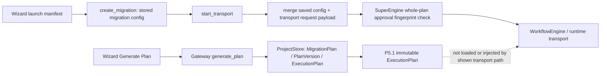

The physical runtime path is not `ExecutionPlan → SuperEngine → runtime`. It is predominantly `migration manifest/config + request merge → SuperEngine → runtime`.

## 25. DAG Visualization Truthfulness Findings

| Displayed node source | Truth |
|---|---|
| React drawer `dynamicExecutionPlanNodes` | local, fabricated from UI state and object counts |
| backend returned `stages` list in current Step 5 | persisted compiler stage descriptions |
| workflow manifest steps | executable workflow-engine units |
| scheduler task graph | executable scheduler units |

The current drawer can show sequence/view/procedure/trigger/materialized-view stages with no corresponding P5.1 compiler node or proved runtime unit. These are **STATIC_DISPLAY**, not reliable execution nodes.

No stable ID, retry/checkpoint status, runtime observability reference, or node-level configuration exists in current displayed nodes.

## 26. Connector-Family Applicability Matrix

| Family | Current compiler DAG applicability |
|---|---|
| Relational | assumes schema, DDL, table bulk transport; partial fit |
| Warehouse/lakehouse | hardcoded schema/DDL/bulk labels may be incomplete |
| Document/NoSQL | relational schema-routing wording is unsuitable |
| Wide-column | table-like stages are incomplete |
| Graph | no entity/edge-oriented plan |
| Key-value | no key/value-specific stages |
| Search/index | no index/document-specific stages |
| Streaming | no topic/event/offset-specific DAG |
| HDFS/files/datasets | no file/dataset/partition-stage model |
| Object storage | no object/bucket/manifest-stage model |
| Managed cloud | no provider-native stage generation |

Current P5.1 DAG is relationally biased.

## 27. M1–M8 DAG Applicability Matrix

| Mode | Current P5.1 representability |
|---|---|
| M1 Bulk | partial: generic schema + transport + validation |
| M2 Bulk + CDC | partial: optional CDC stage |
| M3 CDC only | no; schema/bulk stages remain |
| M4 Incremental polling | no |
| M5 State synchronization | no |
| M6 Schema only | no; transport stage remains |
| M7 Data only | no; schema stage remains |
| M8 Validation only | no; mutation stages remain |

P5.8 owns the canonical mode model. This is a **P5_8_IMPLEMENTATION_MATERIAL** dependency, not a P0–P4 defect.

## 28. Configuration Persistence / Restart Matrix

| Artifact | Durable | Reloadable | Versioned | Immutable | Fingerprinted | Execution-bound |
|---|---:|---:|---:|---:|---:|---:|
| MigrationPlan | yes | yes | active-version reference | no | indirect | partial |
| PlanVersion payload | yes | yes | yes | payload practically fixed, metadata upsertable | yes | partial |
| ExecutionPlan | yes | yes | tied to version | yes on insert | yes | not proved |
| compiler DAG stage DTO | inside ExecutionPlan | yes | via execution plan | yes on insert | indirect | not proved |
| React DAG | no | no | no | no | no | no |
| diagnostics | no separate durable store | no | no | no | no | no |
| risk/estimates | not in ExecutionPlan | no | no | no | no | no |
| compiled P5.3–P5.6 policies | not bound in plan | no Step-7 proof | no | no | no | no |
| barriers | no canonical model | no | no | no | no | no |
| dry-run result | transient response | no | no | no | compiler fingerprint | no |

## 29. Shipping Reachability Matrix

| Capability | Implemented | UI | Gateway | Rust registered | Persisted | Runtime consumed | Proof |
|---|---:|---:|---:|---:|---:|---:|---|
| logical plan | yes | no | indirect `generate_plan` | yes | yes | partial | INTEGRATION_PROVEN |
| P5.1 DAG stages | yes | backend list only | yes | yes | yes | no | INTEGRATION_PROVEN storage |
| React DAG drawer | yes | yes | no | n/a | no | no | IMPLEMENTED only |
| schema actions | P2 exists | no | no direct Step-7 path | no | no plan binding | no | IMPLEMENTED elsewhere |
| dependency ordering | several engines | no | indirect/generic | no | partial | separate runtime | UNIT_PROVEN |
| node config/overrides | no | no | no | no | no | no | NOT_IMPLEMENTED |
| approval barriers | no | no | no | no | no | no | NOT_IMPLEMENTED |
| compatibility | yes | no | indirect compiler | yes via wrapper | transient diagnostic | partial | INTEGRATION_PROVEN compile |
| risk | yes | partial advisor label | indirect | yes | no plan binding | no | PARTIAL |
| estimates | yes | partial modal | indirect | yes | no plan binding | no | PARTIAL |
| warnings/blockers | yes | no | indirect | yes | no durable list | no | PARTIAL |
| plan versions | yes | no | backend-only P5 method | no | yes | partial | INTEGRATION_PROVEN |
| plan diff | yes | no | yes | no | transient | no | IMPLEMENTED |
| dry run | yes | no | yes | no | transient | no | IMPLEMENTED |
| fingerprint | yes | checksum label | yes | yes | yes | pre-start related fence | INTEGRATION_PROVEN |

## 30. Duplicate Authority Map

| Responsibility | Candidate A | Candidate B | Candidate C | Recommendation |
|---|---|---|---|---|
| logical plan | P5 `MigrationPlan` | legacy migration plan/config | launch manifest | KEEP P5; legacy only; rectify manifest role |
| execution plan/DAG | P5 `ExecutionPlan` stages | React drawer DAG | workflow manifest/scheduler graphs | keep P5 as config authority; React read-only; retain workflow/scheduler as runtime authority |
| ordering | P2 dependencies | planner ExecutionGraph | workflow manifest | merge through compiler; no second plan authority |
| configuration | P5 `ConfigurationScope` | manifest tuning rules | runtime defaults | keep P5; rectify runtime binding |
| approvals | gateway packets | ApprovalEngine | governance workflow/P3 approvals | P5.10 consolidation needed |
| fingerprint | P5 compiler SHA | SuperEngine plan fingerprint | legacy plan hashes | define one execution binding; current overlap is DUPLICATE_AUTHORITY risk |
| persistence | ProjectStore | CentralStateStore | legacy memory | keep ProjectStore + CentralStateStore scoped roles |

## 31. Security / Secret Exposure Findings

P5 compiler redacts only exact top-level `password`, `token`, `secret`, and `api_key` keys in effective configuration before plan serialization. Risks remain:

- nested secret fields are not proven redacted;
- source/target connection details enter launch manifest;
- P5 plan configuration is raw dictionary data;
- privacy salts/keys or SQL parameters are not structurally excluded by a typed schema;
- React confirmation views source/target endpoint details;
- no plan-diff secret-redaction contract was found.

No direct plaintext password persistence was established in this plan path, but Step-7 secret handling is **partial and not contractually comprehensive**.

## 32. Failure / Fail-Closed Matrix

| Condition | Behavior | Classification |
|---|---|---|
| invalid topology | some compiler blockers | FAIL_CLOSED |
| missing source/target in persisted plan | ProjectStore load rejects mandatory instance IDs | FAIL_CLOSED |
| stale discovery | fence material exists, not reliably bound | PARTIAL/DEFERRED |
| incompatible connector pair | compiler blocker | FAIL_CLOSED |
| compatibility evaluator exception | warning then continue | WARNING_ONLY |
| unsupported mode | no canonical mode model | DEFERRED |
| unsupported object/datatype | not comprehensively injected | DEFERRED |
| invalid mapping/transformation/privacy/quality | not bound into current plan | DEFERRED |
| impossible dependency graph | workflow/scheduler validators exist; P5 stage list has no graph cycle | PARTIAL |
| missing runtime consumer | no compile-time check | UNRESOLVED |
| stale plan version/current draft divergence | current plan is compiled with old version | FAIL_OPEN risk |
| stale approval/fingerprint | SuperEngine rejects | FAIL_CLOSED |
| missing/rejected/expired custom barrier | no custom barrier system | DEFERRED |
| dry-run target write | compiler path no write found | SAFE_DRY_RUN |
| missing estimate inputs | fixed defaults in selection estimator | SILENT_DEFAULT |
| runtime/plan divergence | separate manifest/request path | UNRESOLVED / DUPLICATE_AUTHORITY risk |
| secret leakage | shallow top-level redaction | PARTIAL |

## 33. Proof-Level Matrix

| Finding | Highest proof |
|---|---|
| P5.1 SQLite plan/version/execution plan creation | INTEGRATION_PROVEN |
| immutable execution-plan insert protection | IMPLEMENTED |
| React visual DAG exists | IMPLEMENTED |
| React DAG equals compiler DAG | disproven by code |
| compiler DAG equals runtime executed DAG | not proven |
| plan diff/dry-run methods | IMPLEMENTED |
| shipping access to plan diff/dry run/history | not present |
| whole-plan approval fingerprint fence | INTEGRATION_PROVEN |
| exact runtime use of resolved config | not proven |
| custom approval barriers | NOT_IMPLEMENTED |
| live physical execution equivalence | no LIVE_PROVEN evidence |

## 34. Current Gap vs Future Gap

| Classification | Findings |
|---|---|
| FROZEN_P0_P4_REUSABLE_AUTHORITY | P2 schema/dependencies/validation, P3 CDC/lifecycle, P4 capabilities, P1 runtime scheduler |
| COMPLETED_P5_1_IMPLEMENTATION | plan/version/store/compiler/effective config/fingerprint/dry-run foundation |
| COMPLETED_P5_2_P5_6_IMPLEMENTATION | selected-scope/mapping/transformation/privacy/quality authorities to bind into plan |
| CURRENT_STEP7_INTEGRATION_GAP | one authoritative DAG view; complete input binding; plan-to-runtime binding; diagnostics/risk/estimates/version review |
| P5_7_IMPLEMENTATION_MATERIAL | hook nodes/configuration |
| P5_8_IMPLEMENTATION_MATERIAL | M1–M8 DAG generation/applicability |
| P5_9_IMPLEMENTATION_MATERIAL | workspace/environment setup/defaults |
| P5_10_IMPLEMENTATION_MATERIAL | custom approval barriers/policy administration |
| P5_11_IMPLEMENTATION_MATERIAL | template/config lifecycle and semantic historical protections |
| DEAD_CODE | local React drawer as execution-authority candidate |
| DUPLICATE_AUTHORITY | P5 execution plan versus manifest/request runtime spec |
| FAKE_SUCCESS | local DAG can imply executable nodes without proof |

## 35. Reusable Reconstruction Material

Keep and integrate:

1. P5.1 `MigrationPlan → PlanVersion → ExecutionPlan → ProjectStore`.
2. `ConfigurationScope` effective values and provenance.
3. P5.1 deterministic compiler/dry-run and diff foundations.
4. P2/P3/P4 as input authorities, never duplicated.
5. existing workflow/scheduler graphs as runtime execution mechanisms, not visual-plan replacements.
6. SuperEngine’s fingerprint fence as a base for a future single approval authority.
7. advisor/risk/estimate engines, after binding their inputs/results to a versioned plan.

## 36. Unresolved Questions

- Whether a non-desktop API later loads `ExecutionPlan` and passes it to runtime.
- Whether a deployment-only bridge registers P5 diff/history/dry-run capabilities dynamically.
- Whether an external plan-to-runtime adapter exists outside the checked repository paths.
- Whether all P5.3–P5.6 artifacts are persisted in another completed subsystem not invoked from this wizard.
- Whether a future P5.12 acceptance layer resolves current plan/version draft divergence.

## 37. Final Step-7 Verdict

A. **Canonical logical migration plan:** **PARTIAL.** `MigrationPlan` is real, but shipping composition omits major Step 1–6 artifacts.

B. **Real dynamic execution DAG:** **PARTIAL.** P5.1 produces persisted stage DTOs; richer executable DAGs exist elsewhere. Neither is proven to be the exact runtime graph.

C. **Shipping UI DAG equals runtime DAG:** **NO.** The drawer independently computes local nodes from React state.

D. **Plan contains Steps 1–6 outputs:** **NO.** Identity/basic topology/config are partial; selected scope and P5 policies are not reliably bound.

E. **P5.3–P5.6 compiled policies bound:** **NO.**

F. **Runtime config resolved/visible with provenance:** resolved in P5.1, not meaningfully visible or proven consumed.

G. **Schema actions based on P2:** P2 exists, but current Step-7 plan only shows generic labels.

H. **Connector applicability from P4 truth:** pair compatibility partial only.

I. **Dependencies/order deterministic and runtime-consumed:** separate authorities exist; current P5 stage list is not proven runtime-consumed.

J. **Warnings/blockers truthful/fail-closed:** some compiler blockers are fail-closed; diagnostics are neither durable nor surfaced, and warnings can allow compilation.

K. **Estimates real:** mixed. Discovery/advisor inputs can be real; P5 selection estimator has fixed defaults; current plan does not version-bind estimates.

L. **PlanVersion/ExecutionPlan immutable:** ExecutionPlan is immutable-on-insert. PlanVersion payload is persisted but version compilation can use a later mutable draft, so full immutable execution binding is not proven.

M. **Plan diff:** real but narrow/coarse and unreachable from shipping UI.

N. **Fingerprint:** deterministic for limited compiler inputs, but not over the exact runtime artifact.

O. **Exact approved-plan reconstruction after restart:** persisted artifacts can reload, but exact runtime reconstruction is not proven because transport uses a separate manifest/request path.

P. **Dry run:** compiler dry run is zero-target-write; shipping Step-7 dry-run experience is absent.

Q. **Node changes only through canonical configuration/recompile:** no node-edit feature exists; safe workflow is absent rather than violated.

R. **Custom ApprovalBarrier/ApprovalNode:** **NO; P5.10 ownership.**

S. **Lineage estimate:** approximately 50% current canonical AKAAL/P5.1 foundation, 25% early AKAAL workflow/planner/runtime graph material, 15% legacy/compatibility material, 10% unproven overlap.

T. **Engineering reconstruction estimate:** approximately 30% KEEP AS-IS, 45% RECTIFY/INTEGRATE, 25% BUILD NEW. The largest new work is the authoritative plan-to-runtime binding, dynamic/capability-driven DAG composition, and P5.10 barrier model—not replacement of frozen P0–P4 or completed P5.1–P5.6 authorities.


# Workflow Step 8 — Governance & Readiness

## 1. Step-8 Executive Truth

AKAAL has reusable governance, readiness, preflight, compatibility, risk, approval, policy, fingerprint, audit, and runtime-fence material across several competing implementation worlds. It does not currently have one canonical Step-8 Governance & Readiness authority that consumes an exact Step-7 immutable-plan candidate and produces durable execution authorization.

The current shipping path is evidence only:

```text
wizard preflight / request_approval
→ gateway packet/state
→ launch manifest
→ SuperEngine whole-plan fingerprint check
→ transport
```

It is not the future architectural authority because it:

- operates on a migration manifest/request rather than the exact immutable `ExecutionPlan`;
- has partly fabricated preflight capacity/benchmark/readiness values;
- exposes approvals through a fixed-gate UI rather than a canonical Step-8 readiness decision;
- has no unified policy/waiver/permission/capacity/readiness evidence bundle;
- contains multiple policy/approval engines with different persistence and semantics.

No files or Git state were modified.

## 2. Whole-Repository Coverage Map

| World searched | Reusable Step-8 material |
|---|---|
| Shipping React UI | wizard preflight/approval status, Governance Center, approval repository |
| Tauri/Rust | preflight and approval capabilities registered; no canonical Step-8 aggregate capability |
| Gateway | async preflight, approval packets/decisions, transport authorization |
| SuperEngine | fail-closed approval-fingerprint verification and physical contract checks |
| P5.1 | plan version, execution plan, resolved configuration, fingerprints |
| P2/P4 | schema/connector compatibility, validation, discovery facts |
| P3 | CDC readiness, conflict/quarantine, cutover/failback gates |
| Governance platform | policies, SoD, four-eyes, waiver/override, ledger, approval workflow models |
| Workflow approval | fixed ordered approval gates/tokens |
| Legacy manager | human-approval stage and project state transitions |
| Adapters/connectors | permission methods and capability/compatibility models |
| Advisor/risk | advisory/risk/ETA/readiness material |
| Archive UI clone | static mock risk/permissions/storage screens—non-evidence of implementation |
| CentralStateStore/ProjectStore | state, migration approval packets, P5 plans/versions |

## 3. Step-8 Candidate Inventory

| Candidate | Actual responsibility | Durability/reachability | Classification |
|---|---|---|---|
| `EngineGateway.start_preflight` | source discovery/preflight wrapper | registered and shipping reachable | KEEP_CANDIDATE, but rectify truthfulness |
| preflight result in CentralStateStore | discovery/advisor snapshot | restart-readable | MERGE_CANDIDATE |
| `AkaalSuperEngine.verify_governance_authorization` | pre-start whole-plan fingerprint fence | runtime-used | KEEP_CANDIDATE |
| `EnterpriseGovernancePlatformV6` | policy, SoD, workflow, waiver, ledger facade | not Step-8 shipping-integrated | P5_10_IMPLEMENTATION_MATERIAL |
| simple `PolicyEngine` | role/masking/approval gate shortcuts | gateway-instantiated | REPLACE_CANDIDATE |
| `ApprovalEngine`/`ApprovalGateStep` | fixed numbered workflow gates | in-memory | MERGE_CANDIDATE |
| Gateway approval packet path | request/decision/status persistence | CentralStateStore | RECTIFY_CANDIDATE |
| adapter `check_permissions` | connector-local permission hook | inconsistent semantics | MERGE_CANDIDATE |
| P3 CDC cutover readiness | operational lifecycle readiness | P3 authority | KEEP_CANDIDATE |
| plan/version fingerprints | P5.1 planning integrity | durable P5 store | KEEP_CANDIDATE |
| archived UI risk/readiness cards | static display | no backend path | DEAD_CODE / FAKE_SUCCESS |
| legacy ManagerAgent approval stage | legacy human checkpoint | legacy memory/project state | LEGACY_ONLY |

## 4. Current Shipping Step-8 Support Verdict

**Does the shipping product support canonical Step 8? — NO.**

It has fragments:

- source discovery/preflight;
- an approval packet/queue;
- a transport-time approval fingerprint fence;
- some governance dashboard UI;
- P3 cutover readiness views.

It lacks a coherent Step-8 screen and decision record containing the exact PlanVersion, immutable execution-plan candidate, applicability result, policies, permissions, capacity, security posture, risks, waivers, barriers, and final authorization.

## 5. Current Physical Flows

### Current preflight/readiness-like path

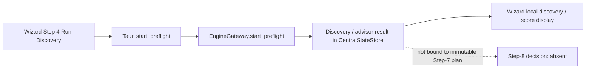

### Current approval/launch path

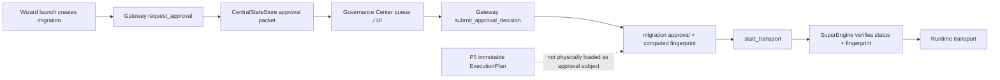

### Required future boundary, showing current break

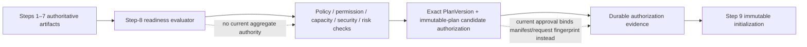

## 6. Preflight Findings

`EngineGateway` preflight produces discovery, object summaries, capacity-like values, ETA, risk labels, readiness labels, warnings, and approval-requirement strings. It persists the result under discovery/advisor state keys.

Useful pieces:

- source discovery facts;
- source/target connectivity paths;
- target lock-capacity query attempt;
- selected-scope cardinality mismatch blocker;
- source/target benchmark interface;
- P2/P4 compatibility and advisor material.

Critical truthfulness issues:

| Preflight value | Physical basis | Verdict |
|---|---|---|
| source throughput benchmark | returns 100 rows/4096 bytes based essentially on elapsed local time; no actual source fetch | FAKE_SUCCESS |
| target throughput benchmark | comments describe temporary-table writes but code performs no database work, returns measured=true | FAKE_SUCCESS |
| elapsed preflight | fixed `150.0` ms | STATIC/FABRICATED |
| risk score | `LOW` if no collected errors, otherwise `HIGH` | oversimplified/static |
| compatibility score | 100 or 90 from error-list presence | oversimplified/static |
| rollback readiness | static “Snapshot Protection Active” | STATIC_DISPLAY |
| approval requirements | static Gate 1/2/3 strings | STATIC_DISPLAY |
| target capacity | actual PostgreSQL lock query attempted; defaults 64 on error | PARTIAL, SILENT_DEFAULT on failure |

Preflight is therefore reusable technical material, but not a trustworthy final Step-8 readiness verdict without rectification.

## 7. Source / Target / Environment Readiness Findings

Existing reusable checks are scattered:

| Area | Evidence | Step-8 truth |
|---|---|---|
| source connectivity | adapters/gateway tests | available upstream |
| target connectivity | adapters/gateway tests | available upstream |
| source permissions | adapter contract says read access | implementation inconsistent |
| target permissions | adapter contract exists | no canonical target capability verification |
| source catalog/discovery | Scout/gateway preflight | reusable |
| target capacity | bounded lock query attempt | narrow/partly defaulted |
| storage | no demonstrated authoritative free-space readiness check | absent |
| network | benchmark facade only, fabricated throughput result | absent as reliable control |
| compute/memory | resource runtime material | not evaluated as Step-8 readiness |
| runtime health | engine/runtime status endpoints | separate material |
| CDC readiness | P3 lifecycle/cutover gates | reusable but not aggregated |
| connector compatibility | P4 engines | partial compiler/preflight integration |

## 8. Permission Findings

The adapter abstraction requires `check_permissions()`. However, several implementations simply return `True` after connection—for example the PostgreSQL adapter—without inspecting grants. Other adapters vary, and at least one HDFS adapter explicitly raises `NotImplementedError`.

No Step-8 orchestration:

- invokes both source and target permission checks consistently;
- asks for privileges applicable to the immutable execution mode;
- records privilege evidence against PlanVersion/fingerprint;
- fails closed when permission semantics are unavailable;
- distinguishes schema-only/data-only/validation-only requirements.

Status: **permission hooks exist, canonical permission readiness absent.**

## 9. Capacity / Storage / Network Findings

The repository contains runtime resource governors, monitoring, P3 buffers/backpressure, and preflight ETA/benchmark material. It does not form a durable readiness proof for:

- available target storage;
- temp/staging storage;
- network capacity;
- runtime process resource envelope;
- queue/buffer headroom;
- maintenance window capacity;
- connector quotas/API budgets;
- CDC retention/backlog headroom.

The only concrete target capacity query observed is `SHOW max_locks_per_transaction`; its failure defaults to 64. This is insufficient for a final readiness decision.

## 10. Compatibility Findings

P4 compatibility models provide source/target semantic compatibility, restrictions, risk items, and “lossy requires approval” states. P2/P5 compiler paths can produce blockers for incompatible connector pairs.

Current Step-8 gaps:

- no aggregate compatibility report linked to exact plan version;
- no consumption of complete mapping/type/privacy/quality compatibility;
- no canonical mode applicability from P5.8;
- no UI showing which warnings require acknowledgement/approval;
- compatibility exceptions may become warnings rather than hard prohibition.

Reusable authority: **P2/P4.** Step 8 should consume, not recreate, it.

## 11. Policy Findings

There are two materially different policy candidates:

| Candidate | Actual behavior | Verdict |
|---|---|---|
| `governance.policy_engine.PolicyEngine` | hardcoded ADMIN/OPERATOR action checks; hardcoded masking heuristics; risk-string approval shortcut | REPLACE_CANDIDATE |
| `PolicyAsCodeEngine` + `EnterprisePolicy` lifecycle | evaluates declarative rules, policy lifecycle/waiver paths | P5_10_IMPLEMENTATION_MATERIAL |

The simple policy engine is not a sufficient policy authority: it does not retain policy version/origin, applicable scope, evidence, exception state, or complete role semantics.

The governance facade is stronger reusable material but explicitly auto-simulates successful approval for non-fast-track routed workflows. It cannot presently be treated as a final governance decision engine.

## 12. Risk Findings

Relevant risk material:

- `RiskPlatform`;
- advisor/risk models;
- connector lossiness/risk engine;
- governance risk routing;
- P2/P4 compatibility risk;
- P3 cutover/CDC conflict risk.

No current Step-8 decision binds a complete risk assessment to exact PlanVersion/fingerprint. Gateway request approval can derive a risk level, but the inspected conversion is weak and may default to `LOW`; the packet then contains hardcoded 0.12/0.85 risk scores.

Status: **multiple reusable risk sources; no canonical Step-8 risk aggregation/evidence authority.**

## 13. Approval Findings

Current approval paths compete:

| System | Identity/persistence | Strength |
|---|---|---|
| Gateway approval packet | CentralStateStore | shipping-reachable, weak authorization checks |
| SuperEngine approval verification | CentralStateStore exact status/fingerprint | strong pre-start fence |
| `ApprovalEngine` | in-memory fixed gates/tokens | useful workflow primitive |
| Governance workflow | in-memory role steps | useful P5.10 material |
| Enterprise governance facade | policy/SoD/ledger facade | useful, but auto-simulates approval |
| P3 cutover/failback approvals | lifecycle-specific | retain P3 scope |
| legacy manager controller | in-memory/CLI approval | legacy-only |

The current `request_approval` packet declares `fourEyesConfirmed: True` and fixed required roles. It does not prove that required roles have actually approved.

`submit_approval_decision` calls `evaluate_action_permission("OPERATOR", ...)`, but records the decision even if `perm` is false; it merely returns `permission_evaluated` in the response. This is a fail-open authorization defect in the candidate path.

## 14. Waivers / Exceptions Findings

`ExceptionWaiver`, `EmergencyOverride`, waiver manager, governance policy lifecycle, audit ledger, and impact-analysis models exist in the governance platform world.

No shipping Step-8 UI/IPC path:

- creates a waiver;
- attaches it to a plan/version/fingerprint;
- limits scope to a specific policy violation;
- validates expiry;
- records authorization and evidence;
- determines whether the waiver permits execution.

Status: **P5_10_IMPLEMENTATION_MATERIAL.** Its absence is not a P0–P4/P5.1–P5.6 regression.

## 15. Security / Policy-Requirement Findings

Existing material includes security contexts, connector credentials, policy models, four-eyes validation, audit/ledger artifacts, and privacy sanitization. Step 8 does not currently collect a canonical security readiness result for:

- required secret/vault availability;
- credential scope;
- transport/TLS policy;
- connector security requirements;
- policy version;
- role/session identity;
- P7 controls such as SSO/MFA/SCIM/certificate lifecycle.

P7 absence is **FUTURE_P7**, but Step 8 still needs to consume relevant already-available policy/security facts in the future canonical workflow.

## 16. Fingerprint Verification Findings

Two fingerprint families matter:

1. P5.1 compiler fingerprint: plan/version/topology/routing/scope/effective config.
2. SuperEngine fingerprint: canonicalized `{spec, dag}` from migration manifest/runtime plan data.

The SuperEngine fence is strong in isolation:

- missing approval: fails closed;
- non-approved status: fails closed;
- missing approved fingerprint: fails closed;
- mismatch: fails closed.

But it authorizes the gateway’s migration manifest plus plan DTO/request path, not necessarily P5.1’s exact immutable execution plan. This is a duplicate-authority gap, not proof that the existing launch pipeline must survive.

## 17. Readiness Evidence / Persistence Map

| Artifact | Durable | Restart reconstructible | Bound to exact plan/version |
|---|---:|---:|---:|
| preflight discovery result | CentralStateStore | yes | no |
| advisor/preflight result | CentralStateStore | yes | no |
| P5 PlanVersion | ProjectStore | yes | yes |
| P5 ExecutionPlan | ProjectStore | yes | yes |
| gateway approval packet | CentralStateStore | yes | manifest/request fingerprint only |
| SuperEngine approval record | CentralStateStore | yes | manifest/request fingerprint only |
| ApprovalEngine request/token | no, in memory | no | fixed workflow/gate only |
| Governance facade workflow | no, in memory | no | no |
| waiver/emergency models | no shipping persistence route proven | no | no |
| runtime cutover readiness | P3-specific state | partial | P3 lifecycle scope |

## 18. Current UI Findings

### Wizard

The wizard triggers preflight in current Step 4 and requests approval only after creating the migration in Step 7. It displays approval state and preflight-derived summary values, but has no Step-8 governance/readiness surface.

### Governance Center

[`GovernanceCenterView.tsx`](A:\temp_akaal\akaal_software\src\screens\MigrationModule\GovernanceCenterView.tsx) provides an approval queue/history interface. It is a useful UI candidate, not canonical Step 8:

- it operates fixed `GATE_1`/`GATE_2`/`GATE_3`;
- it has hardcoded identity use such as `Aalok` in decision processing;
- it does not show full readiness evidence, plan version, immutable plan, policy results, waivers, or barrier nodes;
- its KPI logic is local UI filtering, not backend governance evaluation;
- it can display approval packets but not prove actual authority or plan binding.

### Archive UI clone

Archive screens contain hardcoded “passed” permissions/storage/risk values. They are **STATIC_DISPLAY / FAKE_SUCCESS** and cannot be used as implementation proof.

## 19. Approval Barrier Findings

**Does AKAAL currently have a first-class custom ApprovalBarrier / ApprovalNode system? — NO.**

No model was found with durable:

- barrier ID;
- protected PlanVersion/DAG boundary;
- protected node/action;
- condition/policy origin;
- approver roles/groups/quorum;
- expiry/escalation/rejection behavior;
- evidence requirement;
- exact plan/config fingerprint;
- durable waiting state;
- exactly-once release/fencing semantics.

Existing fixed gates, whole-plan approval, and P3 lifecycle approvals are useful implementation material only.

Classification: **P5_10_REMAINING_SCOPE / P5_10_IMPLEMENTATION_MATERIAL.**

## 20. P3 CDC / Cutover Readiness Findings

P3 has strong reusable lifecycle controls for:

- backlog and lag;
- unresolved conflicts;
- quarantines;
- checkpoint/frontier readiness;
- cutover validation;
- approval-related cutover/failback operations;
- fencing and abort/recovery logic.

This must remain P3-owned. Step 8 should aggregate a summarized readiness/evidence result when the selected mode requires CDC/cutover; it must not create a second CDC readiness or approval engine.

## 21. Failure / Fail-Closed Matrix

| Condition | Current behavior | Classification |
|---|---|---|
| missing approval record | SuperEngine rejects transport | FAIL_CLOSED |
| approval status not approved | SuperEngine rejects transport | FAIL_CLOSED |
| missing approval fingerprint | SuperEngine rejects transport | FAIL_CLOSED |
| manifest/request fingerprint mismatch | SuperEngine rejects transport | FAIL_CLOSED |
| denied action permission in gateway decision | decision still persisted | FAIL_OPEN |
| policy facade workflow | routed workflow auto-simulates approved | FAKE_SUCCESS |
| preflight benchmark | claims measurement without physical benchmark work | FAKE_SUCCESS |
| preflight lock query fails | defaults lock capacity to 64 | SILENT_DEFAULT |
| missing target storage/network proof | not evaluated | DEFERRED |
| adapter permission unavailable | inconsistent, no aggregate orchestration | UNRESOLVED |
| HDFS permissions unsupported | adapter raises NotImplemented | FAIL_CLOSED locally, not surfaced canonically |
| compatibility pair invalid | compiler can block | FAIL_CLOSED in compiler path |
| compatibility evaluator exception | warning and continues | WARNING_ONLY |
| policy waiver expiry/scope | no shipping binding | DEFERRED |
| custom barrier missing/rejected/expired | no general barrier system | DEFERRED |
| stale discovery/plan relation | separate artifacts, incomplete binding | UNRESOLVED |
| P3 CDC readiness failure | P3 gates can block lifecycle | FAIL_CLOSED within P3 |

## 22. Shipping Reachability Matrix

| Step-8 capability | Implemented | UI | Gateway | Rust registered | Durable | Exact plan-bound | Proof |
|---|---:|---:|---:|---:|---:|---:|---|
| preflight/discovery | yes | yes, Step 4 | yes | yes | yes | no | INTEGRATION_PROVEN |
| source/target readiness | partial | partial display | preflight partial | yes | partial | no | PARTIAL |
| permissions | adapter-level | no | no aggregate | no | no | no | IMPLEMENTED only |
| capacity/network/storage | partial candidates | no | preflight partial | yes | partial | no | PARTIAL/FAKE |
| compatibility | yes | indirect | partial | yes | transient | no | PARTIAL |
| policy evaluation | yes | no canonical UI | indirect | not canonical | mixed | no | IMPLEMENTED |
| approval request | yes | wizard/governance UI | yes | yes | yes | manifest-bound | INTEGRATION_PROVEN |
| approval decision | yes | Governance Center | yes | yes | yes | manifest-bound | INTEGRATION_PROVEN, authorization flaw |
| waiver/exception | model/facade | no | no | no | no proof | no | P5_10 material |
| approval barriers | no | no | no | no | no | no | NOT_IMPLEMENTED |
| fingerprint verification | yes | no | transport path | yes | approval state | manifest-bound | INTEGRATION_PROVEN |
| final execution authorization | partial | no Step-8 screen | transport gate | yes | yes | not exact P5 plan | PARTIAL |

## 23. Duplicate Authority Map

| Responsibility | Competing candidates | Reconstruction recommendation |
|---|---|---|
| approval state | gateway packets, ApprovalEngine, governance workflow, manager controller, P3 approvals | consolidate configuration/admin under P5.10; preserve P3 lifecycle approvals |
| policy | simple PolicyEngine, PaC engine, connector policies, P3 rules | retain domain-specific authorities; P5.10 orchestrates/records evaluation |
| fingerprint | P5 compiler and SuperEngine | unify future binding to immutable plan candidate |
| readiness | preflight, P3 cutover readiness, runtime health, advisor/risk | aggregate at Step 8; do not duplicate underlying checks |
| permissions | adapter methods, simple role policy, governance SoD | compose by scope; no separate ad hoc checks |
| exceptions/waivers | governance models/manager | retain governance models; make durable under P5.10 |
| approval UI | wizard status, Governance Center, legacy CLI | retain strongest queue/display components; remove them as authority |

## 24. Roadmap Classification

| Classification | Findings |
|---|---|
| FROZEN_P0_P4_REUSABLE_AUTHORITY | P2/P4 compatibility/validation/discovery, P3 CDC readiness/cutover, P1 runtime/health/checkpoint |
| COMPLETED_P5_1_IMPLEMENTATION | PlanVersion, immutable execution-plan candidate, configuration/fingerprint material |
| COMPLETED_P5_2_P5_6_IMPLEMENTATION | scope/data-control artifacts Step 8 must consume when bound |
| CURRENT_STEP8_INTEGRATION_GAP | exact-plan readiness bundle, evidence aggregation, authoritative plan-bound authorization |
| P5_7_IMPLEMENTATION_MATERIAL | hooks requiring approval |
| P5_8_IMPLEMENTATION_MATERIAL | execution-mode legality/applicability consumed by readiness |
| P5_9_IMPLEMENTATION_MATERIAL | environment/workspace defaults and admin context |
| P5_10_IMPLEMENTATION_MATERIAL | RBAC, policy administration, waivers, approval chains, barriers |
| P5_11_IMPLEMENTATION_MATERIAL | reusable/versioned governance configuration lifecycle |
| FUTURE_P6 | fleet/platform administration and broad operational notification |
| FUTURE_P7 | full zero-trust/identity/compliance enforcement |
| DEAD_CODE / FAKE_SUCCESS | archive readiness UI; fabricated preflight benchmark/readiness fields |

## 25. Reusable Reconstruction Material

The strongest candidates for the future Step-8 authority are:

1. P5.1 PlanVersion/ExecutionPlan and deterministic plan/config fingerprints.
2. SuperEngine’s fail-closed missing/expired/mismatched approval-fingerprint checks, after rebinding to exact immutable plan candidates.
3. P2/P4 compatibility and discovery evidence.
4. P3 CDC/cutover/failback readiness evidence, without duplicating P3 authority.
5. Governance platform models: policies, SoD, four-eyes, waiver, ledger, impact and lifecycle.
6. Adapter permission contracts, after truthful connector-specific implementation and evidence capture.
7. Governance Center as a presentation candidate only.

## 26. Unresolved Questions

- Whether a deployment-specific governance persistence provider replaces the inspected in-memory governance facade services.
- Whether any non-desktop API binds approvals directly to P5 `ExecutionPlan` IDs.
- Whether all connectors have substantive permission checking rather than connection-success checks.
- Whether a real external target-write benchmark implementation exists outside `migration/benchmarks.py`.
- Whether P5.12 will provide a canonical plan/approval invalidation bridge not yet referenced by shipping paths.

## 27. Final Step-8 Verdict

AKAAL does not currently deliver the frozen Step-8 Governance & Readiness product.

It has meaningful reusable logic:

- durable preflight/discovery evidence;
- P2/P4 compatibility material;
- P3 lifecycle readiness;
- P5.1 plan/version/fingerprint candidates;
- fail-closed whole-manifest approval-fingerprint fencing;
- governance policy/SoD/waiver/ledger domain material.

But the current shipping pipeline must not be preserved as architecture. It has split authority, static/fabricated readiness values, insufficient permission semantics, weak gateway decision authorization, and no exact immutable-plan-bound governance decision.

The correct later reconstruction direction is a new Step-8 composition authority that consumes Steps 1–7 artifacts, records a versioned evidence bundle and authorization decision against the exact immutable plan candidate, delegates specialized checks to frozen authorities, and leaves generic RBAC/policy/waivers/custom ApprovalBarrier administration to P5.10.


# 1. Step-9 Executive Truth

AKAAL has no canonical Step 9 surface or schedule-to-runtime chain.

What exists today is a split implementation:

- The shipping wizard creates a mutable migration manifest, requests an approval, and opens Mission Control.
- Mission Control provides the actual “start now” control via `start_transport`.
- `start_transport` has a durable SQLite compare-and-set start claim and fail-closed approval-fingerprint verification.
- P5.1 has a persisted, insert-only `ExecutionPlan` model.
- However, runtime does not load or execute that persisted P5.1 `ExecutionPlan`; it executes a merged migration manifest plus an independently stored/transient DAG.
- There is no user-facing migration scheduler, schedule persistence, schedule activation service, or immutable scheduled snapshot binding.

This is forensic fact only; it does not require retaining or replacing any present pipeline.

# 2. Whole-Repository Coverage Map

| World searched | Step-9 relevance |
|---|---|
| Shipping React/Tauri | Wizard final-confirmation UI; Mission Control start path; Rust capability registry |
| Gateway/SuperEngine | Creation, approval, fingerprint gate, start initialization, background runtime handoff |
| P5.1 planner/store | `MigrationPlan`, `PlanVersion`, persisted `ExecutionPlan`, compiler/fingerprint |
| Workflow engine | Separate immutable-in-memory workflow `ExecutionPlan`; fixed three-step manifest |
| P1/runtime/checkpoint | Worker scheduling, state/checkpoint persistence, recovery material |
| P3 CDC | Durable CDC/cutover recovery and fencing material, not bound by shipping Step 9 |
| Governance | Gateway approval records, SuperEngine verification, in-memory 3-gate engine, Platform6 candidate |
| Schedulers | Partition/task/resource schedulers only; no migration-at-time scheduling |
| Monitoring/Mission Control | Runtime snapshot polling keyed by migration ID |
| Archive UI/UI clone | Static mock scheduled-migration displays |
| Tests | Unit coverage for P5.1 insert-only persistence and gateway start claim; no live proof |

# 3. Current Shipping Step-9 Support Verdict

| Capability | Shipping status | Proof |
|---|---|---|
| Final review | PARTIAL/UI-only | Wizard confirmation modal |
| Immutable compile | Indirect only | `generate_plan` invokes P5.1 methods internally |
| Fingerprint | IMPLEMENTED, duplicate authorities | P5 compiler and SuperEngine hash different artifacts |
| Run Now | YES | Mission Control → registered `start_transport` |
| Schedule Migration | NO | No UI action, IPC capability, gateway method, durable schedule record, or daemon |
| Durable initialization | PARTIAL | SQLite start claim precedes background thread |
| Exact-once initialization | PARTIAL | Per migration ID start claim, not execution identity |
| Runtime consumes P5 plan | NO | Runtime uses mutable manifest / `_plans` / `CentralStateStore` |
| Mission Control handoff | PARTIAL | Migration-ID polling; no execution/run identity |

# 4. Repository-Lineage / Provenance Map

| Candidate | Lineage | Evidence-based status |
|---|---|---|
| Wizard/Mission Control | CURRENT_CANONICAL_AKAAL | Tauri-reachable UI |
| `EngineGateway.start_transport` | CURRENT_CANONICAL_AKAAL | Registered Rust capability and shipping UI caller |
| P5.1 ProjectStore/compiler | CURRENT_CANONICAL_AKAAL / COMPLETED_P5_1_IMPLEMENTATION | Direct gateway use from `generate_plan`; P5 APIs not Rust-registered |
| Workflow planning `ExecutionPlan` | EARLY_AKAAL | Separate workflow model, no shipping path from Step 9 |
| `MigrationExecutionPlan` | EARLY_AKAAL | Rich immutable DTO, no proven runtime binding |
| Partition/task/resource schedulers | EARLY_AKAAL / ambiguous | Internal execution scheduling, not a calendar scheduler |
| Archive scheduled migration views | ARCHIVED_UI | Explicit `MOCK_SCHEDULED` arrays |
| Generic approval engine | EARLY_AKAAL | In-memory fixed gates, not shipping authority |
| P3 CDC lifecycle/recovery | CURRENT_CANONICAL_AKAAL frozen authority | Strong recovery material, no Step-9 binding proven |

# 5. Step-9 Candidate Inventory

| Candidate | Exact location | Owns today | Persisted / restart-safe | Reachable | Classification |
|---|---|---|---|---|---|
| Wizard confirmation | [NewMigrationWizard.tsx](A:/temp_akaal/akaal_software/src/screens/MigrationModule/NewMigrationWizard.tsx:927) | Local final summary and migration creation | Browser state only | Shipping UI | RECTIFY_CANDIDATE |
| Mission Control | [MissionControlView.tsx](A:/temp_akaal/akaal_software/src/screens/MigrationModule/MissionControlView.tsx:127) | Run-now UI and monitoring display | UI state no; polls backend | Shipping UI | RECTIFY_CANDIDATE |
| Capability registry | [capability_registry.rs](A:/temp_akaal/akaal_software/src-tauri/src/engine_bridge/capability_registry.rs:15) | IPC allow-list | N/A | Shipping | KEEP_CANDIDATE |
| Gateway generate-plan bridge | [engine_gateway.py](A:/temp_akaal/akaal/gateway/engine_gateway.py:1480) | Builds P5 plan/version/execution plan then makes a second execution-plan dict | P5 SQLite plus CentralStateStore copy | Shipping | MERGE_CANDIDATE |
| P5 `PlanVersion` | [p5_domain.py](A:/temp_akaal/akaal/planner/models/p5_domain.py:442) | Draft snapshot/version metadata | SQLite | Backend-only through `generate_plan` | RECTIFY_CANDIDATE |
| P5 `ExecutionPlan` | [p5_domain.py](A:/temp_akaal/akaal/planner/models/p5_domain.py:476) | Persisted compiled plan artifact | SQLite, reloadable, insert-only by ID | Backend-only | KEEP_CANDIDATE |
| P5 compiler | [plan_compiler.py](A:/temp_akaal/akaal/planner/engine/plan_compiler.py:150) | Computes P5 fingerprint and stage DTOs | Result persisted by caller | Backend-only | RECTIFY_CANDIDATE |
| P5 ProjectStore | [project_store.py](A:/temp_akaal/akaal/planner/persistence/project_store.py:34) | Projects/plans/versions/execution plan tables | `artifacts/state.db` | Backend-only | KEEP_CANDIDATE |
| Gateway approval record | [engine_gateway.py](A:/temp_akaal/akaal/gateway/engine_gateway.py:1537) | Migration-ID approval and SuperEngine fingerprint | CentralStateStore | Shipping | RECTIFY_CANDIDATE |
| SuperEngine fingerprint fence | [facade.py](A:/temp_akaal/akaal/engine/facade.py:98) | Fail-closed equality check over current spec/DAG | Reads persisted approval; recomputes current hash | Shipping | KEEP_CANDIDATE |
| Gateway start initialization | [engine_gateway.py](A:/temp_akaal/akaal/gateway/engine_gateway.py:1709) | Claim, state transitions, background thread | CentralStateStore | Shipping | RECTIFY_CANDIDATE |
| Workflow `ExecutionPlan` | [planner.py](A:/temp_akaal/akaal/workflow/planning/planner.py:36) | Immutable workflow-stage DTO | Memory only | No physical Step-9 caller | LEGACY_ONLY |
| Rich `MigrationExecutionPlan` | [migration_execution_plan.py](A:/temp_akaal/akaal/planner/models/migration_execution_plan.py:13) | Rich planning DTO/checksum | No persistence found | No proven runtime consumer | DEAD_CODE / AMBIGUOUS |
| WorkflowScheduler | [scheduler.py](A:/temp_akaal/akaal/workflow/scheduling/scheduler.py:12) | Immediate queueing of stage-0 tasks | In-memory queue | No Step-9 path | LEGACY_ONLY |
| Runtime Registry | [runtime_registry.py](A:/temp_akaal/akaal/runtime/registry/runtime_registry.py:12) | Runtime/migration/PID mapping | Memory only | Gateway uses it | RECTIFY_CANDIDATE |
| Engine scheduler | [scheduler.py](A:/temp_akaal/akaal/engine/scheduler.py:159) | Worker/partition execution | Engine/checkpoint SQLite | Runtime material | FROZEN_P0_P4_REUSABLE_AUTHORITY |
| Archive schedule views | [migrations/page.tsx](A:/temp_akaal/archive/UI/src/app/migrations/page.tsx:51) | Mock scheduled migration display | No | Archive only | STATIC_DISPLAY / LEGACY_ONLY |

# 6. Final Review Findings

The only shipping final-review-like surface is the wizard’s “Migration Pipeline Provisioned & Ready” modal. It displays local React state, not a reloaded immutable artifact. It includes migration title/ID, source/target, selected object counts, estimated duration, workers/batch, local approval state, and advisor risk. It does not display the exact persisted P5 execution-plan payload, P5 fingerprint, schedule, P5.2–P5.6 bindings, actual runtime workflow manifest, readiness evidence, approval artifact, waiver state, or execution identity.

| Review input | Authoritative data exists? | Persisted? | Version/fingerprint-bound? | Shipping UI | Exact runtime equivalence |
|---|---:|---:|---:|---:|---:|
| Source/target | Yes, migration manifest | Yes | SuperEngine hash only | Yes, local state | PARTIAL |
| Execution mode | No canonical M1–M8 model | No | No | Strategy label only | NO |
| Selected scope | Yes | Yes | P5 and SuperEngine differ | Counts only | PARTIAL |
| Mappings | P5.3 material exists | Not physically bound here | No | Not in final review | NO |
| Transformations | P5.4 material exists | Not physically bound here | No | Not in final review | NO |
| Privacy | P5.5 material exists | Not physically bound here | No | Not in final review | NO |
| Quality/conflict | P5.6 material exists | Not physically bound here | No | Not in final review | NO |
| Runtime configuration | Manifest tuning subset | Yes | SuperEngine hash, mutable request merge | Workers/batch only | NO |
| Execution DAG | P5 stages plus local UI DAG | P5 stages yes | Different hash authorities | Local DAG | NO |
| Approvals | Gateway approval record | Yes | Bound to SuperEngine manifest hash | Status only | PARTIAL |
| Readiness/risk | Preflight/advisor records | Yes | Not exact-plan-bound | Local advisor values | NO |
| Schedule | No migration schedule | No | No | No | NO |

Sensitive inputs are not shown in the modal. The wizard sends source and target passwords through IPC in the create-migration payload, but gateway code removes the ordinary password fields before storing the migration config and places credentials in its credential vault. The raw in-memory wizard manifest still contains them until its state is discarded.

# 7. Step 1–8 Input Completeness Matrix

| Required Step input | Present in current Step-9 artifact | Persisted authority | Bound to exact executable runtime |
|---|---|---|---|
| 1. Migration definition | Partial metadata in manifest/project | CentralStateStore/P5 project | NO |
| 2. Source instance | Manifest and connection authority | CentralStateStore | PARTIAL |
| 3. Target instance | Manifest and connection authority | CentralStateStore | PARTIAL |
| 4. Discovery | Snapshot ID and stores | CentralStateStore | NO |
| 5. Data controls | Selection partial; P5.2–P5.6 not bound | Separate P5 material | NO |
| 6. Configuration | Tuning subset and manifest | CentralStateStore/P5 config | NO |
| 7. Plan compilation | P5 execution plan exists | ProjectStore | NO |
| 8. Governance/readiness | Approval record exists | CentralStateStore | PARTIAL, but wrong subject |
| 9. Schedule decision | Not implemented | — | — |

# 8. MigrationPlan / PlanVersion / ExecutionPlan Findings

P5.1 records live in `artifacts/state.db` tables `plans`, `plan_versions`, and `execution_plans`.

- `MigrationPlan` is mutable: `save_plan` uses `ON CONFLICT ... DO UPDATE`.
- `PlanVersion.canonical_payload` snapshots `plan.to_dict()` at version creation.
- `PlanVersion` records preserve their canonical payload and stored fingerprint, but `save_plan_version` permits later updates to `compile_state`, `approval_state`, and `approved_fingerprint`.
- P5 `ExecutionPlan` persists topology, routing, resolved configuration, stage-one plan, and DAG stages.
- `save_execution_plan` rejects an existing `execution_plan_id`; this is storage-level immutability against normal overwrite calls.
- Foreign keys use `ON DELETE CASCADE`: deleting a project can delete its plans, versions, and execution plans. Therefore persistence is immutable-on-insert, not indelible.
- The execution-plan ID is deterministic from the first eight characters of a version ID. Re-compiling the same version after a draft mutation attempts to write the same execution-plan ID and normally fails because the ID already exists.

# 9. Historical Plan-Version Reconstruction Findings

**Hostile V1/V2 result:** V1’s stored `canonical_payload` survives later draft mutation, but P5 compile does not reconstruct from it.

`p5_compile_execution_plan` loads both `plan = store.load_plan(plan_id)` and `version = store.load_plan_version(version_id)`, then calls:

```text
compiler.compile(plan=current_mutable_plan, version=requested_historical_version)
```

The compiler fingerprints and resolves topology, routing, scope, and effective configuration from the mutable `plan`, not `version.canonical_payload`.

Therefore:

```text
Create V1 from draft D1
→ mutate current draft to D2
→ request compile of V1
→ compiler uses D2 + V1 identity/revision
→ persisted/returned execution artifact can represent D2 under V1
```

This is physically demonstrated by [p5_compile_execution_plan](A:/temp_akaal/akaal/gateway/engine_gateway.py:3898) and [PlanCompiler.compile](A:/temp_akaal/akaal/planner/engine/plan_compiler.py:150).

Verdict: historical payload preservation is **PARTIAL**; historical compilation is **MUTABLE_DRAFT_RISK**.

# 10. ExecutionPlan Immutability Findings

| ExecutionPlan-like object | Immutable characteristic | Persistence | Runtime consumption |
|---|---|---|---|
| P5 `ExecutionPlan` | Insert-only under same ID | SQLite | No proven consumption |
| Workflow `ExecutionPlan` | Frozen dataclass/checksum | Memory only | Workflow scheduler candidate, not shipping Step 9 |
| `MigrationExecutionPlan` | Frozen dataclass; checksum generated on serialization | No store found | No proven consumer |
| Gateway `_plans` dict | Mutable Python dictionary | CentralStateStore copy sometimes | Used by start path |
| Wizard `dynamicExecutionPlanNodes` | Local `useMemo` display | No | No |

The P5 artifact is genuinely non-overwritable through `ProjectStore.save_execution_plan`, but that property does not protect the actual shipping runtime path because the runtime does not load it by ID.

# 11. Fingerprint Authority Findings

| Authority | Inputs | Runtime-verified | Finding |
|---|---|---:|---|
| P5 compiler fingerprint | Project/version ID, revision, topology, routing, scope, selection definition, effective config | No | Does not cover the full reviewed/runtime artifact |
| SuperEngine fingerprint | Current migration spec + independently resolved DAG; excludes named secret keys | Yes | Shipping start fence |
| Approval record fingerprint | SuperEngine fingerprint at approval decision | Yes | Binds migration manifest/DAG, not P5 execution plan |
| Connection authority fingerprint | Connection identity fields | Runtime checks occur in workflow steps | Narrow authority integrity |
| Privacy fingerprints | Privacy policy/rule-specific material | Not proven in shipping start | Separate authority |
| Workflow checksums | Individual workflow DTO payloads | No | Separate in-memory world |

The two principal plan fingerprints are not semantically equivalent.

P5 fingerprint omits, at minimum, explicit approval/readiness/waiver evidence, canonical execution-mode truth, connector capability version, discovery snapshot identity/fingerprint, barrier configuration, and proven P5.2–P5.6 artifact bindings. Its inclusion of `version_id` also means semantically identical content in different versions receives a different fingerprint.

SuperEngine does hash whatever is in the mutable manifest/DAG at start, and the gateway recomputes it before the atomic claim. It can therefore reject a modified manifest after approval. But it does not prove equivalence with the stored P5 `ExecutionPlan`.

# 12. Run-Now Findings

The real shipping Run-Now path is:

```text
MissionControlView “start”
→ Tauri capability `start_transport`
→ EngineGateway.start_transport(migration_id)
→ load saved CentralStateStore migration configuration
→ merge caller payload changes into configuration
→ locate in-memory/CentralStateStore DAG
→ SuperEngine approval/fingerprint check
→ SQLite atomic_claim_start
→ background daemon thread
→ AkaalSuperEngine.execute_migration
→ WorkflowEngine / runtime material
```

The wizard’s “Initialize Migration & Launch Dashboard” is not Run Now. It creates a migration, requests approval, and opens Mission Control. Actual work begins only after Mission Control sends `start_transport`.

Positive evidence:

- `atomic_claim_start` uses SQLite `BEGIN IMMEDIATE`, with a per-migration status key.
- The claim is persisted before the background thread starts.
- Duplicate active calls return an existing accepted operation result.

Limitations:

- It starts from mutable saved configuration plus caller-supplied non-transient fields.
- It uses a migration ID as both runtime and registry identity; the generated `operation_id` is not a durable execution/run model.
- No transaction joins approval revalidation, durable runtime initialization, worker handoff, and status completion.
- The background thread is daemonized and has no durable work-submission record.
- The gateway creates/synthesizes physical authority and validation context at start if absent.

# 13. Scheduling Findings

**NOT_IMPLEMENTED for migration scheduling.**

No shipping UI action, Rust capability, gateway dispatch case, schedule table, schedule serializer, calendar/time-zone DTO, delayed job queue, migration scheduler daemon, cancellation/edit API, or schedule recovery path was found.

Repository schedulers are not evidence of user-facing scheduling:

- [WorkflowScheduler](A:/temp_akaal/akaal/workflow/scheduling/scheduler.py:12) immediately queues stage-zero tasks in memory.
- [Runtime scheduler](A:/temp_akaal/akaal/runtime/scheduler/scheduler.py:12) allocates partitions to workers.
- [Engine scheduler](A:/temp_akaal/akaal/engine/scheduler.py:159) runs partition workers.
- [Planning SchedulingEngine](A:/temp_akaal/akaal/planner/engine/scheduling_engine.py:1) computes resource allocation only.
- Archive UI scheduled migrations use `MOCK_SCHEDULED` records and are static displays.

Thus the “10:00 schedule / 02:00 tomorrow / 23:00 draft edit” scenario has no current executable behavior. Snapshot safety is **NOT_IMPLEMENTED**, not safe or unsafe by implementation.

# 14. Scheduled Snapshot Safety Findings

| Requirement | Current classification | Evidence |
|---|---|---|
| Store schedule | NOT_IMPLEMENTED | No schedule model/table |
| Pin ExecutionPlan ID | NOT_IMPLEMENTED | No scheduler payload exists |
| Survive app closure | NOT_IMPLEMENTED | No schedule service |
| Survive process/machine restart | NOT_IMPLEMENTED | No schedule activation/recovery |
| Time-zone-safe execution | NOT_IMPLEMENTED | No schedule-time model |
| Missed-run policy | NOT_IMPLEMENTED | No code |
| Cancel/edit/audit schedule | NOT_IMPLEMENTED | No API/storage |

# 15. Durable Execution Initialization Findings

There is partial durable initialization, but not the canonical Step-9 form.

| Initialization element | Current behavior |
|---|---|
| Migration identity | Created by `create_migration`, stored in CentralStateStore |
| Execution identity | `operation_id` is generated only after start validation; not a dedicated persistent execution entity |
| Durable claim | `runtime:{migration_id}_status` written atomically |
| Approval check | Recomputed before claim |
| Runtime start | Daemon thread launched after claim |
| Worker/job submission | No durable job-submission artifact |
| Plan binding | SuperEngine fingerprint string only; no P5 plan reload |
| Runtime eligible state | Status transitions `START_REQUESTED → STARTING → RUNNING` |
| Runtime work before durable state | Claim is durable first; worker handoff is not transactionally coupled |
| Exact restart reconstruction | Unproven for this shipping path |

# 16. Exact-Once / Duplicate-Start Findings

`start_transport` has **per-migration at-most-one active claim behavior** in CentralStateStore:

- statuses `START_REQUESTED`, `STARTING`, `RUNNING`, and `COMPLETED` reject a new claim;
- `FAILED`/`ERROR` ordinary start is rejected;
- concurrent callers use `BEGIN IMMEDIATE`.

This is meaningful duplicate-start material, but not proof of exactly-once execution:

- operation IDs may differ prior to losing the claim;
- no durable execution-attempt entity relates operation ID, P5 plan, scheduler job, workers, checkpoint namespace, CDC session, and monitoring record;
- daemon-thread launch occurs after the claim and outside the SQLite transaction;
- no durable outbox/worker submission mechanism was found;
- two different migration IDs representing the same migration are not fenced by this mechanism.

Classification: **PARTIAL / DUPLICATE_RISK under crash or identity duplication**.

# 17. Crash / Restart Reconstruction Findings

| Hostile crash window | Current observable behavior |
|---|---|
| A. ID created before persistence | Migration ID is generated in memory; no recovery proof before `create_migration` writes |
| B. Persisted claim before scheduler/thread submission | `START_REQUESTED` remains durable; no shipping recovery worker found | ORPHAN_RISK |
| C. Submission before state update | No durable scheduler submission exists | UNRESOLVED |
| D. Worker starts before initialized state | Claim precedes thread; `RUNNING` transition happens in thread | ORPHAN_RISK if process dies after claim |
| E. Partial schema work | P0/P1 checkpoint/state material exists | RECOVERABLE material, shipping linkage unproven |
| F. CDC initialization | P3 recovery/fencing exists | REUSABLE P3 authority, Step-9 binding unproven |
| G. Process restart during scheduled activation | No migration scheduling | NOT_IMPLEMENTED |
| H. Machine restart at scheduled time | No migration scheduling | NOT_IMPLEMENTED |

P1/P3 subsystems include durable checkpoints, WAL, recovery coordinator, and CDC fencing. They should be treated as frozen reusable authorities, not as proof that the shipping Step-9 initialization path reconstructs an exact approved execution.

# 18. Approval / Readiness Revalidation Findings

At Start:

- Approval status must be `approved`.
- `approved_plan_fingerprint` must be non-empty.
- SuperEngine recomputes its own current manifest/DAG fingerprint and requires equality.
- Physical execution and validation contracts are checked.

This is fail-closed for missing approval, missing fingerprint, or changed current SuperEngine fingerprint.

Not revalidated or not proven:

- approval expiry (`expiresAt` is displayed in the packet but never enforced by `verify_governance_authorization`);
- Step-8 readiness freshness;
- discovery snapshot freshness;
- source/target capability drift;
- credentials/permissions;
- capacity/storage/network;
- policy/barrier changes;
- P5 `PlanVersion` or `ExecutionPlan` identity;
- P5.2–P5.6 artifact fingerprints;
- canonical execution mode.

# 19. Approval Barrier Findings

No first-class custom `ApprovalBarrier` / `ApprovalNode` artifact exists that can be frozen into P5 `PlanVersion`/`ExecutionPlan`, persisted as a durable waiting state, and released exactly once at the runtime boundary.

Relevant candidates:

- Gateway approval packet: durable but migration-ID/manifest-hash scoped.
- [ApprovalEngine](A:/temp_akaal/akaal/workflow/approval/engine.py:16): fixed three-gate, in-memory requests/tokens.
- Platform6 governance material: richer reusable material, but no proven canonical shipping Step-9 binding.

Classification: **P5_10_IMPLEMENTATION_MATERIAL / NOT_IMPLEMENTED**, not a regression against completed P5.1–P5.6.

# 20. Execution-Mode Findings

There is no canonical M1–M8 representation on the Step-9 path.

The shipping wizard stores a free-form `execution_strategy` metadata value and a Boolean `enable_cdc`. The actual runtime start path does not use a canonical mode contract to prevent mutating behavior for schema-only, data-only, validation-only, CDC-only, polling, or reconciliation-only intent.

Classification: **P5_8_IMPLEMENTATION_MATERIAL**. It is not evidence that P5.1–P5.6 must already implement M1–M8.

# 21. Mission Control Handoff Findings

Mission Control receives and uses a **migration ID**, not an authoritative execution/run ID.

- The wizard locally creates a project/session and calls `onLaunch`.
- Mission Control polls `get_runtime_snapshot({ migration_id })` every two seconds.
- The backend retrieves CentralStateStore status/progress and in-memory RuntimeRegistry data.
- It can show configured, awaiting approval, running, failed, or completed status if those records exist.
- It cannot distinguish multiple attempts reliably because no first-class execution attempt identity is passed to it.
- Scheduled-not-running executions cannot be visible because scheduling does not exist.
- Failed initialization can be represented if gateway writes a failed runtime state, but the pre-thread crash window can leave only `START_REQUESTED`.

Mission Control state is partly backend-derived but not an exact execution-plan display and has UI inference such as local approval-repository fallback.

# 22. Persistence Ownership Matrix

| Artifact | Store | Key | Restart reconstruction | Step-9 risk |
|---|---|---|---|---|
| Migration manifest/config | `central_state` in `artifacts/state.db` | migration ID | Yes | Mutable runtime source |
| P5 project/plan/version/execution plan | `projects`, `plans`, `plan_versions`, `execution_plans` in same SQLite DB | IDs | Yes | Not used by runtime |
| Runtime start status | `central_state` runtime category | `{migration_id}_status` | Yes | No durable worker submission |
| Approval | `central_state` governance category | `{migration_id}_approval`, `approval:{id}` | Yes | Bound to SuperEngine hash, not P5 plan |
| Gateway `_migrations`, `_plans` | Python memory | migration/plan ID | No | Duplicate authority |
| Runtime registry | Python memory | migration/runtime ID | No | Lost on restart |
| Workflow approval engine | Python memory | workflow/gate ID | No | Not durable |
| Engine state/checkpoints | SQLite tables | migration/partition/checkpoint IDs | Yes | Separate P0/P1 world |
| P3 CDC state | Multiple durable P3 stores | migration/CDC IDs | P3-specific recovery | Not Step-9-bound |
| Migration schedule | None | — | No | NOT_IMPLEMENTED |

# 23. UI / IPC / Backend Reachability Matrix

| Capability | UI | Rust registered | Gateway | Persisted | Reloadable | Runtime consumed | Proof |
|---|---:|---:|---:|---:|---:|---:|---|
| Final review | Yes | N/A | No aggregate API | No | No | No | UI_ONLY |
| P5 immutable compile | Indirect | `generate_plan` only | Yes | Yes | Yes | No | IMPLEMENTED backend material |
| P5 create/compile APIs | No | No | Yes | Yes | Yes | No | BACKEND_ONLY |
| Fingerprint display | No canonical display | N/A | Yes | Yes | Yes | SuperEngine one is | IMPLEMENTED |
| Run Now | Yes | Yes | Yes | Partial | Status reloads | Yes | IMPLEMENTED |
| Schedule/cancel/edit | No | No | No | No | No | No | NOT_IMPLEMENTED |
| Execution identity | Operation ID not surfaced as entity | N/A | Yes | In status only | Partial | Partial | PARTIAL |
| Approval revalidation | No specific UI | N/A | Yes | Yes | Yes | Yes | IMPLEMENTED |
| Readiness revalidation | No | N/A | No aggregate check | Partial source records | Partial | No | NOT_IMPLEMENTED |
| Mission Control handoff | Yes | snapshot APIs registered | Yes | Partial | Partial | Yes, by migration ID | PARTIAL |

# 24. Duplicate Authority Map

| Concern | Competing authorities | Finding |
|---|---|---|
| Plan | Mutable `MigrationPlan`, manifest config, `_plans`, rich legacy DTOs | DUPLICATE_AUTHORITY |
| Plan version | P5 `PlanVersion`, active version pointer, manifest has no version binding | DUPLICATE_AUTHORITY |
| Execution snapshot | P5 `ExecutionPlan`, Gateway `_plans`, workflow plan, `MigrationExecutionPlan` | DUPLICATE_AUTHORITY |
| Fingerprint | P5 compiler, SuperEngine, workflow checksums, privacy, connection authority | DUPLICATE_AUTHORITY |
| Runtime config | P5 configuration, manifest tuning rules, merged request payload | DUPLICATE_AUTHORITY |
| DAG | P5 compiler stages, wizard local DAG, fixed workflow manifest, rich planner graph | DUPLICATE_AUTHORITY |
| Approval | Gateway records, ApprovalEngine, Platform6 | DUPLICATE_AUTHORITY |
| Readiness | preflight/advisor stores, physical contract checks | DUPLICATE_AUTHORITY |
| Execution identity | migration ID, operation ID, runtime ID, workflow ID, CDC session ID, checkpoint IDs | DUPLICATE_AUTHORITY |
| Monitoring identity | migration ID/runtime session default | RECTIFY_CANDIDATE |
| Schedule | No migration authority exists | BUILD_REQUIRED |

# 25. Security / Secret Exposure Findings

- The wizard sends plaintext `source_pass`/`target_pass` over IPC while creating a migration.
- Gateway stores credentials through `credential_vault` and removes ordinary plaintext password fields before persisting migration configuration.
- SuperEngine fingerprint canonicalization excludes keys including passwords, secrets, private keys, access tokens, and ephemeral tokens.
- Connection identity/fingerprint and host/database/username remain present in manifests/logs.
- P5 `PlanVersion.canonical_payload` is a full snapshot of the plan configuration. If a caller places secrets in P5 configuration, no generic redaction is applied by ProjectStore before JSON persistence.
- P5 plan comparison returns raw configuration values; sensitive configuration could therefore be exposed through backend-only diff output.
- No schedule payload exists, so schedule secret exposure is not applicable.
- Mission Control sanitizes some error strings containing common secret patterns, but this is not a general secret-model guarantee.

Current safety classification: **PARTIAL**.

# 26. Failure / Fail-Closed Matrix

| Condition | Current result |
|---|---|
| Missing migration | FAIL_CLOSED |
| Missing P5 plan/version during P5 API compile | FAIL_CLOSED |
| Missing stored P5 execution plan at shipping start | Not required by path; FAIL_OPEN relative to P5 binding |
| Changed SuperEngine fingerprint | FAIL_CLOSED |
| Missing approval/fingerprint | FAIL_CLOSED |
| Expired approval | WARNING_ONLY / not enforced |
| Rejected approval | FAIL_CLOSED by status |
| Missing readiness evidence | Not checked at start |
| Stale discovery | Not checked |
| Connector drift | Not checked |
| Invalid canonical execution mode | No canonical mode validation |
| Missing physical authority/contracts | Partially synthesized; then contract check |
| Insufficient capacity | No final capacity recheck |
| Scheduler unavailable | NOT_APPLICABLE; no migration scheduler |
| Duplicate Run Now while active | IDEMPOTENT ACK / claim-based prevention |
| Duplicate scheduled activation | NOT_IMPLEMENTED |
| State store unavailable | Exception path; no proven recovery | UNRESOLVED |
| Background-thread crash | Durable status may become failed only if exception runs | ORPHAN_RISK |
| Plan deserialization failure | P5 loading rejects malformed required topology | FAIL_CLOSED |
| Secret unavailable | Runtime behavior unresolved |
| Unresolved custom barrier | No barrier system | NOT_IMPLEMENTED |
| Mission Control handoff failure | UI-local navigation; no durable handoff transaction | ORPHAN_RISK |

# 27. Proof-Level Matrix

| Area | Proof level |
|---|---|
| P5 insert-only execution-plan persistence | UNIT_PROVEN |
| P5 historical compile uses mutable plan | IMPLEMENTED code-path evidence |
| Gateway fingerprint gate | UNIT_PROVEN / IMPLEMENTED |
| Atomic start claim | UNIT_PROVEN / IMPLEMENTED |
| Shipping Run Now reachability | INTEGRATION_PROVEN by registered UI/IPC/gateway trace |
| Exact once physical execution | UNPROVEN |
| Final-review equivalence to runtime | NO / UI_ONLY |
| Migration scheduler | NOT_IMPLEMENTED |
| Schedule restart survival | NOT_IMPLEMENTED |
| Full Step-9 restart reconstruction | UNPROVEN |
| Archive scheduled display | STATIC_DISPLAY |
| Live production behavior | Not established; no LIVE_PROVEN claim |

# 28. Current Gap vs Future Roadmap

| Finding | Ownership |
|---|---|
| P5 immutable-plan persistence and versioning | COMPLETED_P5_1_IMPLEMENTATION |
| P5 plan/runtime nonbinding | CURRENT_STEP9_INTEGRATION_GAP |
| Canonical Step-9 final review | CURRENT_STEP9_INTEGRATION_GAP |
| User-facing immutable schedule/activation | CURRENT_STEP9_INTEGRATION_GAP |
| Exact execution identity / durable initialization record | CURRENT_STEP9_INTEGRATION_GAP |
| P5.2–P5.6 physical binding into execution plan | COMPLETED_P5_2_P5_6_IMPLEMENTATION + CURRENT_STEP9_INTEGRATION_GAP |
| Custom SQL/hooks | P5_7_IMPLEMENTATION_MATERIAL |
| M1–M8 applicability/operation safety | P5_8_IMPLEMENTATION_MATERIAL |
| Workspace administration/defaults | P5_9_IMPLEMENTATION_MATERIAL |
| General ApprovalBarrier administration | P5_10_IMPLEMENTATION_MATERIAL |
| Reusable templates/config lifecycle | P5_11_IMPLEMENTATION_MATERIAL |
| Whole-P5 hostile acceptance | P5_12_ACCEPTANCE_MATERIAL |
| Fleet operations | FUTURE_P6 |
| Advanced security/identity enforcement | FUTURE_P7 |
| Platform/cloud/AI/product integration | FUTURE_P7A–P7D |
| Scale/performance certification and packaging | FUTURE_P8–P10 |

# 29. Physical Call / Data Flows

**A. Current final-review path**

```text
Wizard local state
→ create_migration(manifest)
→ request_approval(migration ID)
→ local confirmation modal
-. no reload of P5 ExecutionPlan / PlanVersion / approval packet .->
modal display
→ local project/session creation
→ Mission Control
```

**B. Current Run-Now path**

```text
MissionControlView
→ Rust registry: start_transport
→ EngineGateway.start_transport
→ CentralStateStore migration config + in-memory/persisted gateway DAG
→ SuperEngine fingerprint verification
→ CentralStateStore.atomic_claim_start
→ daemon thread
→ AkaalSuperEngine.execute_migration
→ WorkflowEngine / P0-P4 runtime material
```

**C. Current schedule path**

```text
No migration scheduling UI
-. no IPC capability .->
no gateway scheduling method
-. no durable schedule record .->
no activation service
```

**D. P5 artifact creation**

```text
Wizard generate_plan
→ EngineGateway.generate_plan
→ save mutable MigrationPlan
→ p5_create_plan_version(snapshot)
→ p5_compile_execution_plan(current mutable plan + requested version)
→ ProjectStore.execution_plans
→ duplicate Gateway _plans / CentralStateStore execution-plan dict
```

**E. P5 plan to runtime**

```text
P5 ProjectStore ExecutionPlan
-. no physical load by start_transport or SuperEngine .->
runtime execution
```

**F. Approval to initialization**

```text
request_approval / submit_approval_decision
→ CentralStateStore {migration_id}_approval
→ SuperEngine verifies SuperEngine fingerprint
→ atomic start claim
```

**G. Runtime to Mission Control**

```text
CentralStateStore runtime/progress + RuntimeRegistry memory
→ get_runtime_snapshot(migration ID)
→ MissionControlView polling
```

**H. Restart path**

```text
CentralStateStore / ProjectStore reload individual state
-. no shipping orchestration that reconstructs exact claimed operation,
   P5 execution plan, runtime workers, and Mission Control execution identity .->
UNPROVEN
```

# 30. Reusable Reconstruction Material

- P5 ProjectStore’s SQLite schema, serialization, foreign-key discipline, and insert-only `ExecutionPlan` save logic.
- P5 `PlanVersion.canonical_payload` as preserved version data, subject to the mutable-compile defect.
- P5 compiler’s deterministic configuration resolution and plan stage generation.
- SuperEngine’s fail-closed approved-fingerprint equality gate.
- CentralStateStore’s SQLite `BEGIN IMMEDIATE` atomic claim and guarded transition primitives.
- P0/P1 checkpoint/state and restart components.
- P3 CDC lifecycle, recovery, and fencing authorities.
- Registered IPC capability mechanism.
- Mission Control’s backend polling connection and runtime-status rendering as presentation material.

# 31. Dead / Fake / Legacy Material

- Archive `MOCK_SCHEDULED` migration lists: **STATIC_DISPLAY**.
- Archive scheduler health/system displays: **STATIC_DISPLAY**.
- Wizard execution DAG: local presentation artifact; differs from P5 compiler DAG and runtime manifest.
- Workflow `ExecutionPlan` and WorkflowScheduler: useful separate material, but no current Step-9 physical path.
- `MigrationExecutionPlan`: rich DTO/checksum candidate without proven persistence or runtime consumption.
- Wizard’s “Export Migration Plan”: notification-only; no physical export call in the inspected handler.
- Final confirmation language implies readiness/provisioning before actual start; it is not an immutable execution authorization event.

# 32. Reconstruction Estimate

These are material estimates, not an architecture decision:

| Category | Estimate | Basis |
|---|---:|---|
| Keep as-is / strong reuse | 25% | P5 persistence, fingerprint gate mechanics, atomic claim, P0–P3 recovery material |
| Rectify / integrate | 40% | Version compilation semantics, runtime binding, duplicate authorities, Mission Control identity |
| Build new | 25% | Canonical final-review aggregate, user scheduling, durable execution record/activation |
| Legacy / dead / remove-candidate | 10% | Mock schedule UI, duplicate in-memory models, non-bound displays |

Lineage estimate:

| Lineage | Estimate |
|---|---:|
| CURRENT_CANONICAL_AKAAL | 45% |
| EARLY_AKAAL | 30% |
| NEXUS/NEXUSFORGE legacy | 10% |
| Compatibility/bridge | 5% |
| Ambiguous/unknown | 10% |

# 33. Unresolved Questions

- Whether an external desktop daemon/service outside the repository performs migration scheduling.
- Whether production deployment wraps the daemon thread with a supervisor that reconstructs `START_REQUESTED` claims.
- Whether the credential vault’s backing store has its own restart, rotation, and access-control guarantees.
- Whether physical P5.2–P5.6 binding exists in an uninspected external service or generated artifact.
- Whether direct database deletion is governed externally; code-level foreign-key cascade permits loss of execution plans with project deletion.
- Whether another client sends P5 backend capabilities despite their absence from the Rust shipping registry.

# 34. Answers to All 48 Hostile Questions

1. Canonical final review: **NO**.
2. Exact executable artifact displayed: **NO**.
3. Immutable P5 ExecutionPlan: **YES, storage-level insert-only**.
4. Immutability mechanism: primary key plus explicit duplicate-ID rejection.
5. Older version compile can use newer draft: **YES**.
6. Persisted P5 execution plan can change after approval: no overwrite through store; runtime can execute a different artifact.
7. Runtime configuration can differ from review: **YES**.
8. Runtime can execute other than stored P5 ExecutionPlan: **YES**.
9. Run Now initializes from immutable P5 snapshot: **NO**.
10. Run Now idempotent: **PARTIAL**, migration-status claim only.
11. Double-click duplicate execution: normally blocked while active; crash/identity cases remain unproven.
12. User-facing schedule: **NO**.
13. Schedule durable: **NO**.
14. Schedule survives app closure: **NO**.
15. Schedule survives daemon restart: **NO**.
16. Schedule survives machine restart: **NO**.
17. Schedule pins exact plan: **NOT_IMPLEMENTED**.
18. Draft edit after schedule affects execution: no schedule exists.
19. Plan deletion/changing breaks schedule: no schedule exists; project deletion can cascade P5 plan deletion.
20. Schedule times timezone-safe: **NOT_IMPLEMENTED**.
21. Missed schedules deterministic: **NOT_IMPLEMENTED**.
22. Initialization durable before runtime work: start claim yes; complete runtime initialization no.
23. Crash can orphan execution: **YES, risk**.
24. Crash can duplicate execution: **UNPROVEN / risk**.
25. Authoritative execution/run identity: **NO**.
26. Consistently used by checkpoint/CDC/workflow/scheduler/monitoring: **NO**.
27. Approval bound to exact initialized P5 plan: **NO**.
28. Stale approval rejected: only if SuperEngine manifest/DAG fingerprint changes; expiry/readiness staleness not rejected.
29. Readiness bound to exact plan: **NO**.
30. Stale readiness rejected/revalidated: **NO**.
31. Approval barriers first-class immutable plan artifacts: **NO — P5.10 ownership**.
32. Current fingerprint covers exact runtime artifact: **PARTIAL for current merged spec/DAG; NO for P5 execution artifact equivalence**.
33. Multiple competing fingerprints: **YES**.
34. Secrets can leak: plaintext crosses IPC; P5 generic snapshots/diffs lack proven redaction; persisted migration config removes normal password fields.
35. Mission Control observes exact initialized execution: **PARTIAL, migration-ID state only**.
36. Mission Control reconstructs exact execution after restart: **NO / UNPROVEN**.
37. Scheduled inactive migrations visible: **NO**.
38. Initialization failures visible: **PARTIAL**.
39. Current AKAAL pieces: wizard, Mission Control, Tauri registry, gateway, SuperEngine, CentralStateStore.
40. Early AKAAL pieces: workflow plans/schedulers, rich plan DTOs, in-memory approval engine.
41. Nexus/NexusForge pieces: archive/UI and compatibility-like legacy material; no canonical Step-9 authority proven.
42. Compatibility bridges: manifest synthesis and multiple adapter/runtime bridges.
43. Dead/static/fake: archive schedules, local wizard DAG/export behavior, non-bound plan models.
44. Reconstruction requirement: estimated 65% rectify/build.
45. P5.7–P5.11-owned gaps: hooks, modes, workspace administration, custom barriers, templates.
46. Not judged yet: P6–P10 operational, security, ecosystem, scale, packaging, acceptance scope.
47. Current pipeline implicitly mandatory: **No architectural conclusion**; repository has multiple conflicting paths only.
48. New-pipeline assumption required: **No**; all reported breaks are observed physical gaps.

# 35. Final Step-9 Verdict

A. Canonical final review: **NO**
B. Final review reflects exact executable artifact: **NO**
C. Immutable ExecutionPlan exists: **PARTIAL** — persisted P5 artifact exists, but is not the runtime authority
D. Historical PlanVersion immune to later draft mutation: **NO**
E. ExecutionPlan actually consumed by runtime: **NO**
F. Fingerprint covers exact runtime artifact: **PARTIAL** for manifest/DAG, **NO** for P5 execution-plan equivalence
G. Run Now exists: **YES**
H. Run Now durable/idempotent: **PARTIAL**
I. User-facing Schedule Migration exists: **NO**
J. Scheduled execution pins immutable snapshot: **NOT_APPLICABLE / NOT_IMPLEMENTED**
K. Scheduled execution survives restart: **NO**
L. Durable execution initialization exists: **PARTIAL**
M. Initialization crash-safe: **NO / UNPROVEN**
N. Duplicate execution prevented: **PARTIAL**
O. Approval bound to exact initialized plan: **NO**
P. Readiness bound to exact initialized plan: **NO**
Q. ApprovalBarrier first-class plan artifact: **NO — P5.10 implementation material**
R. Mission Control receives authoritative execution identity: **NO**
S. Restart reconstructs exact initialized execution: **NO / UNPROVEN**
T. Current pipeline must be retained: no architectural decision; several components are reusable.
U. New pipeline should be built: no architectural decision.
V. Lineage estimate: 45% current, 30% early, 10% legacy, 5% bridge, 10% unknown.
W. Reconstruction estimate: 25% keep, 40% rectify/integrate, 25% build, 10% legacy/dead.


# PART A — Executive Truth

**Does AKAAL currently implement the eight canonical execution modes?**

| Mode | Status | Precise truth |
|---|---|---|
| M1 Bulk Migration | PARTIAL | Physical bulk/partition/checkpoint material and a shipping bulk-oriented start path exist, but no explicit immutable M1 identity or mode-specific Step 7–9 binding exists. |
| M2 Bulk + CDC | NO | Bulk and CDC subsystems both exist, but no physical composition establishes and preserves a consistent capture boundary while bulk is running. |
| M3 CDC / Continuous Replication | PARTIAL | Significant P3 CDC capture/apply/buffer/ordering/cutover material exists behind backend gateway methods, but it is not a first-class shipping mode and is not bound to Steps 1–9 or the Rust registry. |
| M4 Incremental Query/Polling | NO | An incremental filter and watermark stores exist, but no polling lifecycle, safe watermark transaction ordering, scheduler, or shipping path exists. |
| M5 State-Based Synchronization | NO | Validation/reconciliation can compare supplied source/target data, but no state-sync lifecycle generates and governs a convergent delta application flow. |
| M6 Schema Only | NO | Schema discovery/translation/DDL material exists, but no explicit mode isolates schema from bulk/CDC on the current path. |
| M7 Data Only | NO | Bulk transport exists, but no explicit mode or target-structure validation boundary proves schema execution is absent. |
| M8 Validation / Reconciliation Only | PARTIAL | Strong P2/P3 validation/reconciliation components exist, including a write firewall, but no independent 9-step validation operation, immutable validation plan, or shipping entry path exists. |

# PART B — Whole-Repository Coverage Map

| Repository world | Relevant evidence found |
|---|---|
| Current shipping UI | New Migration Wizard, Mission Control, CDC validation/cutover components |
| Rust/Tauri IPC | Capability registry exposes bulk-oriented workflow APIs, not the P3 CDC or P5 mode-specific APIs |
| Gateway | `start_transport`; numerous CDC methods; validation and reconciliation-repair methods; P5 plan APIs |
| P5.1–P5.5 | Project/plan/version/execution-plan persistence; selection, mapping, transformation, privacy material |
| P1 transport/runtime | Worker scheduler, partitions, reader/writer, checkpoints, WAL/state material |
| P2 schema/validation | Canonical schema, DDL, physical checksum/Merkle validator, reconciliation engine |
| P3 CDC | Native miner adapters, capture/apply, durable buffers, ordering, lifecycle, cutover/failback, CDC validation |
| P4 connectors | Relational adapters, capability declarations, connector registry and managed/cloud profiles |
| Workflow engines | Fixed shipping workflow manifest; separate workflow planner and scheduler |
| Runtime/recovery | CentralStateStore, EngineStateRepository, RuntimeRegistry, RecoveryCoordinator |
| Governance | Gateway approvals, SuperEngine fingerprint gate, Platform6, in-memory approval engine |
| Archive/UI clone | Mock scheduled migrations and mode labels; not runtime-backed |
| Tests | Broad unit tests, including CDC and validation; not proof of shipping/reachable product behavior |

# PART C — Mode-by-Mode Forensic Reports

## M1 — Bulk Migration

**Verdict: PARTIAL.** The repository contains real bulk transport material, but not a canonical M1 product mode.

**Physical entry path**

```text
MissionControlView Start
→ registered `start_transport`
→ EngineGateway.start_transport
→ saved migration manifest + Gateway `_plans`
→ SuperEngine approval/fingerprint verification
→ atomic SQLite start claim
→ fixed WorkflowEngine manifest
→ schema execution / transport / validation runtime material
```

The shipping runtime is not selected as “M1.” It is a fixed migration path whose default behavior resembles bulk migration.

**9-step integration:** No explicit M1 identity is gathered in Step 1; wizard strategy is free-form metadata. Step 7 generates generic P5 stages, not an M1 contract. Step 8 does not perform M1-specific readiness. Step 9 does not freeze the exact bulk artifact consumed by runtime.

**Actual material**

- Partition/worker execution: [engine scheduler](A:/temp_akaal/akaal/engine/scheduler.py:159).
- Per-partition SQLite state and batches: [EngineStateRepository](A:/temp_akaal/akaal/engine/state.py:19).
- Checkpoints after committed writes: [engine scheduler](A:/temp_akaal/akaal/engine/scheduler.py:130).
- P5 compiler bulk stage: [PlanCompiler](A:/temp_akaal/akaal/planner/engine/plan_compiler.py:220).
- Shipping runtime fixed manifest includes schema, data transport, validation: [gateway workflow registration](A:/temp_akaal/akaal/gateway/engine_gateway.py:122).

**Controls:** P5.2–P5.5 implementations exist, but current runtime does not physically load/bind their artifacts from the P5 execution plan. Therefore mapping, transformation, and privacy application in M1 shipping execution is **UNPROVEN**.

**Checkpoint/recovery:** Engine worker code commits target data then writes a checkpoint. A crash between commit and checkpoint permits re-read/retry and must rely on target writer idempotency; safe full M1 semantics are **PARTIAL/UNPROVEN**. P1 checkpoint material is reusable frozen authority.

**Validation/evidence:** Runtime invokes validation path conceptually, and P2 checksum/Merkle material exists. Exact validation scope bound to the M1 selected scope and immutable plan is not proven.

**Negative proof:** There is no branch that proves M1 excludes CDC based on explicit mode. `enable_cdc` affects P5 stage display, but shipping runtime itself is not a mode-aware DAG.

**Proof level:** Bulk worker/checkpoint components: IMPLEMENTED/UNIT_PROVEN. Canonical M1: NO.

**Classification:** FROZEN_P0_P4_REUSABLE_AUTHORITY + CURRENT_CANONICAL_AKAAL shipping path + CURRENT foundational mode gap.

---

## M2 — Bulk + CDC

**Verdict: NO.** Independent bulk and CDC material must not be mistaken for M2.

**Physical entry:** No UI, Rust capability, gateway orchestration, immutable plan, or runtime DAG composes bulk and CDC as a single operation.

**CDC material exists**

- Capture coordinator: [coordinator.py](A:/temp_akaal/akaal/cdc/sources/coordinator.py:30).
- Native positions: PostgreSQL LSN, MySQL/MariaDB GTID, Oracle SCN, MSSQL, MongoDB oplog: [positions.py](A:/temp_akaal/akaal/cdc/domain/positions.py:13).
- Continuous CDC coordinator: [coordinator.py](A:/temp_akaal/akaal/cdc/sync/coordinator.py:46).
- Durable CDC buffer, apply, ordering, schema evolution, cutover, failback: P3 package.
- Cutover persistence/recovery: [coordinator.py](A:/temp_akaal/akaal/cdc/sync/coordinator.py:634).

**Critical missing physical composition**

```text
Bulk M1 runtime
-. no consistent-source-boundary handoff .->
CDC capture initialization
-. no overlap orchestration .->
bulk snapshot + CDC backlog catch-up
```

No code physically proves:

- capture begins before or at the bulk snapshot boundary;
- insert/update/delete events during bulk are retained;
- duplicate suppression between snapshot rows and CDC events;
- CDC catch-up is driven after bulk;
- final drain/cutover uses the exact M2 initial-load artifact;
- M2 restart reconstructs the original source boundary.

Therefore lost or duplicated changes during bulk are **UNPROVEN risks**, not ruled out.

**Step 7–9:** P5 stage generation conditionally adds “CDC Continuous Replication Setup” when `enable_cdc` is true, but this is a display-stage DTO—not a composed CDC/bulk runtime graph, immutable M2 snapshot, or runtime binding.

**Proof level:** P3 components UNIT_PROVEN/IMPLEMENTED; canonical M2 NOT_IMPLEMENTED.

**Classification:** FROZEN_P0_P4_REUSABLE_AUTHORITY; EXECUTION_MODE_FOUNDATIONAL_GAP.

---

## M3 — CDC / Continuous Replication

**Verdict: PARTIAL.** P3 contains serious CDC subsystem material, but it is not exposed as a canonical independent mode.

**Physical backend path**

```text
Gateway backend CDC capability method
→ CDCContinuousSyncCoordinator.initialize_and_start
→ source miner initialization at supplied position
→ capture coordinator
→ durable buffer/apply coordinator
→ ordering/causality/fencing
→ CDC telemetry / cutover lifecycle
```

The coordinator explicitly initializes capture and apply without calling the bulk scheduler. This is the strongest evidence that CDC-only runtime material exists.

**What exists**

- Explicit CDC session identity: migration ID, job ID, run ID, CDC session ID.
- Source-specific starting positions.
- CDC capture miners for PostgreSQL, MySQL, MariaDB, Oracle, MSSQL, MongoDB.
- Persistent buffering/recovery material.
- Fencing epochs, ordering/causality, parallel apply, schema-evolution barriers.
- Cutover readiness, quiescence, final drain, validation, commit/abort/failback mechanisms.
- CDC monitoring DTOs in CentralStateStore.

**What is not physically proven**

- Shipping UI entry for “CDC-only.”
- Rust registration for `initialize_cdc_capture`, `start_cdc_capture`, `start_cdc_apply`, or the continuous coordinator APIs.
- P5/P9 immutable plan binding.
- Mode-specific approval/readiness binding.
- P3 session reconstruction from a Step-9 execution identity.
- Independent Mission Control session routing for M3.
- Connector capability truth pinned into a compiled artifact.

**Negative proof:** The CDC coordinator does not itself invoke bulk; however, the product has no canonical M3 selection mechanism that prevents an operator entering the normal bulk-oriented start path.

**Proof level:** CDC internals IMPLEMENTED/UNIT_PROVEN; shipping M3 PARTIAL.

**Classification:** FROZEN_P0_P4_REUSABLE_AUTHORITY; RECTIFY_CANDIDATE.

---

## M4 — Incremental Query/Polling

**Verdict: NO.**

**Found**

- [IncrementalManager](A:/temp_akaal/akaal/migration/execution/incremental/manager.py:5) can create a simple `>=` filter using a tracking column.
- [SQLiteStateStore](A:/temp_akaal/akaal/migration/execution/incremental/store.py:28) persists `{project_id,migration_id,table_name} → watermark`.
- Relational adapters expose `incremental_filter` parameters in some read APIs.

**Physical breaks**

```text
Incremental filter / watermark store
-. no poll runner .->
no bounded high-water boundary capture
-. no target transaction linkage .->
no post-commit watermark advance
-. no scheduling / locking / retry orchestration .->
no M4 operation
```

The default store is memory. The SQLite store defaults to `:memory:`. `PostgreSQLStateStore` is an emulated memory cache. No call path connects `IncrementalManager` to shipping UI, Tauri, gateway, bulk writer, checkpoints, or Mission Control.

**Hostile M4 conditions**

| Condition | Current result |
|---|---|
| Target commit succeeds / watermark fails | No integrated operation; NOT_IMPLEMENTED |
| Watermark succeeds / target fails | No integrated operation; NOT_IMPLEMENTED |
| Crash between them | No atomic protocol; NOT_IMPLEMENTED |
| Equal timestamps | `>=` can overlap; no tie-breaker |
| Deletes | No M4 delete model |
| Concurrent pollers | No lease/lock model |
| Restart | Only a separately configured SQLite store could reload watermark; no poller reconstruction |

**Proof level:** Incremental helper IMPLEMENTED; M4 NOT_IMPLEMENTED.

**Classification:** EXECUTION_MODE_FOUNDATIONAL_GAP.

---

## M5 — State-Based Synchronization

**Verdict: NO.**

P2/P3 reconciliation engines compare materialized source/target rows. They do not form a state synchronization runtime that establishes a common boundary, produces a governed delta plan, applies it, checkpoints it, and converges on repeated runs.

**Physical break**

```text
CanonicalReconciliationEngine / CDCValidationEngine
→ mismatch records
-. no state-sync delta planner / governed application lifecycle .->
M5 synchronization
```

The CDC validation engine can set a reconciliation record’s repair status to executed, but its `execute_safe_repair` does not call `target_executor`; it records a logical repair status. This is not proof of real M5 target synchronization.

**Negative proof:** M5 is not separately selected, scheduled, monitored, or checkpointed. Current comparison should not be relabeled as state sync.

**Proof level:** Validation/reconciliation components IMPLEMENTED/UNIT_PROVEN; M5 NOT_IMPLEMENTED.

**Classification:** P5_6_REMAINING_SCOPE for quality/conflict policy portions; EXECUTION_MODE_FOUNDATIONAL_GAP for M5 lifecycle.

---

## M6 — Schema Only

**Verdict: NO.**

**Found:** P2 schema discovery, compatibility, object translation, target DDL, and dependency material. Gateway exposes registered `execute_schema`.

**Break:** No M6 identity exists in the wizard, P5 planning model, compiler, approval, final review, or runtime. The shipping fixed workflow manifest unconditionally includes:

```text
schema_exec → data_transport → validation
```

Thus no evidence proves data transport is absent during a schema-only operation.

**Negative safety:** No mode guard prevents bulk/CDC from executing. Row-oriented progress can still be emitted by general runtime monitoring.

**Proof level:** Schema pieces IMPLEMENTED/UNIT_PROVEN; canonical M6 NOT_IMPLEMENTED.

**Classification:** FROZEN_P0_P4_REUSABLE_AUTHORITY + P5_8_REMAINING_SCOPE.

---

## M7 — Data Only

**Verdict: NO.**

**Found:** Transport and partition workers can move data. P5 mapping/transformation/privacy material exists.

**Break:** No data-only intent, target-structure compatibility gate, immutable M7 plan, or mode-specific runtime branch exists. The shipping manifest includes schema execution before transport. No physical condition proves it is omitted for a data-only request.

**Controls:** P5.2–P5.5 controls are not proven loaded into the shipping bulk worker chain.

**Negative safety:** Schema mutation can occur on the shipping path; M7 is therefore not safely implemented.

**Proof level:** Transport material IMPLEMENTED; M7 NOT_IMPLEMENTED.

**Classification:** EXECUTION_MODE_FOUNDATIONAL_GAP; COMPLETED_P5_1_P5_5_IMPLEMENTATION material is not yet physically integrated.

---

## M8 — Validation / Reconciliation Only

**Verdict: PARTIAL.** The repository has meaningful validation foundations but not an independent M8 product operation.

**Physical validation material**

- [PhysicalChecksumValidator](A:/temp_akaal/akaal/validation/domain/physical_validator.py:176): canonical value serialization, SHA-256 row hashes, Merkle roots, LOB streaming hash helper.
- [CanonicalReconciliationEngine](A:/temp_akaal/akaal/validation/domain/reconciliation.py:160): table → Merkle → key → row → column reconciliation.
- [ValidationOnlyWriteFirewall](A:/temp_akaal/akaal/validation/domain/reconciliation.py:46): blocks mutation keywords and target mutation in validation-only mode.
- [CDCValidationEngine](A:/temp_akaal/akaal/cdc/validation/engine.py:40): CDC-window-aware counts/checksums/reconciliation records.
- Reports UI contains a `VALIDATION_ONLY` presentation state, but this is report display, not creation/execution.

**Independent-entry break**

```text
Independent source + target validation request
-. no shipping New Validation workflow .->
no M8 Step 1–9 creation
-. no immutable Validation ExecutionPlan .->
no independent runtime/session
```

Current validation gateway entry is migration-oriented. CDC validation takes a `CDCEventIdentity` and caller-provided `tables_data`; it is not a physical connector-driven independent operation.

**Heterogeneous normalization:** Strong algorithmic material exists:

- Oracle empty string maps to null.
- decimal/float normalization.
- UTC handling for time-zone-aware datetimes.
- Unicode NFC.
- JSON canonical key ordering.
- bytes, UUID, null, NaN/infinity handling.

Limitations: current `validate_table_checksums` takes complete in-memory lists of rows. Merkle construction consumes all row hashes in memory. It does not itself query connectors, establish a distributed comparison boundary, safely paginate huge tables, pin mapping/transformation/privacy rules, or prove semantic equivalence for all 28 connector profiles.

**Mismatch localization:** Reconciliation can identify source-only, target-only, value mismatch, and column differences where stable PKs exist. No-PK/non-unique/null key cases become `INDETERMINATE`. It is not proven as a connector-driven large-scale production operation.

**Non-mutating safety:** The firewall is strong reusable material. However, `CDCValidationEngine.execute_validation` contains only a `pass` at its stated firewall-enforcement point; it performs no SQL itself. Its safety applies to supplied data, not a physical read-only connector execution path.

**Repair:** CDC reconciliation repair applies fencing and identity checks, but does not physically call a target executor in the inspected path. It marks persisted reconciliation state. No generic P5.10 approval barrier binds a repair to an immutable plan.

**Evidence:** JSON/PDF/ZIP reporting/evidence components exist; credible M8 certification is **PARTIAL** because independent scope, source/target boundary, mapping, plan identity, and real connector evidence are not physically bound.

**Proof level:** P2/P3 algorithms IMPLEMENTED/UNIT_PROVEN; independent M8 product PARTIAL/NOT_IMPLEMENTED.

**Classification:** FROZEN_P0_P4_REUSABLE_AUTHORITY plus P5_8_REMAINING_SCOPE for execution-mode exposure and P5_10_REMAINING_SCOPE for controlled repair barriers.

# PART D — M8 Independent Validation / Reconciliation Product Audit

| Requirement | Current truth |
|---|---|
| Independent validation creation | NO |
| Third-party migration validation | No physical product entry; algorithm can accept supplied datasets |
| Heterogeneous type normalization | PARTIAL, algorithmically implemented |
| Structural validation | P2 material exists; no independent M8 creation/runtime binding |
| Counts | Implemented for supplied rows |
| Merkle | Implemented for supplied in-memory rows |
| Deep rows/columns | Implemented with usable PK; indeterminate otherwise |
| Large-scale memory-bounded operation | NO proof; full row/hash lists are built |
| Consistent source/target boundary | CDC window logic exists only in CDC context |
| Reconciliation analysis | YES, supplied-data/CDC context |
| Physical repair | NO proof |
| Repair authorization | P3 fencing/identity checks; no general approval barrier |
| Revalidation after repair | Not physically composed |
| Privacy-safe evidence | Partial: hashes instead of raw values in several records; generic report path unproven |
| Restartable independent validation | NO |
| Dedicated Validation Operations UI | NO |
| Mission Control for independent validation | NO |
| Non-mutating default | Algorithmic firewall exists; independent connector execution absent |

**M8 independently validating non-AKAAL migrations:** **NO.** It has reusable comparison foundations, not a complete independent validation operation.

# PART E — Cross-Mode Capability Matrix

| Capability | M1 | M2 | M3 | M4 | M5 | M6 | M7 | M8 |
|---|---|---|---|---|---|---|---|---|
| 9-step creation | Partial | No | No | No | No | No | No | No |
| Explicit mode identity | No | No | No | No | No | No | No | Partial enum only |
| Immutable plan runtime-bound | No | No | No | No | No | No | No | No |
| Run Now | Partial | No | Backend-only | No | No | No | No | Migration-oriented only |
| Schedule | No | No | No | No | No | No | No | No |
| Schema | Partial | Partial | Optional material | N/A | N/A | Implemented material | Unsafe/uncontrolled | Structural material |
| Bulk | Implemented material | Uncomposed | Forbidden internally | No | No | Forbidden | Implemented material | Forbidden |
| CDC | Not isolated | Uncomposed | Implemented material | Forbidden | Forbidden | Forbidden | Forbidden | Forbidden |
| Polling | No | No | Native CDC polling only | No | No | N/A | N/A | N/A |
| State comparison | Partial validation | Partial | CDC validation | No | Partial comparison | Schema comparison | Partial validation | Partial |
| Mapping | Unbound | Unbound | Unbound | Unbound | Unbound | Partial | Unbound | Unbound |
| Transformation | Unbound | Unbound | Unbound | Unbound | Unbound | N/A | Unbound | Expected-rule support unbound |
| Privacy | Unbound | Unbound | Unbound | Unbound | Unbound | N/A | Unbound | Partial evidence protection |
| Quality | Future P5.6 | Future P5.6 | Future P5.6 | Future P5.6 | Core future aspect | N/A | Future P5.6 | Future P5.6 |
| Checkpoint | Partial | No composition | P3 material | Store-only | No | DDL-specific unproven | Partial | No independent session |
| Recovery | Partial | No | P3 material | No | No | Partial DDL material | Partial | No |
| Validation | Partial | Partial | Implemented material | No | Comparison-only | Schema validation material | Partial | Implemented material |
| Reconciliation | Partial | Partial | Implemented material | No | No state apply | Schema reconciliation | Partial | Implemented material |
| Repair | No | No | Logical/fenced material | No | No | N/A | No | No physical proof |
| Approval barrier | No generic system | No | Cutover-specific material | No | No | No | No | No |
| Cutover/failback | No | No composition | P3 material | N/A | N/A | N/A | N/A | N/A |
| Monitoring | Partial | No | Backend material | No | No | Partial generic | Partial generic | Partial generic |
| Mission Control | Bulk-oriented | No | Partial UI panel | No | No | Not mode-aware | Not mode-aware | No independent view |
| Evidence | Partial | Partial | P3/P2 material | No | No | Partial | Partial | Partial |
| Independent operation | No | No | Backend-only | No | No | No | No | No |

# PART F — Negative Execution Matrix

Required semantics versus current physical behavior:

| Engine/authority | M1 | M2 | M3 | M4 | M5 | M6 | M7 | M8 |
|---|---|---|---|---|---|---|---|---|
| Schema execution | OPTIONAL | REQUIRED/OPTIONAL | OPTIONAL | FORBIDDEN | FORBIDDEN | REQUIRED | FORBIDDEN | FORBIDDEN |
| Bulk transport | REQUIRED | REQUIRED | FORBIDDEN | FORBIDDEN | FORBIDDEN | FORBIDDEN | REQUIRED | FORBIDDEN |
| CDC | FORBIDDEN | REQUIRED | REQUIRED | FORBIDDEN | FORBIDDEN | FORBIDDEN | FORBIDDEN | FORBIDDEN |
| Query polling | FORBIDDEN | FORBIDDEN | NOT_APPLICABLE native CDC | REQUIRED | FORBIDDEN | FORBIDDEN | FORBIDDEN | FORBIDDEN |
| State comparison | OPTIONAL | OPTIONAL | OPTIONAL | OPTIONAL | REQUIRED | OPTIONAL | OPTIONAL | REQUIRED |
| Validation | REQUIRED | REQUIRED | REQUIRED/continuous | REQUIRED | REQUIRED | REQUIRED | REQUIRED | REQUIRED |
| Repair | FORBIDDEN unless authorized | FORBIDDEN unless authorized | OPTIONAL governed | FORBIDDEN unless authorized | OPTIONAL governed | N/A | FORBIDDEN unless authorized | OPTIONAL governed |
| Cutover | FORBIDDEN | OPTIONAL/governed | OPTIONAL/governed | FORBIDDEN | FORBIDDEN | FORBIDDEN | FORBIDDEN | FORBIDDEN |

**Current physical behavior:** shipping workflow is fixed `schema_exec → data_transport → validation`; mode isolation is not implemented. Therefore M3/M6/M7/M8 negative guarantees are not product-enforced by a canonical mode dispatcher.

# PART G — Connector / Mode Matrix

The connector registry can declare abilities, but metadata is insufficient by itself to establish mode eligibility, immutable capability pinning, or live support.

| Connector family | M1 | M2 | M3 | M4 | M5 | M6 | M7 | M8 |
|---|---|---|---|---|---|---|---|---|
| Relational | PARTIAL | Capability-dependent/uncomposed | PARTIAL for PostgreSQL, MySQL, MariaDB, Oracle, MSSQL | Not implemented | Not implemented | Partial material | Not implemented | Partial algorithmic material |
| Warehouse/lakehouse | Capability-dependent | Unproven | Partial position classes only | Not implemented | Not implemented | Partial | Not implemented | Unproven |
| NoSQL/specialized | Capability-dependent | Unproven | Partial MongoDB miner | Not implemented | Not implemented | Capability-dependent | Not implemented | Unproven |
| Streaming | Not applicable/partial transport | Unproven | Transport material only | Not implemented | Not implemented | Not applicable | Not applicable | Unproven |
| Object/distributed storage | Capability-dependent | Not supported/unproven | Unproven | Not implemented | Not implemented | Not applicable/partial | Unproven | Unproven |
| Managed/cloud profiles | Profile metadata exists | Unproven | Unproven | Not implemented | Not implemented | Capability-dependent | Unproven | Unproven |

No evidence supports mode eligibility across all 28 physical connectors/profiles. Classification is predominantly **CAPABILITY_DEPENDENT / UNPROVEN**, not SUPPORTED.

# PART H — Mission Control Matrix

| Capability | Implemented | Backend-backed | Mode-aware | Persistent/restart-safe | Truth |
|---|---:|---:|---:|---:|---|
| Overview/status | Yes | Partial CentralStateStore | No | Partial | Backend-bound but migration-ID scoped |
| Start/pause/resume/terminate | Yes | Yes | No | Partial | Bulk-oriented |
| Workers/partitions | Partial | Progress/state data | No | Partial | Runtime-specific |
| Checkpoints | Partial | State stores | No | Partial | Not linked to execution plan |
| CDC panel/lifecycle | UI exists | Backend P3 APIs exist | Partial | P3-specific | Rust reachability not proven |
| Validation/reconciliation | Partial | CDC gateway APIs exist | Partial | Partial | CDC-oriented, not M8 product |
| Cutover/failback | CDC UI components | P3 backend material | CDC-only | Partial | Not canonical Step 9 |
| Polling | No | No | No | No | NOT_IMPLEMENTED |
| State sync | No | No | No | No | NOT_IMPLEMENTED |
| Schema-only view | No | No | No | No | NOT_IMPLEMENTED |
| Independent validation operations | No | No | No | No | NOT_IMPLEMENTED |
| Scheduled operations | No | No | No | No | NOT_IMPLEMENTED |

Mission Control infers some display state from generic runtime snapshots and a local approval repository. It is not a capability-driven M1–M8 controller.

# PART I — Identity / Persistence Map

| Artifact | Model/store | Restart | Physical consumer | Duplicate risk |
|---|---|---:|---|---|
| MigrationProject | P5 SQLite `projects` | Yes | Planning material | High |
| MigrationPlan | P5 SQLite `plans` | Yes, mutable | Compiler | High |
| PlanVersion | P5 SQLite `plan_versions` | Yes | Compiler only | High |
| ExecutionPlan | P5 SQLite `execution_plans` | Yes | Not shipping runtime | High |
| Migration manifest | CentralStateStore migration category | Yes | `start_transport` | High |
| Schedule | None | No | None | N/A |
| Execution/run | transient operation ID/status | Partial | Gateway only | High |
| Workflow | WorkflowEngine memory manifest | No | SuperEngine | High |
| Worker/partition | Engine SQLite state/checkpoints | Yes | Engine scheduler | Medium |
| CDC session | P3 state/CentralStateStore plus memory coordinators | Partial | CDC coordinators | Medium |
| Polling session | None | No | None | N/A |
| State-sync session | None | No | None | N/A |
| Validation session | CDC validation run/state | Partial | CDC validation | High |
| Approval | CentralStateStore governance plus in-memory engines | Partial | SuperEngine | High |
| Evidence | Reporting/evidence services | Partial | Reporting | Medium |

# PART J — Failure Findings

| Risk | Current exposure |
|---|---|
| Silent data loss | M2 source changes during bulk are uncomposed; M4 not implemented |
| Duplicate data | M1 crash between commit/checkpoint; M2 overlap suppression absent |
| Stale data | No final readiness/discovery/capability revalidation for modes |
| Incorrect validation | M8 current checksum consumes supplied in-memory data, lacks independent consistent connector boundary |
| Unauthorized mutation | M8 firewall material exists, but no general approval barrier for repairs |
| Unauthorized cutover | P3 cutover checks exist; no Step-9/M2 composition binding |
| False success | Archive/static UI; wizard confirmation occurs before runtime starts; fabricated UI paths remain |
| Unrecoverable execution | Daemon-thread start after durable claim lacks full durable handoff reconstruction |
| Split brain | Runtime registry is memory-only; multiple identity authorities; CDC fencing material mitigates P3-specific cases |

# PART K — Duplicate Authority Map

| Responsibility | Competing candidates | Classification |
|---|---|---|
| Plans/DAGs | P5 ExecutionPlan, gateway `_plans`, wizard DAG, workflow plan, `MigrationExecutionPlan` | DUPLICATE_AUTHORITY |
| Runtime execution | SuperEngine, WorkflowEngine, engine scheduler, CDC coordinators | DUPLICATE_AUTHORITY |
| Bulk engines | Engine scheduler, replication schedulers, runtime scheduler | DUPLICATE_AUTHORITY |
| CDC | Capture/apply/sync/parallel/ordering worlds | P3 reusable but fragmented |
| Validation | P2 validator, P2 reconciliation, CDC validation, gateway `run_validation` | DUPLICATE_AUTHORITY |
| Checkpoints/state | CentralStateStore, EngineStateRepository, checkpoint stores, CDC buffer/state | DUPLICATE_AUTHORITY |
| Approval | Gateway packet, SuperEngine fence, ApprovalEngine, Platform6, P3 cutover approval | DUPLICATE_AUTHORITY |
| Fingerprints | P5 compiler, SuperEngine, connection authority, privacy, workflow checksums | DUPLICATE_AUTHORITY |
| Monitoring | CentralStateStore progress, RuntimeRegistry, CDC telemetry, UI inference | DUPLICATE_AUTHORITY |
| Identity | Migration, project, plan, version, execution plan, operation, workflow, CDC session/run | DUPLICATE_AUTHORITY |

# PART L — Roadmap Classification

| Gap | Classification |
|---|---|
| Canonical M1–M8 identity/dispatch/isolation | EXECUTION_MODE_FOUNDATIONAL_GAP |
| Immutable execution-plan-to-runtime binding | EXECUTION_MODE_FOUNDATIONAL_GAP |
| Durable execution/run identity and schedule | EXECUTION_MODE_FOUNDATIONAL_GAP |
| P0–P4 bulk/schema/CDC/checkpoint/validation material | FROZEN_P0_P4_REUSABLE_AUTHORITY |
| P5.1–P5.5 planning and controls | COMPLETED_P5_1_P5_5_IMPLEMENTATION |
| Quality/dedup/conflict policies | P5_6_REMAINING_SCOPE |
| Hooks/extensions | P5_7_REMAINING_SCOPE |
| M1–M8 canonical applicability and validation-only operation | P5_8_REMAINING_SCOPE |
| Workspace/environment administration | P5_9_REMAINING_SCOPE |
| Generic ApprovalBarrier/ApprovalNode | P5_10_REMAINING_SCOPE |
| Reusable templates | P5_11_REMAINING_SCOPE |
| Whole-P5 acceptance | P5_12_ACCEPTANCE_SCOPE |
| Fleet operations | FUTURE_P6 |
| Security/compliance hardening | FUTURE_P7 |
| Ecosystem/cloud/AI/unified UX | FUTURE_P7A–P7D |
| Certification at scale/packaging/final acceptance | FUTURE_P8–P10 |
| Archive mocks/static mode labels | LEGACY_DEAD_FAKE |

# PART M — Reconstruction Material Estimates

| Mode | Keep | Rectify/Merge | Build | Legacy/remove |
|---|---:|---:|---:|---:|
| M1 | 35% | 40% | 20% | 5% |
| M2 | 20% | 30% | 45% | 5% |
| M3 | 45% | 35% | 15% | 5% |
| M4 | 10% | 10% | 75% | 5% |
| M5 | 20% | 20% | 55% | 5% |
| M6 | 35% | 35% | 25% | 5% |
| M7 | 25% | 35% | 35% | 5% |
| M8 | 40% | 30% | 25% | 5% |

# PART N — Cross-Mode Foundational Gaps

The same gaps affect all eight modes:

- Canonical explicit execution-mode identity.
- Mode-capability contract derived from connector truth.
- Mode-specific DAG compilation and negative capability enforcement.
- Immutable execution-plan-to-runtime binding.
- Durable execution/run identity.
- Durable scheduling and activation.
- Mode-aware approval/readiness binding.
- Mode-aware restart reconstruction.
- One authoritative runtime/monitoring identity.
- Capability-driven Mission Control.
- P5.2–P5.5 artifact binding into actual runtime work.
- General approval-barrier attachment model, owned by P5.10.

# PART O — Architecture-Decision Inputs Only

1. **Physically works today:** bulk worker/checkpoint material; schema/DDL material; substantial CDC subsystem material; checksum/Merkle/reconciliation algorithms; gateway approval fingerprint gate; atomic start claim.
2. **Reusable:** P0–P4 authorities, P5.1 storage/compiler, P5.2–P5.5 controls, P3 CDC lifecycle/cutover/recovery, P2 validation algorithms.
3. **Fragmented:** plan, DAG, runtime, identity, approval, fingerprint, monitoring, validation, and checkpoint worlds.
4. **Duplicated:** execution plans, DAGs, workflows, schedulers, validators, stores, approval/fingerprint authorities.
5. **Fake/static:** archive scheduled migration UI; local wizard DAG; wizard plan-export notification; pre-start “provisioned/ready” visual confirmation.
6. **Missing:** canonical M1–M8 product binding/isolation; scheduling; independent M8 workflow; safe M2 composition; M4 polling lifecycle; M5 lifecycle.
7. **Future roadmap:** P5.6 quality, P5.8 mode productization, P5.10 generic barriers, later operational/security work.
8. **All-mode gaps:** immutable runtime binding, execution identity, capability truth, scheduling, mode-aware monitoring/recovery.
9. **Mode-specific gaps:** M2 boundary composition, M4 watermarks, M5 delta application, M6/M7 isolation, M8 independent creation.
10. **Strongest material worlds:** P3 CDC, P2 validation/reconciliation/schema, P1 transport/checkpoints, P5.1 durable planning.

# Hostile Questions — Explicit Answers

1–8. M1 **PARTIAL**; M2 **NO**; M3 **PARTIAL**; M4 **NO**; M5 **NO**; M6 **NO**; M7 **NO**; M8 **PARTIAL**.
9. Yes: multiple labels/components ultimately meet the same fixed shipping runtime.
10. Execution mode is not canonically persisted.
11. It is not immutable.
12. No genuine mode-specific Step-7 DAG is proven.
13. No mode-specific Step-8 readiness is proven.
14. No Step-9 exact mode-plan initialization is proven.
15. Runtime does not consume exact P5 plan.
16. Yes; fixed schema/bulk runtime can execute absent mode guards.
17. Several competing runtime frameworks exist.
18. Only mode-adjacent P1/P3 checkpoints are durable.
19. No exact-mode restart reconstruction.
20. Mission Control cannot reconstruct exact mode.
21. Only generic bulk-oriented Run Now is shipping.
22. No modes have user-facing scheduling.
23. No schedule pins an immutable plan.
24. Connector metadata alone cannot truthfully derive all mode eligibility.

25. Bulk parallelism: **YES**, engine-worker material.
26. Bounded memory: **PARTIAL**, batch worker design; whole-path proof incomplete.
27. Partition checkpoints: **PARTIAL**, commit then checkpoint window remains.
28. Restart can duplicate/skip committed rows: **UNPROVEN risk**.
29. Schema execution genuinely composed for generic shipping flow: **PARTIAL**.
30. Validation/reconciliation physically reached: **PARTIAL**.

31. M2 consistent boundary: **NO**.
32. M2 changes during bulk can be lost: **UNPROVEN risk; not ruled out**.
33. M2 changes can be duplicated: **UNPROVEN risk**.
34. CDC capture overlap: **NO composition proof**.
35. Catch-up: P3 exists; M2 composition no.
36. Final drain: P3 exists; M2 composition no.
37. Cutover fenced: P3 material yes; M2 product no.
38. Failback: P3 material yes; M2 product no.
39. M2 boundary restart: **NO**.

40. CDC can run without bulk internally: **YES, backend P3 material**.
41. CDC runtime silently bulk-loads: P3 coordinator does not; product mode isolation remains absent.
42. Starting position explicit: **YES** in P3 APIs.
43. Persistent buffering: **YES**, P3 material.
44. ACK/reclaim crash-safe: P3 material exists; end-to-end shipping proof unavailable.
45. Ordering/causality: **YES**, P3 material.
46. Continuous validation: P3 material exists; shipping M3 composition partial.

47. Actual M4 polling: **NO**.
48. Durable watermark: store exists, but no operation.
49. Watermark after target commit: **NO proof**.
50. Equal timestamps safe: **NO**.
51. Deletes handled: **NO**.
52. Concurrent pollers duplicate work: **No prevention found**.
53. Restart loses rows: **UNPROVEN risk**.

54. State sync distinct from validation: **NO**.
55. Comparison boundary consistent: only CDC context.
56. Real governed delta: **NO**.
57. Governed reconciliation application: **NO physical proof**.
58. Convergence: **NO proof**.
59. P2 reuse: reconciliation engines can be reused; no M5 composition exists.

60. Schema-only without transport: **NO product proof**.
61. Schema-only without CDC: **NO product proof**.
62. Real translated DDL: schema material exists.
63. Dependency ordering: material exists; M6 product path no.
64. Schema reconciliation: material exists; M6 binding no.
65. UI avoids fake row progress: **NO proof**.

66. Data-only without schema: **NO**.
67. Target structure first: **NO M7 path**.
68. Schema can mutate accidentally: **YES, risk**.
69. P5 controls applied: **UNPROVEN**.
70. M7 restart safe: **NO proof**.

71. M8 without AKAAL history: **NO**.
72. Third-party migration validation: **NO product path**.
73. Heterogeneous validation: **PARTIAL algorithmic support**.
74. Canonical type normalization sufficient: **PARTIAL**.
75. Boundary-consistent counts: CDC context only.
76. Heterogeneous-safe checksums: **PARTIAL**.
77. Merkle implemented/reachable: implemented; independent M8 reachability no.
78. Mismatch localization: **PARTIAL**, PK-dependent.
79. Exact differing rows: **PARTIAL**, PK-dependent/in-memory.
80. Differing columns: **YES**, in reconciliation material.
81. Privacy-safe mismatch samples: **PARTIAL**.
82. Very large memory-safe validation: **NO proof**.
83. Validation restartable: CDC context partial; independent M8 no.
84. Validation non-mutating by default: firewall material yes; independent operation absent.
85. Repair candidates: **YES**, records.
86. Repair without authorization: no generic approval system; physical repair not proven.
87. Repair idempotent/restart-safe: logical P3 material partial; physical proof no.
88. Repair triggers revalidation: **NO composed flow**.
89. Credible evidence: **PARTIAL**.
90. Dedicated Validation Operations workflow: **NO**.
91. Mission Control independent validation: **NO**.

92–99. Duplicate validators/schema/bulk/CDC/checkpoint/DAG/plan/fingerprint/approval authorities: **YES**.
100. Monitoring: partly authoritative state, partly inferred/local.
101. Fake/static/demo execution UI values: **YES**.
102. Secrets: plaintext crosses creation IPC; P5 snapshots lack generic redaction guarantee.
103. Fail-open: approval expiry/readiness/capability drift not enforced; absent mode guards.
104. Silent-loss risk: M2/M4 and restart windows.
105. False validation success risk: supplied-data/in-memory validation and UI-static paths.
106. Unauthorized mutation risk: absent generic repair barrier and M6/M7/M8 mode isolation.
107. Unrecoverable-state risk: daemon-thread startup after claim; fragmented identities.
108. P5.6–P5.11: quality, hooks, mode identity, workspace admin, barriers, templates.
109. P6+: operations/security/ecosystem/cloud/AI/scale/packaging deferred.
110. Preserve evidence: P1 transport/checkpoint, P2 schema/validation, P3 CDC lifecycle/fencing, P5.1 persistence/compiler, P5.2–P5.5 controls, SuperEngine gate, atomic claim code, all duplicate maps.

# Final Verdict

A. M1 status: **PARTIAL**
B. M2 status: **NO**
C. M3 status: **PARTIAL**
D. M4 status: **NO**
E. M5 status: **NO**
F. M6 status: **NO**
G. M7 status: **NO**
H. M8 status: **PARTIAL**
I. 9-step → execution binding: **NO**
J. Immutable-plan → runtime binding: **NO**
K. Mode-specific DAG support: **NO**
L. Durable execution identity: **PARTIAL / fragmented**
M. Scheduling: **NO**
N. Mode-aware restart: **NO**
O. Capability-driven Mission Control: **NO**
P. Independent Validation Operations: **NO**
Q. Cross-mode authority reuse: **PARTIAL**
R. Duplicate-authority severity: **HIGH**
S. Fake/static/dead-code severity: **MODERATE-HIGH**
T. Connector capability truthfulness: **PARTIAL / capability declarations exceed proven mode support**
U. Current M1–M8 product completeness: **LOW**
V. Strongest reusable implementation worlds: **P1 transport/checkpoints, P2 schema/validation, P3 CDC, P5.1–P5.5 planning/controls**
W. Largest foundational gaps: **mode identity/isolation, immutable runtime binding, execution identity, scheduling, capability-driven monitoring**
X. Future-roadmap items intentionally deferred: **P5.6–P5.12 and P6–P10 as classified above**
Y. Does this audit require retaining the current pipeline? **No architectural conclusion; evidence identifies reusable components only.**
Z. Does this audit require building a new pipeline? **No architectural conclusion; evidence identifies gaps only.**

NO ARCHITECTURE DECISION WAS MADE BY THIS AUDIT.
