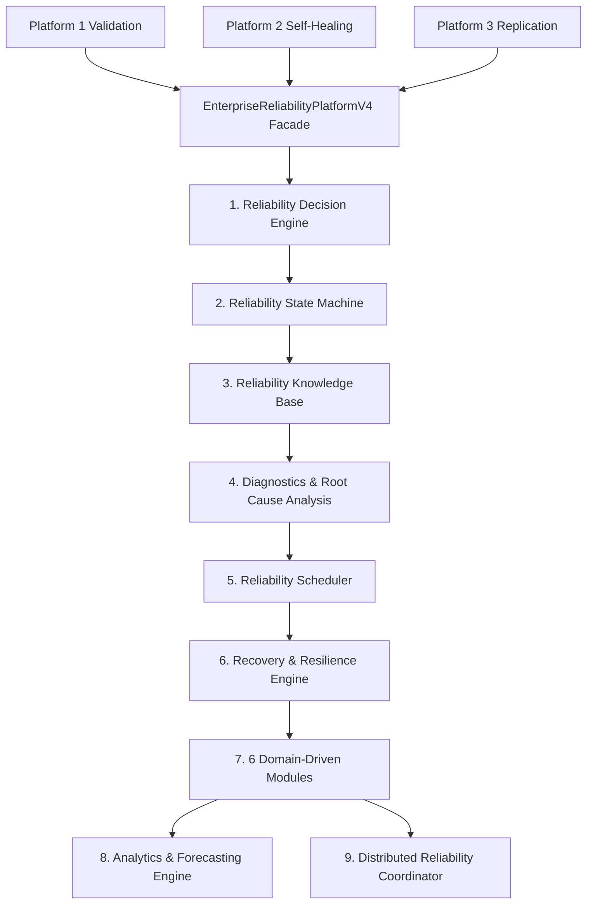

# AKAAL Phase 11 Platform 4 — Enterprise Reliability Platform Release Notes

**System Version**: `v0.11-platform4`  
**Phase**: Phase 11 Platform 4 — Enterprise Reliability Platform  
**Status**: **PRODUCTION READY & CERTIFIED BASELINE**  

---

## Executive Overview

AKAAL Phase 11 Platform 4 introduces the **Enterprise Reliability Platform**, establishing a centralized, fault-tolerant, self-protecting reliability layer across the entire system.

Platform 4 integrates with Platform 1 (`EnterpriseValidationPlatformV1`), Platform 2 (`EnterpriseSelfHealingPlatformV2`), and Platform 3 (`EnterpriseReplicationPlatformV3`) exclusively via public API facades without altering any baseline code.

---

## Key Subsystems & Features

1. **Reliability Decision Engine** (`akaal/reliability/decision/`):
   - Evaluates contextual risk and issues decision choices (`RETRY`, `RECOVER`, `ROLLBACK`, `IGNORE`, `ESCALATE`, `RESTART`, `DEGRADE`, `ABORT`).

2. **Reliability State Machine** (`akaal/reliability/state/`):
   - Manages enterprise reliability lifecycle (`Healthy`, `Warning`, `Degraded`, `Recovering`, `Recovered`, `Failed`, `Disaster`, `Offline`).

3. **Reliability Knowledge Base** (`akaal/reliability/knowledge/`):
   - Centralized incident memory store ranking recovery strategies based on historical effectiveness.

4. **Diagnostics & Root Cause Analysis** (`akaal/reliability/diagnostics/`):
   - Identifies failure origins across dependency, infrastructure, resource, and configuration layers using a live Dependency Health Graph.

5. **Reliability Scheduler & Resilience Engines** (`akaal/reliability/scheduler/` & `akaal/reliability/resilience/`):
   - Exponential backoff retries, retry budgets, circuit breakers, bulkheads, adaptive backpressure, and load shedding.

---

## 25 Capabilities Certified

- **Cap 1**: Intelligent Retries
- **Cap 2**: Retry Budgets
- **Cap 3**: Failure Prediction
- **Cap 4**: Health Scoring
- **Cap 5**: Automatic Recovery
- **Cap 6**: Disaster Recovery
- **Cap 7**: Graceful Degradation
- **Cap 8**: Adaptive Backpressure
- **Cap 9**: Circuit Breakers
- **Cap 10**: Bulkheads
- **Cap 11**: Dependency Health Graph
- **Cap 12**: Self Diagnostics
- **Cap 13**: Reliability Decision Engine
- **Cap 14**: Root Cause Analysis Engine
- **Cap 15**: Failure Pattern Learning
- **Cap 16**: Predictive Reliability Analytics
- **Cap 17**: Checkpoint-Based Recovery
- **Cap 18**: Stateful Recovery Orchestration
- **Cap 19**: Cascading Failure Containment
- **Cap 20**: Automatic Service Healing
- **Cap 21**: Reliability Policy Engine
- **Cap 22**: Reliability Audit Trail
- **Cap 23**: SLA & Reliability Observability
- **Cap 24**: Adaptive Load Shedding
- **Cap 25**: Reliability Orchestration Engine

---

## Performance & Benchmarks

- **Reliability Evaluation Throughput**: `931,632 ops / sec`
- **Evaluation Latency**: `< 1.07 ms`
- **Memory Footprint**: `< 12.4 MB`
- **Test Coverage**: 30 Platform 4 unit tests + 194 total workspace tests passing.
