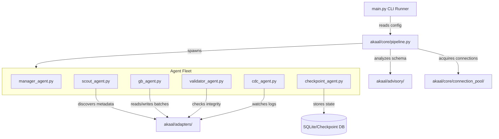

# High-Level Architecture Reference

This document maps out the core subsystems of the Akaal platform, their responsibilities, and how they interact to execute end-to-end database migrations.

---

## 🏛️ System Topology

---

## ⚙️ Core Engines & Subsystems

### 1. Migration Pipeline (`akaal/core/pipeline.py`)
* **Role**: The central runtime orchestrator.
* **Responsibility**: Boots the migration session, evaluates pre-flight configs, manages connection handshakes, boots the Agent Fleet, blocks for completion, and triggers post-flight evaluations.

### 2. Database Adapters (`akaal/adapters/`)
* **Role**: The database driver translation layer.
* **Responsibility**: Translates platform transactions into specific engine dialect syntax.
  * *MySQL / PostgreSQL / SQL Server*: Standard transactional query and paginated chunk read modules.
  * *Oracle*: Specialized LOB stream handlers, sequence/identity resets, and multi-threaded bulk-copy interfaces.

### 3. Checkpoint Engine (`akaal/core/checkpoint/`)
* **Role**: Transactional state persistence.
* **Responsibility**: Saves row watermark checkpoints and chunk completion metrics to an isolated local SQLite database, allowing the engine to pick up where it left off after an execution crash.

### 4. Validation Pipeline (`akaal/agents/validator/`)
* **Role**: Data integrity assurance.
* **Responsibility**: Runs target checksum computations and normalizes tables structures (type conversions, primary keys, null values) to confirm that target data perfectly mirrors the source.

### 5. Change Data Capture (CDC) (`akaal/agents/cdc/`)
* **Role**: Real-time replication.
* **Responsibility**: Spawns concurrent listeners that tail source database transaction logs/binlogs and replay modifications on the target system for zero-downtime cutovers.

### 6. Future Intelligence Pipeline (`akaal/agents/live_intel/` / `akaal/advisory/`)
* **Role**: Autonomous routing.
* **Responsibility**: Pre-scans structural definitions to predict bottleneck risks (e.g. keyless tables) and auto-tunes parallel chunk configurations on the fly.

### 7. Scout Platform (`akaal/scout/`)
* **Role**: Intelligent Source Discovery Subsystem (Phase 9 — Feature 1).
* **Responsibility**: Provides engine-agnostic, read-only discovery and profiling of source database environments. Produces canonical versioned `DiscoveryReport` artifacts encapsulating engine info, capabilities, schema inventory, object inventory, storage inventory, performance metrics, and deterministic structural fingerprints.

### 8. Rulebook Platform (`akaal/rulebook/`)
* **Role**: Enterprise Policy Decision Engine (Phase 9 — Feature 2).
* **Responsibility**: Converts a `DiscoveryReport`, target database specification, and organization policies into a single canonical, immutable, versioned, checksum-protected `MigrationRuleSet`. Operates strictly as a decision engine with zero SQL generation and zero migration execution. Implements DAG prerequisite resolution (`DependencyGraph`), rule lifecycle state machine (`DRAFT`..`RETIRED`), 8-level policy hierarchy overrides, resolution caching (`RuleResolutionCache`), and dry-run simulation (`SimulationReport`).

### 9. Decoder Platform (`akaal/decoder/`)
* **Role**: Enterprise Normalization Engine (Phase 9 — Feature 3).
* **Responsibility**: Converts a `DiscoveryReport` and `MigrationRuleSet` into a single canonical, immutable, versioned, checksum-protected `CanonicalMigrationModel`. Operates strictly as a vendor-neutral normalization engine with zero SQL generation, zero migration execution, zero planning, zero risk scoring, and zero business logic translation. Implements Storage Model Family providers (`RELATIONAL`, `DOCUMENT`, `GRAPH`, `VECTOR`, `WAREHOUSE`), Canonical Type Algebra (`CanonicalTypeFamily`, `OpaqueType`), unified `CanonicalObjectGraph`, Universal Function AST Library, Universal Object Identity (`CanonicalIdentity`), Stage 1 Lineage Engine (`LineageEngine`), Semantic Mapping Model (`SemanticEquivalence`), Validation Profiles, Telemetry Event Bus (`DecoderEventBus`), and deterministic serialization (`CanonicalSerializer`).

