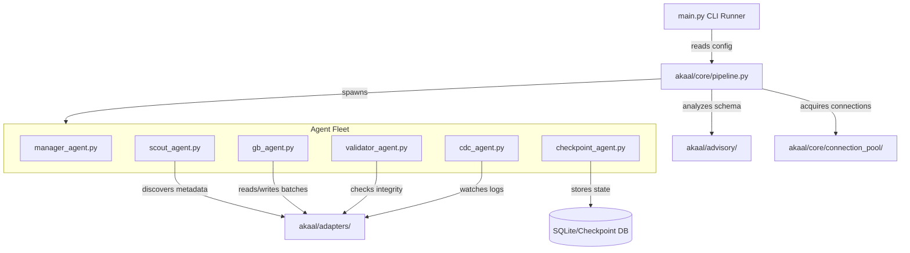

# High-Level Architecture Reference

This document maps out the core subsystems of the Akaal platform, their responsibilities, and how they interact to execute end-to-end database migrations.

---

## 🏛️ System Topology

---

## ⚙️ Core Engines & Subsystems

### 1. Migration Pipeline (`akaal/core/pipeline.py`)
* **Role**: The central runtime orchestrator.
* **Responsibility**: Boots the migration session, evaluates pre-flight configs, manages connection handshakes, boots the Agent Fleet, blocks for completion, and triggers post-flight evaluations.

### 2. Database Adapters (`akaal/adapters/`)
* **Role**: The database driver translation layer.
* **Responsibility**: Translates platform transactions into specific engine dialect syntax.
  * *MySQL / PostgreSQL / SQL Server*: Standard transactional query and paginated chunk read modules.
  * *Oracle*: Specialized LOB stream handlers, sequence/identity resets, and multi-threaded bulk-copy interfaces.

### 3. Checkpoint Engine (`akaal/core/checkpoint/`)
* **Role**: Transactional state persistence.
* **Responsibility**: Saves row watermark checkpoints and chunk completion metrics to an isolated local SQLite database, allowing the engine to pick up where it left off after an execution crash.

### 4. Validation Pipeline (`akaal/agents/validator/`)
* **Role**: Data integrity assurance.
* **Responsibility**: Runs target checksum computations and normalizes tables structures (type conversions, primary keys, null values) to confirm that target data perfectly mirrors the source.

### 5. Change Data Capture (CDC) (`akaal/agents/cdc/`)
* **Role**: Real-time replication.
* **Responsibility**: Spawns concurrent listeners that tail source database transaction logs/binlogs and replay modifications on the target system for zero-downtime cutovers.

### 6. Future Intelligence Pipeline (`akaal/agents/live_intel/` / `akaal/advisory/`)
* **Role**: Autonomous routing.
* **Responsibility**: Pre-scans structural definitions to predict bottleneck risks (e.g. keyless tables) and auto-tunes parallel chunk configurations on the fly.

### 7. Scout Platform (`akaal/scout/`)
* **Role**: Intelligent Source Discovery Subsystem (Phase 9 — Feature 1).
* **Responsibility**: Provides engine-agnostic, read-only discovery and profiling of source database environments. Produces canonical versioned `DiscoveryReport` artifacts encapsulating engine info, capabilities, schema inventory, object inventory, storage inventory, performance metrics, and deterministic structural fingerprints.

### 8. Rulebook Platform (`akaal/rulebook/`)
* **Role**: Enterprise Policy Decision Engine (Phase 9 — Feature 2).
* **Responsibility**: Converts a `DiscoveryReport`, target database specification, and organization policies into a single canonical, immutable, versioned, checksum-protected `MigrationRuleSet`. Operates strictly as a decision engine with zero SQL generation and zero migration execution. Implements DAG prerequisite resolution (`DependencyGraph`), rule lifecycle state machine (`DRAFT`..`RETIRED`), 8-level policy hierarchy overrides, resolution caching (`RuleResolutionCache`), and dry-run simulation (`SimulationReport`).

### 9. Decoder Platform (`akaal/decoder/`)
* **Role**: Enterprise Normalization Engine (Phase 9 — Feature 3).
* **Responsibility**: Converts a `DiscoveryReport` and `MigrationRuleSet` into a single canonical, immutable, versioned, checksum-protected `CanonicalMigrationModel`. Operates strictly as a vendor-neutral normalization engine with zero SQL generation, zero migration execution, zero planning, zero risk scoring, and zero business logic translation. Implements Storage Model Family providers (`RELATIONAL`, `DOCUMENT`, `GRAPH`, `VECTOR`, `WAREHOUSE`), Canonical Type Algebra (`CanonicalTypeFamily`, `OpaqueType`), unified `CanonicalObjectGraph`, Universal Function AST Library, Universal Object Identity (`CanonicalIdentity`), Stage 1 Lineage Engine (`LineageEngine`), Semantic Mapping Model (`SemanticEquivalence`), Validation Profiles, Telemetry Event Bus (`DecoderEventBus`), and deterministic serialization (`CanonicalSerializer`).

### 10. Risk Platform (`akaal/risk/`)
* **Role**: Enterprise Migration Risk Engine (Phase 9 — Feature 4).
* **Responsibility**: Analyzes `CanonicalMigrationModel` produced by Decoder to generate a single canonical, immutable, versioned, checksum-protected `RiskAssessmentModel`. Operates strictly as an analysis engine with zero SQL generation, zero migration execution, zero planning, zero advisory execution, and zero business logic conversion. Implements 7 roadmap features (Compatibility Scoring, Downtime Estimation, Performance Prediction, Data Loss Prediction, Multi-level Resource Estimation [Min/Rec/Peak/Burst], Cutover Readiness [`READY`..`NOT_READY`], Migration Complexity Scoring), Enterprise Risk Taxonomy (`RiskTaxonomy`), Risk Evidence Graph (`RiskEvidenceGraph`) referencing embedded rule provenance without runtime Rulebook dependencies, Deterministic Severity Matrix, Multi-Dimensional Confidence Model, Risk Dependency Graph (`RiskDependencyGraph`), Passive Analyzer plugins, single-responsibility risk engines, Telemetry Event Bus (`RiskEventBus`), and deterministic serialization (`RiskSerializer`).

### 11. Planner Platform (`akaal/planner/`)
* **Role**: Enterprise Migration Planning Engine (Phase 9 — Feature 5).
* **Responsibility**: Converts `RiskAssessmentModel` produced by Risk into a single deterministic, immutable, versioned, checksum-protected `MigrationExecutionPlan`. Operates strictly as a planning engine with zero SQL generation, zero migration execution, zero database connections, zero advisory execution, and zero business logic conversion. Implements 8 roadmap features (Migration Planning, Execution Sequencing, Dependency Planning, Parallel Execution Planning, Checkpoint Planning, Rollback Planning, Resource Scheduling, Cutover Planning), `ExecutionState` lifecycle model (9 states), `DependencySemantics` typed edges, `ExecutionWindow` model, per-stage `StagePolicy`, `PlannerEvidenceGraph`, immutable `PlanVersionInfo`, `ConflictResolutionEngine`, expanded `PlannerValidator`, `RollbackGraph` with compensation chains, `CutoverPlan` with 8 deterministic phases, `StrategyRegistry` with governance, Telemetry Event Bus (`PlannerEventBus`), and deterministic serialization (`PlannerSerializer`).

### 12. Advisor Platform (`akaal/advisor/`)
* **Role**: Enterprise Advisory Engine (Phase 9 — Platform 1).
* **Responsibility**: Converts `MigrationExecutionPlan` produced by Planner into a single deterministic, immutable, versioned, checksum-protected `MigrationAdvisoryModel`. Operates strictly as a pure compiler layer (immutable input → deterministic execution → immutable output) with zero database connections, zero SQL generation, zero execution state mutations, and zero side effects. Implements 12 independent Recommendation Analyzers (`Batch`, `Worker`, `Hardware`, `Cost`, `ETA`, `BestPractice`, `Checkpoint`, `Rollback`, `Topology`, `Parallelism`, `Resource`), `AdvisoryAggregationEngine` (deduplication via stable SHA-256 fingerprinting, domain conflict resolution, multi-key deterministic sorting), `AdvisorRegistry` (analyzer discovery and plugin auto-registration), `AdvisorValidator` (integrity, schema, and checksum validation), `AdvisorSerializer` (JSON/Dict/Canonical round-trip), `AdvisorMetricsCollector` (microsecond timing and distribution stats), `AdvisorReportBuilder` (technical advisory reports, omitting executive summaries reserved for Enterprise Intelligence), `AdvisorEvents` (lifecycle notifications), and `AdvisorGovernance` (audit, versioning, determinism verification).

### 13. Live Schema Evolution Platform (`akaal/schema/`)
* **Role**: Enterprise Live Schema Evolution Engine (Phase 10 — Platform 5).
* **Responsibility**: Safely analyzes, versions, evolves, propagates, replays, and recovers schema changes across supported databases without violating migration consistency. Operates strictly inside Platform 5 boundaries with zero CDC, zero migration planning, zero streaming execution, zero distributed runtime, zero database adapters, and zero business logic translation. Implements:
  - **Metadata Version Control & DAG Graph** (`akaal/schema/versioning/`): `MetadataVersionManager`, `SchemaSnapshot` with SHA-256 integrity checksums and zlib compression, `VersionDAG` graph, 3-way `VersionMergeEngine`, and version diffing.
  - **Dynamic Metadata Refresh** (`akaal/schema/refresh/`): `MetadataRefreshService`, `ThreadSafeMetadataCache` with TTL, `RefreshCoordinator` single-flight lock, prioritized queue, and pub/sub events.
  - **Schema Compatibility Analysis** (`akaal/schema/compatibility/`): `CompatibilityAnalyzer`, `SchemaComparator` added/removed/modified diffs, `RiskClassifier` scoring (0-100), and `CompatibilityReport` advisories.
  - **Online Type Evolution** (`akaal/schema/type_evolution/`): `TypeEvolutionEngine`, `TypeCompatibilityMatrix` widening (safe) vs narrowing (unsafe), `ConversionPlanner` two-phase conversion strategies.
  - **Enterprise Schema Transactions** (`akaal/schema/transactions/`): `TransactionManager`, `SchemaTransaction` lifecycle (`PENDING`..`COMMITTED`/`ROLLED_BACK`), nested parent/child transactions, atomic rollback plans, and transaction store persistence.
  - **5-Stage Validation Pipeline** (`akaal/schema/validation/`): `ValidationPipeline` executing Syntax, Dependency, Compatibility, Execution Pre-Check, and Post-Execution validation stages with `DiagnosticReport`.
  - **Constraint & Object Dependency Graph** (`akaal/schema/graph/`): `ConstraintDependencyGraph` modeling PKs, FKs, Unique, Check, Indexes, Views, Sequences, and Triggers with Tarjan topological cycle-free sorting.
  - **Live Evolution Engine** (`akaal/schema/evolution_engine/`): `SchemaEvolutionEngine` orchestrating transactional evolution, `EvolutionCoordinator`, and `EvolutionExecutor`.
  - **Online DDL Propagation** (`akaal/schema/ddl_propagation/`): `DDLPropagationEngine`, `DDLPlanner` statement hashing, `DDLExecutor` exponential backoff retry policy, and `PropagationHistory`.
  - **Constraint Evolution** (`akaal/schema/constraint/`): `ConstraintEvolutionEngine` managing PK/FK/Unique/Check constraint changes in dependency order.
  - **DDL Replay & Immutable Journal** (`akaal/schema/replay/`): `DDLReplayEngine`, append-only tamper-evident `JournalStore` with SHA-256 hash-chaining, `ReplayValidator`, and checkpoint recovery.
  - **Concurrency & Locking** (`akaal/schema/concurrency/`): `SchemaLockManager` (Global, Table, Advisory), `OptimisticConcurrencyController` (OCC), and `DeadlockDetector`.
  - **Enterprise Failure Recovery** (`akaal/schema/recovery/`): `RecoveryManager` handling 7 failure classes with compensation rollbacks and retry policies.
  - **Enterprise Observability** (`akaal/schema/observability/`): `SchemaTracer` (Correlation/Tx/Replay IDs), `StructuredAuditLogger`, `SchemaMetricsCollector`, and `SchemaEventPublisher`.
  - **Public Platform Facade** (`akaal/schema/facade/`): `SchemaEvolutionPlatformV5` exposing stable high-level API (`refresh_metadata()`, `compare_schemas()`, `analyze_compatibility()`, `evaluate_type_evolution()`, `execute_evolution()`, `propagate_ddl()`, `evolve_constraints()`, `replay_journal()`, `rollback_transaction()`).

